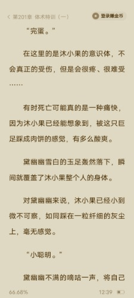

# 找到一本内含大量gts内容的网络小说

作者：草食君

TID：34591

<title>1</title> <link href="../Styles/Style.css" type="text/css" rel="stylesheet">

# 1

一直在找这样的玄幻/修仙小说，功夫不负有心人，哈哈，终于在番茄上的找到一本，书名叫《转生人参果:开局就被狐妖吞掉》，开头就是丸吞，几乎每一章都有gts内容，后面越看越怀疑是圈内人写的 <title>2</title> <link href="../Styles/Style.css" type="text/css" rel="stylesheet">

# 2

随便截了几张图大家看看                        <title>3</title> <link href="../Styles/Style.css" type="text/css" rel="stylesheet">

# 3

 <ignore_js_op>[Screenshot_20221220_124957.jpg](forum.php?mod=attachment&aid=MTAxMTAwfDk4NTI0NDljfDE2NzQwNjUxNzZ8MTgyMzB8MzQ1OTE%3D&nothumb=yes) *(24.3 KB, 下載次數: 1)*

[下載附件](forum.php?mod=attachment&aid=MTAxMTAwfDk4NTI0NDljfDE2NzQwNjUxNzZ8MTgyMzB8MzQ1OTE%3D&nothumb=yes)

2022-12-20 12:53 上傳  

</ignore_js_op> <ignore_js_op>[Screenshot_20221220_125005.jpg](forum.php?mod=attachment&aid=MTAxMTAxfDIxNmQwYmQ4fDE2NzQwNjUxNzZ8MTgyMzB8MzQ1OTE%3D&nothumb=yes) *(24.41 KB, 下載次數: 2)*

[下載附件](forum.php?mod=attachment&aid=MTAxMTAxfDIxNmQwYmQ4fDE2NzQwNjUxNzZ8MTgyMzB8MzQ1OTE%3D&nothumb=yes)

2022-12-20 12:53 上傳  

</ignore_js_op> <ignore_js_op>[Screenshot_20221220_124830.jpg](forum.php?mod=attachment&aid=MTAxMTAyfDU5OGEyMmEwfDE2NzQwNjUxNzZ8MTgyMzB8MzQ1OTE%3D&nothumb=yes) *(23.75 KB, 下載次數: 1)*

[下載附件](forum.php?mod=attachment&aid=MTAxMTAyfDU5OGEyMmEwfDE2NzQwNjUxNzZ8MTgyMzB8MzQ1OTE%3D&nothumb=yes)

2022-12-20 12:53 上傳  

</ignore_js_op> <ignore_js_op>[Screenshot_20221220_124836.jpg](forum.php?mod=attachment&aid=MTAxMTAzfGUwMmZiMjk2fDE2NzQwNjUxNzZ8MTgyMzB8MzQ1OTE%3D&nothumb=yes) *(21.27 KB, 下載次數: 2)*

[下載附件](forum.php?mod=attachment&aid=MTAxMTAzfGUwMmZiMjk2fDE2NzQwNjUxNzZ8MTgyMzB8MzQ1OTE%3D&nothumb=yes)

2022-12-20 12:53 上傳  

</ignore_js_op> <ignore_js_op>[Screenshot_20221220_123908.jpg](forum.php?mod=attachment&aid=MTAxMTA0fDFiNjQ4ZDM1fDE2NzQwNjUxNzZ8MTgyMzB8MzQ1OTE%3D&nothumb=yes) *(23.23 KB, 下載次數: 0)*

[下載附件](forum.php?mod=attachment&aid=MTAxMTA0fDFiNjQ4ZDM1fDE2NzQwNjUxNzZ8MTgyMzB8MzQ1OTE%3D&nothumb=yes)

2022-12-20 12:53 上傳  

</ignore_js_op> <ignore_js_op>[Screenshot_20221220_123914.jpg](forum.php?mod=attachment&aid=MTAxMTA1fGIwYzAxOGE1fDE2NzQwNjUxNzZ8MTgyMzB8MzQ1OTE%3D&nothumb=yes) *(23.8 KB, 下載次數: 0)*

[下載附件](forum.php?mod=attachment&aid=MTAxMTA1fGIwYzAxOGE1fDE2NzQwNjUxNzZ8MTgyMzB8MzQ1OTE%3D&nothumb=yes)

2022-12-20 12:53 上傳  

</ignore_js_op> <title>4</title> <link href="../Styles/Style.css" type="text/css" rel="stylesheet">

# 4

就是圈内人写的，不用惊奇                <title>5</title> <link href="../Styles/Style.css" type="text/css" rel="stylesheet">

# 5

确实挺多的，但是到后来感觉大小有些错乱的感觉，后续也没有太多play了 <title>6</title> <link href="../Styles/Style.css" type="text/css" rel="stylesheet">

# 6

如果我有时间的话也可以去看看吧，不知道怎么样 <title>7</title> <link href="../Styles/Style.css" type="text/css" rel="stylesheet">

# 7

哦，有点意思哦，很有圈内的味道哦，迅速去看看 <title>8</title> <link href="../Styles/Style.css" type="text/css" rel="stylesheet">

# 8

确实有点意思噢，很网文也很gts的感觉，哇 <title>9</title> <link href="../Styles/Style.css" type="text/css" rel="stylesheet">

# 9

> 1428059826 發表於 2022-12-20 16:09
> 就是圈内人写的，不用惊奇

有没有其他推荐                                              <title>10</title> <link href="../Styles/Style.css" type="text/css" rel="stylesheet">

# 10

嚯，居然真的有。上个帖子我还说正经小说了肯定不会有咱喜欢的那种gts内容，可能是因为我只在起点，没看过番茄吧 <title>11</title> <link href="../Styles/Style.css" type="text/css" rel="stylesheet">

# 11

不知道是哪位圈内大佬写的 <title>12</title> <link href="../Styles/Style.css" type="text/css" rel="stylesheet">

# 12

哇，居然有圈内人写的修仙小说，必须支持一下才行