# 接稿过程中碰见的一件事（也是给各位坛友的提醒！）

作者：MacV

TID：30404

<title>1</title> <link href="../Styles/Style.css" type="text/css" rel="stylesheet">

# 1

*本帖最後由 vvawd234567 於 2021-2-22 03:57 編輯*

Ok长话短说。（这不是挂人贴！这不是挂人贴！这不是挂人贴！重要的事说三遍）
几天前，我在极限区发了这样一个帖子，并且我也明确说明了这是一个约稿。
也就是这篇：[https://giantessnight.com/gnforu ... hread&tid=30359](https://giantessnight.com/gnforum2012/forum.php?mod=viewthread&tid=30359)
而这个约稿背后的故事，就很他妈的搞笑了。
找我约稿的这个同好，我们先是谈好了价格，最后文章的总价是300元，我先给他写了一部分，并且按数量付了定金。
我也觉得他没什么问题，于是就把文章写完了，等我的尾款。
但是，我写完的时候，他说他在外面，过两天回去了给我转。
然后两天后，我依然没有收到
于是离谱的事情就几把开始了。

<title>2</title> <link href="../Styles/Style.css" type="text/css" rel="stylesheet">

# 2

*本帖最後由 vvawd234567 於 2021-2-22 03:12 編輯*

首先，他说他没钱的原因是失恋了。

<ignore_js_op>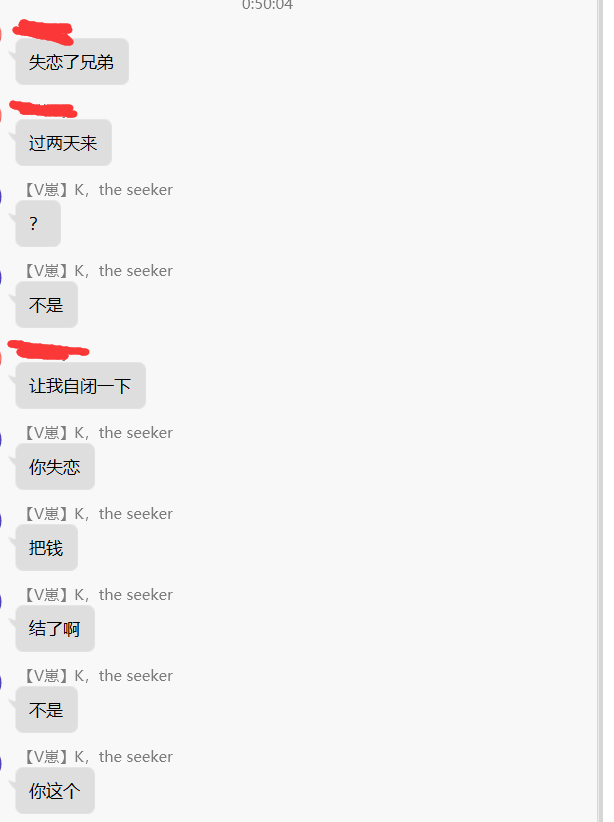

**1.png** *(30.34 KB, 下載次數: 0)*

[下載附件](forum.php?mod=attachment&aid=ODc1OTd8OWEwODQ0ZTh8MTY3NDA2NjEwNHwxODIzMHwzMDQwNA%3D%3D&nothumb=yes)

2021-2-22 03:11 上傳

真你妈离谱，为啥失恋会没有钱啊。

意思他女朋友走的时候把他钱拿完了？这也离谱了。
于是我开始了追问
<ignore_js_op>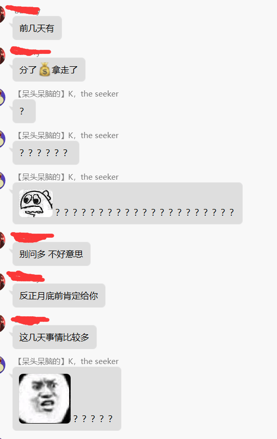

**2.png** *(68.97 KB, 下載次數: 0)*

[下載附件](forum.php?mod=attachment&aid=ODc1OTh8OGNiOTEyZWF8MTY3NDA2NjEwNHwxODIzMHwzMDQwNA%3D%3D&nothumb=yes)

2021-2-22 03:11 上傳

<title>3</title> <link href="../Styles/Style.css" type="text/css" rel="stylesheet">

# 3

看到这里，我大脑瞬间血压嗡的一下拉满了，我感觉眼前有两颗星星在晃悠，脑子像是被人拿铁棍狠狠的敲了一下。

我觉得事情开始朝着搞笑的方向发展了。
<title>4</title> <link href="../Styles/Style.css" type="text/css" rel="stylesheet">

# 4

<ignore_js_op>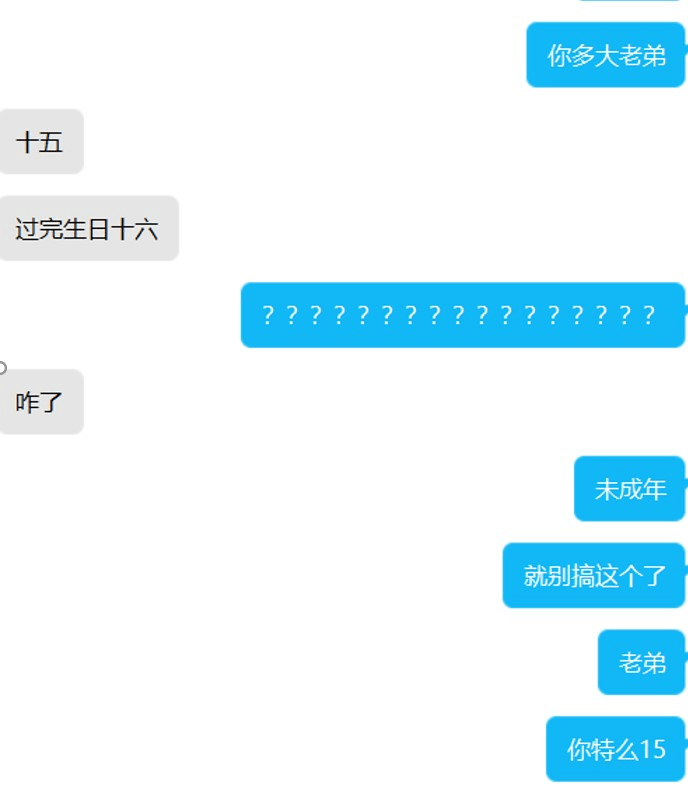

**1.jpg** *(37.89 KB, 下載次數: 0)*

[下載附件](forum.php?mod=attachment&aid=ODc1OTN8YmU4MTA2ZTd8MTY3NDA2NjEwNHwxODIzMHwzMDQwNA%3D%3D&nothumb=yes)

2021-2-22 03:06 上傳

<ignore_js_op>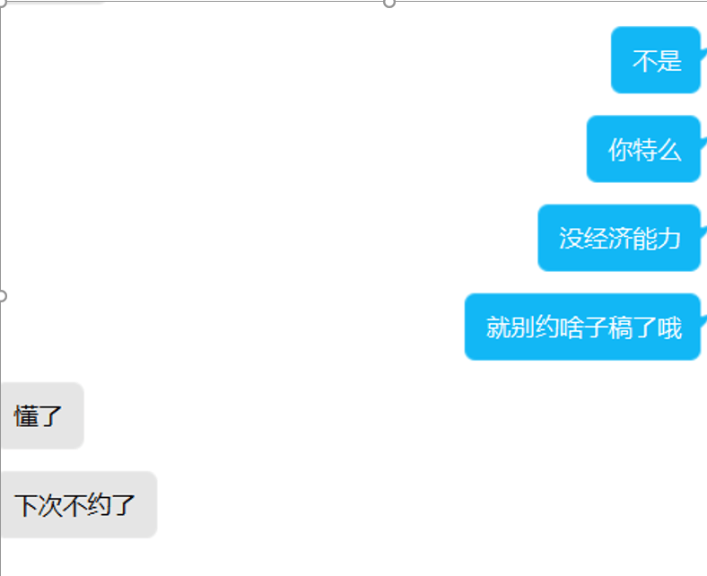

**2.png** *(54.48 KB, 下載次數: 0)*

[下載附件](forum.php?mod=attachment&aid=ODc1OTR8ZGQ5MzdiM2Z8MTY3NDA2NjEwNHwxODIzMHwzMDQwNA%3D%3D&nothumb=yes)

2021-2-22 03:06 上傳

看到这些的时候，我的脑袋已经快要他妈的炸裂开来了，我是想不到一个15岁小朋友居然回去网上约别人写黄文。
当然了，现在是网络世界，到底是真是假也不好说，于是我稍微验证了一下 <ignore_js_op>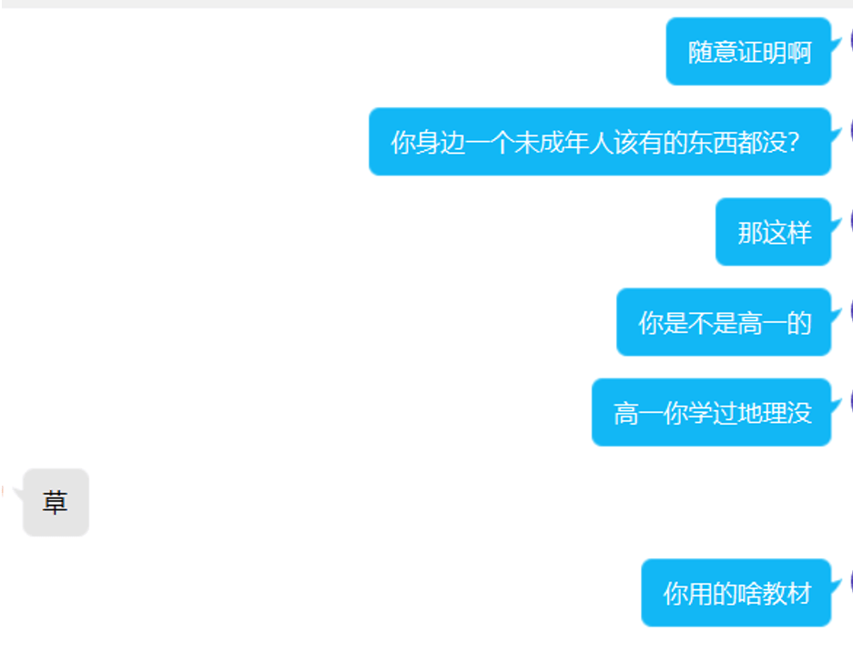

**3.png** *(90.57 KB, 下載次數: 0)*

[下載附件](forum.php?mod=attachment&aid=ODc1OTV8NzBjMmRhYTN8MTY3NDA2NjEwNHwxODIzMHwzMDQwNA%3D%3D&nothumb=yes)

2021-2-22 03:06 上傳

<ignore_js_op>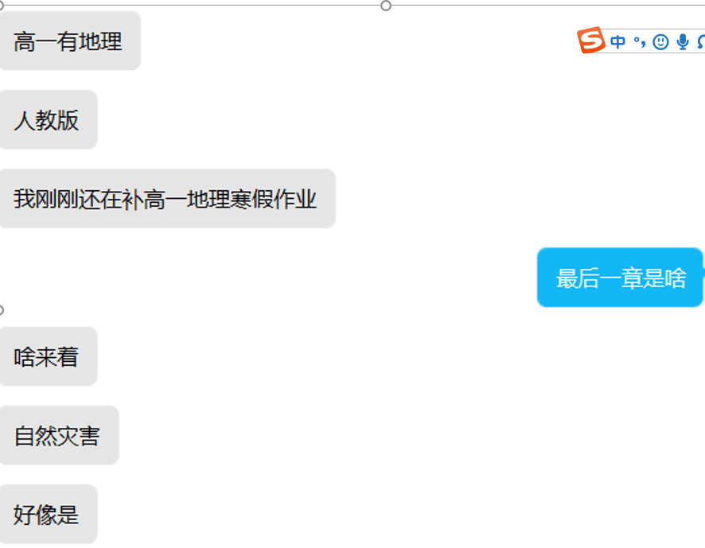

**4.png** *(79.43 KB, 下載次數: 0)*

[下載附件](forum.php?mod=attachment&aid=ODc1OTZ8NTNiMzBjOTV8MTY3NDA2NjEwNHwxODIzMHwzMDQwNA%3D%3D&nothumb=yes)

2021-2-22 03:06 上傳

<title>5</title> <link href="../Styles/Style.css" type="text/css" rel="stylesheet">

# 5

啊这……他是拿压岁钱付的定金么?300按理说也不多吧…就算15也可以付吧，和同学出去吃两顿饭的钱而已 <title>6</title> <link href="../Styles/Style.css" type="text/css" rel="stylesheet">

# 6

*本帖最後由 vvawd234567 於 2021-2-22 04:06 編輯*

OK
我立刻把他删了。
当然，删之前，最后进行了一下说服教育。（当然，由于一种愤怒感还有我对我从天灵盖中源源不断冒出的冲天傻气的痛苦感，让语言有点粗鄙。）<ignore_js_op>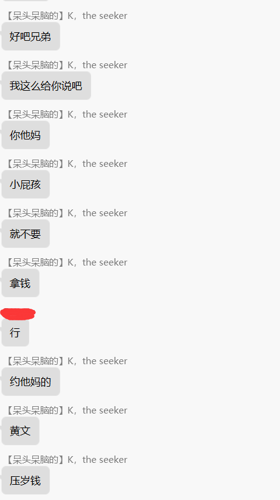

**1.png** *(29.53 KB, 下載次數: 0)*

[下載附件](forum.php?mod=attachment&aid=ODc1OTl8MzRlNTYyZTN8MTY3NDA2NjEwNHwxODIzMHwzMDQwNA%3D%3D&nothumb=yes)

2021-2-22 03:16 上傳

<ignore_js_op>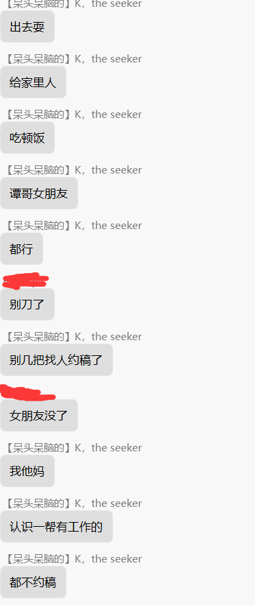

**2.png** *(32.25 KB, 下載次數: 0)*

[下載附件](forum.php?mod=attachment&aid=ODc2MDB8YzQ4M2FhZDd8MTY3NDA2NjEwNHwxODIzMHwzMDQwNA%3D%3D&nothumb=yes)

2021-2-22 03:16 上傳

<ignore_js_op>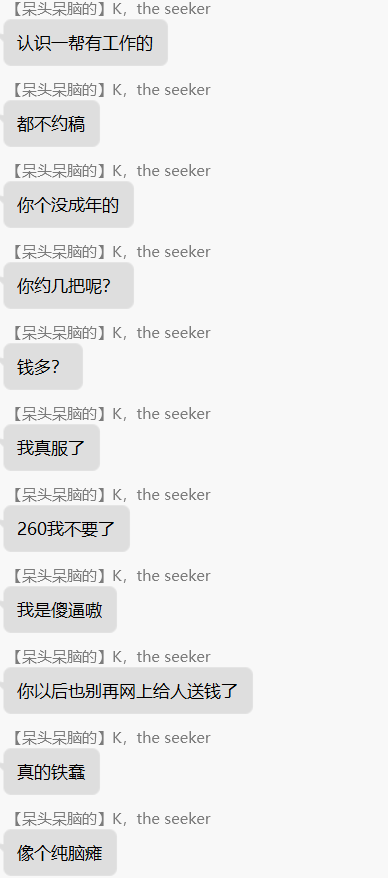

**3.png** *(36.01 KB, 下載次數: 0)*

[下載附件](forum.php?mod=attachment&aid=ODc2MDF8ZGQ5YjUxZDd8MTY3NDA2NjEwNHwxODIzMHwzMDQwNA%3D%3D&nothumb=yes)

2021-2-22 03:16 上傳

<ignore_js_op>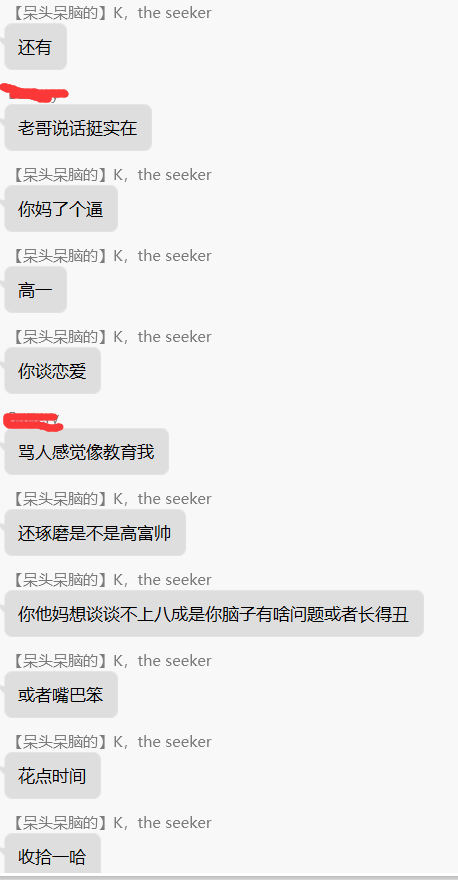

**4.png** *(38.06 KB, 下載次數: 0)*

[下載附件](forum.php?mod=attachment&aid=ODc2MDJ8OWQ0YWQwNmN8MTY3NDA2NjEwNHwxODIzMHwzMDQwNA%3D%3D&nothumb=yes)

2021-2-22 03:16 上傳

<ignore_js_op>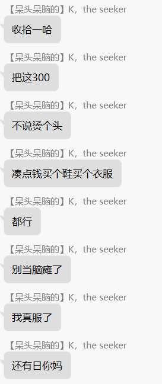

**5.png** *(24.26 KB, 下載次數: 0)*

[下載附件](forum.php?mod=attachment&aid=ODc2MDN8NDM3Y2FjNTZ8MTY3NDA2NjEwNHwxODIzMHwzMDQwNA%3D%3D&nothumb=yes)

2021-2-22 03:16 上傳

<ignore_js_op>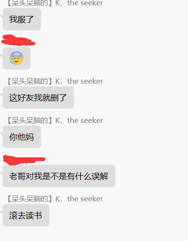

**6.png** *(22.3 KB, 下載次數: 0)*

[下載附件](forum.php?mod=attachment&aid=ODc2MDR8ZjcyYWE3MWV8MTY3NDA2NjEwNHwxODIzMHwzMDQwNA%3D%3D&nothumb=yes)

2021-2-22 03:16 上傳

最后，我觉得我对说一下我对这件事的态度，以及我为什么要发这个帖子。
首先，这件事情，其实我的目的，一开始就是为了追个债罢了，毕竟约稿写完，钱没到手里，真的很不舒服，虽然这240对我来说不是特别关键，我也不是很抠门的人，但是一想到该拿的拿不到，我就有种被耍了的感觉。但我知道这小兔崽子是个15岁的未成年高中生的时候，我的态度有一些变化。各位也可以看出，我完全是不想再纠结我那240块钱的B稿费了，我真的巴不得不要和这孩子扯上关系，全然当做我自己写了一篇文罢了。
当然，这是个性癖论坛，论坛里很多都是少儿不宜的东西，而且很多同好包括我自己的，也是未成年的时候就开始整这些黄色资源了，我也并没有能力和喜好去教导别人远离gts，好好生活，毕竟这里又不是戒色吧。但是主要是三个原因，让我这么做
第一，就像我前面说的，我有一种强烈的被愚弄感，我觉得我像个究极无敌血马巨型冲天狂暴脑残大傻B。首先我应该先要求全款的，只是写一半或者三分之二就让他把钱交了，不然也不会这么难受。其次，我为啥就看不出来他是个高中生？虽然我不能说自己是个天才，但我一直觉得自己还算有点聪明至少不是很蠢，但是我为啥看不出来呢？现代社会，谁会因为不在家而转不了钱？是tm在遥远的山区值勤还是他是他妈的爱斯基摩人附近没有信号？其次，谁他妈会因为分手不给别人还钱？又tm不是离婚净身出户，而且离婚了拿不了三百？总之我简直脑残到了极点。同时，不仅我觉得我自己很脑残，我也觉得这件事真的很他妈脑残，一个傻不拉几的写手被一个傻不拉几的小屁孩约稿，然后傻不拉几的等了半天然后发现这小子连个压岁钱都不能留在手上，还要出来找人约稿子？说实话他那句压岁钱出来，我自己都已经笑了老半天，节目效果属实拉满。但是，故事还是故事嘛，我是个故事创作者，如果我让他最后弄来了尾款，给了我，我弄完了这件事，这就是个非常脑残的故事，并且这个节目效果最后很烂，而且我还成了这个很烂的节目效果中的一员，并且大概率，我回忆这件事的时候，心里并不会感到好笑和痛快。作为一个一直很自觉的导演和演员，我自费了240元，因为我觉得这件事应该有个更果断和爽快的结束，所以为了好好怒斥他，发泄我心头之恨，也是为了让我以后想到这件事情，这是个非常有意思的笑话，并且我是一个努力让这个笑话变得不那么离谱和无聊的角色。
其次，是一个比较理性的原因。15岁的小屁孩，是没有经济能力的。我不太清楚台湾或者其他地区的坛友是怎么样的状况，当然也不排除各地的风俗，但我个人理解上，大陆这边，一个高一学生，连压岁钱都不能自己用的情况下，让父母大大方方的给他240块钱，或者说他怎么会在父母不同意的情况下，变出来240呢？当然，我可能是瞎操心，但是这状况未必不可能发生，我不想冒这个风险。为什么说风险，因为很容易构想这样一个情景。他偷偷卖掉自己的什么模型，或者从家里不太光明的搞来一些钱，比如说和朋友聚会之类的理由弄到手，然后他没糊弄过去，让他的父母发现有问题了。当然，现在很多人的家庭都很开明，但是万一他爹他娘比较暴躁，给丫结结实实揍了一顿，然后他又比较怂，说明了这笔钱的来由呢。那我，就他妈，得和他父母聊天了！这他妈可太折磨了。首先，这显然是一件很烦人的事情，他爸他妈如果不愿意付这个，我光扯皮都得扯老久。其次，其实我根本不能扯皮，因为他父母如果告我传播淫秽等，不管我负不负责任，真的都是对我非常非常麻烦的一件事情，我自己还有生活上的事情，而且为了240块钱纠结这么几把老半天，我真的很他妈烦。
所以这也是我为啥要发这个帖子的原因，也算是给各位坛友提个醒，不要去接一些可能是未成年人的单，我个人写文是为了自己爽，当然约稿这种你情我愿我还有钱拿可以去给我游戏充钱去买万智我当然开开心心的，所以文章进行金钱交易这些，我并没有什么道义上的想法，但是还是记住，未成年人，尤其是年龄并不大的未成年人，他们心智还不成熟，或者直接说他们很瓜，脑回路有点问题，会干一些很离谱的事情，而且他们的经济收入并不稳定，随时会莫名其妙的消失，并且受他们父母的影响很大，没准你和他聊着聊着，就换成他爹他娘代理了，这种破事相信各位也不愿意碰到。而且，之前国内某个画重口漫画的哥们被抓了，各位也是知道的，所以这种风险，我希望大家不说重视，至少留个心眼，有个念想，也别让这火烧起，回头gn的墙更高了，大陆的同好上着更麻烦了。
当然，最后一点，也可能是道貌岸然的一点，我从他的角度来说，未成年人，他妈的没有经济能力，连像大学生那样每个月给生活费不说是收入来源至少一份稍微可以自由消费的金钱都没有，你约几把稿？有性内容的东西，给不给未成年人看，各地想法不一样，但我觉得涉及经济上的问题，还是谨慎一些为好。我不太想向他要这240，因为一来我想喷他，喷他很爽，我自己爽了还可以拿钱是不公平的，其次我觉得大过年的，让一个小屁孩琢磨怎么给别人还钱，有点太蛋疼了，可能因为我就是个成天借钱还钱，花钱没有规划，又穷又喜欢冲动消费的傻狗，我对这种还钱时候蛋疼的感觉还是挺有体会的。当然，还是我说的，一个傻不拉几的写手被一个傻不拉几的小屁孩约稿，然后傻不拉几的等了半天为这个钱死活纠缠，这个故事太傻逼了，我不太希望这种傻逼的故事再发生，不希望论坛的同好成为那个傻不拉几的写手，也希望这位找我约稿的小同学不要再当个傻不拉几的小屁孩，如果你很想看什么，就在你喜欢的那个帖子下面留言，想要什么资源你可以礼貌友善却又恬不知耻的当个伸手党，或者尝试多多搜集，实在不行力所能及的尝试购买一些钱包承受范围内的资源。
至于约稿，那是钱多到可疑的gts控想要满足自己与gts相关的各种性幻想和性欲的。作为一个未成年人，如果你没有属于自己的一笔钱，尤其是压岁钱都没有，请别来整这个活，给老子他妈的
滚去读书
<title>7</title> <link href="../Styles/Style.css" type="text/css" rel="stylesheet">

# 7

太紧张惊现刺激了宝儿，看得我热泪盈眶感激涕零，希望能看到更多这样的优秀原创文章 <title>8</title> <link href="../Styles/Style.css" type="text/css" rel="stylesheet">

# 8

> [MiaoKong 發表於 2021-2-22 04:05](https://giantessnight.cf/gnforum2012/forum.php?mod=redirect&goto=findpost&pid=460863&ptid=30404)
> 太紧张惊现刺激了宝儿，看得我热泪盈眶感激涕零，希望能看到更多这样的优秀原创文章 ...

？好紧我张，我也希望这是原创文章，最好是个故事，这样我就不会在凌晨4点痛惜我随风消散化作烟尘变成红色的沙粒流进我充满愤怒和悔恨泪水里的240大洋了
<title>9</title> <link href="../Styles/Style.css" type="text/css" rel="stylesheet">

# 9

> [vvawd234567 發表於 2021-2-22 04:14](https://giantessnight.cf/gnforum2012/forum.php?mod=redirect&goto=findpost&pid=460865&ptid=30404)
> ？好紧我张，我也希望这是原创文章，最好是个故事，这样我就不会在凌晨4点痛惜我随风消散化作烟尘变成红 ...

不至于不至于v哥不至于????????????
<title>10</title> <link href="../Styles/Style.css" type="text/css" rel="stylesheet">

# 10

楼主莫生气了，下次再有约稿就多注意吧，也可以一段一段的收费，而且约稿这种事确实很容易被坑的，我朋友在网上给别人定制头像，被坑很多次了，还是吃一堑长一智吧 <title>11</title> <link href="../Styles/Style.css" type="text/css" rel="stylesheet">

# 11

> [904904cx 發表於 2021-2-22 04:25](https://giantessnight.cf/gnforum2012/forum.php?mod=redirect&goto=findpost&pid=460868&ptid=30404)
> 楼主莫生气了，下次再有约稿就多注意吧，也可以一段一段的收费，而且约稿这种事确实很容易被坑的，我朋友在 ...

我没生那个小子的气，我只是觉得未成年人不该去乱花不该花的，当然，也希望坛友不要碰到这种事情。这种事情在经济上是一种浪费和双输，在情感上是一种折磨，在价值观上，我只能说我认为不太好
<title>12</title> <link href="../Styles/Style.css" type="text/css" rel="stylesheet">

# 12

> vvawd234567 發表於 2021-2-22 04:14
> ？好紧我张，我也希望这是原创文章，最好是个故事，这样我就不会在凌晨4点痛惜我随风消散化作烟尘变成红 ...

啧啧啧╮(￣▽￣)╭这也算是喜大普奔ヽ(^0^)ﾉ了！某种意义上来说……~~~ <title>13</title> <link href="../Styles/Style.css" type="text/css" rel="stylesheet">

# 13

哭了，v佬真是人生导师，希望这孩子有个美好的未来 <title>14</title> <link href="../Styles/Style.css" type="text/css" rel="stylesheet">

# 14

这还真是什么奇葩都有啊……说实话未成年人还是以学习为主比较好，V佬也算是当了回人生导师吧 <title>15</title> <link href="../Styles/Style.css" type="text/css" rel="stylesheet">

# 15

打个岔，现在流行聊天几个字几个字蹦着发吗？ <title>16</title> <link href="../Styles/Style.css" type="text/css" rel="stylesheet">

# 16

*本帖最後由 择一鞋终老 於 2021-2-22 08:24 編輯*

大佬们约稿都这么贵的嘛，我成年人也觉得支付起来有些吃力，除非哪天日薪能破千。还是自己码字省钱哈哈。
虽说1w字最起码也是一整天的工作量，300差不多是劳动报酬了到也挺合理。

<title>17</title> <link href="../Styles/Style.css" type="text/css" rel="stylesheet">

# 17

看來小屁孩兩岸都是一個樣啊（笑）
搞事能力一流，真的出事的時候卻又沒能力負擔責任，不管是不是在網路上遇到這種都特別頭大
<title>18</title> <link href="../Styles/Style.css" type="text/css" rel="stylesheet">

# 18

> aaabcd3 發表於 2021-2-22 08:12
> 打个岔，现在流行聊天几个字几个字蹦着发吗？

晚上，我当时被震撼的急了，已经发不出完整的话了 <title>19</title> <link href="../Styles/Style.css" type="text/css" rel="stylesheet">

# 19

小鬼做蠢事 每個國家都會有 沒有正確的金錢觀念 導致他們亂花錢不心疼
連工作都沒有的米蟲 怎可能知道賺錢的辛苦 長大後開始工作 會對以前的自己 感到羞愧
但很糟糕的情況 小鬼直接偷家裏錢 拿去儲值亂花 事後父母沒有好好管教  就算長大 還是人渣呀...

<title>20</title> <link href="../Styles/Style.css" type="text/css" rel="stylesheet">

# 20

> Fid 發表於 2021-2-22 10:29
> 小鬼做蠢事 每個國家都會有 沒有正確的金錢觀念 導致他們亂花錢不心疼
> 連工作都沒有的米蟲 怎可能知道賺錢 ...

反正我该喷要喷的，十来块钱或者几十买个片儿花个零花就算了，几百块钱找人约稿不是闹呢 <title>21</title> <link href="../Styles/Style.css" type="text/css" rel="stylesheet">

# 21

感觉下次要稿费的建议直接拉高点定金给一半好了，感觉这样都能筛掉不少小年轻 <title>22</title> <link href="../Styles/Style.css" type="text/css" rel="stylesheet">

# 22

我还以为后续是你给他一顿调教呢，我在期待什么

如果这孩子听你的上了清北，是不是要回来还愿啊 <title>23</title> <link href="../Styles/Style.css" type="text/css" rel="stylesheet">

# 23

.....对这种人真的没话可说，楼主下次小心一点吧
<title>24</title> <link href="../Styles/Style.css" type="text/css" rel="stylesheet">

# 24

> 深巷少女与猫 發表於 2021-2-22 10:48
> 我还以为后续是你给他一顿调教呢，我在期待什么
> 
> 如果这孩子听你的上了清北，是不是要回来还愿啊 ...

考上了我就500块钱1000字给他往死里宰 <title>25</title> <link href="../Styles/Style.css" type="text/css" rel="stylesheet">

# 25

希望这小朋友能理解v哥的良苦用心吧 <title>26</title> <link href="../Styles/Style.css" type="text/css" rel="stylesheet">

# 26

还是最后提一嘴，我不是说这小子不诚信，我相信最后还是能拿到钱的，只是我不想给他诚信完成这笔交易的机会，因为我觉得15岁没压岁钱小屁孩就不该参与到约稿交易的谈判桌上 <title>27</title> <link href="../Styles/Style.css" type="text/css" rel="stylesheet">

# 27

生气了还不忘教育小朋友，太牛了 <title>28</title> <link href="../Styles/Style.css" type="text/css" rel="stylesheet">

# 28

圈内年度爆笑事件no1，这小p孩和楼主的“教育”都蛮搞笑的。因为事实上还算是自己主动放弃了money，所以就不按照惯例表示同情了。 <title>29</title> <link href="../Styles/Style.css" type="text/css" rel="stylesheet">

# 29

v哥，我滴超人♡，确实遇到这种问题挺让人感到无奈的，希望不会再遇到。 <title>30</title> <link href="../Styles/Style.css" type="text/css" rel="stylesheet">

# 30

太草了，给我笑傻了
V佬人品真好哇 <title>31</title> <link href="../Styles/Style.css" type="text/css" rel="stylesheet">

# 31

支持！楼主不生气了，说实话看到年龄那块真的搞笑了 <title>32</title> <link href="../Styles/Style.css" type="text/css" rel="stylesheet">

# 32

码了一串评论又删了……看了眼楼主在gn的作品（标题）xp果然是不分年龄的15岁就开始喜欢futa gc什么的了嘛，早熟的娃呀，心疼楼主损失240 <title>33</title> <link href="../Styles/Style.css" type="text/css" rel="stylesheet">

# 33

过了4年， 一个熟悉的qq号又加了你好友：

感谢你之前的教诲，我好好学习考上了清北。 现在已经读大学毕竟成年了，在学校打工赚了点钱，我为了感谢你又回来约稿了

总之楼主正道的光就对了 <title>34</title> <link href="../Styles/Style.css" type="text/css" rel="stylesheet">

# 34

> killer03 發表於 2021-2-23 00:51
> 我觉得这样的人应该曝光，省的它再骗别人去！
> 就这个小小的圈子，还骗人，真是可恨！ ...

人家也没骗人嘛，只能说拖的久了点 <title>35</title> <link href="../Styles/Style.css" type="text/css" rel="stylesheet">

# 35

啊这。。。。想起以前网络上各种未成年人充值完之后父母找游戏公司退款的事了。。。这年头熊孩子真的是特权群体一样</ignore_js_op></ignore_js_op></ignore_js_op></ignore_js_op></ignore_js_op></ignore_js_op></ignore_js_op></ignore_js_op></ignore_js_op></ignore_js_op></ignore_js_op></ignore_js_op>