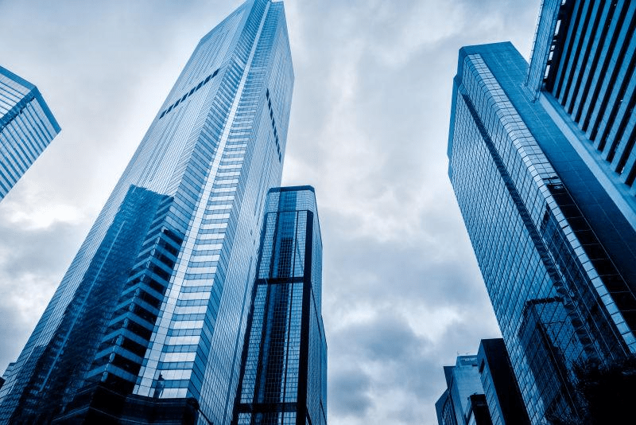
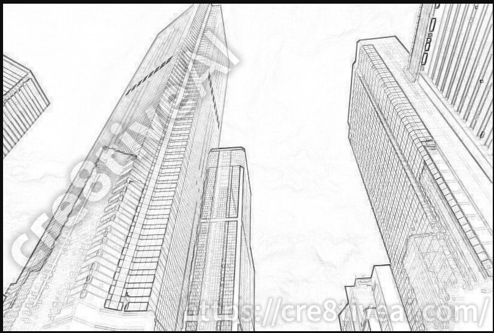

# 推广一个关于画画的工具

作者：dfggggx

TID：30468

<title>1</title> <link href="../Styles/Style.css" type="text/css" rel="stylesheet">

# 1

众所周知，要画背景是非常费心思的，现在居然出了软件，可以通过照片自动生成背景的线稿，像是摩天大楼，街道什么的，以后画画可以节省差不多一半的功夫了，剩下的就是画女主角了
[https://ja.cre8tiveai.com/](https://ja.cre8tiveai.com/)
这个网站还可以约稿，不过价格挺贵就是了
<title>2</title> <link href="../Styles/Style.css" type="text/css" rel="stylesheet">

# 2

 <ignore_js_op>[11V17PsJ1R_small.jpg](forum.php?mod=attachment&aid=ODc3NTN8MjAzM2U3MmV8MTY3NDA2NjA5MnwxODIzMHwzMDQ2OA%3D%3D&nothumb=yes) *(87.78 KB, 下載次數: 1)*

[下載附件](forum.php?mod=attachment&aid=ODc3NTN8MjAzM2U3MmV8MTY3NDA2NjA5MnwxODIzMHwzMDQ2OA%3D%3D&nothumb=yes)

2021-3-2 23:55 上傳  

</ignore_js_op> <ignore_js_op>[QQ截图20210302235631.png](forum.php?mod=attachment&aid=ODc3NTR8MjJiN2NmMmJ8MTY3NDA2NjA5MnwxODIzMHwzMDQ2OA%3D%3D&nothumb=yes) *(417.74 KB, 下載次數: 0)*

[下載附件](forum.php?mod=attachment&aid=ODc3NTR8MjJiN2NmMmJ8MTY3NDA2NjA5MnwxODIzMHwzMDQ2OA%3D%3D&nothumb=yes)

2021-3-2 23:56 上傳  

</ignore_js_op> <title>3</title> <link href="../Styles/Style.css" type="text/css" rel="stylesheet">

# 3

.....有点牛啊这个，只要一张原图就行了吗？ <title>4</title> <link href="../Styles/Style.css" type="text/css" rel="stylesheet">

# 4

现在很多绘画软件都有自动提取线稿的功能，不过还是自己p的图用的放心 <title>5</title> <link href="../Styles/Style.css" type="text/css" rel="stylesheet">

# 5

這個原理和效果與photoshop截留圖像輪廓的操作差不多，有條件使用photoshop的話，操作自由度比這個網站更高。