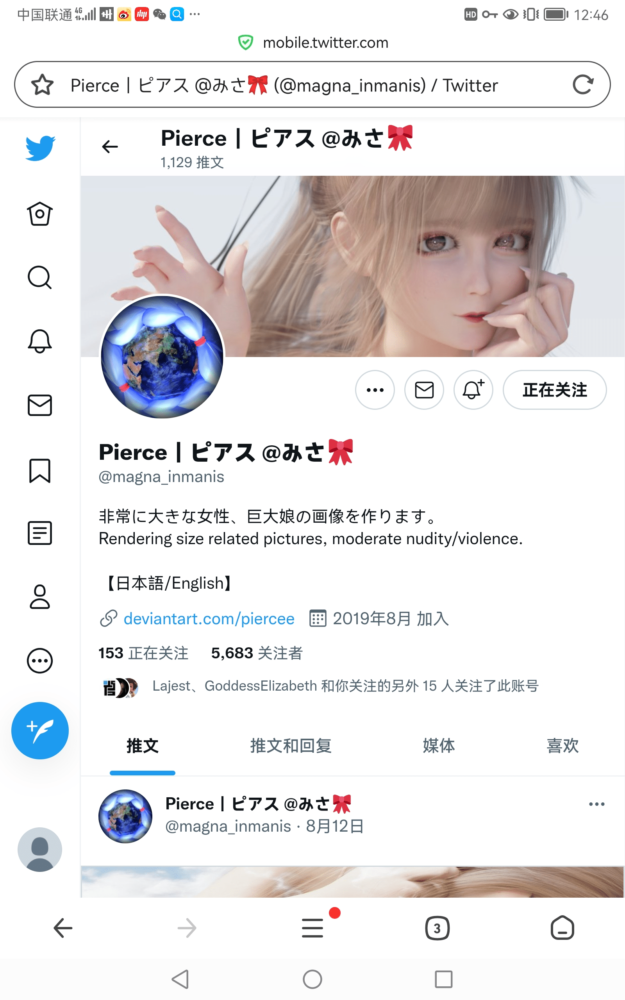
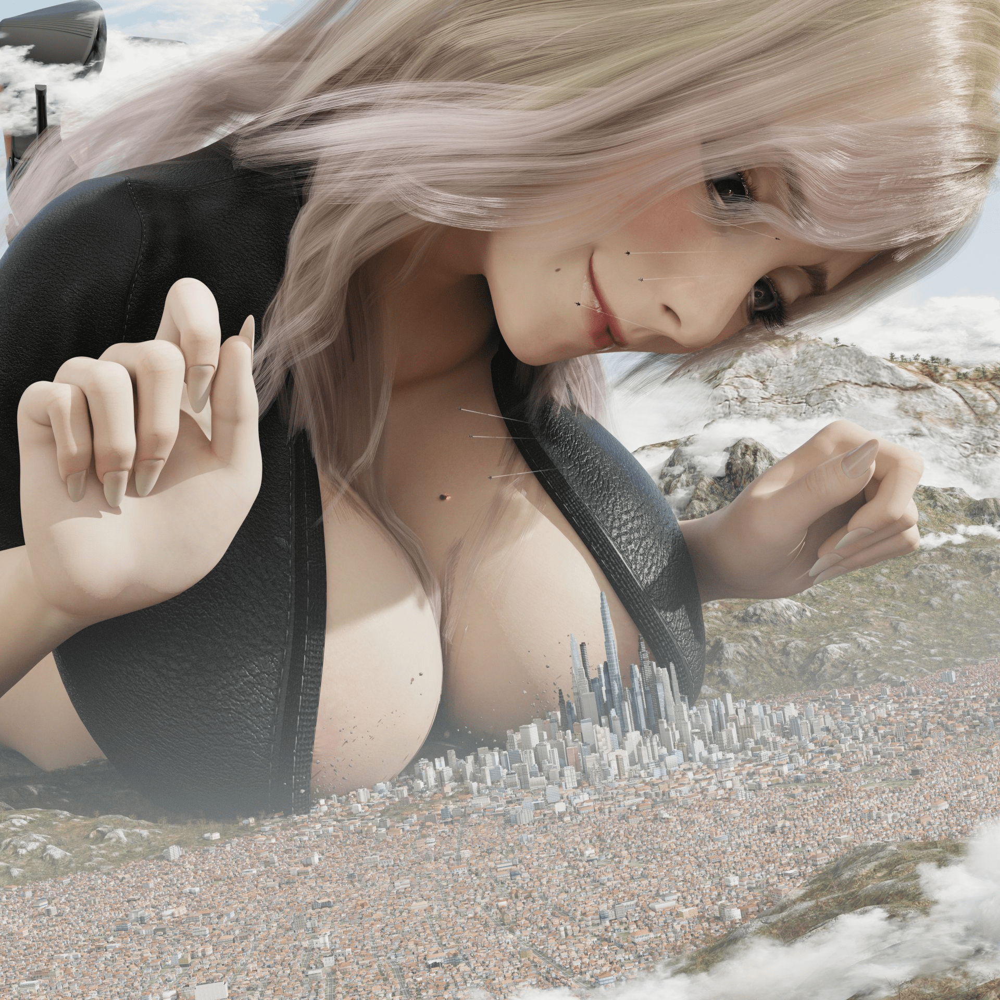

# 推荐一名3d画师，推特名Pierce｜ピアス @みさ

作者：asd159852

TID：34018

<title>1</title> <link href="../Styles/Style.css" type="text/css" rel="stylesheet">

# 1

这是一名3d画师，个人感觉质量很好，虽然更新不稳定，但还是很戳的
https://mobile.twitter.com/magna_inmanis
<title>2</title> <link href="../Styles/Style.css" type="text/css" rel="stylesheet">

# 2

 <ignore_js_op>[Screenshot_20220831_124601_com.qihoo.browser.jpg](forum.php?mod=attachment&aid=OTg5NzV8MDdkNTgyNTB8MTY3NDA2OTMxOXwxODIzMHwzNDAxOA%3D%3D&nothumb=yes) *(869.41 KB, 下載次數: 30)*

[下載附件](forum.php?mod=attachment&aid=OTg5NzV8MDdkNTgyNTB8MTY3NDA2OTMxOXwxODIzMHwzNDAxOA%3D%3D&nothumb=yes)

2022-8-31 12:47 上傳  

</ignore_js_op> <title>3</title> <link href="../Styles/Style.css" type="text/css" rel="stylesheet">

# 3

最近一张作者的图片这是 <title>4</title> <link href="../Styles/Style.css" type="text/css" rel="stylesheet">

# 4

 <ignore_js_op>[FZfHW8VakAERob0?format=jpg&amp;name=large.png](forum.php?mod=attachment&aid=OTg5NzZ8ODIyNzlkYTJ8MTY3NDA2OTMxOXwxODIzMHwzNDAxOA%3D%3D&nothumb=yes) *(663.64 KB, 下載次數: 3)*

[下載附件](forum.php?mod=attachment&aid=OTg5NzZ8ODIyNzlkYTJ8MTY3NDA2OTMxOXwxODIzMHwzNDAxOA%3D%3D&nothumb=yes)

2022-8-31 12:50 上傳  

</ignore_js_op> <title>5</title> <link href="../Styles/Style.css" type="text/css" rel="stylesheet">

# 5

很棒！~                                           <title>6</title> <link href="../Styles/Style.css" type="text/css" rel="stylesheet">

# 6

哇，很棒！谢谢推荐，真的很精致 <title>7</title> <link href="../Styles/Style.css" type="text/css" rel="stylesheet">

# 7

这个画师挺出名的了，画的也确实好。 <title>8</title> <link href="../Styles/Style.css" type="text/css" rel="stylesheet">

# 8

这个作者的女性角色看着确实很顶，希望更新能快点 <title>9</title> <link href="../Styles/Style.css" type="text/css" rel="stylesheet">

# 9

这个作者的图之前群里看到过 确实非常的赞 效果也很好

不过自从被人吐槽脸模有点像 蔡明 老师

我就......笑出声了 <title>10</title> <link href="../Styles/Style.css" type="text/css" rel="stylesheet">

# 10

图很棒很顶，喜欢了，去跟进一下 <title>11</title> <link href="../Styles/Style.css" type="text/css" rel="stylesheet">

# 11

> [wwwnwy 發表於 2022-8-31 20:49](https://giantessnight.cf/gnforum2012/forum.php?mod=redirect&goto=findpost&pid=514405&ptid=34018)
> 这个作者的图之前群里看到过 确实非常的赞 效果也很好
> 
> 不过自从被人吐槽脸模有点像 蔡明 老师

确实，人物都有点显老，而且眼睛大的又像小孩，跟阿基拉里面的小孩很像
<title>12</title> <link href="../Styles/Style.css" type="text/css" rel="stylesheet">

# 12

这个作者捏的脸很怪，韩国人特有的芭比娃娃审美？ <title>13</title> <link href="../Styles/Style.css" type="text/css" rel="stylesheet">

# 13

辨识度很高的一位，一眼就能看出和其他人的与众不同