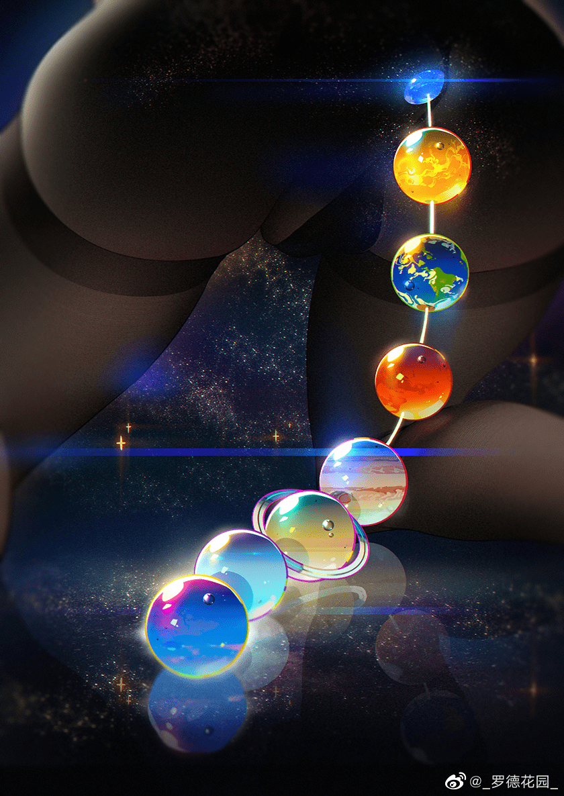

# 搬运图片-星球拉珠

作者：大撸若愚

TID：34378

<title>1</title> <link href="../Styles/Style.css" type="text/css" rel="stylesheet">

# 1

来源微博画师-罗德花园，蓝鸟同名 
作者言：最近看了些科幻小说，突然对宇宙题材有了些想法（双版本见P站和蓝鸟）
p站版本没找到，蓝鸟的图含futa慎入，只搬运了微博的 

<title>2</title> <link href="../Styles/Style.css" type="text/css" rel="stylesheet">

# 2

 <ignore_js_op>[图.jpg](forum.php?mod=attachment&aid=MTAwMzc0fGRkZDQ2NTgwfDE2NzQwNjkyNTB8MTgyMzB8MzQzNzg%3D&nothumb=yes) *(473.78 KB, 下載次數: 13)*

[下載附件](forum.php?mod=attachment&aid=MTAwMzc0fGRkZDQ2NTgwfDE2NzQwNjkyNTB8MTgyMzB8MzQzNzg%3D&nothumb=yes)

2022-11-11 13:22 上傳  

</ignore_js_op> <title>3</title> <link href="../Styles/Style.css" type="text/css" rel="stylesheet">

# 3

怎么就不把我放那里面，我也想进去啊 <title>4</title> <link href="../Styles/Style.css" type="text/css" rel="stylesheet">

# 4

*非真实比例*
虽然看起来爽就够了( <title>5</title> <link href="../Styles/Style.css" type="text/css" rel="stylesheet">

# 5

这个真的是太涩了了，罗德花园老师真厉害，有futa版本的但应该还是女孩子 <title>6</title> <link href="../Styles/Style.css" type="text/css" rel="stylesheet">

# 6

感觉这种玩法有点重口味呀，应该是有更强的女巨人在后面指示 <title>7</title> <link href="../Styles/Style.css" type="text/css" rel="stylesheet">

# 7

一吞吞一排，宇宙深空中。针不戳 <title>8</title> <link href="../Styles/Style.css" type="text/css" rel="stylesheet">

# 8

话说罗德花园大大到底是不是圈内人呢，虽然他的画作主要是以足和丝袜为主，但感觉也有好几张质量很高的gts作品 <title>9</title> <link href="../Styles/Style.css" type="text/css" rel="stylesheet">

# 9

除了星球的体积几乎一样有点难崩以外 图实属好活 <title>10</title> <link href="../Styles/Style.css" type="text/css" rel="stylesheet">

# 10

地球好深啊，看起来巨爽，体积错了顺序却是对的 <title>11</title> <link href="../Styles/Style.css" type="text/css" rel="stylesheet">

# 11

这珠子可真够大的，比例属实有点离谱 <title>12</title> <link href="../Styles/Style.css" type="text/css" rel="stylesheet">

# 12

图片渲染的真的色，请问一下，蓝鸟是啥，有梯子的话怎么上的呀