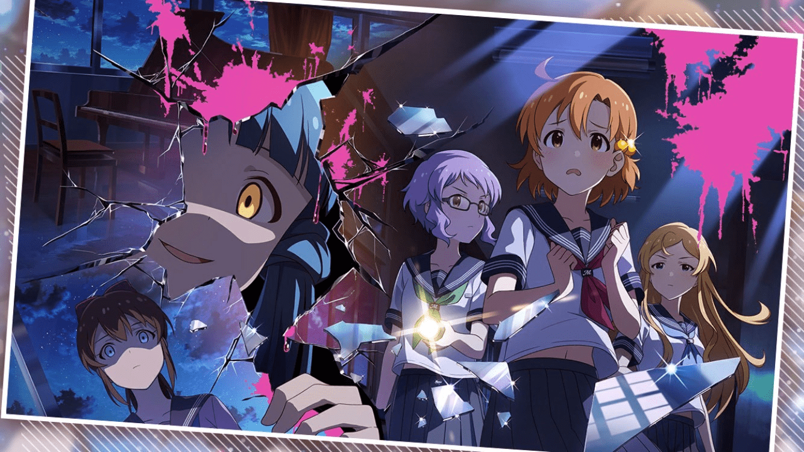

# 擦边图

作者：aaabcd3

TID：27338

<title>1</title> <link href="../Styles/Style.css" type="text/css" rel="stylesheet">

# 1

偶像大师 百万人演唱会 剧场生活 日服
最近的活动图
不过有个日本恐怖游戏叫　つぐのひ ，好像确实是有巨大亡灵的剧情，但是并没有能让GTSfan兴奋的剧情，所以就不多做介绍了
<title>2</title> <link href="../Styles/Style.css" type="text/css" rel="stylesheet">

# 2

 <ignore_js_op>[11.jpg](forum.php?mod=attachment&aid=Nzk1NTF8YWFjZmIwMjF8MTY3NDA2Njc0NHwxODIzMHwyNzMzOA%3D%3D&nothumb=yes) *(264.21 KB, 下載次數: 1)*

[下載附件](forum.php?mod=attachment&aid=Nzk1NTF8YWFjZmIwMjF8MTY3NDA2Njc0NHwxODIzMHwyNzMzOA%3D%3D&nothumb=yes)

2019-9-6 17:02 上傳  

活动图

</ignore_js_op> <title>3</title> <link href="../Styles/Style.css" type="text/css" rel="stylesheet">

# 3

请问楼主有游戏链接吗          <title>4</title> <link href="../Styles/Style.css" type="text/css" rel="stylesheet">

# 4

这边擦的有点远
反正可奈可爱（ <title>5</title> <link href="../Styles/Style.css" type="text/css" rel="stylesheet">

# 5

> [回梦游仙 發表於 2019-9-7 00:31](https://giantessnight.cf/gnforum2012/forum.php?mod=redirect&goto=findpost&pid=414205&ptid=27338)
> 请问楼主有游戏链接吗

日区搜ミリシタ应该就可以，不过是个音游，剧情上这次活动应该是个演的校园恐怖型的剧（没去看，只是刷石头）。
歌倒是16年出的，[≪赤いせかいが消える頃≫](http://www.bilibili.com/video/av66491273)
<title>6</title> <link href="../Styles/Style.css" type="text/css" rel="stylesheet">

# 6

擦边类作品是最气的在于，gts的魅力是至少也是倒错，没了这层光是体格差距，就会觉得:
白瞎了这么好的画风了