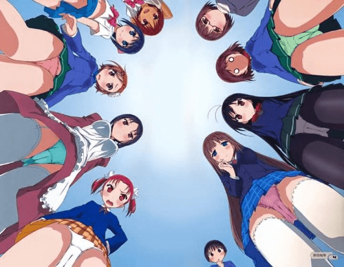

# 擦邊(？ 加速世界＼(・∀・)／

作者：Glauben

TID：21436

<title>1</title> <link href="../Styles/Style.css" type="text/css" rel="stylesheet">

# 1

這角度好棒r (聽說劇場版出了) <title>2</title> <link href="../Styles/Style.css" type="text/css" rel="stylesheet">

# 2

 <ignore_js_op>[FB_IMG_1469456560034.jpg](forum.php?mod=attachment&aid=NjI0OTJ8YzdlZmQzMWF8MTY3NDA2NzY2MnwxODIzMHwyMTQzNg%3D%3D&nothumb=yes) *(63.55 KB, 下載次數: 16)*

[下載附件](forum.php?mod=attachment&aid=NjI0OTJ8YzdlZmQzMWF8MTY3NDA2NzY2MnwxODIzMHwyMTQzNg%3D%3D&nothumb=yes)

2016-7-25 22:24 上傳  

</ignore_js_op> <title>3</title> <link href="../Styles/Style.css" type="text/css" rel="stylesheet">

# 3

都看完了，，（字数补丁 <title>4</title> <link href="../Styles/Style.css" type="text/css" rel="stylesheet">

# 4

加速劇場版還不錯
不過最好要有看小說，不然會對一些東西不懂呢 <title>5</title> <link href="../Styles/Style.css" type="text/css" rel="stylesheet">

# 5

不会是男主变猪了的视角吧www
那个高度我倒是觉得很有可能哦 <title>6</title> <link href="../Styles/Style.css" type="text/css" rel="stylesheet">

# 6

我赞同楼上的说法       <title>7</title> <link href="../Styles/Style.css" type="text/css" rel="stylesheet">

# 7

加速劇場版還不錯  <title>8</title> <link href="../Styles/Style.css" type="text/css" rel="stylesheet">

# 8

感觉男主和女主的存在本来就是GTS化，都不及女主一半高