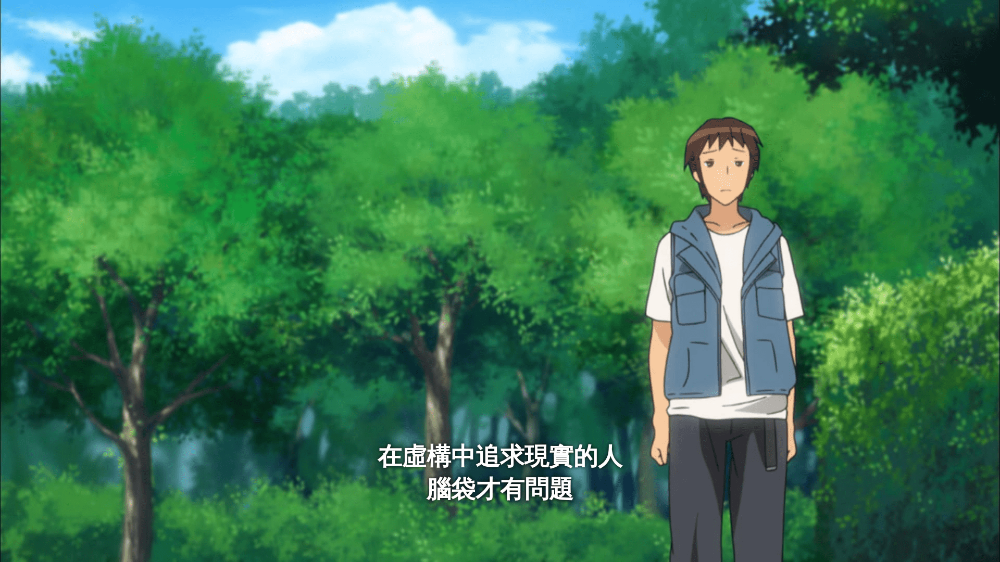
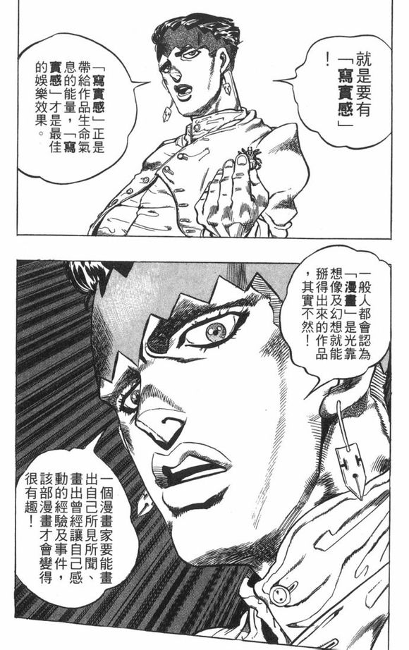

# 故事寫作指引，Part 1：真實感

作者：3213213210

TID：33238

<title>1</title> <link href="../Styles/Style.css" type="text/css" rel="stylesheet">

# 1

*本帖最後由 3213213210 於 2022-6-14 14:27 編輯*

前情提要：[https://giantessnight.com/gnforu ... iewthread&tid=33230](https://giantessnight.com/gnforum2012/forum.php?mod=viewthread&tid=33230)
大家似乎對故事設計最有興趣呢，那麼我就來寫個故事寫作引導系列好了
系列預計做三個部份：基礎理解、世界與角色塑造，還有敘事方法
強烈建議有興趣的人先嘗試自己寫篇短文，在看本系列時將會有更深刻的感觸
（或是看完、寫完再看一次，效果應該差不多）

=================================================================================
首先，從結論開始講起：
**不管是什麼領域的創作，「觀察現實」都是最基本的事。
你是無法只靠充沛的想像力做出好作品的，**
**沒有「真實感」的作品不會打動人。** 
……這話可能說得有點太重，也有點玩文字遊戲的意味在，畢竟「真實感」是很主觀的東西。
不過，我相信這是所有創作者都得在某個階段面對的問題，因此以釐清這個問題作為開場。

在這邊強調真實性，有個非常顯而易見的問題：
這裡是交流「女性巨人」的幻想天地，一個以現實不存在的東西為基礎的交流區。
在這裡會出現的故事通常都是……
"
*女性巨人吃下小人，然後開始自慰。*
"
在這種地方討論**真實感**有什麼意義嗎？
這種時候不都會說……
<ignore_js_op>

**real.jpg** *(274.53 KB, 下載次數: 0)*

[下載附件](forum.php?mod=attachment&aid=OTYwOTB8ZjA5ZGZkNzF8MTY3NDA2NTUyM3wxODIzMHwzMzIzOA%3D%3D&nothumb=yes)

2022-5-10 14:28 上傳

**當然有意義。**
別聽那個高中生的，讓我們看看職業漫畫家的說法：
<ignore_js_op>

**Img18767.jpg** *(122.51 KB, 下載次數: 0)*

[下載附件](forum.php?mod=attachment&aid=OTYwODl8ZWNkODBiNmF8MTY3NDA2NTUyM3wxODIzMHwzMzIzOA%3D%3D&nothumb=yes)

2022-5-10 14:28 上傳

……但說這句話的人可以把人體當書翻閱，似乎也不怎麼真實啊。
如果大家都只要真實的話，那一開始就不需要故事創作了，書架上除了真實故事的東西通通能燒掉。
大家似乎都喜歡不真實的故事，既然如此，**真實性的重要性在哪？** 
這牽扯到一個很根本的問題：什麼是故事？
單從字面上來看，「故事」就是「曾經發生過的事」。
「事」並沒有一定得實際發生過，也並不會因為實際與否而對體驗造成直接的優劣影響。

然而，比起真假，更重要的是：人們能怎麼了解「事」？
這個問題可能太廣泛了，或許該問的是：人們怎樣會「無法了解事」？
讓我寫個簡單的示範「故事」。
"
*有一天，有個女巨人吃了快樂。小人在過去搶走睡眠，然後穿上遊戲以後就搬家了。*
"
……不用試著看懂，我只是隨機拼湊突然想到的詞。
但是定義上，這是個「包含女巨人與小人的、曾經的發生過的、不需要是真的的事」，
所以這是個「GTS故事」，結案。謝謝各位，大家可以開始尻槍了！

當然不是。就算符合故事的定義，正常人也看不懂到底發生了什麼事。
為什麼快樂可以吃？什麼叫搶走睡眠，他讓別人睡不著嗎？
遊戲是要怎麼當衣服？跟搬家又有什麼關係？
或許再補上個數百字的背景設定，這個句子就能夠合理；
但我想強調的重點是，
**雖然只要是發生了的事就能當故事，
但如果事件本身無法被讀者的感性感知、無法被理性理解，
那創作的呈現就無法傳達出去。**
**「故事」必須有所限制才能讓讀者有所共鳴。**

所以……要怎麼讓讀者感知與理解呢？
這就是本篇文的重點了。
在大部分情況，你不會知道讀者是誰，更不會知道對方有什麼人生經驗、大腦是什麼邏輯。
這種時候，作者與讀者在期望上的最大公因數，就是我們做為人類共同生活的這個世界了。
**「現實」在創作上並不是絕對必要的。但是想與讀者有效進行溝通，真實感是最佳的捷徑。**

各位必須要認知到，雖然「女巨人」在現實中不存在，
但**我們會對這種題材有興趣，根本上是因為「巨」與「女人」都是確實存在的概念。**
我們能在現實中觀察到「尺寸遠大於一般的物品」，例如大型建築或超級肥的水果；
「女人」……雖然在這裡也跟幻想生物沒兩樣，但也很明確地指涉了現實中存在的事物，
所以雖然結論上我們在幻想不可能存在的事物，本質上我們還是**依靠現實才有了這些想法**的。

說到這裡，希望大家已經同意，「故事不能只有幻想，必須多少有點真實性在，人們才看得懂」。
但是理論說了這麼多，這對寫作到底有什麼幫助？

就讓我們利用開頭的故事來做例子：
"
*女巨人用手拿起小人，打開嘴巴，把小人吃了下去。*
"
這並不像剛才的例子，這是個非圈內人士也能看懂的事件。
「打開嘴巴吃東西」是個很明確的概念，「巨」的東西可以吃下「小」的東西也符合常識，無須進一步解釋，
所以最起碼，這已經是個人類能用理性理解的故事了。
但你在這個論壇裡，你應該已經看這故事沒有感覺了。
太多人都寫了一樣的東西，你的大腦已經非常清楚這是假的了，對情緒造成的波動微乎其微。
但是我們可以來設想看看，能不能在這故事裡再添加些許的真實感？那樣能否強化故事的呈現？

「大到能生吞人類的巨人」在現實中並不存在，試著幻想巨人與小人的心裡狀態也不符本文主旨。
但是「吃」這個動作，是每個人每天都會做的，是個能輕易找到現實參考的事情。
那麼便可以以自身出發思考，現實中牽扯到「飲食」時有什麼會發生的事？
吃東西時會先洗手、取得食材並清洗、進行烹飪、
進行調味、放入容器、拿到不同的環境進食，最後還有清洗容器與進食工具等等……
有了這些「現實」以後，再調整一下故事內容：
"
*女巨人洗了洗雙手，拿起小人，放到水龍頭下沖洗；
洗淨之後，將小人的下半身沾了些碟子中的蜜糖，高舉起來放入了嘴裡。*
"
雖然依舊是幻想故事，說的也是類似的內容、一樣的不現實，但是說服力卻有了非常明顯的區別。
吃東西之前會先洗手洗食材、進行簡單調味的東西更好吃、沾醬會倒在小容器裡避免污染……
這就是藉由針對現實的觀察來調整寫作的內容，讓讀者能在潛意識中將幻想與自身經驗進行更深層的連結，增加真實感與說服力的例子。
（不過如果你並不覺得這樣的改動有增進體驗，也請務必不顧忌地告知。）

然而，如何在寫作中應用現實也是門深刻的學問，並不是只要想著現實就能保證故事的說服力。
參考現實進行創作並不保證作品就有真實感，單純的幻想與推論也並非無法打動人心，故事呈現這種事實在有太多影響因素了。
但是，**一個創作的偉大，並不是其如何脫離現實，而是它如何讓人連結回現實。**
問題不在你的角色尺寸有多荒謬、不在一次事件中死的人數有多誇張，
而是你如何能在這些荒謬的角色與世界中，建立起讀者能夠感受與理解「啊，確實會這樣呢！」的地方。

要有說服力，真實感非常重要。而真實感的最佳來源，就是現實世界。
不要擔心觀察現實世界會折損想像力，觀察現實世界才能做出大家能欣賞的創作。
這就是整篇文的重點與結論。

……但是，這些真實感要怎麼傳達給讀者呢？
說到底，就算知道現實很重要，最後還是要寫幻想故事啊，這又怎麼辦呢？

這便是預計在接下來探討的內容了。
請訂閱並開啟小鈴鐺……喔不對。
請加到收藏，之後我會把系列連結放在這裡的。

同意、不同意、不理解或是有疑問都歡迎留言。

＝＝＝＝＝＝＝＝＝＝＝＝＝＝＝＝＝＝＝＝＝＝＝＝＝＝＝＝＝＝＝＝＝＝＝＝＝＝＝＝＝＝＝＝＝＝＝＝＝
Part 2：[https://giantessnight.com/gnforu ... iewthread&tid=33400](https://giantessnight.com/gnforum2012/forum.php?mod=viewthread&tid=33400)
Part 3：[https://giantessnight.com/gnforu ... iewthread&tid=33458](https://giantessnight.com/gnforum2012/forum.php?mod=viewthread&tid=33458)

<title>2</title> <link href="../Styles/Style.css" type="text/css" rel="stylesheet">

# 2

看的有点懵。。尤其是‘吃了快乐’那，读了好几遍hh。没有真实感确实体验一般，尤其自己代入的时候还容易出戏，没有身临其境的感觉 <title>3</title> <link href="../Styles/Style.css" type="text/css" rel="stylesheet">

# 3

> [devil145 發表於 2022-5-11 00:02](https://giantessnight.cf/gnforum2012/forum.php?mod=redirect&goto=findpost&pid=502839&ptid=33238)
> 看的有点懵。。尤其是‘吃了快乐’那，读了好几遍hh。没有真实感确实体验一般，尤其自己代入的时候还容易出 ...

简单来说 就是现实中会发生过的动作 写入故事中
这样通过一个侧写 造成读者的真实感

<title>4</title> <link href="../Styles/Style.css" type="text/css" rel="stylesheet">

# 4

是的，个人感觉没有真实感的GTS是空洞的。比如我们单纯说一个GTS的脚“有2600米长”，这句话并不会让读者有什么感觉，因为现实中不存在，而且太抽象了。抽象的东西是难以给人深刻印象的，所以要把虚幻的东西投射到现实的概念中才有冲击力。  比如很常见的：“从脚趾缝跑到脚趾尖都要两三分钟”，实际上就是把抽象的空间转化为更能被理解的时间。理解以后，读者才会受到震撼，当有一天参加400米跑上气不接下气的时候，就更能理解2600米长的脚有多可怕。  我有时候会把街边的卡车脑补成女孩的脚趾，或者贴近一栋大楼的墙根往上望，想象大楼是个少女，这种实实在在的震撼和屈辱感是抽象文字难以带给读者的，而文章的真实感就是要完成这个任务。 <title>5</title> <link href="../Styles/Style.css" type="text/css" rel="stylesheet">

# 5

个人认为通俗点说就是逻辑自洽，尽可能的消除违和感。
早期圈内某些文里会出现巨大娘和小人说话间，小人“瞬移”到其他地方进行互动的情况，会让人非常疑惑
以我的阅读习惯会本能的对细节更丰富的文提起兴趣（气味，温度，衣物甚至是体表纹理），但自己写文时往往因为过于注重细节忽略了剧情的合理性，往往不是写的彻底失控就是味同嚼蜡，如果可以，可否分享下构筑合理剧情（故事线）却又不至于太无聊的方法 <title>6</title> <link href="../Styles/Style.css" type="text/css" rel="stylesheet">

# 6

*本帖最後由 3213213210 於 2022-5-12 11:20 編輯*

> [wqr 發表於 2022-5-12 01:49](https://giantessnight.cf/gnforum2012/forum.php?mod=redirect&goto=findpost&pid=502953&ptid=33238)
> 个人认为通俗点说就是逻辑自洽，尽可能的消除违和感。
> 早期圈内某些文里会出现巨大娘和小人说话间，小人“ ...

細節描寫失控的話，重寫就好了啊，先讓冷靜下來的自己用讀者的角度看一遍故事有不有趣

故事要有趣與合理？
有趣的敘事就是要讓人「想知道會發生什麼事」或是「怎麼發生某件事」，
典型的像是「箱子裡到底裝了什麼」、「謀殺案的兇手是誰」，
在這裡就是「這個巨人想要做什麼」、「那個角色會怎麼死」等等

而「合理」則是取決於在此之前已經發生的事，就像你說的，
這是邏輯融貫的問題，不合現實沒關係，但已經出現過的規則不能隨便拋棄掉
（但哪些是讀者會在乎的規則也取決於你說故事的方法）
要講現實面的方法，其實最簡單的還是那句老話，寫少一點
元素越多越容易矛盾，有趣的東西講完就趕快結尾最安全

<title>7</title> <link href="../Styles/Style.css" type="text/css" rel="stylesheet">

# 7

> [3213213210 發表於 2022-5-12 11:17](https://giantessnight.cf/gnforum2012/forum.php?mod=redirect&goto=findpost&pid=502981&ptid=33238)
> 細節描寫失控的話，重寫就好了啊，先讓冷靜下來的自己用讀者的角度看一遍故事有不有趣
> 
> 故事要有趣與合理 ...

受教了，回想下自己以前挖的几个天坑，基本都是因为早期铺设了自己驾驭不了的复杂世界观导致各种矛盾和突兀，看来适当调整发展节奏，避免写出太冗长的文又堆砌严重的文很有必要啊~将不知道何时才能完结的长篇文直接规划为几篇短篇或中篇或许更靠谱点
<title>8</title> <link href="../Styles/Style.css" type="text/css" rel="stylesheet">

# 8

艺术源自现实，却又高于现实，我们对于gts的所有幻想都是基于现实的这个框架，但我们自然会被这个框架所束缚，如何在这种束缚中追求到我们所渴望的东西，这是一个非常重要的问题。
在三年的写作生涯当中我得到的答案是从情感方面入手，如果过分追求现实，就是从数据或者一些科学的可能去构思一个故事，那gts的故事则会显得过于昂长且设定繁多。
所以我慢慢地在尝试着做减法，就是把过多的设定抛弃，重新把作为“人”的情感代入到故事当去，
与其一味地破坏、自慰、把纯粹的欲望展现在文内，还不如重新让gts显得像一个普通人，对，就是要让gts的存在更贴近一个 我们幻想中的角色，他们可以满足我们的幻想，却又好像可以在现实中找到他们的影子，
总结来说，
**把gts故事的真实感从对现实的映射转移到对情感的共鸣**
<title>9</title> <link href="../Styles/Style.css" type="text/css" rel="stylesheet">

# 9

有时候故事并非越复杂越好，而是，越纯粹越好，至少对于xp圈子是这样 <title>10</title> <link href="../Styles/Style.css" type="text/css" rel="stylesheet">

# 10

聽起來很奇怪

我不會看故事看到一半會有 「啊，確實會這樣呢！」

<title>11</title> <link href="../Styles/Style.css" type="text/css" rel="stylesheet">

# 11

> [Jake 發表於 2022-6-1 07:50](https://giantessnight.cf/gnforum2012/forum.php?mod=redirect&goto=findpost&pid=504987&ptid=33238)
> 聽起來很奇怪
> 
> 我不會看故事看到一半會有 「啊，確實會這樣呢！」

這個措辭可能不太好，也可以想成「想不到在這種地方貼合現實啊」、「仔細想想好像挺合理的」這種感覺

如果從來沒有過這種感覺，我就不知道囉，</ignore_js_op></ignore_js_op>