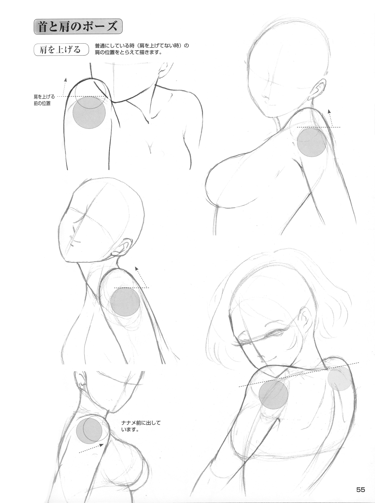

# 整理了些繪畫教學書

作者：CarbonSilicon

TID：22100

<title>1</title> <link href="../Styles/Style.css" type="text/css" rel="stylesheet">

# 1

*本帖最後由 3213213210 於 2018-12-8 04:53 編輯*

--------------------------------------------------------------------------------------------------
https://mega.nz/#F!Fx1ynIrb!cvySoFf80rw9y3z1TWOwCghttps://mega.nz/#F!h10E2KiL!V1pMNi78wIFJ_20EMErwSg
https://mega.nz/#F!V40G0KzS!VZvXHGZxiPRkqrtSXh_IIQ--------------------------------------------------------------------------------------------------
共三個資料夾，一個是遠近馳名的超級漫畫素描技法(簡體)
裡面有兩個檔名有寫兩個標題是臺灣代理的書名
再來是日本漫畫大師講座(也是簡體)，1、2、7、10以外可以忽略
最後的「其他」資料夾只有四本，被挑出來是因為我相信極其重要
個人排的重要度順序：
1.其他->絕對會上手！3：3堂課就學會，性感角色&魅力女體！(日文) <ignore_js_op>

**HowToDrawSexyCharacters_0000_0.png** *(9.96 MB, 下載次數: 0)*

[下載附件](forum.php?mod=attachment&aid=NjUzNDF8YTU4MjYwYzF8MTY3NDA2OTYwMHwxODIzMHwyMjEwMA%3D%3D&nothumb=yes)

2016-11-1 18:45 上傳

這本其實是進階用書，但是時不時翻一下可以讓努力學習的動力大增
針對女體的各個細節和各個角度都有詳細解說(看不懂日文就用描的吧)
例圖：
<ignore_js_op>

**HowToDrawSexyCharacters_0046_46.png** *(3.26 MB, 下載次數: 0)*

[下載附件](forum.php?mod=attachment&aid=NjUzNDR8NzY5NmI1ODF8MTY3NDA2OTYwMHwxODIzMHwyMjEwMA%3D%3D&nothumb=yes)

2016-11-1 19:24 上傳

<ignore_js_op>

**HowToDrawSexyCharacters_0055_55.png** *(2.17 MB, 下載次數: 0)*

[下載附件](forum.php?mod=attachment&aid=NjUzNDV8ZDhiMTJkMDh8MTY3NDA2OTYwMHwxODIzMHwyMjEwMA%3D%3D&nothumb=yes)

2016-11-1 19:24 上傳

<ignore_js_op>

**HowToDrawSexyCharacters_0064_64.png** *(1.75 MB, 下載次數: 0)*

[下載附件](forum.php?mod=attachment&aid=NjUzNDZ8ZDQ1NzBkYzh8MTY3NDA2OTYwMHwxODIzMHwyMjEwMA%3D%3D&nothumb=yes)

2016-11-1 19:25 上傳

<ignore_js_op>

**HowToDrawSexyCharacters_0119_119.png** *(1.86 MB, 下載次數: 0)*

[下載附件](forum.php?mod=attachment&aid=NjUzNDd8NDVkNTMwMTd8MTY3NDA2OTYwMHwxODIzMHwyMjEwMA%3D%3D&nothumb=yes)

2016-11-1 19:25 上傳

<ignore_js_op>

**HowToDrawSexyCharacters_0127_127.png** *(1.53 MB, 下載次數: 0)*

[下載附件](forum.php?mod=attachment&aid=NjUzNDh8MjZhMjg1N2N8MTY3NDA2OTYwMHwxODIzMHwyMjEwMA%3D%3D&nothumb=yes)

2016-11-1 19:25 上傳

2.其他->手足の描き方 マスターガイド
手和腳的畫法詳盡攻略(封面不太好看所以不貼)
吃、放身上磨或者XX，就算只是把小人拿起來，手畫歪也會讓圖片產生強烈違和感，不能不學
足控也得好好學習怎麼畫腳掌，只畫到小腿是無法滿足足控的
例圖：
<ignore_js_op>

**22.png** *(422.68 KB, 下載次數: 0)*

[下載附件](forum.php?mod=attachment&aid=NjUzNDl8NzJiYTAxN2V8MTY3NDA2OTYwMHwxODIzMHwyMjEwMA%3D%3D&nothumb=yes)

2016-11-1 19:31 上傳

3.日本漫畫大師講座 (10)人物變形誇張=マンガの基礎デッサン (デフォルメ編)=漫畫速寫講座 變形篇(臺灣代理名稱)
<ignore_js_op>

**htdm-0Cover.png** *(2.41 MB, 下載次數: 0)*

[下載附件](forum.php?mod=attachment&aid=NjUzNDJ8MTg5ZjI5YTF8MTY3NDA2OTYwMHwxODIzMHwyMjEwMA%3D%3D&nothumb=yes)

2016-11-1 18:56 上傳

變形構圖對巨大娘藝術來說實在太重要了
請看這張廣角鏡頭與低角度的完美結合
<ignore_js_op>

**就職先は落第魔女の使い魔4.jpg** *(87.13 KB, 下載次數: 0)*

[下載附件](forum.php?mod=attachment&aid=NjUzNDN8NDk2YzViNjh8MTY3NDA2OTYwMHwxODIzMHwyMjEwMA%3D%3D&nothumb=yes)

就職先は落第魔女の使い魔4

2016-11-1 19:05 上傳

(冬野みかん-就職先は落第魔女の使い魔)
以後有時間可能會寫一篇構圖方式的文
※搭配 超級漫畫素描技法4-透視篇 更有效果
4.日本漫畫大師講座 (2)漫畫服飾造型 (日文版圖片較清楚)
你是不能一輩子只畫裸體的，稍微研究一下衣服和床單的畫法吧
<ignore_js_op>

**33.png** *(440.33 KB, 下載次數: 0)*

[下載附件](forum.php?mod=attachment&aid=NjUzNTB8ZWJjMDBiNTh8MTY3NDA2OTYwMHwxODIzMHwyMjEwMA%3D%3D&nothumb=yes)

2016-11-1 19:38 上傳

5.超級漫畫素描技法-06人物與素材篇
豐富的背景可以增加圖像的說服力
尤其你的小人尺寸差距越大，對周遭細節的描繪就越重要
<ignore_js_op>

**55.png** *(461.3 KB, 下載次數: 0)*

[下載附件](forum.php?mod=attachment&aid=NjUzNTJ8ZjFhYWUxYjN8MTY3NDA2OTYwMHwxODIzMHwyMjEwMA%3D%3D&nothumb=yes)

2016-11-1 19:46 上傳

<ignore_js_op>

**44.png** *(564.76 KB, 下載次數: 0)*

[下載附件](forum.php?mod=attachment&aid=NjUzNTF8OWIxMGVlYTJ8MTY3NDA2OTYwMHwxODIzMHwyMjEwMA%3D%3D&nothumb=yes)

2016-11-1 19:46 上傳

至於其他本就看各位怎麼運用了，畫畫有無限的可能性
舉例來說，你可以在熟練頭身比的運用後把小人畫成Q版強調存在感
其實也不用只參考這些教學，這些書都是教導紙上作業，
電繪使用者也可以選擇使用軟體和網路素材來輔助作畫
像是擺骨架可以用Desighdoll或Clip Studio Paint附的Pose Studio，
背景和網點更是Google圖片就能用到手軟，想要更專精的話還可以研究用3D模型來做參考
優秀的藝術作品不會無緣無故自己變出來，一切事在人為，共勉之

-------------------------------------------------------------------------------------------------------------------

最後還是得求一下檔，所有的檔案都是我從網路上抓下來作整理的，所以品質也良莠不齊
最理想的情況是去買日版電子書轉成PDF，再依照現有官方實體本翻譯把所有日文PhotoShop修掉
不過別說精緻版本，許多書在網路上根本不見鬼影(漫畫大師講座6目前沒檔)
請手上有更多資源的同好積極分享，當然如果有人可以去買正版是最好的啦，雖然連MM都沒什麼人願意花錢了......
如果各位前輩有其他的推薦書單也請留言一下，感謝至極

<title>2</title> <link href="../Styles/Style.css" type="text/css" rel="stylesheet">

# 2

就爱这类技艺福利，感谢，我这种爱漫画却毫无天赋的苦手只是看看就感激不尽了 <title>3</title> <link href="../Styles/Style.css" type="text/css" rel="stylesheet">

# 3

這需要天賦，我很早就認清了
我的天賦不在於這
雖然練習可以增長，但資質有限 <title>4</title> <link href="../Styles/Style.css" type="text/css" rel="stylesheet">

# 4

第一本強推，因為我就用了好幾年，書都泛黃了說XD

其他的不是不推，不是沒中文版就是附近沒看過...

有動機就要動筆，有動筆才有成就，共勉之!

自給自足的感覺是甜美的，動筆吧!
<title>5</title> <link href="../Styles/Style.css" type="text/css" rel="stylesheet">

# 5

右键完之后的我打开了战网客户端 <title>6</title> <link href="../Styles/Style.css" type="text/css" rel="stylesheet">

# 6

看到这个不由得想起几年前也曾经想做个本子画师，然而到现在了ps都还停留在入门阶段 <title>7</title> <link href="../Styles/Style.css" type="text/css" rel="stylesheet">

# 7

资源..........炸了，还能补档吗.... <title>8</title> <link href="../Styles/Style.css" type="text/css" rel="stylesheet">

# 8

> [weikesi 發表於 2018-12-7 17:36](https://giantessnight.cf/gnforum2012/forum.php?mod=redirect&goto=findpost&pid=391921&ptid=22100)
> 资源..........炸了，还能补档吗....

看在你挖出了這麼久以前的文 已補
<title>9</title> <link href="../Styles/Style.css" type="text/css" rel="stylesheet">

# 9

> [3213213210 發表於 2018-12-8 04:53](https://giantessnight.cf/gnforum2012/forum.php?mod=redirect&goto=findpost&pid=391953&ptid=22100)
> 看在你挖出了這麼久以前的文 已補

233333还不是因为看到了你的个性签名嘛
<title>10</title> <link href="../Styles/Style.css" type="text/css" rel="stylesheet">

# 10

终于找到了哇，这全套的参考学习书。
真该早来这个板块逛一逛:P <title>11</title> <link href="../Styles/Style.css" type="text/css" rel="stylesheet">

# 11

有專教畫皮膚光陰與渲染肌膚嗎？ <title>12</title> <link href="../Styles/Style.css" type="text/css" rel="stylesheet">

# 12

> [CarbonSilicon 發表於 2021-10-24 17:29](https://giantessnight.cf/gnforum2012/forum.php?mod=redirect&goto=findpost&pid=483073&ptid=22100)
> 有專教畫皮膚光陰與渲染肌膚嗎？

我這些講的都漫畫素描 也就是用線來表現畫面

在漫畫裡 皮膚經常是一片白 用些網點強調陰影 或是用一些小線條製造材質感就夠了 大概不是會特地出書的事情

<title>13</title> <link href="../Styles/Style.css" type="text/css" rel="stylesheet">

# 13

那麼唯有自我去直接苦練吓渲染膚色啦.....</ignore_js_op></ignore_js_op></ignore_js_op></ignore_js_op></ignore_js_op></ignore_js_op></ignore_js_op></ignore_js_op></ignore_js_op></ignore_js_op></ignore_js_op></ignore_js_op>