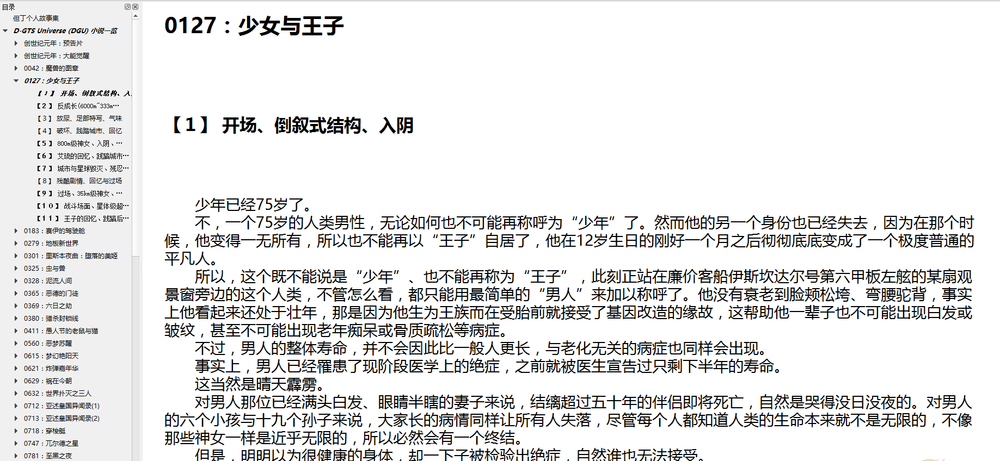
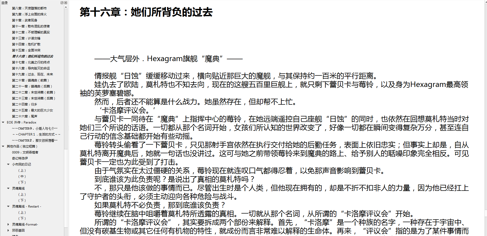
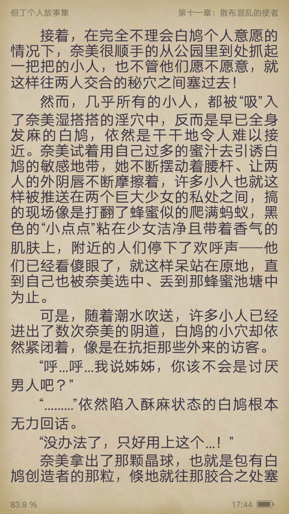

# 整理但大的作品做了电子书，有详细目录，epub格式

作者：jyb1025

TID：21073

<title>1</title> <link href="../Styles/Style.css" type="text/css" rel="stylesheet">

# 1

*本帖最後由 jyb1025 於 2016-5-13 17:48 編輯*

遥想当年第一次接触但大的作品，应该是接近十年前了吧，那个时候还没有办法整天上网，于是就把但大的作品下载成txt格式，放到mp4上看。后来有了手机，于是就把txt下载到手机上，现在有了kindle，终于得了一次机会，把但大在首页上的作品整理了一下，做成了mobi，可以放在Kindle上愉快看了。鉴于不是每个人都有kindle，mobi这种专用格式比较麻烦，所以转了份epub格式，基本上大多数的手机阅读软件都支持。

看了这么多GTS文，还是但大的最好，最来感。感谢但大给我们带来的宏伟世界。原文本10MB+，不得不对但大肃然起敬。

保留全部文章内容（DGU部分的背景设定/key-word没有做进去），包括「大能觉醒」和其预告文，以及「来自出云」，「永劫极速」两篇未包括在首页目录中，但是在网页根目录下的文章。全部目录/分页。因为偷懒，所以可能有错误排版，不过我觉得基本可以算完美了吧。

内容为简体，有几篇是用word的繁转简转化的，貌似会改动其中的某些大陆台湾用法不同的词，比如「网络」和「网路」之类的，抱歉。

如有侵权请通知，立即删除。

需要其他格式/繁体版，可以联系我。

不知道发到哪个区好，要是不合适可以帮我移动了～

例图
<ignore_js_op>

**2016-05-13.png** *(192.38 KB, 下載次數: 19)*

[下載附件](forum.php?mod=attachment&aid=NjEyOTh8MjRjNWNiOGZ8MTY3NDA2Nzk4OXwxODIzMHwyMTA3Mw%3D%3D&nothumb=yes)

2016-5-13 17:18 上傳

<ignore_js_op>

**2016-05-13 (1).png** *(221.13 KB, 下載次數: 0)*

[下載附件](forum.php?mod=attachment&aid=NjEyOTl8ZjI0NTliYmF8MTY3NDA2Nzk4OXwxODIzMHwyMTA3Mw%3D%3D&nothumb=yes)

2016-5-13 17:20 上傳

<ignore_js_op>

**webwxgetmsgimg.jpg** *(3.76 MB, 下載次數: 0)*

[下載附件](forum.php?mod=attachment&aid=NjEzMDB8ZjI0MDA1MmN8MTY3NDA2Nzk4OXwxODIzMHwyMTA3Mw%3D%3D&nothumb=yes)

2016-5-13 17:48 上傳

<ignore_js_op> [Dante - 但丁个人故事集.zip](forum.php?mod=attachment&aid=NjEyOTZ8ZTI1YWJmZTd8MTY3NDA2Nzk4OXwxODIzMHwyMTA3Mw%3D%3D) *(7.39 MB, 下載次數: 913)* 2016-5-13 17:00 上傳點擊文件名下載附件

<title>2</title> <link href="../Styles/Style.css" type="text/css" rel="stylesheet">

# 2

我只能说这是但丁的忠实粉丝，我开始进论坛也是非常喜欢但丁的文章，但是后来，但丁的文章变得越来越难懂，有着越来越多的含义，我喜欢的GTS要素却越来越少了，而且到了后来，连更新都没有了，比较可惜 <title>3</title> <link href="../Styles/Style.css" type="text/css" rel="stylesheet">

# 3

感谢楼主奉献  分享                   <title>4</title> <link href="../Styles/Style.css" type="text/css" rel="stylesheet">

# 4

*本帖最後由 無邊落木 於 2016-5-14 13:00 編輯*

"如有侵权请通知，立即删除。"

如果樓主真的在乎作者的感受，真的不想侵權，那麼請不要隨隨便便貼出來。

何況作者但大還是論壇主，不是聯繫不到的人，並不是作者看到了，通知了，你才下架，
因為在樓主貼出的瞬間，這個檔案就已經被拷貝了無數次，流進網海一去不復返了，樓主下不下架又有何干？

雖然樓主並非拿但大的心血結晶營利，但是看到紅字這段話，無某還是忍不住針對著作權的部分小吐槽一下，請見諒。
<title>5</title> <link href="../Styles/Style.css" type="text/css" rel="stylesheet">

# 5

谢谢楼主，一直想离线但丁大大的文章但是太多。。。 <title>6</title> <link href="../Styles/Style.css" type="text/css" rel="stylesheet">

# 6

旦大的作品量很大，字很足。世界观也有点大，一般的作者有点难以驾驭 <title>7</title> <link href="../Styles/Style.css" type="text/css" rel="stylesheet">

# 7

> [無邊落木 發表於 2016-5-14 12:58](https://giantessnight.cf/gnforum2012/forum.php?mod=redirect&goto=findpost&pid=293599&ptid=21073)
> "如有侵权请通知，立即删除。"

这个，但大的故事首页，第一句话是这样的。
「若各位想要转贴，还请记得附上原作者我的名字 。然而，因本人文章性质小众，无论如何皆禁止转贴于非GTS网站。」

因此，我觉得单纯在本站发帖，应该并无不妥之处。
<title>8</title> <link href="../Styles/Style.css" type="text/css" rel="stylesheet">

# 8

kindle上可以看！？那么好！？书名叫什么我要买！</ignore_js_op></ignore_js_op></ignore_js_op></ignore_js_op>