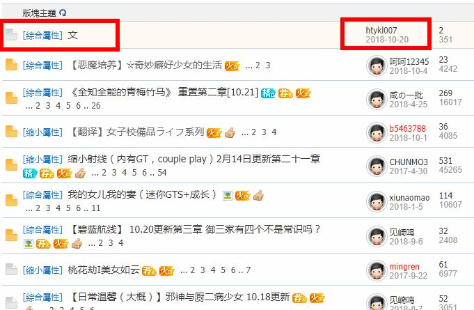
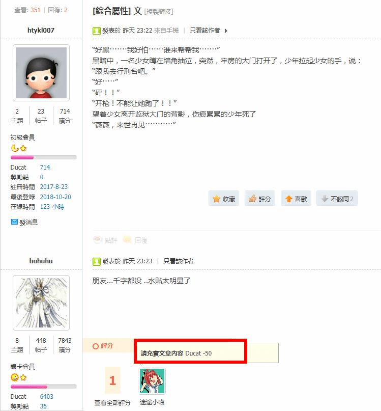
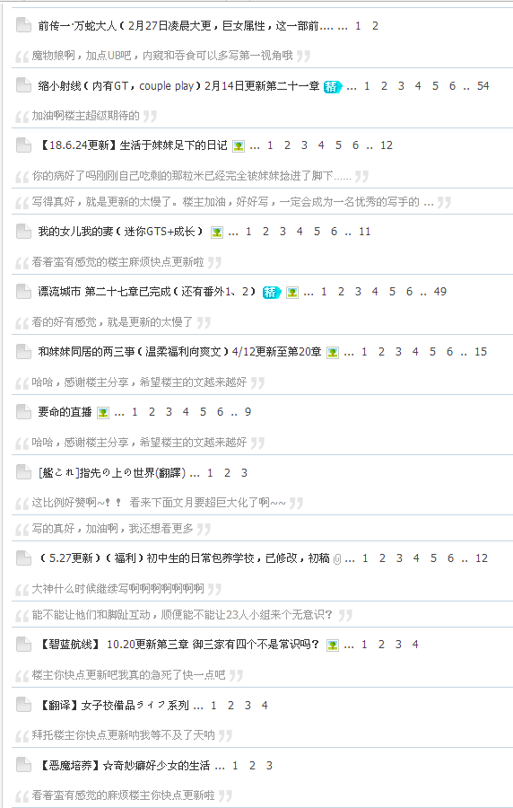

# 文章區的新文章與評論

作者：xxx99

TID：25991

<title>1</title> <link href="../Styles/Style.css" type="text/css" rel="stylesheet">

# 1

慣例逛GN
發現有新文章！
標題還這麽簡潔
趕快點開看看
<ignore_js_op>

**100509709.jpg** *(59.92 KB, 下載次數: 0)*

[下載附件](forum.php?mod=attachment&aid=NzUyNjF8NzZlZWZlODh8MTY3NDA2Njk4NnwxODIzMHwyNTk5MQ%3D%3D&nothumb=yes)

2018-10-21 10:06 上傳

結果內容這麽少啊
只能等更新了

不過看到下面的回復就想吐槽了

<ignore_js_op>

**0557956.jpg** *(60.32 KB, 下載次數: 0)*

[下載附件](forum.php?mod=attachment&aid=NzUyNjJ8NTYzY2I5YTN8MTY3NDA2Njk4NnwxODIzMHwyNTk5MQ%3D%3D&nothumb=yes)

2018-10-21 10:06 上傳

明明是好心人提示樓主文章字數過少

反而被視為水帖扣分
理由竟然是充實內容！
真正該充實內容的不是被扣分人員的回復
而是樓主的文章才對
<title>2</title> <link href="../Styles/Style.css" type="text/css" rel="stylesheet">

# 2

噗，是不是管理人员点错了啊，应该是想要扣楼主的吧wwww <title>3</title> <link href="../Styles/Style.css" type="text/css" rel="stylesheet">

# 3

不知道为什么我看着想笑:-D <title>4</title> <link href="../Styles/Style.css" type="text/css" rel="stylesheet">

# 4

如截图 点进去这人回帖一看大概全是需要充实内容的回帖 只是这样水的人太多 或者是一人多水 管理员人数不多 精力也有限 不可能管得了那么多人  不可能说特地一个一个扣分什么的  特别是那些大长文后面 水的人其实不少 但是没办法 管不来。。  
另外 我也想说其实应该把那个水帖直接删了算了。。 这种文字数连一个比较长一点的回复都不到 里面内容也不怎么充实 写这么一点东西还特地分开两个主题发 一边是今晚构思第一章 然后这边就是第一章吗。。 虽然管理员的初衷应该是想鼓励别人在文章区写文 但是 这是gts的圈子 你写的东西不仅一点不沾边 看完我还不知道看的是啥 起码学学那边5楼phone2345的例子呀
<title>5</title> <link href="../Styles/Style.css" type="text/css" rel="stylesheet">

# 5

 <ignore_js_op>[123.png](forum.php?mod=attachment&aid=NzUyNjN8NmQzZDlmNjd8MTY3NDA2Njk4NnwxODIzMHwyNTk5MQ%3D%3D&nothumb=yes) *(60.75 KB, 下載次數: 0)*

[下載附件](forum.php?mod=attachment&aid=NzUyNjN8NmQzZDlmNjd8MTY3NDA2Njk4NnwxODIzMHwyNTk5MQ%3D%3D&nothumb=yes)

2018-10-21 14:03 上傳  

</ignore_js_op> <title>6</title> <link href="../Styles/Style.css" type="text/css" rel="stylesheet">

# 6

瞬间感动..谢谢你的热心肠... <title>7</title> <link href="../Styles/Style.css" type="text/css" rel="stylesheet">

# 7

不歧视新人写短篇，可这位仁兄写的比诗歌还短啊！
<title>8</title> <link href="../Styles/Style.css" type="text/css" rel="stylesheet">

# 8

九年之前的话这种行为会直接删号吧好像 <title>9</title> <link href="../Styles/Style.css" type="text/css" rel="stylesheet">

# 9

呃，我错了。

我本来打算放一下看看这位仁兄会不会补充点内容，结果竟然有事发生......

如果两天后他不补充内容就删帖好了。 <title>10</title> <link href="../Styles/Style.css" type="text/css" rel="stylesheet">

# 10

補述
論壇其實很多都是喜歡先佔樓補內容
但後來基於沒人繼續檢舉
所以以為已經補上了，如果還是一樣的情況，將會刪除文章 <title>11</title> <link href="../Styles/Style.css" type="text/css" rel="stylesheet">

# 11

其實應該不少人知道
我的評斷標準比較嚴格(或是說台灣標準就是如此)
基本上提醒內文過短可以
但一句：怎麼那麼短，也是提醒或建議
可作為回覆來說，依然不夠用心，不能獲得該有的積分

或許可以添加詢問，以及自己的見解等等，或是提供改善，別的大佬的作品參考等等

如果是：這個文章內文有點少，而且跟巨大娘看不出關係？是先佔樓嗎？如果不是的話可能要請管理員處理</ignore_js_op></ignore_js_op>