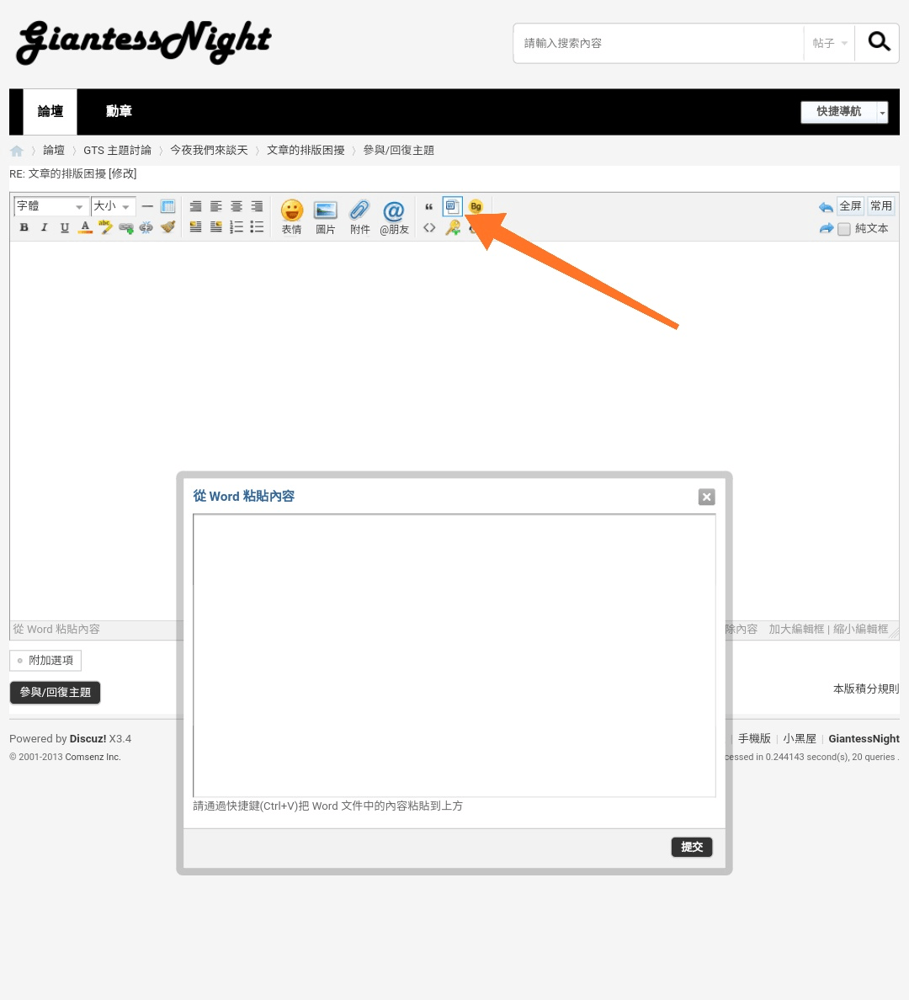

# 文章的排版困擾

作者：單身的貓

TID：30977

<title>1</title> <link href="../Styles/Style.css" type="text/css" rel="stylesheet">

# 1

*本帖最後由 單身的貓 於 2021-5-28 01:15 編輯*

各位寫文的時候是運用甚麼工具編輯和編寫呢?
我是用電腦 Microsoft Word 360 字體12 新細明體，再把文章複製後貼到gn(字體大小改成4或3)這裡發布一開始在gn做最後編輯都很正常，但是按下發布後，文字與文字之間原本的空行會消失或其他，導致最後的文字會擠在一起(直接跳到上一行的後面、空行消失/增加) 所以我就得再次調整並發布，有點麻煩

請問這樣的問題如何解決呢???

(字體4)**文章理想排版:**
...
今天天氣真好。**(空格)**
真想出門打幾道鼓。**(空格)**
可惡現在遊樂場都關門。**(空格)**
結束。
...
**發佈到gn的結果:**

今天天氣真好。真想出門打幾道鼓。
**(空格)** **(空格)** 可惡現在遊樂場都關門。
結束。
...

<title>2</title> <link href="../Styles/Style.css" type="text/css" rel="stylesheet">

# 2

不知道这样可不可以 <ignore_js_op>

**Screenshot_2021-05-28-14-30-20-003_com.android.chrome.png** *(101.64 KB, 下載次數: 0)*

[下載附件](forum.php?mod=attachment&aid=ODg5NjB8MmM3MGNjYmN8MTY3NDA2NjAwNXwxODIzMHwzMDk3Nw%3D%3D&nothumb=yes)

2021-5-28 14:31 上傳

另外也许可以尝试专门的BBcode编辑器编辑后将内容连同代码一起在纯文本模式下粘贴进来

<title>3</title> <link href="../Styles/Style.css" type="text/css" rel="stylesheet">

# 3

建議發discuz論壇的文別設定字體，排版的話有幾種思路：

完美排版：
用記事本讓文變成純文字，自己用bbcode搭配尋找取代功能加上字型變化，如果有需要不同角色的對話套上不同顏色就要用這種方法

純文字排版
利用線上純文字排版網頁 (例如: [https://paiban.gaodun.com/](https://paiban.gaodun.com/)) ，對文章段落加上行前空格或行間換行，達到排版效果。由於是純文字，適合大量文字發布排版，也相容各種用戶端與一些瀏覽器閱讀設定

WORD排版
透過WORD編輯格式，搭配discuz編輯器中的「從WORD黏貼內容」可以獲得不錯的排版效果，但建議WORD格式別過於複雜，最好只有縮排、顏色、字型、粗體等四種設定就好，設定越少，越不容易出錯

<title>4</title> <link href="../Styles/Style.css" type="text/css" rel="stylesheet">

# 4

> [Lcxzyr 發表於 2021-5-28 14:32](https://giantessnight.cf/gnforum2012/forum.php?mod=redirect&goto=findpost&pid=469677&ptid=30977)
> 不知道这样可不可以
> 另外也许可以尝试专门的BBcode编辑器编辑后将内容连同代码一起在纯文本模式下粘贴进来
> ...

了解,我會試看看那個功能，目前還在摸索中
<title>5</title> <link href="../Styles/Style.css" type="text/css" rel="stylesheet">

# 5

> [phone2345 發表於 2021-5-28 23:56](https://giantessnight.cf/gnforum2012/forum.php?mod=redirect&goto=findpost&pid=469726&ptid=30977)
> 建議發discuz論壇的文別設定字體，排版的話有幾種思路：
> 
> 完美排版：

關於 「從WORD黏貼內容」我把按了提交他好像沒有反應? 是甚麼步驟出錯了嗎?

編排網站的用法是把word的內容貼過去那裏再進行修飾最後才複製到這裡嗎?</ignore_js_op>