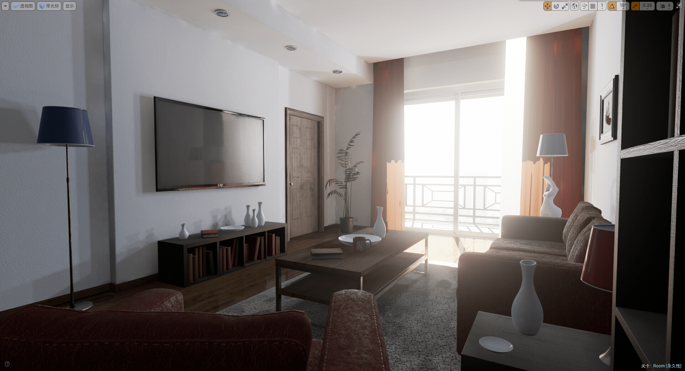

# 新游戏跳票·放几张截图·征集玩法

作者：freedomkey

TID：18595

<title>1</title> <link href="../Styles/Style.css" type="text/css" rel="stylesheet">

# 1

之前说是看看能不能在冬天再做个游戏出来，结果发现开发实在是太费劲了...所以...
跳票好了。
调到什么时候呢...说实话我也不知道...

引擎换成了虚幻4，因为不像UDK那样有现成的虚幻竞技场作为模板，一切都得从零开始，所以开发就变得麻烦的多了...
这一次决定集中研究人物的动作部分，让游戏里的人真正动起来，目前效果还算是不错...
对于UE4还是新手，现在还在边做边学的阶段，不过不得不说虚幻4真的是个相当棒的引擎。
询问了City上的Dreams的作者，和他讨论了下后发现碰撞检测一直是个大问题，这种尺寸的话，如果加入动画很难实现精确的碰撞并且会出现很多的问题，所以像上一部游戏的探索元素就必须舍弃掉了...这个是一个目前难以解决的技术难题...
调试了很久第一人称和第三人称切换的功能，加入这个主要是为了让Oculus Rift用户的体验会更好一些，没错，这次会加入对Oculus Rift的支持（虽然我没有Oculus Rift...）。

个人对于人物动画非常不熟悉，不知道论坛里有没有动画高手愿意帮忙的...（使用3dsMax、Maya、Cinema4D、Blender或MotionBuilder）

另外游戏还在搭建基础框架的阶段，具体内容还没有设计好，来征集一下大家的创意好了...
游戏情节，玩法之类的，听听你们的意见...
比例是1/50，主角大概在3cm左右，场景见下图。

几张截图：
（场景是UE4的官方Demo，被我放大了50倍...）

<ignore_js_op>

**01.jpg** *(1.5 MB, 下載次數: 0)*

[下載附件](forum.php?mod=attachment&aid=NTA3NDF8OGRhZDFlY2V8MTY3NDA2ODA2NHwxODIzMHwxODU5NQ%3D%3D&nothumb=yes)

2015-3-1 17:01 上傳

<ignore_js_op>

**02.jpg** *(1.61 MB, 下載次數: 0)*

[下載附件](forum.php?mod=attachment&aid=NTA3NDJ8MjFjNWQxNTF8MTY3NDA2ODA2NHwxODIzMHwxODU5NQ%3D%3D&nothumb=yes)

2015-3-1 17:02 上傳

<ignore_js_op>

**03.jpg** *(1.71 MB, 下載次數: 0)*

[下載附件](forum.php?mod=attachment&aid=NTA3NDN8NzQ3NTg5MDJ8MTY3NDA2ODA2NHwxODIzMHwxODU5NQ%3D%3D&nothumb=yes)

2015-3-1 17:02 上傳

<ignore_js_op>

**04.jpg** *(1.79 MB, 下載次數: 0)*

[下載附件](forum.php?mod=attachment&aid=NTA3NDR8Mzg1NWM4ZTl8MTY3NDA2ODA2NHwxODIzMHwxODU5NQ%3D%3D&nothumb=yes)

2015-3-1 17:02 上傳

<ignore_js_op>

**05.jpg** *(1.57 MB, 下載次數: 0)*

[下載附件](forum.php?mod=attachment&aid=NTA3NDV8NzQ3NzlkNTl8MTY3NDA2ODA2NHwxODIzMHwxODU5NQ%3D%3D&nothumb=yes)

2015-3-1 17:02 上傳

<ignore_js_op>

**06.jpg** *(1.6 MB, 下載次數: 0)*

[下載附件](forum.php?mod=attachment&aid=NTA3NDZ8NTUyZDk0YjJ8MTY3NDA2ODA2NHwxODIzMHwxODU5NQ%3D%3D&nothumb=yes)

2015-3-1 17:02 上傳

<title>2</title> <link href="../Styles/Style.css" type="text/css" rel="stylesheet">

# 2

唔我想能多体验下inshoe的感觉，因为这是现在所有视频中最难的，也是最适合pov游戏模拟的。特别是鞋子里面汗渍和蒸汽腾腾热热的效果，真的很想尝试！！然后自己通过观察可以肯定，再爱干净的女孩子的鞋子里完全可以像地狱一样可怕，所以求制作！！！ <title>3</title> <link href="../Styles/Style.css" type="text/css" rel="stylesheet">

# 3

非常支持楼主的开发，上一作的遗憾要解决了么！ <title>4</title> <link href="../Styles/Style.css" type="text/css" rel="stylesheet">

# 4

楼主你应该找几个会这方面的人来一起制作，互动要是也有的话那你的游戏就是一部史诗啦 <title>5</title> <link href="../Styles/Style.css" type="text/css" rel="stylesheet">

# 5

有想像力又有實體化能力的人才真的是難得呀，樓主加油，祝你早日完成巨作！ <title>6</title> <link href="../Styles/Style.css" type="text/css" rel="stylesheet">

# 6

> [月影方守矢 發表於 2015-3-1 18:46](https://giantessnight.cf/gnforum2012/forum.php?mod=redirect&goto=findpost&pid=247813&ptid=18595)
> 非常支持楼主的开发，上一作的遗憾要解决了么！

没错，就是想解决上一部不能动的遗憾...
不过没办法做到像上一部那样的尺寸探索了，动画和探索这两个是冲突的只能选一个....
<title>7</title> <link href="../Styles/Style.css" type="text/css" rel="stylesheet">

# 7

> [langborghini 發表於 2015-3-1 18:55](https://giantessnight.cf/gnforum2012/forum.php?mod=redirect&goto=findpost&pid=247816&ptid=18595)
> 楼主你应该找几个会这方面的人来一起制作，互动要是也有的话那你的游戏就是一部史诗啦 ...

这回主要就是想解决互动的问题了，找人估计会很困难吧...
<title>8</title> <link href="../Styles/Style.css" type="text/css" rel="stylesheet">

# 8

上一作就是大小和速度不同，变大了之后还是这么慢的速度..探索的地方希望能多一些，楼主加油！ <title>9</title> <link href="../Styles/Style.css" type="text/css" rel="stylesheet">

# 9

> [xszr 發表於 2015-3-1 20:07](https://giantessnight.cf/gnforum2012/forum.php?mod=redirect&goto=findpost&pid=247833&ptid=18595)
> 上一作就是大小和速度不同，变大了之后还是这么慢的速度..探索的地方希望能多一些，楼主加油！ ...

大小好速度不同那是你控制台输入不到位，changesize了之后应该把set speed都设置好了。
这回不玩探索了，这次是主攻互动，所以也不会有更多地方能让你探索。
<title>10</title> <link href="../Styles/Style.css" type="text/css" rel="stylesheet">

# 10

能否換個模組...........
是說最近SS還為了影片自己制作模組
(不過格式之類的完全沒概念) <title>11</title> <link href="../Styles/Style.css" type="text/css" rel="stylesheet">

# 11

请问场景是在一个房间里的吗？有几个GTS？女性模型有哪几种？

房间的预览图有没有？我帮你做个互动方面的策划（配插图）。 <title>12</title> <link href="../Styles/Style.css" type="text/css" rel="stylesheet">

# 12

不能碰觸也行啊，讓主角站在床上躲避各種壓迫而來的女主身體部位，先用手指戳(慢慢地)，戳幾次改用掌壓，接著開使用腳踩，不能忘記加個乳壓橋段，然後兩隻手撐著床臉靠近親吻(被逮到還會伸出舌頭，啊斯)，最後直接搖搖屁股坐到床上，根據逃的方向決定結束方式(屁股後或大腿間......)(也能作成那種不管怎樣都會Game over的)
然後當然要有收集要素，像是離被殺掉範圍距離越近分數越高或特定位置可以拿到加分道具等等，分數用來幫女主換衣服(或脫衣服，別的BD橋段之類的，容量夠還能買新女主)(或是能買檔案解壓密碼)
當然這樣要非常大量的運算啦，不過光這段文字我就硬邦邦了，品質保證
可以在地上(床上)畫格子，用快攻擊到時主角所在範圍決定有沒有Game Over，有的話就把畫面直接轉向襲來的女主身體，接著黑畫面，紅色的Game Over
決定遊戲性的地方就是操控感和節奏
我對製作遊戲完完全全沒有概念，所以我如果說了甚麼蠢話也請砲小力點
不過最大的重點還是，模組要吸引人............沒有動漫人物至少也亞洲人，要是正妹 <title>13</title> <link href="../Styles/Style.css" type="text/css" rel="stylesheet">

# 13

技术渣只能给予精神鼓励了！！！ <title>14</title> <link href="../Styles/Style.css" type="text/css" rel="stylesheet">

# 14

> [3213213210 發表於 2015-3-1 23:25](https://giantessnight.cf/gnforum2012/forum.php?mod=redirect&goto=findpost&pid=247863&ptid=18595)
> 不能碰觸也行啊，讓主角站在床上躲避各種壓迫而來的女主身體部位，先用手指戳(慢慢地)，戳幾次改用掌壓，接 ...

你说的这些互动都是通过碰触实现的啊！
<title>15</title> <link href="../Styles/Style.css" type="text/css" rel="stylesheet">

# 15

> [3213213210 發表於 2015-3-1 23:25](https://giantessnight.cf/gnforum2012/forum.php?mod=redirect&goto=findpost&pid=247863&ptid=18595)
> 不能碰觸也行啊，讓主角站在床上躲避各種壓迫而來的女主身體部位，先用手指戳(慢慢地)，戳幾次改用掌壓，接 ...

XNR大正解了...这些内容目前技术水平来说几乎是不可能实现的...
还有这种真实向的游戏搞个动漫人出来真的好么= =
<title>16</title> <link href="../Styles/Style.css" type="text/css" rel="stylesheet">

# 16

> [xnr 發表於 2015-3-1 22:37](https://giantessnight.cf/gnforum2012/forum.php?mod=redirect&goto=findpost&pid=247853&ptid=18595)
> 请问场景是在一个房间里的吗？有几个GTS？女性模型有哪几种？
> 
> 房间的预览图有没有？我帮你做个互动方面的 ...

房间是这个就基本确定了，GTS目前只做了一个，根据场景来看可以做2个的样子，不过再多就没有空间了，而且做太多也没有精力了，我需要做大量的预处理工作...比如压缩材质通道以优化游戏，还有头发我是重新在max里蒙皮的，为了实现动态的物理效果，而且还得处理那些Morphin部分...
<ignore_js_op>

**td.jpg** *(128.54 KB, 下載次數: 0)*

[下載附件](forum.php?mod=attachment&aid=NTA3NjR8MDExODUzMDV8MTY3NDA2ODEwNXwxODIzMHwxODU5NQ%3D%3D&nothumb=yes)

2015-3-2 14:04 上傳

这个是俯视图
<ignore_js_op>

**td2.jpg** *(355.22 KB, 下載次數: 0)*

[下載附件](forum.php?mod=attachment&aid=NTA3NjV8Mzg2MGRlMDF8MTY3NDA2ODEwNXwxODIzMHwxODU5NQ%3D%3D&nothumb=yes)

2015-3-2 14:04 上傳

场景的结构
<ignore_js_op>

**tp3.jpg** *(1.72 MB, 下載次數: 0)*

[下載附件](forum.php?mod=attachment&aid=NTA3NjZ8N2UwNzMyZTF8MTY3NDA2ODEwNXwxODIzMHwxODU5NQ%3D%3D&nothumb=yes)

2015-3-2 14:05 上傳

<ignore_js_op>

**tp4.jpg** *(1.63 MB, 下載次數: 0)*

[下載附件](forum.php?mod=attachment&aid=NTA3Njd8MjgwZGViNjl8MTY3NDA2ODEwNXwxODIzMHwxODU5NQ%3D%3D&nothumb=yes)

2015-3-2 14:05 上傳

PlayerStart是在门口的地毯上
<ignore_js_op>

**tp5.jpg** *(1.73 MB, 下載次數: 0)*

[下載附件](forum.php?mod=attachment&aid=NTA3Njh8NmE2MWU5YzF8MTY3NDA2ODEwNXwxODIzMHwxODU5NQ%3D%3D&nothumb=yes)

2015-3-2 14:05 上傳

<ignore_js_op>

**tp6.jpg** *(1.83 MB, 下載次數: 0)*

[下載附件](forum.php?mod=attachment&aid=NTA3Njl8YzQ1Y2FiNGJ8MTY3NDA2ODEwNXwxODIzMHwxODU5NQ%3D%3D&nothumb=yes)

2015-3-2 14:05 上傳

主要的互动就集中在这个位置了
<ignore_js_op>

**tp7.jpg** *(2.14 MB, 下載次數: 0)*

[下載附件](forum.php?mod=attachment&aid=NTA3NzB8NTBjMWVkMWZ8MTY3NDA2ODEwNXwxODIzMHwxODU5NQ%3D%3D&nothumb=yes)

2015-3-2 14:05 上傳

<ignore_js_op>

**tp8.jpg** *(397.15 KB, 下載次數: 0)*

[下載附件](forum.php?mod=attachment&aid=NTA3NzF8YTM2ODljNTd8MTY3NDA2ODEwNXwxODIzMHwxODU5NQ%3D%3D&nothumb=yes)

2015-3-2 14:05 上傳

场景是在这样的一个客厅里了，研究了一下发现互动是完全不可能通过AI实现的，所以只能预先做好不同的可能性了...

P.S. 麻烦XNR大看一下论坛是不是bug了，怎么前几天买的两个勋章都不见了...

<title>17</title> <link href="../Styles/Style.css" type="text/css" rel="stylesheet">

# 17

(´・ω・｀)互动既然没办法做的话...UP你干脆弄成第三人称视角算了...
捏几个小人，让它们和女巨人互动，然后操纵的角色设置为不可见，使用道具触发命令让女巨人和小人互动...
这样的话碰撞就只要装装样子就行了。大概？ <title>18</title> <link href="../Styles/Style.css" type="text/css" rel="stylesheet">

# 18

> [shendanxiaogui 發表於 2015-3-2 15:18](https://giantessnight.cf/gnforum2012/forum.php?mod=redirect&goto=findpost&pid=247916&ptid=18595)
> (´・ω・｀)互动既然没办法做的话...UP你干脆弄成第三人称视角算了...
> 捏几个小人，让它们和女巨人互动， ...

简单的互动是可以实现的，只是复杂的做不到...
而且现在就是第三人称视角的，加了一个切换到第一人称的功能而已
设想的方法就是通过不同的触发器和条件触发不同的动画
<title>19</title> <link href="../Styles/Style.css" type="text/css" rel="stylesheet">

# 19

前排圍觀樓主大神
有樓主這樣的創作者真的是我們廣大群眾的福音
加油! <title>20</title> <link href="../Styles/Style.css" type="text/css" rel="stylesheet">

# 20

> [wxy112300 發表於 2015-3-2 13:54](https://giantessnight.cf/gnforum2012/forum.php?mod=redirect&goto=findpost&pid=247906&ptid=18595)
> XNR大正解了...这些内容目前技术水平来说几乎是不可能实现的...
> 还有这种真实向的游戏搞个动漫人出来真的 ...

我的意思是讓女主攻擊地板，如果攻擊範圍和主角範圍重合就直接判定Game over(畫面直接黑掉，反正死了嘛)
確實是不適合放動漫人物啦，但大A作品容貌等級的模組應該找的到吧
不過還是探險類遊戲比較簡單啦，
那如果是限時逃脫呢，努力狂敲鍵盤逃離逼近的女主身體部位(沙發上要坐來、地上要踩來等)，
或者時限內找到每次都在不同地方出現的道具
讓女主作一個動作，然後視角鎖定在往畫面逼來的部位，要碰到時直接Game Over
這樣實際上不算互動吧？
(互動的定義看來不是不拿起來就沒事啊)
如果是類似開放世界的概念卻不能有身體接觸也太悲傷了
(不然就做像Dust一樣，女主身體當作地圖)
<title>21</title> <link href="../Styles/Style.css" type="text/css" rel="stylesheet">

# 21

LZ不愧是大神啊还当上了GTA5吧小吧主，我今天才发现 <title>22</title> <link href="../Styles/Style.css" type="text/css" rel="stylesheet">

# 22

> [xljsb 發表於 2015-3-2 22:32](https://giantessnight.cf/gnforum2012/forum.php?mod=redirect&goto=findpost&pid=247972&ptid=18595)
> LZ不愧是大神啊还当上了GTA5吧小吧主，我今天才发现

LZ我错了我也是5吧吧友啊 <title>23</title> <link href="../Styles/Style.css" type="text/css" rel="stylesheet">

# 23

依然不考虑巨大女吗？
地图小点也可以的 <title>24</title> <link href="../Styles/Style.css" type="text/css" rel="stylesheet">

# 24

拜玩过前作，被楼主的细节处理能力深深触动，新作看截图貌似效果更佳体验更好的样子。
有没有办法让GTS主动攻击小人们（NPC），比如吞食，践踏。包括吞食后的逃生。想想也有点小性奋了~~ <title>25</title> <link href="../Styles/Style.css" type="text/css" rel="stylesheet">

# 25

对楼主所说的引擎之类的简直是一窍不通，只能在回帖子的时候支持一下QAQ向楼主的热情与无私奉献精神致敬~ <title>26</title> <link href="../Styles/Style.css" type="text/css" rel="stylesheet">

# 26

说实话，楼主要是能找到同样的技术宅同好的话，说不定就可以自己做出第一部虚幻4引擎的gts游戏了，如果发售的话我一定会入的=v= <title>27</title> <link href="../Styles/Style.css" type="text/css" rel="stylesheet">

# 27

帮不上任何忙，只是来凑热闹。。顺便说一句外行话,这样的模型导入不可以自己建模吗? <title>28</title> <link href="../Styles/Style.css" type="text/css" rel="stylesheet">

# 28

> [涅槃 發表於 2015-3-27 00:57](https://giantessnight.cf/gnforum2012/forum.php?mod=redirect&goto=findpost&pid=249875&ptid=18595)
> 帮不上任何忙，只是来凑热闹。。顺便说一句外行话,这样的模型导入不可以自己建模吗? ...

(´・ω・｀)嗯...简单说建模需要比起制作一个游戏更为大量的时间，所以自己建模是不效率的...
<title>29</title> <link href="../Styles/Style.css" type="text/css" rel="stylesheet">

# 29

房间设计的不错，如果能把女主角设计成女神级人物就完美了~ <title>30</title> <link href="../Styles/Style.css" type="text/css" rel="stylesheet">

# 30

期待~~

感觉如果真的让女主动起来工作量会很大的说...

是不是还要设计大量的程序啥的...

总之楼主加油啦~可惜我不是技术宅不然我也想帮忙出一份力的... <title>31</title> <link href="../Styles/Style.css" type="text/css" rel="stylesheet">

# 31

这游戏叫什么名字，在哪里可以下载，求楼主告之，谢谢 <title>32</title> <link href="../Styles/Style.css" type="text/css" rel="stylesheet">

# 32

感觉这游戏不错，但是找不带资源。 <title>33</title> <link href="../Styles/Style.css" type="text/css" rel="stylesheet">

# 33

*本帖最後由 王异 於 2015-4-30 21:39 編輯*

想问下楼主 这次还能在嘴里面玩耍吗……前作做得太棒了~~
<title>34</title> <link href="../Styles/Style.css" type="text/css" rel="stylesheet">

# 34

> [Reimu丨Action 發表於 2015-4-27 13:21](https://giantessnight.cf/gnforum2012/forum.php?mod=redirect&goto=findpost&pid=252948&ptid=18595)
> 感觉这游戏不错，但是找不带资源。

。。。。请问新人你要什么资源？
<title>35</title> <link href="../Styles/Style.css" type="text/css" rel="stylesheet">

# 35

> [lighttu 發表於 2015-4-12 10:00](https://giantessnight.cf/gnforum2012/forum.php?mod=redirect&goto=findpost&pid=251320&ptid=18595)
> 这游戏叫什么名字，在哪里可以下载，求楼主告之，谢谢

新人你是故意来灌水的吧？楼主的帖子有没有认真看！
<title>36</title> <link href="../Styles/Style.css" type="text/css" rel="stylesheet">

# 36

希望能再小一点~不过支持楼主！加油 <title>37</title> <link href="../Styles/Style.css" type="text/css" rel="stylesheet">

# 37

好像很高大上很好玩的样子(≧∇≦)ﾉ <title>38</title> <link href="../Styles/Style.css" type="text/css" rel="stylesheet">

# 38

话说现在做到什么程度了，楼主可以透露一下嘛？ <title>39</title> <link href="../Styles/Style.css" type="text/css" rel="stylesheet">

# 39

请问假期预计能完成多少的工作量呢？有没有什么可以帮忙的？

技术方面的繁琐工作不知道能不能外包给CITY那帮技术宅。 <title>40</title> <link href="../Styles/Style.css" type="text/css" rel="stylesheet">

# 40

> [xnr 發表於 2015-5-13 23:40](https://giantessnight.cf/gnforum2012/forum.php?mod=redirect&goto=findpost&pid=254564&ptid=18595)
> 请问假期预计能完成多少的工作量呢？有没有什么可以帮忙的？
> 
> 技术方面的繁琐工作不知道能不能外包给CITY那 ...

其实麻烦的地方就在各种动画，如果能招来动画大神就会变得容易多了...
<title>41</title> <link href="../Styles/Style.css" type="text/css" rel="stylesheet">

# 41

> [wxy112300 發表於 2015-5-15 17:09](https://giantessnight.cf/gnforum2012/forum.php?mod=redirect&goto=findpost&pid=254687&ptid=18595)
> 其实麻烦的地方就在各种动画，如果能招来动画大神就会变得容易多了...

CITY 最下面3D动画版有不少人才，要不你去开个帖子召集一下大神，共同完成这个游戏。

如果能实现商业化、分工明确那就最理想了
<title>42</title> <link href="../Styles/Style.css" type="text/css" rel="stylesheet">

# 42

> [xnr 發表於 2015-5-15 17:17](https://giantessnight.cf/gnforum2012/forum.php?mod=redirect&goto=findpost&pid=254690&ptid=18595)
> CITY 最下面3D动画版有不少人才，要不你去开个帖子召集一下大神，共同完成这个游戏。
> 
> 如果能实现商业化 ...

先搞个练手再考虑商业化，因为用到了一些来历不明的模型...比如Pirate的Daz模型之类的，不知道版权该怎么搞...

<title>43</title> <link href="../Styles/Style.css" type="text/css" rel="stylesheet">

# 43

游戏很好，就是妹子太丑了。上一作那个躺床上的妹子形象就不错的说 <title>44</title> <link href="../Styles/Style.css" type="text/css" rel="stylesheet">

# 44

楼主，能不能调节自身大小啊。。。。玩的游戏里人物都太小了跑路好费劲呐 <title>45</title> <link href="../Styles/Style.css" type="text/css" rel="stylesheet">

# 45

非常期待，楼主加油，就是妹子有些挫。。。 <title>46</title> <link href="../Styles/Style.css" type="text/css" rel="stylesheet">

# 46

> [1厘米小人 發表於 2015-5-16 00:45](https://giantessnight.cf/gnforum2012/forum.php?mod=redirect&goto=findpost&pid=254753&ptid=18595)
> 游戏很好，就是妹子太丑了。上一作那个躺床上的妹子形象就不错的说

你有没有适合虚幻4引擎的美女模型？或者素材论坛？
<title>47</title> <link href="../Styles/Style.css" type="text/css" rel="stylesheet">

# 47

> [gfxx 發表於 2015-5-21 23:18](https://giantessnight.cf/gnforum2012/forum.php?mod=redirect&goto=findpost&pid=255326&ptid=18595)
> 非常期待，楼主加油，就是妹子有些挫。。。

你有没有适合虚幻4引擎的美女模型？或者素材论坛？ <title>48</title> <link href="../Styles/Style.css" type="text/css" rel="stylesheet">

# 48

> [xnr 發表於 2015-5-21 23:28](https://giantessnight.cf/gnforum2012/forum.php?mod=redirect&goto=findpost&pid=255328&ptid=18595)
> 你有没有适合虚幻4引擎的美女模型？或者素材论坛？

没有，不会搞模型
<title>49</title> <link href="../Styles/Style.css" type="text/css" rel="stylesheet">

# 49

> [1厘米小人 發表於 2015-5-22 09:41](https://giantessnight.cf/gnforum2012/forum.php?mod=redirect&goto=findpost&pid=255355&ptid=18595)
> 没有，不会搞模型

你觉得楼主会放着好看的模型不用，专门拿不好看的模型么？如果你有更好的模型资源，欢迎在这里分享，谢谢。
<title>50</title> <link href="../Styles/Style.css" type="text/css" rel="stylesheet">

# 50

> [xnr 發表於 2015-5-23 14:32](https://giantessnight.cf/gnforum2012/forum.php?mod=redirect&goto=findpost&pid=255491&ptid=18595)
> 你觉得楼主会放着好看的模型不用，专门拿不好看的模型么？如果你有更好的模型资源，欢迎在这里分享，谢 ...

我只是吐槽下，又没有说什么其他的，你看你激动的。
最后辛苦大大的无私作品 <title>51</title> <link href="../Styles/Style.css" type="text/css" rel="stylesheet">

# 51

*本帖最後由 x1277427243 於 2015-6-1 01:41 編輯*

> [1厘米小人 發表於 2015-5-23 14:57](https://giantessnight.cf/gnforum2012/forum.php?mod=redirect&goto=findpost&pid=255492&ptid=18595)
> 我只是吐槽下，又没有说什么其他的，你看你激动的。
> 最后辛苦大大的无私作品 ...

所以说要先思而后行，吐槽请先看清自己槽点。
<title>52</title> <link href="../Styles/Style.css" type="text/css" rel="stylesheet">

# 52

> [xnr 發表於 2015-5-23 14:32](https://giantessnight.cf/gnforum2012/forum.php?mod=redirect&goto=findpost&pid=255491&ptid=18595)
> 你觉得楼主会放着好看的模型不用，专门拿不好看的模型么？如果你有更好的模型资源，欢迎在这里分享，谢 ...

关于模型审美问题，个人表示如果人物用二次元形象是不是就更容易让大家接受些呢？本人还未接触UDK开发，自然对UDK的模型支持类型也不了解，若XNR您了解还请举例一二，不清楚的话也不麻烦了。以后有时间的话，可能也会初步会尝试LZ的前作，开发纯属个人兴趣，事成则分享，败则自坟，还以学习为主。在此也只是表达一下个人观点。
<title>53</title> <link href="../Styles/Style.css" type="text/css" rel="stylesheet">

# 53

虽然完全不懂原理，不过还是支持一下，楼主真是大神啊，加油 <title>54</title> <link href="../Styles/Style.css" type="text/css" rel="stylesheet">

# 54

> [x1277427243 發表於 2015-6-1 02:24](https://giantessnight.cf/gnforum2012/forum.php?mod=redirect&goto=findpost&pid=256249&ptid=18595)
> 关于模型审美问题，个人表示如果人物用二次元形象是不是就更容易让大家接受些呢？本人还未接触UDK开发， ...

可能我的语气比较强硬，很抱歉。

以下说明几点吧：
1\. 关于二次元还是仿真三次元人物的问题，我和游戏制作者沟通过多次，已经确认原作者目前以追求“极致的真实性”为主要目标，所以二次元的模型是绝对不会考虑的。

2\. 而目前二次元模型的GTS游戏已经有了，不止一部，CITY上就有，免费下载，不仅有足够的动画，还有互动情节，甚至可以用oculus rift。

3\. 当然欢迎提意见，比如你喜欢哪个二次元角色，喜欢怎样的游戏内容和互动情节，尽可能多说一点，而不是一句“我不喜欢”之类的，对原作者没有任何帮助，谢谢。
<title>55</title> <link href="../Styles/Style.css" type="text/css" rel="stylesheet">

# 55

*本帖最後由 x1277427243 於 2015-6-3 01:32 編輯*

> [xnr 發表於 2015-6-1 23:51](https://giantessnight.cf/gnforum2012/forum.php?mod=redirect&goto=findpost&pid=256349&ptid=18595)
> 可能我的语气比较强硬，很抱歉。
> 
> 以下说明几点吧：

嗯，既然作者以决定，那我也就收回我之前的提议。不过说白了，追求真实难度会很大，模型稀缺先不说，环境效果调试也不仅是技术活，而且还考验耐心，这对完美主义者来说是一大硬伤，而这次互动又为主角，难度可能会成倍增加。当然，我也很期待作者能够顺利完成目标。目前在制作技术上方面也完全帮不上忙，只能在此默默的多加支持了。

说道真实人物模型，让我想起论坛内有一位搞人物模型还不错的，名叫“小狐狸桑”，他的作品我想在坛内多少也有点印象吧，或许他对游戏的开发有所帮助，不知他有莫有兴趣 <title>56</title> <link href="../Styles/Style.css" type="text/css" rel="stylesheet">

# 56

*本帖最後由 x1277427243 於 2015-6-3 01:47 編輯*

> [xnr 發表於 2015-6-1 23:51](https://giantessnight.cf/gnforum2012/forum.php?mod=redirect&goto=findpost&pid=256349&ptid=18595)
> 可能我的语气比较强硬，很抱歉。
> 
> 以下说明几点吧：

另外我想问下关于CITY的，我首次在CITY注册个帐号，直接就把我IP拉入黑名，不知道CITY他想干嘛几年了连注册都不让，悲剧
有没有什么办法在不换运营的情况下顺利登入CITY（当然我不是指黑客技术），至少能让人愉快的浏览吧。就像CITY都已有互动的二次元GTS作品我都完全不知。。。其实我很好奇这些作品，如果您有资源（国外的链接或网盘都行，只要不是CITY的链接就行）不麻烦的话，很希望能够分享一下，在此表示十分感谢！

<title>57</title> <link href="../Styles/Style.css" type="text/css" rel="stylesheet">

# 57

上一作就是大小和速度不同，变大了之后还是这么慢的速度..探索的地方希望能多一些，楼主加油！ <title>58</title> <link href="../Styles/Style.css" type="text/css" rel="stylesheet">

# 58

希望男猪脚再小一点~TAT 1cm好不好~ <title>59</title> <link href="../Styles/Style.css" type="text/css" rel="stylesheet">

# 59

要是有黑丝高跟情节就更好了 <title>60</title> <link href="../Styles/Style.css" type="text/css" rel="stylesheet">

# 60

支持楼主的新作品，PLAYINGROON玩了很久 <title>61</title> <link href="../Styles/Style.css" type="text/css" rel="stylesheet">

# 61

嗯，不知道说什么好，之前也玩过，觉得好厉害。如果是国人做的话，可以多加些国人的特摄，如服装，装饰什么的。。。随便一说啦 <title>62</title> <link href="../Styles/Style.css" type="text/css" rel="stylesheet">

# 62

要是男主角在小一点就更好了 <title>63</title> <link href="../Styles/Style.css" type="text/css" rel="stylesheet">

# 63

跪求pov游戏Monday教学555 <title>64</title> <link href="../Styles/Style.css" type="text/css" rel="stylesheet">

# 64

加油啊，千万别坑啊 <title>65</title> <link href="../Styles/Style.css" type="text/css" rel="stylesheet">

# 65

不知道进展如何了，春节期间能放出初版吗？非常期待！ <title>66</title> <link href="../Styles/Style.css" type="text/css" rel="stylesheet">

# 66

要是做成THE PLAYING ROOM 那种精细度岂不更好(一部一步来)持久关注 <title>67</title> <link href="../Styles/Style.css" type="text/css" rel="stylesheet">

# 67

> [xnr 發表於 2016-1-16 13:32](https://giantessnight.cf/gnforum2012/forum.php?mod=redirect&goto=findpost&pid=280225&ptid=18595)
> 不知道进展如何了，春节期间能放出初版吗？非常期待！

总之...尽量吧...
发现自己越来越忙了，毕竟大四了么。
不过还好已经放假了，学校那边的压力稍稍减轻了一点，不用学校单位两头顾了，总算可以拿出点时间来做这个了...
其实初版半年前就是能玩的状态的，但是一直觉得不完美还欠缺些东西，所以就一拖再拖，赶上学校有点什么事情更是完全停工的状态...
<title>68</title> <link href="../Styles/Style.css" type="text/css" rel="stylesheet">

# 68

十分期待…………………… <title>69</title> <link href="../Styles/Style.css" type="text/css" rel="stylesheet">

# 69

今天City上有人骂你，更多人站出来支持你 <title>70</title> <link href="../Styles/Style.css" type="text/css" rel="stylesheet">

# 70

> [xnr 發表於 2016-1-23 14:56](https://giantessnight.cf/gnforum2012/forum.php?mod=redirect&goto=findpost&pid=280930&ptid=18595)
> 今天City上有人骂你，更多人站出来支持你

看到了...有个叫nata的喷子...当然也看到了支持者...
不准备说什么了，抓紧时间开发吧，没什么比作品本身能作为更好的回复了。
<title>71</title> <link href="../Styles/Style.css" type="text/css" rel="stylesheet">

# 71

樓主加油，祝你早日完成巨作  抓紧时间    <title>72</title> <link href="../Styles/Style.css" type="text/css" rel="stylesheet">

# 72

光线效果有些怪怪的。。 <title>73</title> <link href="../Styles/Style.css" type="text/css" rel="stylesheet">

# 73

虽然一直在跳票，但是还是要支持一下</ignore_js_op></ignore_js_op></ignore_js_op></ignore_js_op></ignore_js_op></ignore_js_op></ignore_js_op></ignore_js_op></ignore_js_op></ignore_js_op></ignore_js_op></ignore_js_op></ignore_js_op></ignore_js_op>