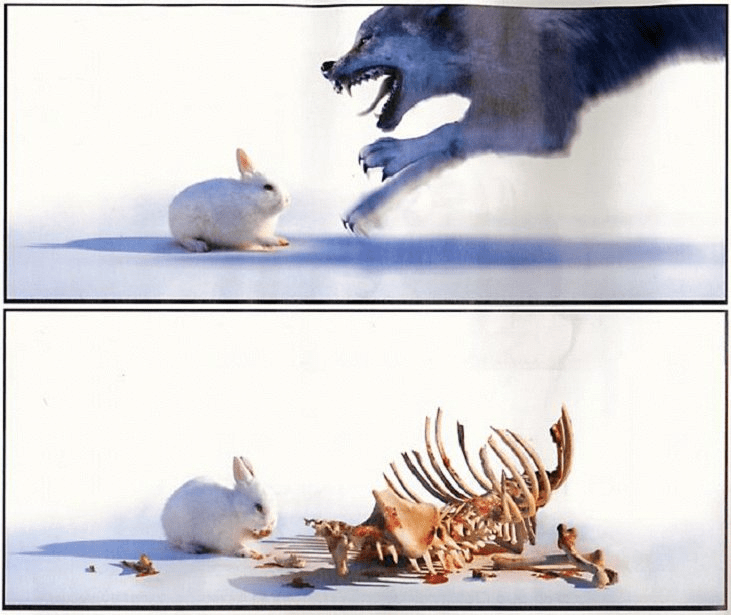

# 新版主上任感想 請多多指教

作者：wtman

TID：13130

<title>1</title> <link href="../Styles/Style.css" type="text/css" rel="stylesheet">

# 1

咳咳! 測試1、2、3

痾..大家好! 我是影視區的新任實習版主pliod       
在這論壇也打滾(潛水)了許多年了...以前看那些大神級人物版主可以隨意像**神**一般的將我們的主題刪移覺得很威
如今我也來逞下威風了(風浪  ..然後但大一腳把我踢下登高台  )

(醒來)啊不----分隔線----我是來貢獻的

其實看著論壇人越來越多, 且最近幾位版主有提出他們想要稍微隱退的想法
我覺得在這我感到有人情味的論壇應該也要回饋一下..
不然其實我就偶爾發個圖像個職業潛水員一樣

******
嗯!至於我會做的動作
其實就是每天翻翻影視區看到特別需處理帖會刪移你的主題, **為什麼刪移呢?**

a. 大好! 頂你! 吃飽沒? (廢話灌水類) f*ck you 他X的! (經判決是針對人的粗語) 或是刻意引起筆戰

b. 就發錯版面; 例如你轉別人的影片直接發到原創影視區(初犯微笑的替您移動帖子且警告一下; 二次還是微笑著移動您的帖但並扣分; 第三次以後呢..嘿嘿不要問很可怕 )

c. 隨便找都找的到的影片; 例如在youtube或百度打個關鍵字giantess就來分享的影片(我會謹慎斟酌的)

d. 盡量別發有"重度"版權的影片; 例giantesszone或什麼irafyou等等的, 這種請低調(若有我會找其他長老來評斷如何辦)

e. 痾..既然這是女巨人論壇, 最好別發連跟gts邊都沒擦到的影片(女角至少要比男角大隻吧==)

PS. 假設您懂普通話, "盡量"的避免發70%人看不懂得語言. 例:
仆街!自細睇xxx(粵 ) ㄏㄏ哩後! 哩喜跨挖啥?(閩 ) servs! bist du deppert?(德 )

PS2(不是電動) 如果您發的影片很長, 但gts片段可能在其中的小部分;
可以的話說明一下從影片幾分幾秒開始有gts情節. 這樣的話我們會很感激您的

**設置精華:**
只要您製作的影片超水準;或是搜尋帝分享極品影片, 經過斟酌我會幫您加精的! 鼓勵大家多創作

******
不論大家是初學者還是超S水準專業神, 影視區都極為歡迎您來跟我們分享您的作品或資源
也希望這論壇的風氣會越來越好! 我也會努力學習畫圖貢獻大家(咦?)

請多多指教了! 謝謝大家!

[ *本帖最後由 pliod 於 2012-8-22 23:14 編輯* ] <title>2</title> <link href="../Styles/Style.css" type="text/css" rel="stylesheet">

# 2

哎呀，我又是沙发哎呀真是好啊   嗯舒服，。。。说正事
1首先祝贺p兄（这称呼怪怪的 ）要发喜糖啊啊啊啊!!!!
2额我想想 嗯还是祝贺吧
3额不太好办啊，算了不想了还是祝贺
4（众人上暴揍一顿）你丫的有完没，之后被拉下 <title>3</title> <link href="../Styles/Style.css" type="text/css" rel="stylesheet">

# 3

在此恭賀您的上任.請多多指教. <title>4</title> <link href="../Styles/Style.css" type="text/css" rel="stylesheet">

# 4

在下作为本论坛第一批老会员将全力支持新版主的工作。 <title>5</title> <link href="../Styles/Style.css" type="text/css" rel="stylesheet">

# 5

此人誰拖走一下   ...  什麼?!原來是版主大人阿?

> 原帖由 *1170484163j* 於 22-8-2012 22:57 發表 
> 哎呀，我又是沙发哎呀真是好啊   嗯舒服，。。。说正事
> 1首先祝贺p兄（这称呼怪怪的 ）要发喜糖啊啊啊啊!!!!
> 2额我想想 嗯还是祝贺吧
> 3 ...

<title>6</title> <link href="../Styles/Style.css" type="text/css" rel="stylesheet">

# 6

[哇，听说市内那家贩卖光碟的店新来了个帅哥耶。]

[对啊对啊，好像是叫什么……Pliod来着。]

[呀，上次我还趁着买光碟的时候偷偷地看了他几眼呢，帅得没治啦！]

[是吗……上次……在他肩膀上啃了一口，似乎味道很差的样子……]

众人：[爱丽丝你……] <title>7</title> <link href="../Styles/Style.css" type="text/css" rel="stylesheet">

# 7

期待你的表现 加油 <title>8</title> <link href="../Styles/Style.css" type="text/css" rel="stylesheet">

# 8

小兵果断职业潜水。。。 <title>9</title> <link href="../Styles/Style.css" type="text/css" rel="stylesheet">

# 9

淡定兔 <ignore_js_op>

**058_Humour - Animaux - Faut pas me chercher.jpg** *(62.92 KB, 下載次數: 0)*

[下載附件](forum.php?mod=attachment&aid=MzA0MjB8ODYyODQ0M2Z8MTY3NDA2ODU4MHwxODIzMHwxMzEzMA%3D%3D&nothumb=yes)

2012-8-23 17:28 上傳

> 原帖由 *alice* 於 23-8-2012 00:12 發表 
> [哇，听说市内那家贩卖光碟的店新来了个帅哥耶。]
> 
> [对啊对啊，好像是叫什么……Pliod来着。]
> 
> [呀，上次我还趁着买光碟 ...

<title>10</title> <link href="../Styles/Style.css" type="text/css" rel="stylesheet">

# 10

兔子那头像总感觉像茶太啊
大胖兔。。 <title>11</title> <link href="../Styles/Style.css" type="text/css" rel="stylesheet">

# 11

> 假設您懂普通話, "盡量"的避免發70%人看不懂得語言. 例:
> 仆街!自細睇xxx(粵 )

中槍了。
話說pliod不是原創圖片區的板竹麼?怎麼......像《harry potter》的石內卜那樣，理應當黑魔法防禦術導師卻當了魔藥導師?
嗯，
還是多多支持。 <title>12</title> <link href="../Styles/Style.css" type="text/css" rel="stylesheet">

# 12

.
 其實我也很訝異擅長畫圖的p君反而想當影視區的版主。

不過也沒什麼可奇怪的，我寫文章但也蒐集很多影片啊，反而別人的文章我不怎麼存檔。

能夠願意來幫忙我就夠感激的囉！ <title>13</title> <link href="../Styles/Style.css" type="text/css" rel="stylesheet">

# 13

考虑到大陆同胞，youtube的影片还是不要删的好，因为翻墙很辛苦地，很多youtube资源都得先知道，才会去翻墙，否则会找半天，速度还很慢。 <title>14</title> <link href="../Styles/Style.css" type="text/css" rel="stylesheet">

# 14

支持新版主，管理想法很細致，希望能有更多好片看，要加油喔~</ignore_js_op>