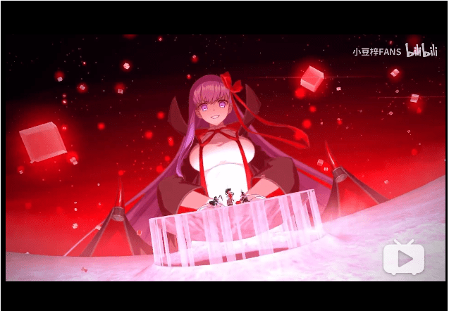
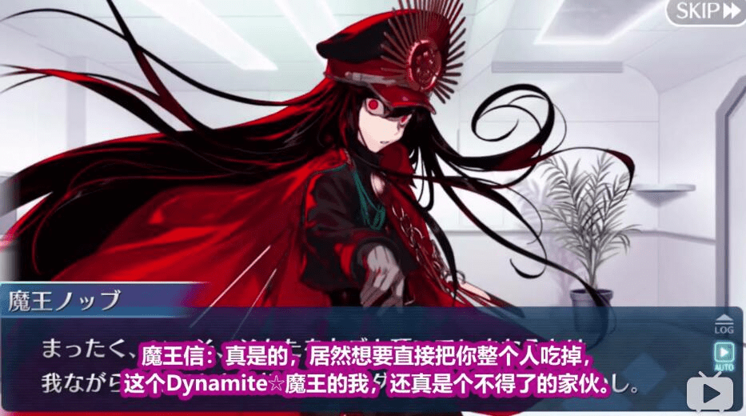

# 日常擦边（直球）的FGO【

作者：宇宙巨娘大和号

TID：28052

<title>1</title> <link href="../Styles/Style.css" type="text/css" rel="stylesheet">

# 1

想着情人节到了FGO一众擦边人设肯定会有擦边剧情了。如此多次的擦边or直球，真的怀疑是不是我方人员打入内部系列】

先不说迦摩这个人设和宝具本身就擦边的，
没想到泳装莉莉丝居然明目张胆搞体内囚禁什么的真是太棒了
以及莉莉丝这个剧情配上其神态表情，恐怕中了不少圈内人的好球区了】

<ignore_js_op>

**HKW5M8J_@WG7QUM2IFB%O}7.png** *(608.36 KB, 下載次數: 0)*

[下載附件](forum.php?mod=attachment&aid=ODEzNTd8NDkyYzZhNDJ8MTY3NDA2NjU4NXwxODIzMHwyODA1Mg%3D%3D&nothumb=yes)

2020-2-14 03:18 上傳

<ignore_js_op>

**HWXIH}SAM86XFN3T~)N32%3.png** *(638.35 KB, 下載次數: 0)*

[下載附件](forum.php?mod=attachment&aid=ODEzNTl8MDk1OTY0OTF8MTY3NDA2NjU4NXwxODIzMHwyODA1Mg%3D%3D&nothumb=yes)

2020-2-14 03:19 上傳

<ignore_js_op>

**~})R5VF4ATEYRXTY7VQ20MA.png** *(570.75 KB, 下載次數: 0)*

[下載附件](forum.php?mod=attachment&aid=ODEzNTh8MzEwNmJiODJ8MTY3NDA2NjU4NXwxODIzMHwyODA1Mg%3D%3D&nothumb=yes)

2020-2-14 03:18 上傳

<ignore_js_op>

**JEF({OAN[AV53[}H@CMU}F8.png** *(582.41 KB, 下載次數: 0)*

[下載附件](forum.php?mod=attachment&aid=ODEzNjB8ZGEwMzMzYmR8MTY3NDA2NjU4NXwxODIzMHwyODA1Mg%3D%3D&nothumb=yes)

2020-2-14 03:19 上傳

<title>2</title> <link href="../Styles/Style.css" type="text/css" rel="stylesheet">

# 2

这个是要在那个网游里面才有的吗 <title>3</title> <link href="../Styles/Style.css" type="text/css" rel="stylesheet">

# 3

有空的话也可以去看看ccc联动复刻和ccc的剧情，
就说ccc吧，有一节是在樱的体内进行的，
莉莉丝也曾把二爷缩小成纳米大小，
莉莉丝那一节也说是在莉莉丝的体内，
不过有一说一，莉莉丝本身是液体，可以把人溶解然后与自己同化，樱是AI，她的体内也就是很多数据什么的
ccc确实只是擦边

ccc联动里面打未削弱杀生院也是站在她手上打的（魔性菩萨）
帝王花的巨大化就不说了，模型是最大的，宝具很好看哦对了还有杀生院和水BB的宝具

这几个是真的直球，

还有保罗班扬（这个也可以巨大化）

也许蘑菇是自己人？
<ignore_js_op>

**1.png** *(337.5 KB, 下載次數: 0)*

[下載附件](forum.php?mod=attachment&aid=ODEzNjF8YTBlODg1YmF8MTY3NDA2NjU4NXwxODIzMHwyODA1Mg%3D%3D&nothumb=yes)

2020-2-14 09:55 上傳

<ignore_js_op>

**2.png** *(272.34 KB, 下載次數: 0)*

[下載附件](forum.php?mod=attachment&aid=ODEzNjJ8YTliNjRkZDF8MTY3NDA2NjU4NXwxODIzMHwyODA1Mg%3D%3D&nothumb=yes)

2020-2-14 09:55 上傳

<ignore_js_op>

**3.png** *(463.83 KB, 下載次數: 0)*

[下載附件](forum.php?mod=attachment&aid=ODEzNjN8Mjg5YTE4NzB8MTY3NDA2NjU4NXwxODIzMHwyODA1Mg%3D%3D&nothumb=yes)

2020-2-14 09:55 上傳

<title>4</title> <link href="../Styles/Style.css" type="text/css" rel="stylesheet">

# 4

可惜当年连沉弃坑后就不怎么去看了，还是看一下别人打的剧情视频啥子的。蘑菇不是自己人都没人信 <title>5</title> <link href="../Styles/Style.css" type="text/css" rel="stylesheet">

# 5

目前最切实的还是帝王花了，以后提妈和游星大王要是落地应该也是 <title>6</title> <link href="../Styles/Style.css" type="text/css" rel="stylesheet">

# 6

> [ZetaWocorde 發表於 2020-2-14 09:57](https://giantessnight.cf/gnforum2012/forum.php?mod=redirect&goto=findpost&pid=426149&ptid=28052)
> 有空的话也可以去看看ccc联动复刻和ccc的剧情，
> 就说ccc吧，有一节是在樱的体内进行的，
> 莉莉丝也曾把二爷 ...

那个大哥你好，你这里面说的ccc剧情可以给个章节定位什么的嘛？看这形容我还是蛮好奇的，和fgo联动哪里倒是基本看过了。麻烦了
<title>7</title> <link href="../Styles/Style.css" type="text/css" rel="stylesheet">

# 7

第一次在国服看到还是领BB，打杀生院那次 <title>8</title> <link href="../Styles/Style.css" type="text/css" rel="stylesheet">

# 8

> [六神一 發表於 2020-2-14 15:02](https://giantessnight.cf/gnforum2012/forum.php?mod=redirect&goto=findpost&pid=426193&ptid=28052)
> 那个大哥你好，你这里面说的ccc剧情可以给个章节定位什么的嘛？看这形容我还是蛮好奇的，和fgo联动哪里倒 ...

我有印象的大概就是伊丽莎白最后一个sg（在樱体内）
以及莉莉丝的三个部分都有擦边内容
我看的是这个视频：[https://www.bilibili.com/video/av23132721?p=26](https://www.bilibili.com/video/av23132721?p=26)
对应的是P17-P20
不过建议不要抱太大希望
因为擦边内容真的比较少……
<title>9</title> <link href="../Styles/Style.css" type="text/css" rel="stylesheet">

# 9

FGO别说giantess了，这游戏说白了就是个xp大合集，基本啥都能找到一点点的意思…… <title>10</title> <link href="../Styles/Style.css" type="text/css" rel="stylesheet">

# 10

> [六神一 發表於 2020-2-14 15:02](https://giantessnight.cf/gnforum2012/forum.php?mod=redirect&goto=findpost&pid=426193&ptid=28052)
> 那个大哥你好，你这里面说的ccc剧情可以给个章节定位什么的嘛？看这形容我还是蛮好奇的，和fgo联动哪里倒 ...

ccc不是章节，是一部独立的游戏，2013年的，主机独占，目前无汉化。月球人里知道这游戏的都少之又少，可以说是究极粉丝向的作品。牵扯到的gts福利较多，大部分都是擦边，除了樱线结尾的杀生院之外，杀生院那是纯gts福利，不擦边。游戏性主要是闯迷宫，然后与敌人对战，如果想打的轻松一点，推荐从者选择金闪闪吉尔伽美什（说句题外话，CCC这部作品算是当年第一次完整地展现了闪闪的人设）
<title>11</title> <link href="../Styles/Style.css" type="text/css" rel="stylesheet">

# 11

> [ZetaWocorde 發表於 2020-2-14 16:47](https://giantessnight.cf/gnforum2012/forum.php?mod=redirect&goto=findpost&pid=426216&ptid=28052)
> 我有印象的大概就是伊丽莎白最后一个sg（在樱体内）
> 以及莉莉丝的三个部分都有擦边内容
> 我看的是这个视频 ...

老哥你忘了ccc樱线的结尾了，杀生院的那个ccc版宝具可是直球的gts福利，用地球自慰啊，虽然有穿着衣服（要不然就变成黄油了）
<title>12</title> <link href="../Styles/Style.css" type="text/css" rel="stylesheet">

# 12

<ignore_js_op>

**]}Z7KC3XMRO%ETP~0GC7HQW.jpg** *(57.33 KB, 下載次數: 0)*

[下載附件](forum.php?mod=attachment&aid=ODEzOTJ8M2E1NmQyMGZ8MTY3NDA2NjY1MnwxODIzMHwyODA1Mg%3D%3D&nothumb=yes)

2020-2-15 15:24 上傳

<ignore_js_op>

**_]Q4Y]78G15)3AV83`6@QSC.jpg** *(69.57 KB, 下載次數: 0)*

[下載附件](forum.php?mod=attachment&aid=ODEzOTN8ZWYwNWUyNzB8MTY3NDA2NjY1MnwxODIzMHwyODA1Mg%3D%3D&nothumb=yes)

2020-2-15 15:24 上傳

还真是越来越多，一开始以为是在奇怪的意义上“吃”
结果后续才发现是真打算丸吞啧啧啧

不知道还会不会有其他带擦边（直球）的情人劫剧情。
<title>13</title> <link href="../Styles/Style.css" type="text/css" rel="stylesheet">

# 13

看了之後懇請趕快更新遊戲啊！
感覺很有那個點啊！
真的讓人受不了啊！這次的情人節
<title>14</title> <link href="../Styles/Style.css" type="text/css" rel="stylesheet">

# 14

> [IRIS·BRANDO 發表於 2020-2-15 15:26](https://giantessnight.cf/gnforum2012/forum.php?mod=redirect&goto=findpost&pid=426421&ptid=28052)
> 还真是越来越多，一开始以为是在奇怪的意义上“吃”
> 结果后续才发现是真打算丸吞啧啧啧

话说为啥魔王信长能丸吞主角啊？我没看明治维新剧情，不太了解
<title>15</title> <link href="../Styles/Style.css" type="text/css" rel="stylesheet">

# 15

> [宇宙巨娘大和号 發表於 2020-2-15 21:09](https://giantessnight.cf/gnforum2012/forum.php?mod=redirect&goto=findpost&pid=426444&ptid=28052)
> 话说为啥魔王信长能丸吞主角啊？我没看明治维新剧情，不太了解

我也不清楚，不过魔王信设定上很强就是了，鬼知道具体怎么吃……
<title>16</title> <link href="../Styles/Style.css" type="text/css" rel="stylesheet">

# 16

我支持那位老哥的说法，fgo更像是个xp大集合，什么都有一点

对此感兴趣的话我建议可以去看看视频做个云玩家，不劝人进游戏坑 <title>17</title> <link href="../Styles/Style.css" type="text/css" rel="stylesheet">

# 17

> [IRIS·BRANDO 發表於 2020-2-15 23:10](https://giantessnight.cf/gnforum2012/forum.php?mod=redirect&goto=findpost&pid=426470&ptid=28052)
> 我也不清楚，不过魔王信设定上很强就是了，鬼知道具体怎么吃……

首先要有巨大化的能力吧，不然那该怎么吞啊。。。我实在脑补不出来，可我记得魔王信并没有巨大化的能力啊
<title>18</title> <link href="../Styles/Style.css" type="text/css" rel="stylesheet">

# 18

> [宇宙巨娘大和号 發表於 2020-2-16 02:02](https://giantessnight.cf/gnforum2012/forum.php?mod=redirect&goto=findpost&pid=426506&ptid=28052)
> 首先要有巨大化的能力吧，不然那该怎么吞啊。。。我实在脑补不出来，可我记得魔王信并没有巨大化的能力啊 ...

我也想不明白】不过我截图里第二张小魔王信的台词虽然被遮住了但由于有语音的确听见“丸吞”了】鬼知道……</ignore_js_op></ignore_js_op></ignore_js_op></ignore_js_op></ignore_js_op></ignore_js_op></ignore_js_op></ignore_js_op></ignore_js_op>