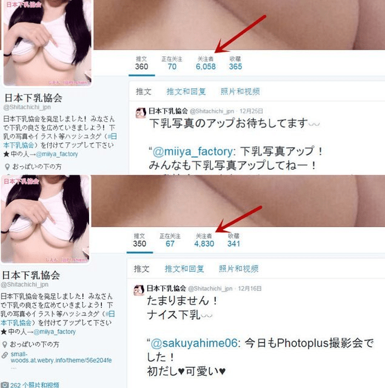

# 日本下乳協會

作者：竹刀

TID：19320

<title>1</title> <link href="../Styles/Style.css" type="text/css" rel="stylesheet">

# 1

<ignore_js_op>

**下載 (35).jpg** *(76.37 KB, 下載次數: 2)*

[下載附件](forum.php?mod=attachment&aid=NTI4NjR8Y2FiNWU1OGZ8MTY3NDA2OTg1OXwxODIzMHwxOTMyMA%3D%3D&nothumb=yes)

2015-7-2 17:21 上傳

協會主要都是下乳照
也就是俗稱的南半球

-------分隔線-------
<ignore_js_op>

**下載 (30).jpg** *(44.82 KB, 下載次數: 4)*

[下載附件](forum.php?mod=attachment&aid=NTI4NjV8NTk4NWFiZTN8MTY3NDA2OTg1OXwxODIzMHwxOTMyMA%3D%3D&nothumb=yes)

2015-7-2 17:21 上傳

<ignore_js_op>

**下載 (32).jpg** *(40.47 KB, 下載次數: 2)*

[下載附件](forum.php?mod=attachment&aid=NTI4NjZ8NGJiYjZhODd8MTY3NDA2OTg1OXwxODIzMHwxOTMyMA%3D%3D&nothumb=yes)

2015-7-2 17:21 上傳

<ignore_js_op>

**下載 (34).jpg** *(41.89 KB, 下載次數: 4)*

[下載附件](forum.php?mod=attachment&aid=NTI4Njh8Y2ZkZTM4M2Z8MTY3NDA2OTg1OXwxODIzMHwxOTMyMA%3D%3D&nothumb=yes)

2015-7-2 17:21 上傳

<ignore_js_op>

**下載 (31).jpg** *(44.02 KB, 下載次數: 4)*

[下載附件](forum.php?mod=attachment&aid=NTI4Njd8MTUxYzg1ZDB8MTY3NDA2OTg1OXwxODIzMHwxOTMyMA%3D%3D&nothumb=yes)

2015-7-2 17:21 上傳

<ignore_js_op>

**下載 (33).jpg** *(35.62 KB, 下載次數: 3)*

[下載附件](forum.php?mod=attachment&aid=NTI4Njl8Nzc5MjQ2NTh8MTY3NDA2OTg1OXwxODIzMHwxOTMyMA%3D%3D&nothumb=yes)

2015-7-2 17:21 上傳

-----------分隔線-----------
因為主要是南半球
有很多都是由下往上拍的
是不是很有gts的感覺呢?
這個協會最近蠻有名的
去搜尋一下就可以找到
不知道大陸要不要翻牆
話說小妹我也想拍下乳照>////<
<title>2</title> <link href="../Styles/Style.css" type="text/css" rel="stylesheet">

# 2

与其说是要感谢这么棒的照片，不如说是最后一句让人忍不住说gj！ <title>3</title> <link href="../Styles/Style.css" type="text/css" rel="stylesheet">

# 3

先感谢分享，然后同楼上最后一句GJ！!XDD <title>4</title> <link href="../Styles/Style.css" type="text/css" rel="stylesheet">

# 4

楼主想拍就拍，拍完求分享 <title>5</title> <link href="../Styles/Style.css" type="text/css" rel="stylesheet">

# 5

超赞的图阿，，感谢楼主的分享 <title>6</title> <link href="../Styles/Style.css" type="text/css" rel="stylesheet">

# 6

gj 然后翻了一下楼主的帖子记录…… gj！ <title>7</title> <link href="../Styles/Style.css" type="text/css" rel="stylesheet">

# 7

其实腹部也是一大萌点呢！！！ <title>8</title> <link href="../Styles/Style.css" type="text/css" rel="stylesheet">

# 8

竟然有这么丧（fu）心（li）病（man）狂（man）的东西，我们要坚（zi）决（xi）抵（kan）制（kan） <title>9</title> <link href="../Styles/Style.css" type="text/css" rel="stylesheet">

# 9

肉肉的女生超级可爱啊 <title>10</title> <link href="../Styles/Style.css" type="text/css" rel="stylesheet">

# 10

如果有大神p上小人就神了，诶？好像在别的帖子也说过这句话的样子..QwQ <title>11</title> <link href="../Styles/Style.css" type="text/css" rel="stylesheet">

# 11

手机依然看不到=皿==皿= <title>12</title> <link href="../Styles/Style.css" type="text/css" rel="stylesheet">

# 12

好棒欸！
超讚的角度！
視覺感官衝擊！ <title>13</title> <link href="../Styles/Style.css" type="text/css" rel="stylesheet">

# 13

果然有些方面，日本就是莫名的强，，，，真是开放</ignore_js_op></ignore_js_op></ignore_js_op></ignore_js_op></ignore_js_op></ignore_js_op>