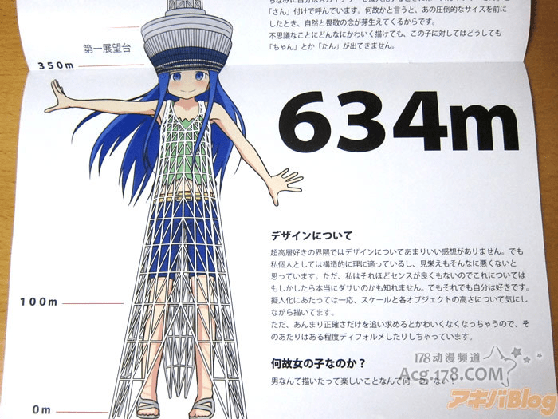
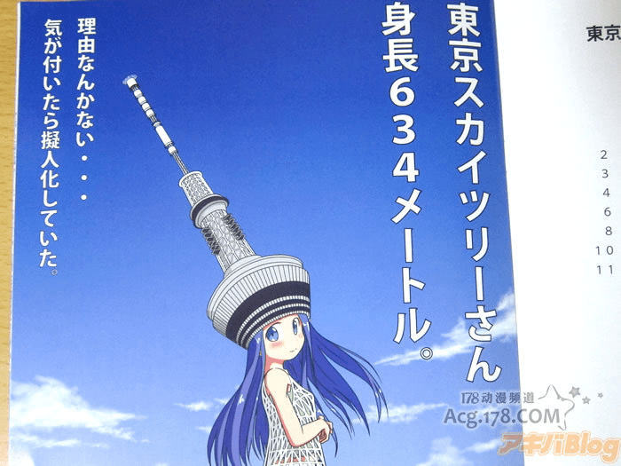
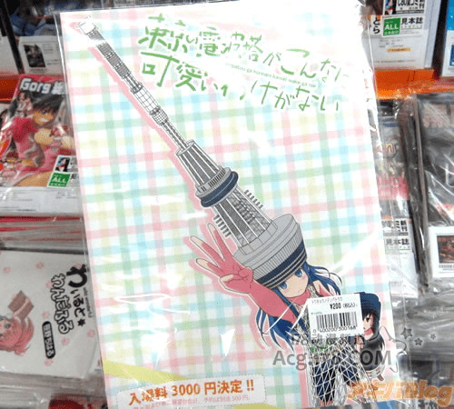
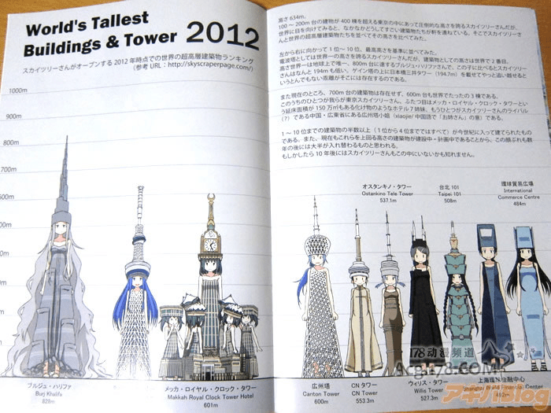

# 日本把高塔都變成萌娘了

作者：rce

TID：11037

<title>1</title> <link href="../Styles/Style.css" type="text/css" rel="stylesheet">

# 1

轉貼的

日本真是個有趣的地方,
連世界各地的高塔都可以萌化成為萌娘... <title>2</title> <link href="../Styles/Style.css" type="text/css" rel="stylesheet">

# 2

 <ignore_js_op>[4ZDDM.jpg](forum.php?mod=attachment&aid=MjYyMDF8Y2E3MDczNTJ8MTY3NDA2ODU3NXwxODIzMHwxMTAzNw%3D%3D&nothumb=yes) *(109.76 KB, 下載次數: 1)*

[下載附件](forum.php?mod=attachment&aid=MjYyMDF8Y2E3MDczNTJ8MTY3NDA2ODU3NXwxODIzMHwxMTAzNw%3D%3D&nothumb=yes)

2011-9-23 02:00 上傳  

</ignore_js_op> <ignore_js_op>[9hUA2.jpg](forum.php?mod=attachment&aid=MjYyMDJ8ZWJlMjIyMzl8MTY3NDA2ODU3NXwxODIzMHwxMTAzNw%3D%3D&nothumb=yes) *(87.61 KB, 下載次數: 1)*

[下載附件](forum.php?mod=attachment&aid=MjYyMDJ8ZWJlMjIyMzl8MTY3NDA2ODU3NXwxODIzMHwxMTAzNw%3D%3D&nothumb=yes)

2011-9-23 02:00 上傳  

</ignore_js_op> <ignore_js_op>[POT8l.jpg](forum.php?mod=attachment&aid=MjYyMDN8NzAwMWYwZjV8MTY3NDA2ODU3NXwxODIzMHwxMTAzNw%3D%3D&nothumb=yes) *(74.41 KB, 下載次數: 1)*

[下載附件](forum.php?mod=attachment&aid=MjYyMDN8NzAwMWYwZjV8MTY3NDA2ODU3NXwxODIzMHwxMTAzNw%3D%3D&nothumb=yes)

2011-9-23 02:00 上傳  

</ignore_js_op> <ignore_js_op>[7RLQz.jpg](forum.php?mod=attachment&aid=MjYyMDR8ZGU0YTRjYjd8MTY3NDA2ODU3NXwxODIzMHwxMTAzNw%3D%3D&nothumb=yes) *(110.99 KB, 下載次數: 6)*

[下載附件](forum.php?mod=attachment&aid=MjYyMDR8ZGU0YTRjYjd8MTY3NDA2ODU3NXwxODIzMHwxMTAzNw%3D%3D&nothumb=yes)

2011-9-23 02:00 上傳  

</ignore_js_op> <title>3</title> <link href="../Styles/Style.css" type="text/css" rel="stylesheet">

# 3

雖然有GTS的要素
不過頭上頂那麼長的東西就覺得很怪 <title>4</title> <link href="../Styles/Style.css" type="text/css" rel="stylesheet">

# 4

那咱也把故宫弄成抖s王女吧-w- <title>5</title> <link href="../Styles/Style.css" type="text/css" rel="stylesheet">

# 5

哈哈~ 二樓說的好呀
我笑了XD 真的他頭頂上頂那隻就真的怪怪的...
她要是有出 去除那隻的版本，我會再考慮一下要不要買~ <title>6</title> <link href="../Styles/Style.css" type="text/css" rel="stylesheet">

# 6

可以编成册子（书）来出售……
真的想买一本~ <title>7</title> <link href="../Styles/Style.css" type="text/css" rel="stylesheet">

# 7

連假面騎士都可以是火箭頭，巨大少女神馬的尖塔頭弱爆了!

(望出窗外的GN都政府)那個巨大少女的頭那麼像馬桶?
(眾:果斷脫褲，光著屁股爬上)

[ *本帖最後由 wtman 於 2011-9-23 19:41 編輯* ] <title>8</title> <link href="../Styles/Style.css" type="text/css" rel="stylesheet">

# 8

(右下角)
Q.為什麼是女孩?
A.不想畫男w <title>9</title> <link href="../Styles/Style.css" type="text/css" rel="stylesheet">

# 9

看來看去，台北101竟然是畫起來最省事的一個...

話說沙烏地打算建1600m的高樓，畫在裡面的話想不GTS都難吧 <title>10</title> <link href="../Styles/Style.css" type="text/css" rel="stylesheet">

# 10

好像有其他塔的版本的 <title>11</title> <link href="../Styles/Style.css" type="text/css" rel="stylesheet">

# 11

.
一群比誰的避雷針比較大隻的妹子們（逃

--
台北101妹超像毛毛蟲（抖 <title>12</title> <link href="../Styles/Style.css" type="text/css" rel="stylesheet">

# 12

拟人系列的果然是各种坑啊…… <title>13</title> <link href="../Styles/Style.css" type="text/css" rel="stylesheet">

# 13

Makkah Clock Royal Tower 周围一群Loli
近处几个是在观察姉様身上的人 ?

萌ええぇええぇぇええぇええぇぇええぇええぇぇ！！！ <title>14</title> <link href="../Styles/Style.css" type="text/css" rel="stylesheet">

# 14

嗯......可以看到大众化的趋势了 <title>15</title> <link href="../Styles/Style.css" type="text/css" rel="stylesheet">

# 15

GTS貌似越来越普遍了呀，还有就是由衷的佩服小日本的想象力…… <title>16</title> <link href="../Styles/Style.css" type="text/css" rel="stylesheet">

# 16

 头顶的那个柱子不和谐啊…… <title>17</title> <link href="../Styles/Style.css" type="text/css" rel="stylesheet">

# 17

我凹凸曼了   是漫画阿 <title>18</title> <link href="../Styles/Style.css" type="text/css" rel="stylesheet">

# 18

天，萌到了。。。 <title>19</title> <link href="../Styles/Style.css" type="text/css" rel="stylesheet">

# 19

日本人就是有把所有東西都變成萌娘的能力啊。
PS.我也被萌到了 <title>20</title> <link href="../Styles/Style.css" type="text/css" rel="stylesheet">

# 20

所以说，日本教育出的人都很。。。 <title>21</title> <link href="../Styles/Style.css" type="text/css" rel="stylesheet">

# 21

真的非常有想像力阿