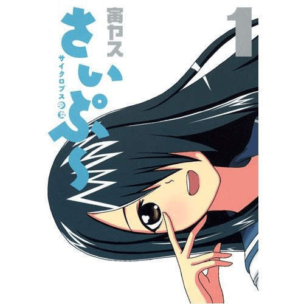

# 日本新的漫畫大家一起來等八

作者：lovegts

TID：12337

<title>1</title> <link href="../Styles/Style.css" type="text/css" rel="stylesheet">

# 1

日本新的漫畫5/18大家一起來等八 <title>2</title> <link href="../Styles/Style.css" type="text/css" rel="stylesheet">

# 2

 <ignore_js_op>[51mlL0lFYTL._SS500_.jpg](forum.php?mod=attachment&aid=Mjg1NjF8NzAzMmVhYjl8MTY3NDA2ODY5N3wxODIzMHwxMjMzNw%3D%3D&nothumb=yes) *(38.1 KB, 下載次數: 12)*

[下載附件](forum.php?mod=attachment&aid=Mjg1NjF8NzAzMmVhYjl8MTY3NDA2ODY5N3wxODIzMHwxMjMzNw%3D%3D&nothumb=yes)

2012-5-19 15:54 上傳  

</ignore_js_op> <title>3</title> <link href="../Styles/Style.css" type="text/css" rel="stylesheet">

# 3

這是什麼漫畫?
能介紹一下嗎? <title>4</title> <link href="../Styles/Style.css" type="text/css" rel="stylesheet">

# 4

這是什麼漫畫？？
GTS漫畫嗎
話說看到水手服就知道是我最愛的校園生活
女子高生大好！！ 
女皮學生鞋大好！！ 4 <title>5</title> <link href="../Styles/Style.css" type="text/css" rel="stylesheet">

# 5

同问，日语什么的完全不懂 <title>6</title> <link href="../Styles/Style.css" type="text/css" rel="stylesheet">

# 6

 楼主来点更多的消息吧~~~~~· <title>7</title> <link href="../Styles/Style.css" type="text/css" rel="stylesheet">

# 7

G狗一下，大概是豎笛與雙肩書包的性轉版
妹妹異常高大(180CM)，老哥則是普通大小(165CM ....好吧 算矮)
而且同樣都是四格漫畫

公式:[http://youngjump.jp/manga/saipuu/](http://youngjump.jp/manga/saipuu/) <title>8</title> <link href="../Styles/Style.css" type="text/css" rel="stylesheet">

# 8

是長身女系，他的妹妹身長180公分天然少女。四格連載漫畫可惜沒有互動。

請見
[http://tieba.baidu.com/f?ct=3356 ... mp;amp;z=1133975095](http://tieba.baidu.com/f?ct=335675392&amp;tn=baiduPostBrowser&amp;sc=13075111639&amp;z=1133975095) <title>9</title> <link href="../Styles/Style.css" type="text/css" rel="stylesheet">

# 9

有點h的搞笑4格漫畫阿.. <title>10</title> <link href="../Styles/Style.css" type="text/css" rel="stylesheet">

# 10

虽然不是gts漫画，但还不错的说。 <title>11</title> <link href="../Styles/Style.css" type="text/css" rel="stylesheet">

# 11

恩，这个我知道这里有连载不过是英文的，期待中文版，这个互动不是一般多

[http://www.mangahere.com/manga/cyclops_shoujo_saipu/c001](http://www.mangahere.com/manga/cyclops_shoujo_saipu/c001) <title>12</title> <link href="../Styles/Style.css" type="text/css" rel="stylesheet">

# 12

可惜是4格漫畫...