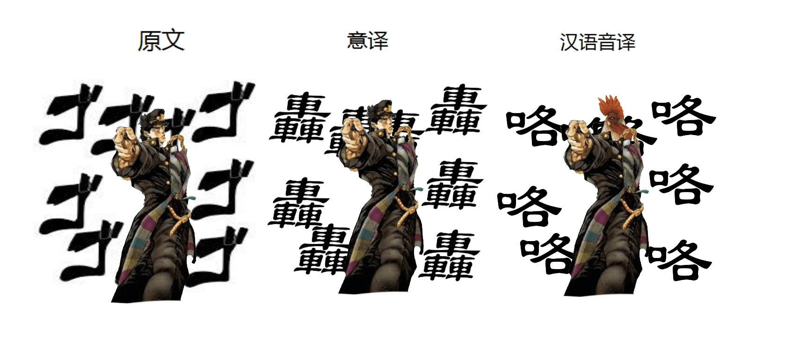
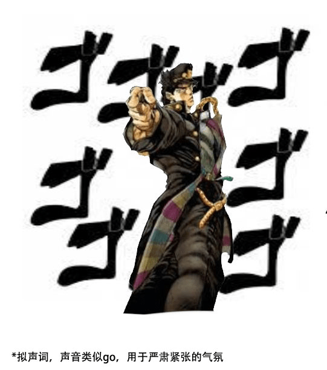

# 日语拟声词如何翻译才好咧？_？

作者：御姐脚上丝袜

TID：21339

<title>1</title> <link href="../Styles/Style.css" type="text/css" rel="stylesheet">

# 1

基本来说日语文章都会出现很多单独换行的拟声词，我的作法都是直接保留原文假名，然后在后面打括号标注罗马音，但是这样的话还是没法让那些强行拟声的副词给不会日语的人看懂。所以一直很蛋疼很纠结，求支招

————————————————————————————————————————————————
众所周知日语的拟声词灰常多。。。普通话因为都是复合元音所以拟声困难（比如日语有ko，普通话只有kou或者kuo，日语念kou就会念成ko+u两个音节），大多都没法找出完全对应的拟声汉字。。。出现在文章里的话，把这些词的实际意思混进对动词的修辞里终归是能混过去的，但单独出现的话，就怎么着都挺奇怪的。但是不只是汉字，很多情况用英文字母也是无法表达标注出相应的意思的。要说为什么的话，因为其中有很多根本就不是拟声词，只能说是类似拟声词的副词。
要是强行翻译成汉字拟声词的话，种类太少，而且也并不很准确，尤其是有很多很多类似的种类都只能翻成【嘎吱嘎吱】和【咚咚】

比如圈内日语文章常有的
ズシイイイン    【zushiiiin
ズウウウウウン     【zuuuuuun
ゴゴゴゴゴゴ    【gogogogogo

直接从拟声的角度去看的话，其实这些根本没有实际表音的意思。。。这些看着像拟声词，实际上应该算副词
很多原本都是结尾加と来用的副词，拆了と就强行变成类似拟声词一样的存在了

所以有的词照原音音译会很蠢
<ignore_js_op>

**拟声词.jpg** *(220.43 KB, 下載次數: 0)*

[下載附件](forum.php?mod=attachment&aid=NjIwODh8YWIzMDUzZjN8MTY3NDA2NzkwNHwxODIzMHwyMTMzOQ%3D%3D&nothumb=yes)

2016-7-5 23:49 上傳

[ズシンズシン](https://kotobank.jp/word/%E3%81%9A%E3%81%97%E3%82%93-541699)　等于[ずしりと](http://dict.hjenglish.com/jp/jc/%E3%81%9A%E3%81%97%E3%82%8A)　意思：重物落下等场合时发出的钝音（比如脚步声，打开缩小学院遭遇个C级会员应该就能听见了）
[ズン](http://thesaurus.weblio.jp/content/%E3%81%9A%E3%82%93)　和上面这个意思差不多。。。[ずんずんと](http://dict.hjenglish.com/jp/jc/%E3%81%9A%E3%82%93%E3%81%9A%E3%82%93#noword)  意思：沉重的无法发出的钝击声，和上面这个差不多意思，经常在靠近的地方被换着用。。。（比如缩小学院在缩小城镇的时候女仆接近时的那种接连的脚步声吧，要说区别的话大概上面这个比较用力？）
     ↑这两个声音基本属于很难用喉咙发出的声音了。。。所以应该没什么语种能真的纯靠拟声来表达他们，都是约定俗成的实意词

[ゴゴゴ](http://thesaurus.weblio.jp/content/%E3%82%B4%E3%82%B4%E3%82%B4)　意思：看过JOJO的应该都认识这个吧。。。差不多是轰鸣声，但一般也并不是真的表示什么具体的声音，就是表示一种气场、气势。。。
    ↑这种基本就属于根本都没在试图拟声的了。。。科科
——————————————————————————————————————————
参考了些汉化组的漫画翻译做法，除了几个和汉语拟声刚好对应的，大多是翻成动词/形容词的感觉，比如ボヨン翻成【弹】，ボリボリ翻成【抓挠】，シュー翻成【闪】之类的，キラキラ这种比较知名的翻成【kirakira】或者【眨眨】或者【闪耀】。但是漫画还好，文章这么翻译的话也挺奇怪的。。。

会变成：
猛的沉重……
猛——————的沉重……
柔软的沉重……
柔软—————的沉重……
【什么？！】
轰轰轰轰轰……
猛击！！！
额，好像也不太好吧？。。。而且也无法回避ズシーン　ドシーン　ズンズン　ズシリ　ドズン意思都差不多的问题。。。所以目前翻译的时候姑且还是都只是标出罗马音而已

一直想改一改但是想太多结果反而什么都做不了。。。到底怎么办好咧。。。

<title>2</title> <link href="../Styles/Style.css" type="text/css" rel="stylesheet">

# 2

日语原文扔上，底下加注释
<ignore_js_op>

**搜狗截图16年07月06日0025_1.jpg** *(69.96 KB, 下載次數: 0)*

[下載附件](forum.php?mod=attachment&aid=NjIxMDB8Y2FlNTNhMzV8MTY3NDA2NzkwNHwxODIzMHwyMTMzOQ%3D%3D&nothumb=yes)

2016-7-6 00:28 上傳

<title>3</title> <link href="../Styles/Style.css" type="text/css" rel="stylesheet">

# 3

罗马音吧。大部分拟声词只要能念出来基本都能明白要表达什么，比如ぷにう（pu ni u）这种，绅士一般都知道用在哪里=3= <title>4</title> <link href="../Styles/Style.css" type="text/css" rel="stylesheet">

# 4

拟声词不至于纠结吧？毕竟在乎的人不是很多，能音译音译想不出来的直接意译，只要让人明白发生了什么就行了，有重击就咣咣咣，在装逼就kira <title>5</title> <link href="../Styles/Style.css" type="text/css" rel="stylesheet">

# 5

拟声词的话一般人都能看出来是什么的吧，如果翻译出来也方便一些人看啦 <title>6</title> <link href="../Styles/Style.css" type="text/css" rel="stylesheet">

# 6

其实这也是我比较费解的地方……
因为每种语言的拟声词都不一样，还有的是以前流传下来的，长久以来大家的区别就很大了
在翻译的情况下，根据尤金奈达的动态对等来说，应该是尽量用简单的语言，让译文读者从译文中获取的信息与原文读者从原文中获取的信息一致
同时根据严复的信达雅理论，译者要先做到信，也就是真实翻译原文内容，再做到达，也就是准确传达原文内容，最后做到雅，也就是以优美的语言来传达内容
图里的规范论也是这个意思，翻译的时候，译者是受到文本规范、受众规范的许多限制的，比如说如果目的语读者的文化限制让他们不能理解文化特有词，如“豆腐脑”一词在英文中是没有对应翻译的，所以如果翻译，就必须注释
同样的，我觉得拟声词可以用这三个理论来看，翻译的目的最终是要让读者看懂，因此没必要完全贴近原文，比如那个gogogogogogo来说，直接译成轰隆隆隆隆什么的，就行了吧

<title>7</title> <link href="../Styles/Style.css" type="text/css" rel="stylesheet">

# 7

　　我觉得还可以把其他字借过来当拟声词，特别是带口字旁的字。

　　因为很多拟声词都有口字旁，所以一长串口字旁的拟声字、非拟声字混在一起，又明显不是表意的，这似乎可以暗示它们实际上都是做拟声词使用。实在不行，后面加个括号注明一下……

　　嘛，楼主不是说“因为其中有很多根本就不是拟声词，只能说是类似拟声词的副词”吗？日语的拟声词可以是“业余”的，汉语为什么不可以？我们也可以“半路出家”啊！我们也可以“中途转业”啊！

　　有很多不常用的带口字旁的汉字，让它们“发挥余热”吧……
<title>8</title> <link href="../Styles/Style.css" type="text/css" rel="stylesheet">

# 8

哒哒哒——射击  这样翻译怎么样 <title>9</title> <link href="../Styles/Style.css" type="text/css" rel="stylesheet">

# 9

> [御姐脚上丝袜 發表於 2016-7-6 12:37](https://giantessnight.cf/gnforum2012/forum.php?mod=redirect&goto=findpost&pid=298927&ptid=21339)
> 　　我觉得还可以把其他字借过来当拟声词，特别是带口字旁的字。
> 
> 　　因为很多拟声词都有口字旁，所以一长 ...

其实还是不太一样的，日语这些不标准的拟声词，因为日常生活中已经长期被作为副词使用，所以已经有特定意思了
比如中文我们一般会说【重重地摔倒在地】很少说【咕咚地摔倒在地】
但是日语就会经常说【咕咚地摔倒在地】，导致【咕咚】这个声音直接拥有【重物砸落】的意思。。。
所以日本人对【咕咚】这个声音的理解都不会有偏差，但中文能理解成【石头落水声】【吞咽声】【坠落声】等等等等。。。
<title>10</title> <link href="../Styles/Style.css" type="text/css" rel="stylesheet">

# 10

拟声词 直接文本形式？ <title>11</title> <link href="../Styles/Style.css" type="text/css" rel="stylesheet">

# 11

> [餃子 發表於 2016-7-6 21:35](https://giantessnight.cf/gnforum2012/forum.php?mod=redirect&goto=findpost&pid=298976&ptid=21339)
> 其实还是不太一样的，日语这些不标准的拟声词，因为日常生活中已经长期被作为副词使用，所以已经有特定意 ...

　　如果“咕咚”专用于表示“重物砸落”，那不是很模式化吗？一个很重的东西，掉在棉被上、石头上、木板上、铁架上，声音肯定是不一样的；但是在日文中大家都习惯用“咕咚”来表示。是这样的吗？
<title>12</title> <link href="../Styles/Style.css" type="text/css" rel="stylesheet">

# 12

*本帖最後由 餃子 於 2016-7-11 14:01 編輯*

> [御姐脚上丝袜 發表於 2016-7-10 22:35](https://giantessnight.cf/gnforum2012/forum.php?mod=redirect&goto=findpost&pid=299479&ptid=21339)
> 　　如果“咕咚”专用于表示“重物砸落”，那不是很模式化吗？一个很重的东西，掉在棉被上、石头上、木板 ...

只是比喻一下。。。你理解反了
汉语的常用拟声词相比日语实在太少了
柔软物体砸落声，硬物砸落声，弹性物体砸落声，日语都能分别给他们找到一个可以让读者准确的认识到物体材质、重量的拟声词
（个人理解0.0）比如同样是重物落下的声音
【ズシーン】——这个物体是沉重的，而且是较柔软的（因为实际上这是个用人类喉咙根本就发不出来的声音，所以说它是强行拟声，但是确实可以让读者获得具体的信息量，因为这些词已经被长期作为副词使用，经由历史固定了意思）
【ガコッ】——坚硬的物体碰撞
【ズーン】——物体沉重，动能大
每个拟声词都可以表示出物体的具体材质，联系到某一种特定的声音
但是中文可能都只能统一翻成“咕咚”“咕隆咚”之类的了，而且还无法用拟声词让读者意识到材质、重量，甚至这些词在中文里还不只能用来表达砸落声，导致看到“咕咚”这个词几乎没有获得任何信息量

如果拟声词是作为副词出现在行文当中，一般可以根据中文的语言习惯，用形容词或者带有相应意思的动词来代替
但是要单独翻译那些单独成行的假名拟声词的时候，就很难翻译成汉字拟声词了

<title>13</title> <link href="../Styles/Style.css" type="text/css" rel="stylesheet">

# 13

确实像下雨的拟声词ザーザーzaza= =就比较坑爹 <title>14</title> <link href="../Styles/Style.css" type="text/css" rel="stylesheet">

# 14

先提出我的意见：日语中诸如此类单独成行的拟声词，应当以适当长度的中文语句，表现出日语中拟声词包涵的丰富的内涵。

原因首先是日语中单个拟声词包涵的涵义十分丰富，而中文的拟声词则略显单薄，两者显然难以很好地对应，前面各位的回复里面也达成了共识。
若要传达出日语中拟声词表现出的丰富意蕴，虽然难以概括地用一个中文词汇表示，却可以以中文的语句加以诠释。例如：
パラパラ雨が降っている。(雨淅淅沥沥地下着。)
这句的翻译中，中文并未使用拟声词，然而却把barabara要表现的意蕴都展现出来了。
在圈内常常出现的拟声词中，ズウウウウウン   就可以根据语境翻译成  从远方传来了低沉的轰鸣声。
至于借鉴漫画的翻译，漫画囿于其形式导致难以出现旁白性的翻译，很难传达出作者的本意，不过在译文之中我们有足够的空间来表达原作者藉由拟声词想表达的意思。 <title>15</title> <link href="../Styles/Style.css" type="text/css" rel="stylesheet">

# 15

实在不行用拼音。
虽说日文里用来拟声的词很多，但是读起来你觉得跟真正的声音像吗？大多都不像，甚至有一些是风马牛不相及的，所以不知如何翻译时，不如用拼音拟一个你觉得像的声音更直截了当</ignore_js_op></ignore_js_op>