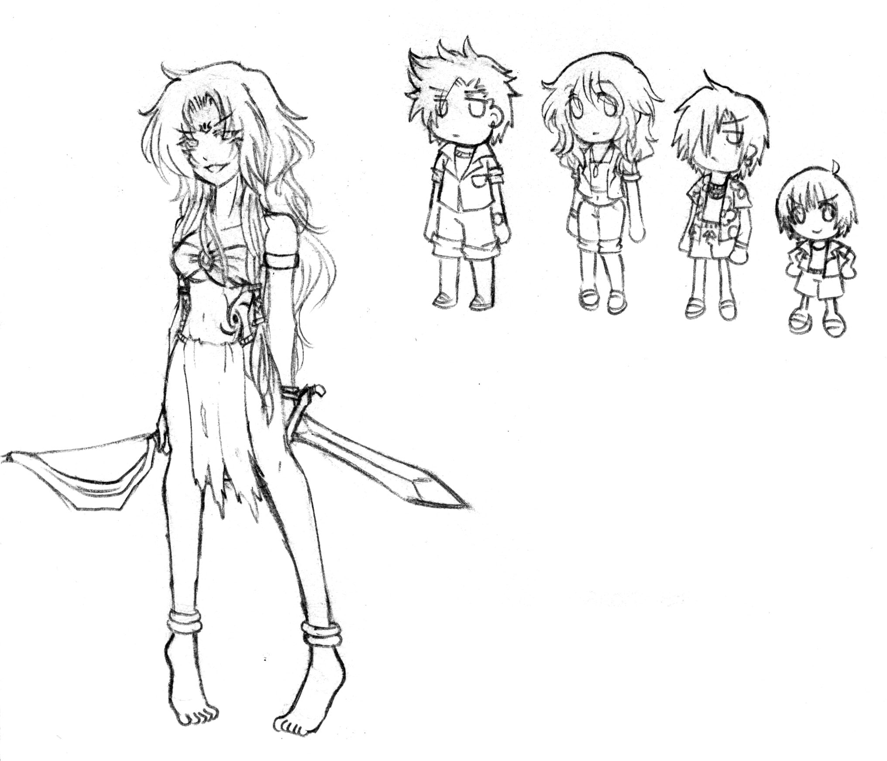

# 是的,我又來拋磚引玉了(謝謝hubert幫忙搬文)

作者：gtsferygood

TID：7730

<title>1</title> <link href="../Styles/Style.css" type="text/css" rel="stylesheet">

# 1

這次有兩個構想,不過因為都尚未設定完全,所以大略的講一下

---
第一個構想的概念圖,先前有在論壇上有意無意的再討論回覆內出現過
那不是我隨手撇出來的圖,而是實際上有著設定的一個東西,私下也只對其中幾個男同好分享過
原本是GT跟vore取向,後來經由同好建議,而衍生出GTS版本,內容大同小異,但互動的細節方面還是有些變化

舞台發生在島上的一座孤島
女主角是一個經歷船難而幸運生還,還跟島上動物結交為朋友的善良女孩
卻因為吃了島上秘樹的禁果,讓體質與性格產生戲劇性的變化,逐漸發狂而將身邊的朋友們一個個吞噬的故事

而我們的男主角在嬰兒時期時,所搭乘的郵輪在孤島內海遇上濃霧而迷途
被女主角發現並撿回郵輪,吃光了船上的所有人,卻因為女主角想養肥他再吃掉而倖存了下來

劇情的主軸都圍繞在這日久生情的兩人之間,究竟這對跨越體型的姐弟戀會青春到什麼樣的地步呢?
(雖然還不會進展到sex的程度就是了,別忘了飽暖思淫慾)
---
第二個構想,是我在玩Stranded 2時YY出來的
算是剛出爐不久的構想吧?但也因此設定得不夠完善

主角是位被稱作鬼島的森林之魔女的褐膚銀髮女性,外觀上看來只有20來歲,實際年齡不詳
是被鄰島的土人村落,以及自稱是海盜的鬍子男所禁忌的存在
擁有各式各樣的知識,雖然會咒術但卻自己手植防禦外敵用的森林
是個喜歡享受勞動樂趣,但卻性情古怪的女人
因為興趣與方便的關係,經常把有害生物與自家貨物用術法縮小

在魔女的日常生活被四名外來的不速之客給打亂節奏後,故事便如此開始了
因為私人飛機失機失事而迫降的他們,全都是些嬌生慣養的溫室花朵
23歲的富豪之子,19歲的名流千金,21歲的海外僑生,與年僅14歲的小少爺
為了能夠在這座島上存活,除了得避開毒蛇猛獸外,更得取得魔女的信任
學習島上的求生法則,他們能夠在逃過血盆大口之際,及沒被魔女的咒術玩死前,安全地返回家鄉嗎?
---

有興趣使用這兩個構想並實體化的人,可以跟我私下洽談細節
短訊也好,QQ也好,MSN也好,隨時都歡迎你們

[ *本帖最後由 gtsferygood 於 2010-5-2 14:02 編輯* ] <title>2</title> <link href="../Styles/Style.css" type="text/css" rel="stylesheet">

# 2

看起来像是孤岛生存之类的游戏一样= =
疯女人和魔女是最终BOSS吗！
打着打着就变成黄金太阳III——孤岛危机吗！
好吧，双重侵犯版权了= =

老实说我很喜欢魔女= =
不过也喜欢蛇女，所以第一个可以改成蛇女XD

[ *本帖最後由 alice 於 2010-5-2 06:50 編輯* ] <title>3</title> <link href="../Styles/Style.css" type="text/css" rel="stylesheet">

# 3

第一個設定蠻不錯的，可以試看看。
支持啊! <title>4</title> <link href="../Styles/Style.css" type="text/css" rel="stylesheet">

# 4

...............被兔子一说。。。。。我想起如果说GTS也有枪战游戏。。。。。那。。 <title>5</title> <link href="../Styles/Style.css" type="text/css" rel="stylesheet">

# 5

我记得有哇…………
一款叫THE BEAUTY的游戏，虽然游戏素质不高，但是就是这种的……
前面是因为一个被外星人变大的沙滩美女在破坏城市……
最终目的就是打到他…… <title>6</title> <link href="../Styles/Style.css" type="text/css" rel="stylesheet">

# 6

那個根本是THE 大美人的姊妹作 <title>7</title> <link href="../Styles/Style.css" type="text/css" rel="stylesheet">

# 7

先附上第二個構想的人設圖
通常會畫Q版代表設定的還不夠完整

左起依序為魔女跟四位倒楣的少男少女
魔女除了能把人縮小外,只有在盛怒下才會把自己變大

[ *本帖最後由 gtsferygood 於 2010-5-4 22:24 編輯* ] <title>8</title> <link href="../Styles/Style.css" type="text/css" rel="stylesheet">

# 8

 <ignore_js_op>[GTS5.jpg](forum.php?mod=attachment&aid=MjAxMjZ8NmZmN2FjY2J8MTY3NDA2ODg5N3wxODIzMHw3NzMw&nothumb=yes) *(212.14 KB, 下載次數: 0)*

[下載附件](forum.php?mod=attachment&aid=MjAxMjZ8NmZmN2FjY2J8MTY3NDA2ODg5N3wxODIzMHw3NzMw&nothumb=yes)

2010-5-4 22:21 上傳  

</ignore_js_op> <title>9</title> <link href="../Styles/Style.css" type="text/css" rel="stylesheet">

# 9

额，对第一个设想很有兴趣，第二个设想想象的空间也很大。 <title>10</title> <link href="../Styles/Style.css" type="text/css" rel="stylesheet">

# 10

画得很有爱，不过为何魔女是左剑右弓而不是拿魔杖的啊。。。。。 <title>11</title> <link href="../Styles/Style.css" type="text/css" rel="stylesheet">

# 11

人家是肉體實戰派。
就跟現代的魔法少女都學了武術一樣。