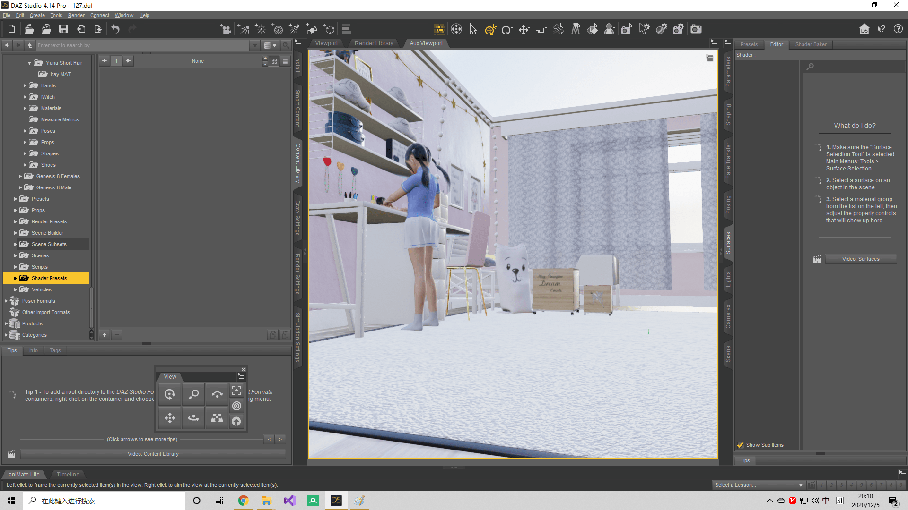
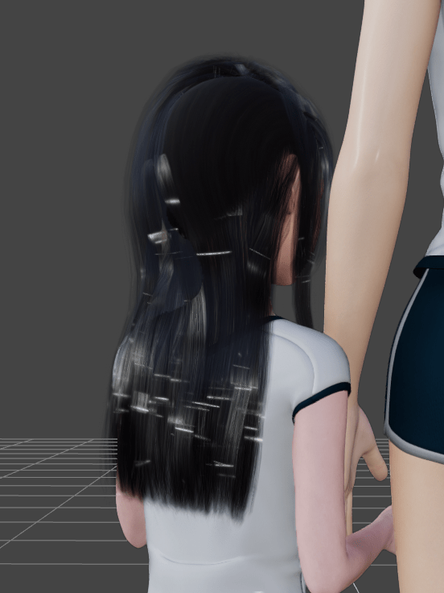

# 最新的 DAZ Studio 4.14 终于支持PBR预览了

作者：AK_H2

TID：29907

<title>1</title> <link href="../Styles/Style.css" type="text/css" rel="stylesheet">

# 1

视口Viewport里面新增了Filament(PBR)渲染模式，做成了和UE4类似的实时PBR效果。

大体思路估计是把传统的射线追踪方法里能预计算的部分全都提了出来。比如环境贴图（Environment map）对diffuse和specular的反射部分分开做预处理等等，然后直接使用Iray的材质数据。不过这样做能计算的间接光照非常有限——盲猜除了环境贴图部分，其他的间接光照，比如光线-墙壁A-墙壁B这种弹射两次以上的照射路径部分，大概难以很好的表现出来。

当然瘦死的骆驼比马大——相比4.12之前的Texture Shaded，PBR对画质的提升依然是质的飞跃。
在对光照要求不是很严谨的情况下，预览效果提升的真的不是一星半点，并且计算结果也和实际的Iray渲染结果更加相似。因此善用的话可以大幅提升制作效率。

（说真的早就想吐槽之前的Texture shaded了……真的有点落后时代了）

不过目前发现的一点问题是对4.12的场景，用PBR会造成很多纹理的UV加载错乱。
解决方法是在自己的库里翻出原来的材质重新再加载一遍。
挨个修复材质好像会翻的很辛苦，现在也没找到批量修复的方案……
（我是业余玩家所以没有这个负担，但对有在做故事的大佬们就不一样了……个人不建议大佬们做故事做到一半突然从4.12突然切换到4.14+PBR，毕竟新上的功能可能不稳定，而且对旧场景加载导致的UV错乱也会造成很多不必要的问题。开新作的时候再使用吧XD）

更多相关问题还在进一步研究中。

<title>2</title> <link href="../Styles/Style.css" type="text/css" rel="stylesheet">

# 2

 <ignore_js_op>[PBR.png](forum.php?mod=attachment&aid=ODYyNjl8NjYwMTVmYjJ8MTY3NDA2NjIyNnwxODIzMHwyOTkwNw%3D%3D&nothumb=yes) *(667.38 KB, 下載次數: 0)*

[下載附件](forum.php?mod=attachment&aid=ODYyNjl8NjYwMTVmYjJ8MTY3NDA2NjIyNnwxODIzMHwyOTkwNw%3D%3D&nothumb=yes)

2020-12-5 18:50 上傳  

PBR预览

</ignore_js_op>  <ignore_js_op>[Texture Shaded.png](forum.php?mod=attachment&aid=ODYyNjh8MjBkZjhiM2J8MTY3NDA2NjIyNnwxODIzMHwyOTkwNw%3D%3D&nothumb=yes) *(638.71 KB, 下載次數: 0)*

[下載附件](forum.php?mod=attachment&aid=ODYyNjh8MjBkZjhiM2J8MTY3NDA2NjIyNnwxODIzMHwyOTkwNw%3D%3D&nothumb=yes)

2020-12-5 18:50 上傳  

Texture Shaded预览

</ignore_js_op> <title>3</title> <link href="../Styles/Style.css" type="text/css" rel="stylesheet">

# 3

这个做出来的效果有没有blender好呢？ <title>4</title> <link href="../Styles/Style.css" type="text/css" rel="stylesheet">

# 4

*本帖最後由 AK_H2 於 2020-12-5 20:24 編輯*

> [dfggggx 發表於 2020-12-5 19:37](https://giantessnight.cf/gnforum2012/forum.php?mod=redirect&goto=findpost&pid=453369&ptid=29907)
> 这个做出来的效果有没有blender好呢？

试了几下，很遗憾，只是视口预览情况下的话我感觉远远比不上Blender……
新上的功能估计问题会很多，比如我刚测出来的，对头发这种类型的材质，渲染效果简直一塌糊涂……
盲猜可能是因为头发本质上是平面组成的，离线渲染时把这种东西转成发丝再去计算绰绰有余，但实时就难堪大任，只能硬生生将头发当成平面去处理。
并且实时预览中对透明遮挡顺序也没处理好，有不小的问题（不过这个问题4.12之前好像就存在）

不过实时PBR的计算结果虽然也是简单的估算，但使用了和Iray相同的Albedo/Metallic工作流，比上个世代的Texture Shaded（Diffuse/Specular工作流）要准确的多。所以提升自己的制图效率，我个人感觉会蛮有用。毕竟4.12之前想预览渲染，通常都需要开一个分辨率较低的附加视口（Aux Viewport）做额外的渲染，每次预览都相当于跑一次Iray，超高的计算量导致CPU只能每次都直接拉满，很卡，效率也不高。
（而且 Daz官方的本意应该也只是做一个更加优秀的辅助参考预览效果，实打实的渲染还是要交给硬核的Iray。）

总的来说，个人愚见，4.14新上的实时PBR并不完美，bug一堆，但依然比4.12的预览效果好多了。

而且这应该算是比较明显的用户体验提升，Daz3D可能会在后续版本花力气抓这个，后续迭代的速度估计不会太慢。
在可见的未来也许很快会成为Aux Viewport+Iray预览的取代方案。

<title>5</title> <link href="../Styles/Style.css" type="text/css" rel="stylesheet">

# 5

 <ignore_js_op>[透明遮挡顺序有问题.png](forum.php?mod=attachment&aid=ODYyNzN8YzU3NzBhMzV8MTY3NDA2NjIyNnwxODIzMHwyOTkwNw%3D%3D&nothumb=yes) *(1.18 MB, 下載次數: 0)*

[下載附件](forum.php?mod=attachment&aid=ODYyNzN8YzU3NzBhMzV8MTY3NDA2NjIyNnwxODIzMHwyOTkwNw%3D%3D&nothumb=yes)

2020-12-5 20:17 上傳  

</ignore_js_op> <ignore_js_op>[test.png](forum.php?mod=attachment&aid=ODYyNzJ8MDA5ZGE0MWN8MTY3NDA2NjIyNnwxODIzMHwyOTkwNw%3D%3D&nothumb=yes) *(1.3 MB, 下載次數: 0)*

[下載附件](forum.php?mod=attachment&aid=ODYyNzJ8MDA5ZGE0MWN8MTY3NDA2NjIyNnwxODIzMHwyOTkwNw%3D%3D&nothumb=yes)

2020-12-5 20:11 上傳  

正常效果

</ignore_js_op>  <ignore_js_op>[Hair.png](forum.php?mod=attachment&aid=ODYyNzF8OGNhZGU0Y2R8MTY3NDA2NjIyNnwxODIzMHwyOTkwNw%3D%3D&nothumb=yes) *(435.76 KB, 下載次數: 0)*

[下載附件](forum.php?mod=attachment&aid=ODYyNzF8OGNhZGU0Y2R8MTY3NDA2NjIyNnwxODIzMHwyOTkwNw%3D%3D&nothumb=yes)

2020-12-5 20:11 上傳  

</ignore_js_op> <title>6</title> <link href="../Styles/Style.css" type="text/css" rel="stylesheet">

# 6

这渲染的效果看上去怎么好像MMD的´_>`但这个效果个人感觉比Iray要好诶。。有点心动 <title>7</title> <link href="../Styles/Style.css" type="text/css" rel="stylesheet">

# 7

DAZ我记得业内都是拿里面的人体素材来做素体的吧，然后放到c4d里改头渲染，单纯daz出图并不好看。 <title>8</title> <link href="../Styles/Style.css" type="text/css" rel="stylesheet">

# 8

看了才想起忘了去升级了，不过只是预览用的话体验确实会好很多，有点Maya窗口里实时效果的感觉了，实时渲染才是未来 <title>9</title> <link href="../Styles/Style.css" type="text/css" rel="stylesheet">

# 9

有没有有关的教程想学