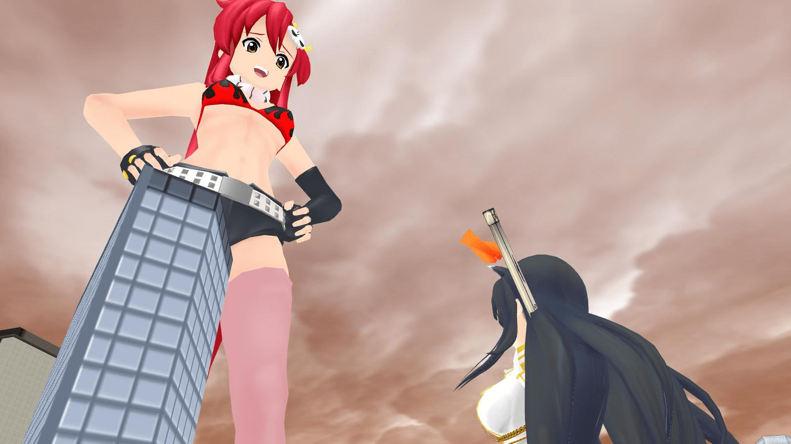
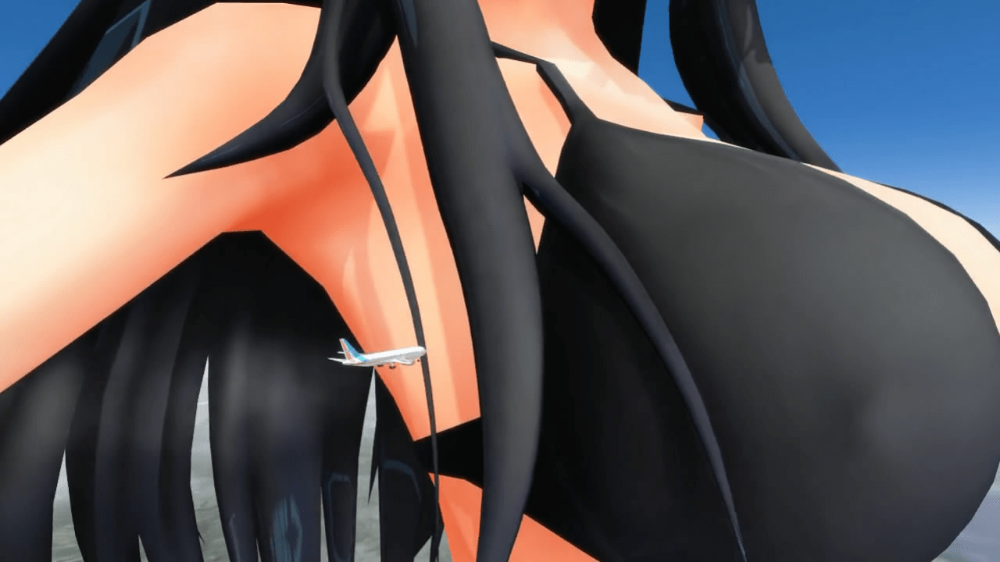

# 最近ＭＭＤ蓬勃

作者：ckw

TID：12434

<title>1</title> <link href="../Styles/Style.css" type="text/css" rel="stylesheet">

# 1

……呼呼呼，我是誰（開場白與本文無關）

話說最近ＭＭＤ發展起來……雅致來了，我也貼一貼，當作參一腳∼∼∼
圖的動一早已經SET好，直到5月27才影，因為個人關係**（懶）**
無插特效，所以看起來不平滑、圓潤，及無足夠陰影（雖然很重要，但好麻煩）
（1600*900）
<ignore_js_op>

**YOKO.jpg** *(93.1 KB, 下載次數: 0)*

[下載附件](forum.php?mod=attachment&aid=Mjg3MjZ8MDY4MTQ5ZjJ8MTY3NDA2ODY5MnwxODIzMHwxMjQzNA%3D%3D&nothumb=yes)

2012-6-4 02:29 上傳

注解一下大小，總覺得表明大小是重要：
斑鳩是100倍大，YOKO是？太久忘記了，總之是更大
地圖銀時町用10倍大不夠顯注，100倍才高於大樓

黑歷史作，今年新年不久造的，那時候忘記了入背景wwwwww…
事實同上面也是隨便，連特效照樣省掉，不過有個背景而已
[http://giantessnight.com/gnforum/viewthread.php?tid=11677&extra=page%3D5](http://giantessnight.com/gnforum/viewthread.php?tid=11677&extra=page%3D5)

＝＝＝＝＝＝＝＝＝＝＝＝＝＝＝
這個不是GTS，但因為我很喜歡所以貼一貼，不過因為各種原因（不是麻煩或懶），不想完全公開:P
<ignore_js_op> [tba39ts.jpg](forum.php?mod=attachment&aid=Mjg3Mjd8ZTcyODA0ODl8MTY3NDA2ODY5MnwxODIzMHwxMjQzNA%3D%3D) *(212.25 KB, 下載次數: 0)* 2012-6-4 02:29 上傳點擊文件名下載附件
閱讀權限: 255

[ *本帖最後由 ckw 於 2012-6-4 02:30 編輯* ] <title>2</title> <link href="../Styles/Style.css" type="text/css" rel="stylesheet">

# 2

最近mmd真的很蓬勃 不是挺好嘛，有福啊 <title>3</title> <link href="../Styles/Style.css" type="text/css" rel="stylesheet">

# 3

哎 为啥我把角色放大之后就看不到上半部分了！！ <title>4</title> <link href="../Styles/Style.css" type="text/css" rel="stylesheet">

# 4

其實也就兩三個人做，算不上蓬勃吧，要是熱度消退了一下子又會冷清了。
如果再多幾個人做就好了呢~~~

我覺得用MME那個變大插件，做姿勢是相當麻煩的（模型太大視角移動累死你），我一般都是用PMD直接把地圖改小的。 <title>5</title> <link href="../Styles/Style.css" type="text/css" rel="stylesheet">

# 5

“用PMD直接把地圖改小的”
这个怎么弄！！！ <title>6</title> <link href="../Styles/Style.css" type="text/css" rel="stylesheet">

# 6

PMDEditor
网上很多地方有下载，这个可以改PMD格式的模型。

然后……教程……
[http://www.moe5.net/forum.php?mod=viewthread&tid=3192](http://www.moe5.net/forum.php?mod=viewthread&tid=3192) <title>7</title> <link href="../Styles/Style.css" type="text/css" rel="stylesheet">

# 7

> 原帖由 *18X* 於 2012-6-4 18:05 發表 
> 其實也就兩三個人做，算不上蓬勃吧，要是熱度消退了一下子又會冷清了。
> 如果再多幾個人做就好了呢~~~
> 
> 我覺得用MME那個變大插件，做姿勢是相當麻煩的（模型太大視角移動累死你），我一般都是用PMD直接把地圖改小的 ...

先做動作,後開Scale_v004不就行了?
視角位置可以入數值改動,我覺得還好啦
問題是,鏡頭切換模型,馬上回鍋,又得重新set,所以好麻煩(愛用save+備份) <title>8</title> <link href="../Styles/Style.css" type="text/css" rel="stylesheet">

# 8

> 原帖由 *ckw* 於 2012-6-4 20:49 發表 
> 
> 先做動作,後開Scale_v004不就行了?
> 視角位置可以入數值改動,我覺得還好啦
> 問題是,鏡頭切換模型,馬上回鍋,又得重新set,所以好麻煩(愛用save+備份)

如果要做跟小人互動的情節，這樣不好把握距離。 <title>9</title> <link href="../Styles/Style.css" type="text/css" rel="stylesheet">

# 9

> 原帖由 *18X* 於 2012-6-4 20:50 發表 
> 
> 如果要做跟小人互動的情節，這樣不好把握距離。

+1
人多了,距離不好整理
就如樓頂的斑鳩和YOKO,在放大後在距離不好掌握,變大後距離太近偶有吃掉對方場合
鏡頭也是難設定在哪一個距離,位置不好拍不下另一個,雖然有個視野角可以調……(懶,不想學) <title>10</title> <link href="../Styles/Style.css" type="text/css" rel="stylesheet">

# 10

> 原帖由 *18X* 於 2012-6-4 18:50 發表 
> PMDEditor
> 网上很多地方有下载，这个可以改PMD格式的模型。
> 
> 然后……教程……
> [http://www.moe5.net/forum.php?mod=viewthread&tid=3192](http://www.moe5.net/forum.php?mod=viewthread&tid=3192)

这个似乎只能改PMD格式的模型哎....求PMD模式的地图...我这边下了好几个都是.X结尾的啊！！
还有那个Scale_v004修改的大小感觉十分有限哎... <title>11</title> <link href="../Styles/Style.css" type="text/css" rel="stylesheet">

# 11

> 原帖由 *archer* 於 2012-6-5 09:41 發表 
> 
> 这个似乎只能改PMD格式的模型哎....求PMD模式的地图...我这边下了好几个都是.X结尾的啊！！
> 还有那个Scale_v004修改的大小感觉十分有限哎...

PE本身可以支持X,PMD,PMX(地圖愈廣,愈LAG)

Scale_v004理論上可以無限放大,然後超過地圖大小還能繼續巨大下去 <title>12</title> <link href="../Styles/Style.css" type="text/css" rel="stylesheet">

# 12

> 原帖由 *ckw* 於 2012-6-5 13:07 發表 
> 
> PE本身可以支持X,PMD,PMX(地圖愈廣,愈LAG)
> 
> Scale_v004理論上可以無限放大,然後超過地圖大小還能繼續巨大下去

Scale_v004是拖动那个表情来放大的吧...但是只能拖动那么一段啊？ <title>13</title> <link href="../Styles/Style.css" type="text/css" rel="stylesheet">

# 13

> 原帖由 *archer* 於 2012-6-5 16:29 發表 
> 
> Scale_v004是拖动那个表情来放大的吧...但是只能拖动那么一段啊？

<ignore_js_op> [ScaleG.zip](forum.php?mod=attachment&aid=Mjg3MzF8MDY2OTE3YTV8MTY3NDA2ODY5N3wxODIzMHwxMjQzNA%3D%3D) *(9.92 KB, 下載次數: 3)* 2012-6-5 19:47 上傳點擊文件名下載附件<title>14</title> <link href="../Styles/Style.css" type="text/css" rel="stylesheet">

# 14

> 原帖由 *archer* 於 2012-6-5 16:29 發表 
> 
> Scale_v004是拖动那个表情来放大的吧...但是只能拖动那么一段啊？

影格編輯>修改表情大小
拖動最大值為10倍,再從「修改表情大小」輸入數值,大小將為「10*數值」,再次輸數值會再疊加,放大輸入小數位可以變小,0.5=減半(總之就是數學問題)
試下就容易明白

注意:放大或變小必先拖動>註冊,後輸入數值,只在修改表情大小調整倍率是不會生效 <title>15</title> <link href="../Styles/Style.css" type="text/css" rel="stylesheet">

# 15

喔喔
樓主的圖好棒
尤其又是我喜歡的大GTSVS小GTS
希望能看到更多你的作品啊 <title>16</title> <link href="../Styles/Style.css" type="text/css" rel="stylesheet">

# 16

> 原帖由 *nijack89* 於 2012-6-6 12:25 發表 
> 喔喔
> 樓主的圖好棒
> 尤其又是我喜歡的大GTSVS小GTS
> 希望能看到更多你的作品啊

人懶,對上一次事隔半年才貼個舊圖

================================================================
話說,dan前段日子做了新視頻
以下是截圖
<ignore_js_op>

**ikarugamizugi[20120606-0755380].JPG** *(87.52 KB, 下載次數: 0)*

[下載附件](forum.php?mod=attachment&aid=Mjg3MzZ8NWQxMTBhYTB8MTY3NDA2ODY5N3wxODIzMHwxMjQzNA%3D%3D&nothumb=yes)

2012-6-7 03:20 上傳

這個模型是斑鳩水SW,該模型我也有(331後DL應該已削除),但沒有模型根本沒有突點,當時心想:原來也有這種違法改造
用PE打開,敏感帶的頂點數只有一圈加一點,根點凸不起(要不然VER太舊)
這個……PE又沒法加頂點(困難),不是PE能改的了,我沒解,求教學

[ *本帖最後由 ckw 於 2012-6-7 03:27 編輯* ] <title>17</title> <link href="../Styles/Style.css" type="text/css" rel="stylesheet">

# 17

> 原帖由 *ckw* 於 2012-6-7 03:20 發表 
> 
> 人懶,對上一次事隔半年才貼個舊圖
> 
> ================================================================
> 話說,dan前段日子做了新視頻
> 以下是截圖
> 28736
> 這個模型是斑鳩水SW,該模型我也有(331後DL應該已削除 ...

求模型~~</ignore_js_op></ignore_js_op></ignore_js_op></ignore_js_op>