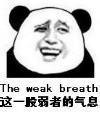

# 最近翻译大大好多啊！但是不知道看完回什么了！怎么办！

作者：ccccccccccc

TID：23636

<title>1</title> <link href="../Styles/Style.css" type="text/css" rel="stylesheet">

# 1

虽然每次看完更新回个6.70字左右还是可以，但是总觉得自己的回复内容越来越格式化，没什么热情了……姑且也是在网上浪里白条水了7年了，从一开始在gn被禁言删帖到现在的毫无痕迹，逐渐的也开始支持作者之后，反而不清楚应该怎么样去支持各种各样的作者了。只是夸么怕被嫌弃水，给建议么怕引起反感，指出不足么又怕打击自信，举例分析么又怕被曲解意思。全部都搞一遍么，我也懒_(:з」∠)_
(ง •̀_•́)ง综上所述就是一个闲的无聊发起的讨论帖，希望文章区大大们一起来聊聊天扯扯淡。顺便一提最近脑洞到个蛋糕上的。就是群里中午在讨论最近的蛋糕，已经能把各种插画打印在糯米纸上，放在蛋糕最上边了，而且完全在碰之前基本看不出是糯米纸。这么一想和游戏界的瞎掰饼干生成随机地图术结合在一起，弄个蛮酷的文章点子的(但是我肯定不会去写的，毕竟要多懒有多懒_(:з」∠)_ <title>2</title> <link href="../Styles/Style.css" type="text/css" rel="stylesheet">

# 2

这就是论坛不能只回一个“支持”的缺点，想表达的就只有两个字，却非要凑字数 <title>3</title> <link href="../Styles/Style.css" type="text/css" rel="stylesheet">

# 3

[http://giantessnight.com/gnforum ... &extra=page%3D3](http://giantessnight.com/gnforum2012/forum.php?mod=viewthread&tid=23554&extra=page%3D3)
說出你的故事_(:з」∠)_ <title>4</title> <link href="../Styles/Style.css" type="text/css" rel="stylesheet">

# 4

> ckw 發表於 2017-8-7 22:59
> http://giantessnight.com/gnforum2012/forum.php?mod=viewthread&tid=23554&extra=page%3D3
> 說出你的故事_ ...

组队开坑什么的肯定不行啦……轻小说有个很好的例子来着，时钟机关之星。两个人一起有了个点子之后：
A:我写了篇文，你看看(初稿写完了
B:你写的很好，但是差点细节(删掉了80%重新写了篇
A:你写的好棒，我再改改(重新暴走，剧情完全脱离B
B:重复步骤2
…………
C:那个，我是责编。请问两位打算什么时候交稿子
A.B:跑路
说到底这俩人要不是产能高的一塌糊涂这文能不能写出来我都怀疑…… <title>5</title> <link href="../Styles/Style.css" type="text/css" rel="stylesheet">

# 5

这个标题起的就很有迷惑性啊，能起这样标题的大佬居然不知道怎样回复，我可能是上了假的GN（滑稽）
嘛其实我也不知道该怎么回就是了……
玩梗划水？我不知道你在说什么啦！ <title>6</title> <link href="../Styles/Style.css" type="text/css" rel="stylesheet">

# 6

*本帖最後由 gnforum 於 2017-8-8 11:04 編輯*

千言万语不如表情包
另，十分希望论坛表情中能加一个滑稽。
滑稽才是真谛。
比如我如果回复别人的评论，多了就像灌水。
发一个滑稽，心领神会，一切尽在不言中。
<title>7</title> <link href="../Styles/Style.css" type="text/css" rel="stylesheet">

# 7

用心看，用些写回复，只能这样。对于那些不i感兴趣的或者不是到我自己的点的那种文，我也是愿意用个表情或者发掘个不一样的角度回复下 <title>8</title> <link href="../Styles/Style.css" type="text/css" rel="stylesheet">

# 8

这个嘛，，，其实怎么回复看个人，怎么反应看作者。用亲身体验就是，
不管怎么样有人回复说明看了文章还是非常开心，但是因为所想所写所悟有偏差，稍微讨论一下还是可以的。当然有的也只是礼貌性回复的客套话而已。还有一些建议，虽然会看，但是怎么写还是我自己的事情ww <title>9</title> <link href="../Styles/Style.css" type="text/css" rel="stylesheet">

# 9

说实话翻译真的回复都不知道回复什么好了，这也说明论坛开始更活跃了，分两个角度看比较好吧 <title>10</title> <link href="../Styles/Style.css" type="text/css" rel="stylesheet">

# 10

我的话比较偏向于夸啊，其实说一句辛苦了或者夸几句比什么都好，毕竟也都是发自内心的，并不是敷衍。 <title>11</title> <link href="../Styles/Style.css" type="text/css" rel="stylesheet">

# 11

這就是問題了。。。
除去真的水之外，真的沒什麼可以說 文學功底差啊
想想那些評論家 我去看同樣的東西我完全找不到可以說的東西 最後就只能說寫得真好 可是他們可以寫上數千字的評價。。。