# 最近迷上了天际，截图几张

作者：shiyue

TID：16642

<title>1</title> <link href="../Styles/Style.css" type="text/css" rel="stylesheet">

# 1

*本帖最後由 廖雪松 於 2014-4-9 17:03 編輯*

新手，不太会弄MOD，而且是小霸王电脑
所以图片不是多好
<title>2</title> <link href="../Styles/Style.css" type="text/css" rel="stylesheet">

# 2

 <ignore_js_op>[ScreenShot15.JPG](forum.php?mod=attachment&aid=NDIxODd8YTAwZWU1ZTZ8MTY3NDA2ODAzM3wxODIzMHwxNjY0Mg%3D%3D&nothumb=yes) *(36.89 KB, 下載次數: 14)*

[下載附件](forum.php?mod=attachment&aid=NDIxODd8YTAwZWU1ZTZ8MTY3NDA2ODAzM3wxODIzMHwxNjY0Mg%3D%3D&nothumb=yes)

2014-4-9 16:58 上傳  

[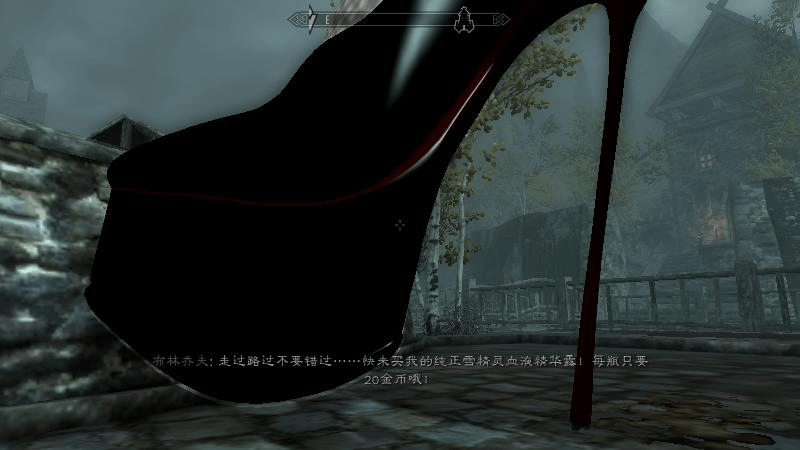](javascript:;)</ignore_js_op> <ignore_js_op>[ScreenShot14.JPG](forum.php?mod=attachment&aid=NDIxODZ8ODJlYzQ3ZDh8MTY3NDA2ODAzM3wxODIzMHwxNjY0Mg%3D%3D&nothumb=yes) *(25.72 KB, 下載次數: 5)*

[下載附件](forum.php?mod=attachment&aid=NDIxODZ8ODJlYzQ3ZDh8MTY3NDA2ODAzM3wxODIzMHwxNjY0Mg%3D%3D&nothumb=yes)

2014-4-9 16:58 上傳  

[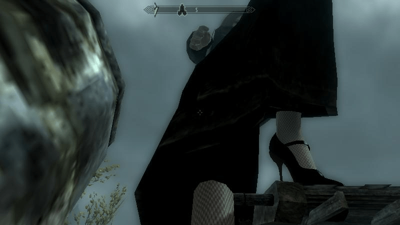](javascript:;)</ignore_js_op> <ignore_js_op>[ScreenShot13.JPG](forum.php?mod=attachment&aid=NDIxODV8ODliMzhlNWN8MTY3NDA2ODAzM3wxODIzMHwxNjY0Mg%3D%3D&nothumb=yes) *(38.91 KB, 下載次數: 1)*

[下載附件](forum.php?mod=attachment&aid=NDIxODV8ODliMzhlNWN8MTY3NDA2ODAzM3wxODIzMHwxNjY0Mg%3D%3D&nothumb=yes)

2014-4-9 16:58 上傳  

[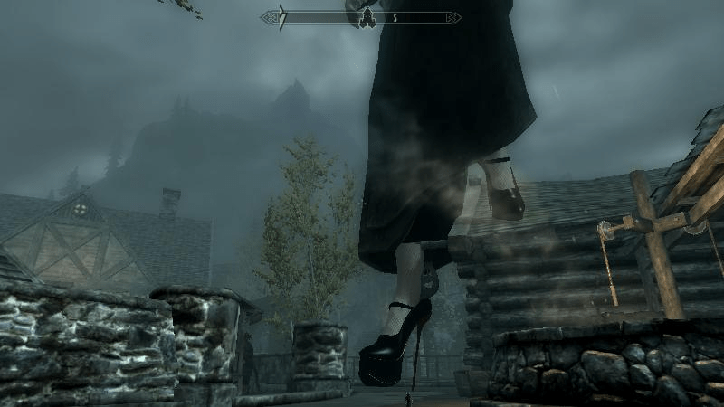](javascript:;)</ignore_js_op> <ignore_js_op>[ScreenShot12.JPG](forum.php?mod=attachment&aid=NDIxODR8MDAxN2M0Mjl8MTY3NDA2ODAzM3wxODIzMHwxNjY0Mg%3D%3D&nothumb=yes) *(58.59 KB, 下載次數: 2)*

[下載附件](forum.php?mod=attachment&aid=NDIxODR8MDAxN2M0Mjl8MTY3NDA2ODAzM3wxODIzMHwxNjY0Mg%3D%3D&nothumb=yes)

2014-4-9 16:58 上傳  

[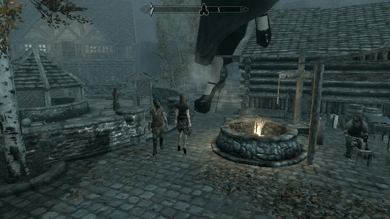](javascript:;)</ignore_js_op> <ignore_js_op>[ScreenShot10.JPG](forum.php?mod=attachment&aid=NDIxODJ8ZjJmMGY2OTh8MTY3NDA2ODAzM3wxODIzMHwxNjY0Mg%3D%3D&nothumb=yes) *(44.72 KB, 下載次數: 2)*

[下載附件](forum.php?mod=attachment&aid=NDIxODJ8ZjJmMGY2OTh8MTY3NDA2ODAzM3wxODIzMHwxNjY0Mg%3D%3D&nothumb=yes)

2014-4-9 16:58 上傳  

[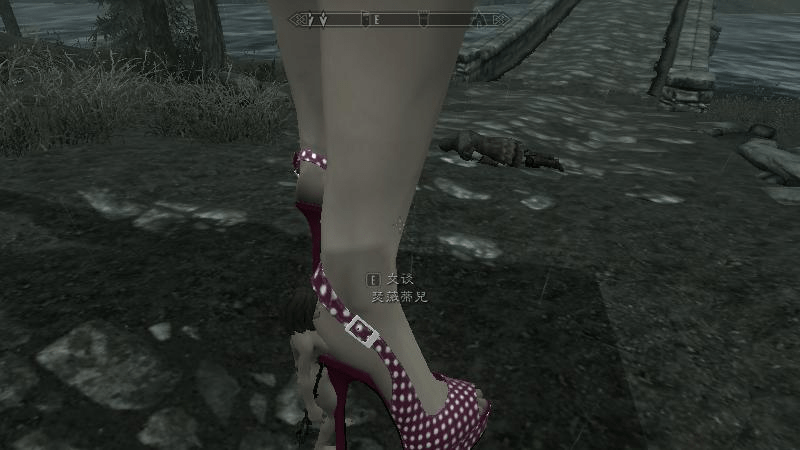](javascript:;)</ignore_js_op> <ignore_js_op>[ScreenShot11.JPG](forum.php?mod=attachment&aid=NDIxODN8MDBjOTYxMzN8MTY3NDA2ODAzM3wxODIzMHwxNjY0Mg%3D%3D&nothumb=yes) *(47.53 KB, 下載次數: 3)*

[下載附件](forum.php?mod=attachment&aid=NDIxODN8MDBjOTYxMzN8MTY3NDA2ODAzM3wxODIzMHwxNjY0Mg%3D%3D&nothumb=yes)

2014-4-9 16:58 上傳  

[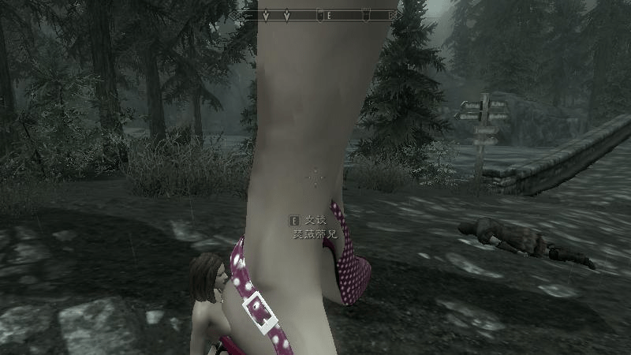](javascript:;)</ignore_js_op> <ignore_js_op>[ScreenShot9.JPG](forum.php?mod=attachment&aid=NDIxODF8MTc4NjU3YTh8MTY3NDA2ODAzM3wxODIzMHwxNjY0Mg%3D%3D&nothumb=yes) *(39.45 KB, 下載次數: 1)*

[下載附件](forum.php?mod=attachment&aid=NDIxODF8MTc4NjU3YTh8MTY3NDA2ODAzM3wxODIzMHwxNjY0Mg%3D%3D&nothumb=yes)

2014-4-9 16:58 上傳  

[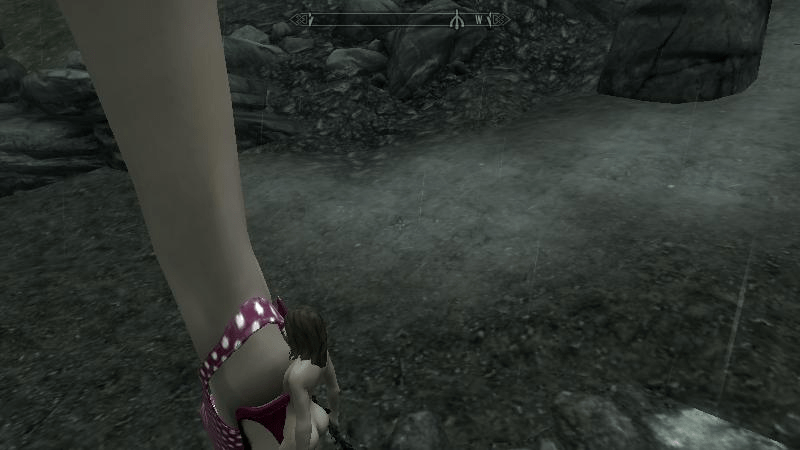](javascript:;)</ignore_js_op> <ignore_js_op>[ScreenShot19.JPG](forum.php?mod=attachment&aid=NDIxODB8ZDNiNDE5NjZ8MTY3NDA2ODAzM3wxODIzMHwxNjY0Mg%3D%3D&nothumb=yes) *(31.46 KB, 下載次數: 8)*

[下載附件](forum.php?mod=attachment&aid=NDIxODB8ZDNiNDE5NjZ8MTY3NDA2ODAzM3wxODIzMHwxNjY0Mg%3D%3D&nothumb=yes)

2014-4-9 16:58 上傳  

[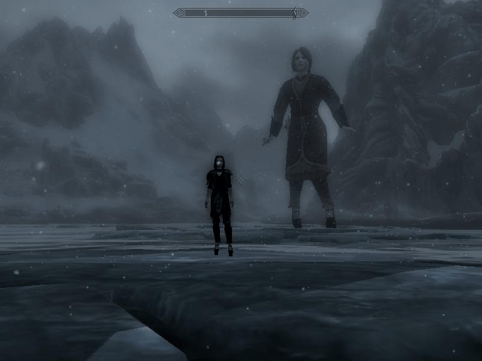](javascript:;)</ignore_js_op> <ignore_js_op>[ScreenShot18.JPG](forum.php?mod=attachment&aid=NDIxNzl8ODI3ZmMxOGF8MTY3NDA2ODAzM3wxODIzMHwxNjY0Mg%3D%3D&nothumb=yes) *(30.74 KB, 下載次數: 1)*

[下載附件](forum.php?mod=attachment&aid=NDIxNzl8ODI3ZmMxOGF8MTY3NDA2ODAzM3wxODIzMHwxNjY0Mg%3D%3D&nothumb=yes)

2014-4-9 16:57 上傳  

[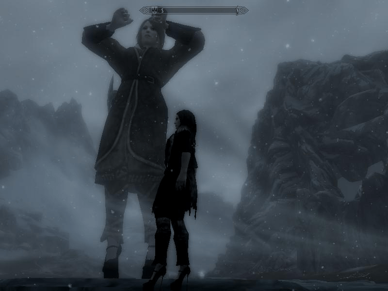](javascript:;)</ignore_js_op> <ignore_js_op>[ScreenShot17.JPG](forum.php?mod=attachment&aid=NDIxNzh8NzUxYjRjNTF8MTY3NDA2ODAzM3wxODIzMHwxNjY0Mg%3D%3D&nothumb=yes) *(63.6 KB, 下載次數: 1)*

[下載附件](forum.php?mod=attachment&aid=NDIxNzh8NzUxYjRjNTF8MTY3NDA2ODAzM3wxODIzMHwxNjY0Mg%3D%3D&nothumb=yes)

2014-4-9 16:57 上傳  

[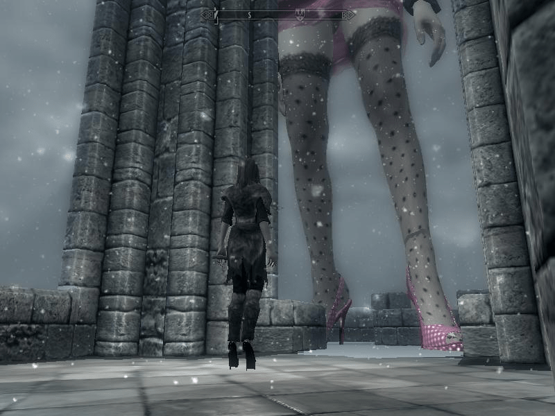](javascript:;)</ignore_js_op> <title>3</title> <link href="../Styles/Style.css" type="text/css" rel="stylesheet">

# 3

<ignore_js_op>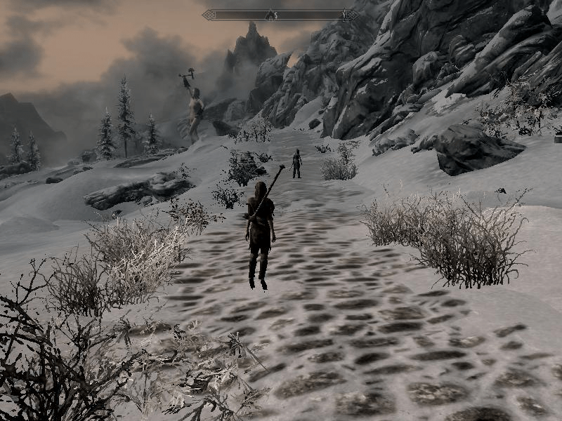

**ScreenShot16.JPG** *(101.46 KB, 下載次數: 0)*

[下載附件](forum.php?mod=attachment&aid=NDIxODh8ZDg4MWY4MTV8MTY3NDA2ODAzM3wxODIzMHwxNjY0Mg%3D%3D&nothumb=yes)

2014-4-9 17:04 上傳

<title>4</title> <link href="../Styles/Style.css" type="text/css" rel="stylesheet">

# 4

*本帖最後由 Nethul 於 2014-4-9 17:47 編輯*

顶楼主！我之前也玩过少女卷轴5，LZ的鞋子MOD都挺性感，我都木有用过T_T <title>5</title> <link href="../Styles/Style.css" type="text/css" rel="stylesheet">

# 5

楼主开了ENB效果会更好，滚5确实是很不错的游戏。 <title>6</title> <link href="../Styles/Style.css" type="text/css" rel="stylesheet">

# 6

不知道怎么去掉雾化效果，而且视距调远了就很卡 <title>7</title> <link href="../Styles/Style.css" type="text/css" rel="stylesheet">

# 7

怎样 放大人物的啊？需要下载什么插件 <title>8</title> <link href="../Styles/Style.css" type="text/css" rel="stylesheet">

# 8

没有互动什么的么？ <title>9</title> <link href="../Styles/Style.css" type="text/css" rel="stylesheet">

# 9

顶楼主！很不错的画面效果，赞一个！ <title>10</title> <link href="../Styles/Style.css" type="text/css" rel="stylesheet">

# 10

顶楼主！很不错的画面效果，赞一个！ <title>11</title> <link href="../Styles/Style.css" type="text/css" rel="stylesheet">

# 11

那个粉红色的鞋子怎么弄的啊？是下载mod吗？ <title>12</title> <link href="../Styles/Style.css" type="text/css" rel="stylesheet">

# 12

5画面真是好 现在老了 折腾不起mod了 <title>13</title> <link href="../Styles/Style.css" type="text/css" rel="stylesheet">

# 13

这游戏还是很不错的  可以有无线的幻想空间 <title>14</title> <link href="../Styles/Style.css" type="text/css" rel="stylesheet">

# 14

你们说的游戏，电脑配置完全不够啊QAQ <title>15</title> <link href="../Styles/Style.css" type="text/css" rel="stylesheet">

# 15

天際一直是ＧＴＳ發揮的好地方
謝謝分享！！ <title>16</title> <link href="../Styles/Style.css" type="text/css" rel="stylesheet">

# 16

这个是游戏！？好有兴趣赶快下一个 <title>17</title> <link href="../Styles/Style.css" type="text/css" rel="stylesheet">

# 17

求游戏全名呀。上网打天际也找不到
<title>18</title> <link href="../Styles/Style.css" type="text/css" rel="stylesheet">

# 18

> [s615042202 發表於 2015-1-13 04:08](https://giantessnight.cf/gnforum2012/forum.php?mod=redirect&goto=findpost&pid=244000&ptid=16642)
> 求游戏全名呀。上网打天际也找不到

上古卷轴5天际     这个是全名 <title>19</title> <link href="../Styles/Style.css" type="text/css" rel="stylesheet">

# 19

这个不错，有感觉啊啊啊 <title>20</title> <link href="../Styles/Style.css" type="text/css" rel="stylesheet">

# 20

果然老滚并没有退出RPG的大舞台 <title>21</title> <link href="../Styles/Style.css" type="text/css" rel="stylesheet">

# 21

天际mod真是神了，可惜电脑带不动啊 <title>22</title> <link href="../Styles/Style.css" type="text/css" rel="stylesheet">

# 22

老滚5是好游戏...简直是给力...看权力的游戏最先想到的就是这个游戏... <title>23</title> <link href="../Styles/Style.css" type="text/css" rel="stylesheet">

# 23

上古卷軸5我本來有想下的，但後來看到檔案大小...果斷放棄(電腦容量不夠 <title>24</title> <link href="../Styles/Style.css" type="text/css" rel="stylesheet">

# 24

一直听说这个游戏 但是没什么时间去玩 <title>25</title> <link href="../Styles/Style.css" type="text/css" rel="stylesheet">

# 25

我當初這個也玩了很久XD
這高跟作者頗猛 <title>26</title> <link href="../Styles/Style.css" type="text/css" rel="stylesheet">

# 26

那只是看看ㄅ
似乎對遊戲沒影響 <title>27</title> <link href="../Styles/Style.css" type="text/css" rel="stylesheet">

# 27

天际我也玩，但是这个mod每次加都失败，nmm都下了，听说还要输代码，真的是不知道怎么玩。。。那个原版的人丑的不要不要的。。怎么破，求教 <title>28</title> <link href="../Styles/Style.css" type="text/css" rel="stylesheet">

# 28

这是上古5？怎么弄得？我下的上古5只是游戏而已。  还有，mod是什么？ <title>29</title> <link href="../Styles/Style.css" type="text/css" rel="stylesheet">

# 29

非常喜欢楼主设计的鞋子，尤其是那个斑点的 <title>30</title> <link href="../Styles/Style.css" type="text/css" rel="stylesheet">

# 30

是极好的mod，很有吸引力 <title>31</title> <link href="../Styles/Style.css" type="text/css" rel="stylesheet">

# 31

画质有点渣 游戏老了? 额 <title>32</title> <link href="../Styles/Style.css" type="text/css" rel="stylesheet">

# 32

天际下过 不过不知道怎么玩 <title>33</title> <link href="../Styles/Style.css" type="text/css" rel="stylesheet">

# 33

少女卷轴还能这么玩 好棒 <title>34</title> <link href="../Styles/Style.css" type="text/css" rel="stylesheet">

# 34

这是个游戏吗？。。。。。</ignore_js_op>