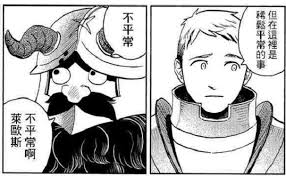
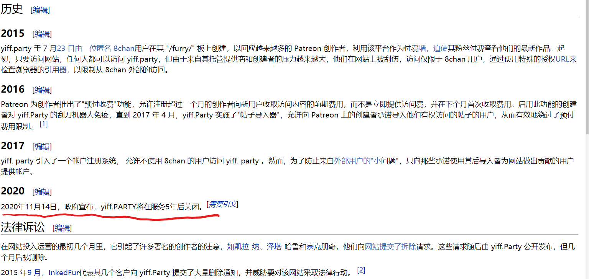

# 有一个网站集聚的不少fantia资源，不过不清楚可不可以发

作者：Carweirdo

TID：28573

<title>1</title> <link href="../Styles/Style.css" type="text/css" rel="stylesheet">

# 1

*本帖最後由 leo1223 於 2020-8-22 11:15 編輯*

fantia毕竟是收费的，不知道发出来有违规吗？又担心有时太多人知道会造成网站的负担

加上网站

| [https://yiff.party/](https://yiff.party/) |

<title>2</title> <link href="../Styles/Style.css" type="text/css" rel="stylesheet">

# 2

發吧！
看看有什麼東西
<title>3</title> <link href="../Styles/Style.css" type="text/css" rel="stylesheet">

# 3

該不會是某y開頭的網站 <title>4</title> <link href="../Styles/Style.css" type="text/css" rel="stylesheet">

# 4

> [assassindark 發表於 2020-4-26 17:05](https://giantessnight.cf/gnforum2012/forum.php?mod=redirect&goto=findpost&pid=434549&ptid=28573)
> 該不會是某y開頭的網站

就是,不清楚有没有隐藏规矩能不能发
<title>5</title> <link href="../Styles/Style.css" type="text/css" rel="stylesheet">

# 5

假如有人看不順眼告知日方作者就不知道有啥反應了

雖然老實講在這裡也不是啥新奇的事情了.呵呵
<ignore_js_op>

**下載 (4).jpg** *(13.22 KB, 下載次數: 0)*

[下載附件](forum.php?mod=attachment&aid=ODI3MDN8OTk2YmViYmV8MTY3NDA2OTQxNXwxODIzMHwyODU3Mw%3D%3D&nothumb=yes)

2020-4-26 17:18 上傳

<title>6</title> <link href="../Styles/Style.css" type="text/css" rel="stylesheet">

# 6

> [葬儀社 發表於 2020-4-26 17:19](https://giantessnight.cf/gnforum2012/forum.php?mod=redirect&goto=findpost&pid=434555&ptid=28573)
> 假如有人看不順眼告知日方作者就不知道有啥反應了
> 
> 雖然老實講在這裡也不是啥新奇的事情了.呵呵

毕竟举报的人也不是没有过
<title>7</title> <link href="../Styles/Style.css" type="text/css" rel="stylesheet">

# 7

我觉得还是不要发了吧。因为根据上面的情报，我已经找到那个网站了，有心的自然会找到的 <title>8</title> <link href="../Styles/Style.css" type="text/css" rel="stylesheet">

# 8

 刚刚发现其实不少ex已有 <title>9</title> <link href="../Styles/Style.css" type="text/css" rel="stylesheet">

# 9

楼主有好东西一样要分享一下啊，我很想看lien和dre的作品，无奈就是太贵了 <title>10</title> <link href="../Styles/Style.css" type="text/css" rel="stylesheet">

# 10

求一个，私信给个提示也好，有个作者超想看 <title>11</title> <link href="../Styles/Style.css" type="text/css" rel="stylesheet">

# 11

倒是有很多夏目的小说想看，不过一篇500日元…… <title>12</title> <link href="../Styles/Style.css" type="text/css" rel="stylesheet">

# 12

如果有文章之类的还蛮有兴趣的……这网站结合楼上这些的提示我还真没搜到（笑 <title>13</title> <link href="../Styles/Style.css" type="text/css" rel="stylesheet">

# 13

同楼上一头雾水，楼主好心私信一下呗 <title>14</title> <link href="../Styles/Style.css" type="text/css" rel="stylesheet">

# 14

求私信啊啊啊，想看很久了 <title>15</title> <link href="../Styles/Style.css" type="text/css" rel="stylesheet">

# 15

求私信啊啊啊，想看很久了
麻煩大大了 上面看半天還是找不到阿... <title>16</title> <link href="../Styles/Style.css" type="text/css" rel="stylesheet">

# 16

难道是某e结尾的网站？ <title>17</title> <link href="../Styles/Style.css" type="text/css" rel="stylesheet">

# 17

打错东西，如何删啊 <title>18</title> <link href="../Styles/Style.css" type="text/css" rel="stylesheet">

# 18

不是 楼上是什么神仙 这怎么找到的 <title>19</title> <link href="../Styles/Style.css" type="text/css" rel="stylesheet">

# 19

哦哦，楼主太伟大了，看到了超喜欢的作者的色色R18作品，激动的无以言表。什么时候楼主要是再找到个收集着patreon的作品的网站就好了 <title>20</title> <link href="../Styles/Style.css" type="text/css" rel="stylesheet">

# 20

我很悲伤地发现，这个网站已经无法登陆了，不过还好我已经把我喜欢的作者都看了一遍，再次感谢楼 <title>21</title> <link href="../Styles/Style.css" type="text/css" rel="stylesheet">

# 21

好奇是什么，发个截图看看呗 <title>22</title> <link href="../Styles/Style.css" type="text/css" rel="stylesheet">

# 22

今天登陆，发现又可以了，赶紧写个爬虫把所有喜欢的作者都爬一遍，如果大家有什么好的作者可以在这里说一下，我看看能不能写个小程序发上来，因为不同作者我要调整一下不同的参数 <title>23</title> <link href="../Styles/Style.css" type="text/css" rel="stylesheet">

# 23

这个网站我也在做备份。

虽然想看的基本都买过了，有些以前删除的或者被ban的就只有这里有了。

然后依然是：

有想要收的用户id列表贴出来或者私信给我也可以。 <title>24</title> <link href="../Styles/Style.css" type="text/css" rel="stylesheet">

# 24

很好奇，求楼主私发提示一下… <title>25</title> <link href="../Styles/Style.css" type="text/css" rel="stylesheet">

# 25

同求私发，没有visa哭了 <title>26</title> <link href="../Styles/Style.css" type="text/css" rel="stylesheet">

# 26

求私信发一个...提示也行
<title>27</title> <link href="../Styles/Style.css" type="text/css" rel="stylesheet">

# 27

这么说搞得我超级好奇呀！ <title>28</title> <link href="../Styles/Style.css" type="text/css" rel="stylesheet">

# 28

> 宇宙巨娘大和号 發表於 2020-4-27 18:35
> 哦哦，楼主太伟大了，看到了超喜欢的作者的色色R18作品，激动的无以言表。什么时候楼主要是再找到个收集着p ...

怎么我搜的全是partoon的作者，就是没有fantia的作者.... <title>29</title> <link href="../Styles/Style.css" type="text/css" rel="stylesheet">

# 29

也求楼主私信发一个链接 <title>30</title> <link href="../Styles/Style.css" type="text/css" rel="stylesheet">

# 30

> [一脸滑稽 發表於 2020-5-3 11:14](https://giantessnight.cf/gnforum2012/forum.php?mod=redirect&goto=findpost&pid=435289&ptid=28573)
> 怎么我搜的全是partoon的作者，就是没有fantia的作者....

是吗？请问你搜的都是那些patreon作者啊
<title>31</title> <link href="../Styles/Style.css" type="text/css" rel="stylesheet">

# 31

有寺田的吗....求私发个网站 <title>32</title> <link href="../Styles/Style.css" type="text/css" rel="stylesheet">

# 32

求楼主私发  想了解看看 <title>33</title> <link href="../Styles/Style.css" type="text/css" rel="stylesheet">

# 33

为什么我看到得都是Patreon的
完全没有Fantia上面关注的
奇怪 <title>34</title> <link href="../Styles/Style.css" type="text/css" rel="stylesheet">

# 34

啊，我找不到求私发(T＿T) <title>35</title> <link href="../Styles/Style.css" type="text/css" rel="stylesheet">

# 35

> [Vanmilos 發表於 2020-7-22 06:47](https://giantessnight.cf/gnforum2012/forum.php?mod=redirect&goto=findpost&pid=442505&ptid=28573)
> 为什么我看到得都是Patreon的
> 完全没有Fantia上面关注的
> 奇怪

fantia的要自己把你关注的人的网址的后几位数字输进去
例如 [party/fantia/6891](https://yiff.party/fantia/6891)
<title>36</title> <link href="../Styles/Style.css" type="text/css" rel="stylesheet">

# 36

楼主求私发，我想康康 <title>37</title> <link href="../Styles/Style.css" type="text/css" rel="stylesheet">

# 37

> [18502802328 發表於 2020-7-22 13:52](https://giantessnight.cf/gnforum2012/forum.php?mod=redirect&goto=findpost&pid=442517&ptid=28573)
> fantia的要自己把你关注的人的网址的后几位数字输进去
> 例如 party/fantia/6891
> ...

写了老哥
看打了一个帖子 里面全都是圈子里作者的
这网站也太厉害了吧
<title>38</title> <link href="../Styles/Style.css" type="text/css" rel="stylesheet">

# 38

这个东西的话得授权吧 <title>39</title> <link href="../Styles/Style.css" type="text/css" rel="stylesheet">

# 39

futa不是更棒吗？uru大佬的扶她最棒了！ <title>40</title> <link href="../Styles/Style.css" type="text/css" rel="stylesheet">

# 40

能私发吗？很想看看呀… <title>41</title> <link href="../Styles/Style.css" type="text/css" rel="stylesheet">

# 41

找不到惹，求大佬私发 <title>42</title> <link href="../Styles/Style.css" type="text/css" rel="stylesheet">

# 42

这贴还活着吗。。。求私发 <title>43</title> <link href="../Styles/Style.css" type="text/css" rel="stylesheet">

# 43

楼主还在吗，求私发一下网址 <title>44</title> <link href="../Styles/Style.css" type="text/css" rel="stylesheet">

# 44

楼主求私信啊啊啊，想看看 <title>45</title> <link href="../Styles/Style.css" type="text/css" rel="stylesheet">

# 45

发吧，让新人看看呗          <title>46</title> <link href="../Styles/Style.css" type="text/css" rel="stylesheet">

# 46

[https://yiff.party/](https://yiff.party/)

还有可以贡献的就贡献吧，网站非常缺钱，如果不够钱可能就关了 <title>47</title> <link href="../Styles/Style.css" type="text/css" rel="stylesheet">

# 47

发呀发呀。。。。。。 <title>48</title> <link href="../Styles/Style.css" type="text/css" rel="stylesheet">

# 48

进去之后不知道搜什么，(lll￢ω￢) <title>49</title> <link href="../Styles/Style.css" type="text/css" rel="stylesheet">

# 49

patreon作者咋搜啊，数字id找不到 <title>50</title> <link href="../Styles/Style.css" type="text/css" rel="stylesheet">

# 50

> 18502802328 發表於 2020-7-22 13:52
> fantia的要自己把你关注的人的网址的后几位数字输进去
> 例如 party/fantia/6891
> ...

怎么我关注的一个作者是五位数的，打上去之后就是404 not found了 = = <title>51</title> <link href="../Styles/Style.css" type="text/css" rel="stylesheet">

# 51

是个好网站，上次显示缺钱有点怕，生怕没了 <title>52</title> <link href="../Styles/Style.css" type="text/css" rel="stylesheet">

# 52

好像已经上不去了，有没有大手子知道啥情况么. <title>53</title> <link href="../Styles/Style.css" type="text/css" rel="stylesheet">

# 53

> [snaibgshoi 發表於 2020-11-24 20:55](https://giantessnight.cf/gnforum2012/forum.php?mod=redirect&goto=findpost&pid=452605&ptid=28573)
> 好像已经上不去了，有没有大手子知道啥情况么.

如图，网站关闭了，不清楚有没有类似的网站可以替代
<title>54</title> <link href="../Styles/Style.css" type="text/css" rel="stylesheet">

# 54

 <ignore_js_op>[397cb81e3a292df5970a8c57ab315c6035a8733e.jpg](forum.php?mod=attachment&aid=ODYxMDN8YmUwN2U1ZmR8MTY3NDA2OTQyMXwxODIzMHwyODU3Mw%3D%3D&nothumb=yes) *(126.72 KB, 下載次數: 0)*

[下載附件](forum.php?mod=attachment&aid=ODYxMDN8YmUwN2U1ZmR8MTY3NDA2OTQyMXwxODIzMHwyODU3Mw%3D%3D&nothumb=yes)

2020-11-24 23:19 上傳  

</ignore_js_op> <title>55</title> <link href="../Styles/Style.css" type="text/css" rel="stylesheet">

# 55

> [无人之九 發表於 2020-11-24 23:26](https://giantessnight.cf/gnforum2012/forum.php?mod=redirect&goto=findpost&pid=452622&ptid=28573)
> 如图，网站关闭了，不清楚有没有类似的网站可以替代

草，真的就这样没了啊……

可惜了啊，又少了一个可以拿资源的地方……

<title>56</title> <link href="../Styles/Style.css" type="text/css" rel="stylesheet">

# 56

> [无人之九 發表於 2020-11-24 23:26](https://giantessnight.cf/gnforum2012/forum.php?mod=redirect&goto=findpost&pid=452622&ptid=28573)
> 如图，网站关闭了，不清楚有没有类似的网站可以替代

我都还没下载想要的东西呢……

希望kemono party 可以做好点吧……现在真是一言难尽
<title>57</title> <link href="../Styles/Style.css" type="text/css" rel="stylesheet">

# 57

> 放逐之锋 發表於 2020-10-11 22:04
> 是个好网站，上次显示缺钱有点怕，生怕没了

已经没了。 站长直接关了.... <title>58</title> <link href="../Styles/Style.css" type="text/css" rel="stylesheet">

# 58

> 神月祭 發表於 2020-12-26 23:29
> 楼主麻烦来一个吧，很想看看的说

别找了，网站已经没了 <title>59</title> <link href="../Styles/Style.css" type="text/css" rel="stylesheet">

# 59

唉，入坑太晚，没看见这个帖子，因为没有visa，之前想看赞助作品只能去某宝找代充，结果之前patreon被弄封号一次，价格也是贵了赞助费的一半还多，现在看见这个帖子说可以拿资源，奈何已经是过去式了，悲 <title>60</title> <link href="../Styles/Style.css" type="text/css" rel="stylesheet">

# 60

过来怀念一下吧，知道的太迟了，好多资源都没来得及看 <title>61</title> <link href="../Styles/Style.css" type="text/css" rel="stylesheet">

# 61

还好网站关闭之前我把寺田大大的东西全下载了 <title>62</title> <link href="../Styles/Style.css" type="text/css" rel="stylesheet">

# 62

> [Carweirdo 發表於 2021-1-3 19:30](https://giantessnight.cf/gnforum2012/forum.php?mod=redirect&goto=findpost&pid=455664&ptid=28573)
> 还好网站关闭之前我把寺田大大的东西全下载了

啊……不过现在 kemono.party 也有寺田的
<title>63</title> <link href="../Styles/Style.css" type="text/css" rel="stylesheet">

# 63

想看honeylounge的啊好可惜啊
。。。。
<title>64</title> <link href="../Styles/Style.css" type="text/css" rel="stylesheet">

# 64

> [ydis 發表於 2021-2-18 20:34](https://giantessnight.cf/gnforum2012/forum.php?mod=redirect&goto=findpost&pid=460381&ptid=28573)
> 想看honeylounge的啊好可惜啊
> 。。。。

嗯……本来honeylounge好像就没有patreon？ 看看kemono 会不会有人加吧

<title>65</title> <link href="../Styles/Style.css" type="text/css" rel="stylesheet">

# 65

fanita我本来是有赞助dre的，后来觉得他更新实在是有点慢就撤了感觉还是patreon用的更舒服点 <title>66</title> <link href="../Styles/Style.css" type="text/css" rel="stylesheet">

# 66

> [leo1223 發表於 2021-2-18 21:05](https://giantessnight.cf/gnforum2012/forum.php?mod=redirect&goto=findpost&pid=460391&ptid=28573)
> 嗯……本来honeylounge好像就没有patreon？ 看看kemono 会不会有人加吧

还没有啊，honey在fantia吧------------
<title>67</title> <link href="../Styles/Style.css" type="text/css" rel="stylesheet">

# 67

刚看到帖子喜出望外，转眼一看半年前…我也想看rakia的付费啊，奈何就为这事开张visa太麻烦了 <title>68</title> <link href="../Styles/Style.css" type="text/css" rel="stylesheet">

# 68

> [leo1223 發表於 2021-2-18 19:34](https://giantessnight.cf/gnforum2012/forum.php?mod=redirect&goto=findpost&pid=460376&ptid=28573)
> 啊……不过现在 kemono.party 也有寺田的

感觉kemono.party好像二月也没动静了，全是一月那会的发布</ignore_js_op>