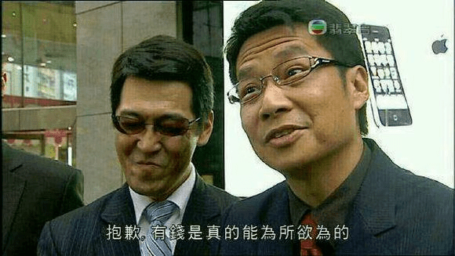

# 有个大胆的想法

作者：TYY

TID：25668

<title>1</title> <link href="../Styles/Style.css" type="text/css" rel="stylesheet">

# 1

为什么大家不众筹一下委托一些里番公司去动画化一些gts本子呢
<title>2</title> <link href="../Styles/Style.css" type="text/css" rel="stylesheet">

# 2

一集里番的成本价在 50万人民币 以上 <title>3</title> <link href="../Styles/Style.css" type="text/css" rel="stylesheet">

# 3

> [源青之绅 發表於 2018-8-11 13:15](https://giantessnight.cf/gnforum2012/forum.php?mod=redirect&goto=findpost&pid=384359&ptid=25668)
> 一集里番的成本价在 50万人民币 以上

打。。。。。。。。。。打扰了
<title>4</title> <link href="../Styles/Style.css" type="text/css" rel="stylesheet">

# 4

我看過那麼多動畫
我覺得動畫不一定比漫畫好
角度的問題 還有拍攝的方向不一定是我們喜歡的
我覺得最好的就是3D漫畫風格的動畫
這種最好也比較省錢
不然太少錢的作品品質會比3D動畫來的差
可能人物會歪曲到不忍直視
3D至少每一幀都不會歪
而且GTS存在已久的問題
GTS要福利會沒劇情
要劇情會沒福利
兩個都要有要大撒幣
又要每個暫停畫面都跟漫畫一樣 聲優又要好...
這...不知道要撒多少幣
<title>5</title> <link href="../Styles/Style.css" type="text/css" rel="stylesheet">

# 5

理想ˋ一點的想法是花錢請自己喜歡的繪師畫本子或單圖(其實就是IRY系列的製作方式).但前提是你得有門路跟....大把大把的銀子.

<ignore_js_op>

**抱歉，有钱是真的能为所欲为的.jpeg** *(41.99 KB, 下載次數: 0)*

[下載附件](forum.php?mod=attachment&aid=NzM2OTV8MjRjNWJhNzB8MTY3NDA2NzAzMXwxODIzMHwyNTY2OA%3D%3D&nothumb=yes)

2018-8-11 18:09 上傳

另外商業動畫化目前的極限大概就是老早以前的一吋法師了(那還是企畫票選出來的作品).而且不論是一寸法師還是OH!!マイクロマン這款打著GTS為主題的倫GAME.最終還是跳脫不了"正戲依舊是正常大小尺寸"的限制.但這是沒辦法的事情.GTS這屬性基本上就注定小眾了.且這不是推廣夠不夠力的問題.而是特殊性癖本來很難容於常識(你自己試想其他性癖屬性(獵奇.蟲姦.甚至是同門卻不同類的縮小女)你吃得下吃不下就能理解了).而公司創作基本上還是賺錢回收成本為主.所以要有一部或一款完全打到GTS點的作品我覺得是很難的.但不是沒有就是.一般向連載最好的實現方式就是類似之前的大攻者凪.用巨大女子格鬥當掩飾其實我覺得是很不錯的想法(可惜作者失敗了).而其他像是不久前完結的おにでか乃至目前進入重點的Gigant.能見度跟討論度其實也算不錯.至於R-18其實DMM的同人作品已經提供很好的銷售管道了.GTS系的作品比起十年前.不管是質與量都有顯著的成長.越來越多有能力的人對這圈子有興趣.自然創作也會增加.所以等吧.說不一定哪一天真的有機會看到真正意味上的GTS動畫/遊戲/漫畫作品.以上個人愚見.

<title>6</title> <link href="../Styles/Style.css" type="text/css" rel="stylesheet">

# 6

太贵了，大家众筹也很吃力，再说也没那么多人来 <title>7</title> <link href="../Styles/Style.css" type="text/css" rel="stylesheet">

# 7

其实我觉得，如果一个美术系毕业的gts爱好者就可以做到，只是创作时间需要久一些，毕竟是业余时间来做，不能养家糊口。 <title>8</title> <link href="../Styles/Style.css" type="text/css" rel="stylesheet">

# 8

> [j_lianwu 發表於 2018-8-12 12:14](https://giantessnight.cf/gnforum2012/forum.php?mod=redirect&goto=findpost&pid=384460&ptid=25668)
> 其实我觉得，如果一个美术系毕业的gts爱好者就可以做到，只是创作时间需要久一些，毕竟是业余时间来做，不 ...

一个人做，还是业余时间，真的要做一百年。。。动画的工作量大的难以想象
<title>9</title> <link href="../Styles/Style.css" type="text/css" rel="stylesheet">

# 9

*本帖最後由 phone2345 於 2018-8-13 02:37 編輯*

動畫公司必須要有利可圖才會執行動畫化的企劃，畢竟製作成本相當高，ˋ在盜版嚴重又難以從廣告或撥放收入等來源回收，因此小眾市場的主題幾乎是不可能成案的呢。
不過還是有特例就是了：

特例1：新海城等獨立製作者
當初他可是除了音樂以外，獨立完成了腳本、人物、作畫、剪輯等工作呢

特例2：東方Porject
這是一個有同人動畫卻沒有官方動畫的系列，雖然製作水準沒辦法跟公司比，但是也相當厲害了 <title>10</title> <link href="../Styles/Style.css" type="text/css" rel="stylesheet">

# 10

这种类型的，可能被和谐了，所以收入可能不多啊，公司估计不会太考虑 <title>11</title> <link href="../Styles/Style.css" type="text/css" rel="stylesheet">

# 11

制作工艺太麻烦了。。如果能实时渲染的话，可能有些帮助 <title>12</title> <link href="../Styles/Style.css" type="text/css" rel="stylesheet">

# 12

漫画有可能，但是动画难度太大，成本比你想的要高

3D是有可能的，利用公司的设备做渲染的话，不被抓到就可以，但是背景音乐和配音就GG了 <title>13</title> <link href="../Styles/Style.css" type="text/css" rel="stylesheet">

# 13

归根结底是钱的问题，这种东西毕竟是小众市场，做出来难赚钱 <title>14</title> <link href="../Styles/Style.css" type="text/css" rel="stylesheet">

# 14

这个成本太高了吧，市场怎么样，还不知道呢，很冒险的</ignore_js_op>