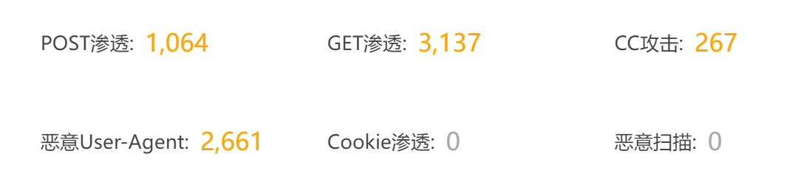

# 有些人就是见不得有人无偿分享资源

作者：ABC

TID：33343

<title>1</title> <link href="../Styles/Style.css" type="text/css" rel="stylesheet">

# 1

*本帖最後由 Lcxzyr 於 2022-5-29 20:52 編輯*

很多人都知道我搞了一个GTS资源分享站点，无偿而且公益的为大家提供服务

我这段时间频繁接到防火墙关于CC攻击的报警，以及一大堆脚本攻击的拦截通知

我想说的是，如果真要打我网站就打好了，反正我也不会去花钱升级服务器或者买高防啥的，我甚至不会花功夫去配置额外的防御措施

甚至更方便一点，你把花钱打我网站的钱给我，我把网站卖你拉倒

但如果真的有这么一天， 这个圈子真是烂透了

<ignore_js_op>

**屏幕截图 2022-05-29 204826.png** *(27.07 KB, 下載次數: 0)*

[下載附件](forum.php?mod=attachment&aid=OTY1MjN8ZTJjYzQ0ZDB8MTY3NDA2NTUyMHwxODIzMHwzMzM0Mw%3D%3D&nothumb=yes)

2022-5-29 20:52 上傳

<title>2</title> <link href="../Styles/Style.css" type="text/css" rel="stylesheet">

# 2

互联网精神已经死的差不多了，怀念我十二三岁的年纪，那是资源百花齐放的时代，是最接近知识与思想共产主义的时代 <title>3</title> <link href="../Styles/Style.css" type="text/css" rel="stylesheet">

# 3

花钱攻击公益网站？确实不知道图啥。一般免费资源反手举报至少成本低。这种长期烧钱攻击的还没见过。
难道是部分资源有版权问题？网站被传出去，但原作者不知道gn，联系不到楼主，才当成盗版网站攻击？ <title>4</title> <link href="../Styles/Style.css" type="text/css" rel="stylesheet">

# 4

所谓“拦人财路如杀人父母”，究竟倒卖盗版能有多大赚头，不好说 <title>5</title> <link href="../Styles/Style.css" type="text/css" rel="stylesheet">

# 5

公益网站有啥攻击的必要吗？？
打了能获得什么.. <title>6</title> <link href="../Styles/Style.css" type="text/css" rel="stylesheet">

# 6

我以我們網站是哪裡惹到誰了?非得要做這種無良的事?那些攻擊的人牠們賺到啥了? = =
<title>7</title> <link href="../Styles/Style.css" type="text/css" rel="stylesheet">

# 7

卖资源的利润居然大到能让他花钱来攻击吗。。。
感觉咱这圈子也不算大啊 <title>8</title> <link href="../Styles/Style.css" type="text/css" rel="stylesheet">

# 8

搞不懂，干这个事的人格局是真的小，也就这能靠倒卖这东西转烂钱了吧。但是，我见过有一些游戏的公益服务器，也同样莫名其妙遭到网络攻击，就不明白是为什么，纯粹为了好玩？就像有了弹弓总想找邻居家的玻璃试一试吧......... <title>9</title> <link href="../Styles/Style.css" type="text/css" rel="stylesheet">

# 9

所有倒卖 黄牛 都先死全家，分享东西你们赚不到钱就来气了是吧
还是你们先把别人东西下载下来，然后在举报了好自己卖呢？ <title>10</title> <link href="../Styles/Style.css" type="text/css" rel="stylesheet">

# 10

> Vanmilos 發表於 2022-5-30 01:01
> 所有倒卖 黄牛 都先死全家，分享东西你们赚不到钱就来气了是吧
> 还是你们先把别人东西下载下来，然后在举报 ...

有人直接卖我盘里东西的

¯\_(ツ)_/¯ <title>11</title> <link href="../Styles/Style.css" type="text/css" rel="stylesheet">

# 11

别的不说，倒卖资源的黄牛搞这种事去可能性最大，卸磨杀驴。善意永远是恶意攻击的目标_〆(´Д｀ ) <title>12</title> <link href="../Styles/Style.css" type="text/css" rel="stylesheet">

# 12

盲猜一手是那个人
不过也有可能是那几个魔怔基佬的恶意攻击，在b站搜一下相关的，然后看到有个基佬就在那硬蹭，标签给打个巨大娘，标题里整个非巨大娘，保证你百分百能搜到它，就和油管那个尼一样恶心 <title>13</title> <link href="../Styles/Style.css" type="text/css" rel="stylesheet">

# 13

两种可能。一，你损害了隔壁论坛或是QQ群某些贩卖盗版资源差价人的利益，所以要花钱攻击你的网站。二，你的网站流出的盗版资源损害了原作者的利益，但是那些作者可能并不知道gn，所以以为你的网站恶意盗版损害他们利益，所以花钱请人攻击你的网站 <title>14</title> <link href="../Styles/Style.css" type="text/css" rel="stylesheet">

# 14

如果是原作者的话可以DMCA啊，没必要DDCC <title>15</title> <link href="../Styles/Style.css" type="text/css" rel="stylesheet">

# 15

草 艾彩就有直接把免费分享的资源（有些是坛友刚刚自己翻译的漫画）放上去卖的，还贼贵 <title>16</title> <link href="../Styles/Style.css" type="text/css" rel="stylesheet">

# 16

> Chtholly 發表於 2022-5-30 21:53
> 如果是原作者的话可以DMCA啊，没必要DDCC

理论上来说给eu.org管理方发dmca，核实之后是可以直接扬域名的_(:з」∠)_ <title>17</title> <link href="../Styles/Style.css" type="text/css" rel="stylesheet">

# 17

倒卖资源的人实在太多了，之前那个被封的安若雨好像也在qq上倒卖资源，我自己刚入圈的时候也买过很多次免费资源，那些混蛋就看不惯免费分享资源的人，就想着自己捞一笔 <title>18</title> <link href="../Styles/Style.css" type="text/css" rel="stylesheet">

# 18

倒卖资源的人实在太多了，之前那个被封的安若雨好像也在qq上倒卖资源，我自己刚入圈的时候也买过很多次免费资源，那些混蛋就看不惯免费分享资源的人，就想着自己捞一笔 <title>19</title> <link href="../Styles/Style.css" type="text/css" rel="stylesheet">

# 19

哎 楼主肯定伤害了某些倒卖资源人的利益 心疼 <title>20</title> <link href="../Styles/Style.css" type="text/css" rel="stylesheet">

# 20

义气几钱斤嘛，能赚钱要什么良心  <title>21</title> <link href="../Styles/Style.css" type="text/css" rel="stylesheet">

# 21

不是搞网站的，随便bb两句：
ddos类的攻击确实狠，所以现在大家都用阿里云了，就是费用比较贵。。。
不知道能不能搞个自动化黑名单 <title>22</title> <link href="../Styles/Style.css" type="text/css" rel="stylesheet">

# 22

> ABC 發表於 2022-6-2 03:28
> 不是搞网站的，随便bb两句：
> ddos类的攻击确实狠，所以现在大家都用阿里云了，就是费用比较贵。。。
> 不知道 ...

其实也不尽然

我这次主要是cc，post/get渗透，不是dd
cc是可以软件拦截也可以硬抗
p/g渗透只能软件拦截
dd只能硬抗

dd硬抗主要需要高防服务器，阿里云普通机器没得高防，一攻击就会被阿里保护机制黑洞，所以dd阿里非高仿反而是比较容易的

另外ddos的第一个d就是分布式的意思，用一大堆机器实行dos攻击，所以黑名单是无效的
<title>23</title> <link href="../Styles/Style.css" type="text/css" rel="stylesheet">

# 23

> [Lcxzyr 發表於 2022-6-2 11:20](https://giantessnight.cf/gnforum2012/forum.php?mod=redirect&goto=findpost&pid=505110&ptid=33343)
> 其实也不尽然
> 
> 我这次主要是cc，post/get渗透，不是dd

我理解的cc也是ddos攻击的一种广义上的变种。另外我在论文上看到过有那种不完成handshake就可以预判的黑名单机制，虽然当时也只是看了摘要。。。 <title>24</title> <link href="../Styles/Style.css" type="text/css" rel="stylesheet">

# 24

> ABC 發表於 2022-6-2 17:28
> 我理解的cc也是ddos攻击的一种广义上的变种。另外我在论文上看到过有那种不完成handshake就可以预判的黑 ...

严格来说cc确实是dd的一种
现在习惯上好像一般打网页叫cc打IP叫dd <title>25</title> <link href="../Styles/Style.css" type="text/css" rel="stylesheet">

# 25

所以不一定是圈内人干的 说不定是被撒网的给网一下 毕竟只要数据挖到了就是可以赚的 <title>26</title> <link href="../Styles/Style.css" type="text/css" rel="stylesheet">

# 26

这种小众圈子 又是free网站 应该没得几个圈内人想不通挖窝边草的吧 <title>27</title> <link href="../Styles/Style.css" type="text/css" rel="stylesheet">

# 27

如果域名是公开的，可能是那种黑客在到处攻击，可以不用管，加强一下防护就行了。 <title>28</title> <link href="../Styles/Style.css" type="text/css" rel="stylesheet">

# 28

手里有些从DL买的patreon和fanbox赞助拿的资源，但是有些人收了后拿出去收费就很恶心 <title>29</title> <link href="../Styles/Style.css" type="text/css" rel="stylesheet">

# 29

确实感觉不一定是圈内人干的，毕竟市场也就这么小，不至于说抢多少饭碗吧。不过呢，这个站点，在哪呢，我没进去过额 <title>30</title> <link href="../Styles/Style.css" type="text/css" rel="stylesheet">

# 30

其实就在我签名里面233333333333333333</ignore_js_op>