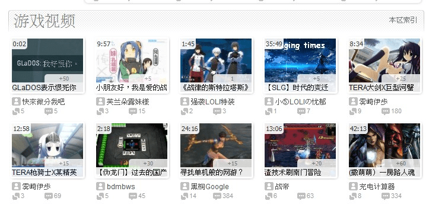

# 有人在bilibili上发了个缩小学院的视频

作者：xnr

TID：10171

<title>1</title> <link href="../Styles/Style.css" type="text/css" rel="stylesheet">

# 1

[http://www.bilibili.us/video/av92508/](http://www.bilibili.us/video/av92508/)
视频连接如上~
亮点神马的没有...
我只是很惊讶而已~
难道GTS要大众化了？ <title>2</title> <link href="../Styles/Style.css" type="text/css" rel="stylesheet">

# 2

GTS大眾化自重啊
另外也不要在評論彈幕裡賣萌

最後這樣真的沒問題嗎
投的那個人 元首叫你進來 <title>3</title> <link href="../Styles/Style.css" type="text/css" rel="stylesheet">

# 3

我们的东西扔哔哩哔哩上的话……
会被说变态的吧?
会被说变态的吧？
会被说变态的吧？

（飞踢踹向K9屁屁） <title>4</title> <link href="../Styles/Style.css" type="text/css" rel="stylesheet">

# 4

1\. 看标签和头像，应该是本论坛某同好贴出去的。
2\. 这个视频去年已经在ACFUN上发布过了。
3\. GTS圈内宅很多，因为宅是GTS同好的一大属性，我倒是想看看在宅网站（A、B站）中发布GTS视频会有什么反响。 <title>5</title> <link href="../Styles/Style.css" type="text/css" rel="stylesheet">

# 5

不用想了,晚上之前肯定被刷下去的
然後就等於沒出現過 <title>6</title> <link href="../Styles/Style.css" type="text/css" rel="stylesheet">

# 6

同看~~~话说这些都也是很久前在YOUTUBE就发上去了的，而AB站很多视频也都是在那里扒拉下来的…… <title>7</title> <link href="../Styles/Style.css" type="text/css" rel="stylesheet">

# 7

A站很早以前就发过了……
如果没记错的话
那视频没啥动静，甚至还不如某些精神猎奇向的RPGmaker作品的视频点击回复率高
平常人看来也就是一般的工口向游戏而已 <title>8</title> <link href="../Styles/Style.css" type="text/css" rel="stylesheet">

# 8

改版後沒啥動靜是正常表現

另外5月4日不是開始禁止福利嗎,這視頻真的能存活嗎喂... <title>9</title> <link href="../Styles/Style.css" type="text/css" rel="stylesheet">

# 9

A站当时的反映还算热烈，那几天经常能在首页看见，求游戏的也有一堆，弹幕也被刷满了。。。
吐槽基本就是，抖M，M，变态，当然还有叫好的。。。。。。
B站也差不多。不过点击啥的就低了些 <title>10</title> <link href="../Styles/Style.css" type="text/css" rel="stylesheet">

# 10

B站嗎? 因為改版看評分不看評論的綠故,早就沉了! <title>11</title> <link href="../Styles/Style.css" type="text/css" rel="stylesheet">

# 11

 <ignore_js_op>[QQ截&#22270;未命名.jpg](forum.php?mod=attachment&aid=MjQ1NTZ8M2ZhY2RiMGN8MTY3NDA2ODc5NHwxODIzMHwxMDE3MQ%3D%3D&nothumb=yes) *(87.15 KB, 下載次數: 0)*

[下載附件](forum.php?mod=attachment&aid=MjQ1NTZ8M2ZhY2RiMGN8MTY3NDA2ODc5NHwxODIzMHwxMDE3MQ%3D%3D&nothumb=yes)

2011-5-15 14:55 上傳  

</ignore_js_op> <title>12</title> <link href="../Styles/Style.css" type="text/css" rel="stylesheet">

# 12

这是A站的地址：
[http://124.228.254.229/html/game/20100814/127994.html](http://124.228.254.229/html/game/20100814/127994.html)

有号的人要不要再去顶顶看？ <title>13</title> <link href="../Styles/Style.css" type="text/css" rel="stylesheet">

# 13

两个站都有号表示不想干那么蛋痛的事...
GTS这东西大家心里都有点吧...
只是我们这帮人重一点... <title>14</title> <link href="../Styles/Style.css" type="text/css" rel="stylesheet">

# 14

重點都不是這些
而是 如果發到b站是想推廣的話 那是肯定沒用的 <title>15</title> <link href="../Styles/Style.css" type="text/css" rel="stylesheet">

# 15

视频已经被和谐了。。。 <title>16</title> <link href="../Styles/Style.css" type="text/css" rel="stylesheet">

# 16

沒有和諧 只是不讓非會員看而已 <title>17</title> <link href="../Styles/Style.css" type="text/css" rel="stylesheet">

# 17

话说那个不是我投的

本人只是想测试一下盗链的效果