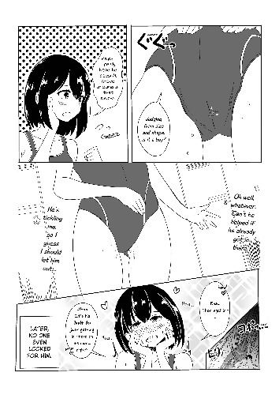
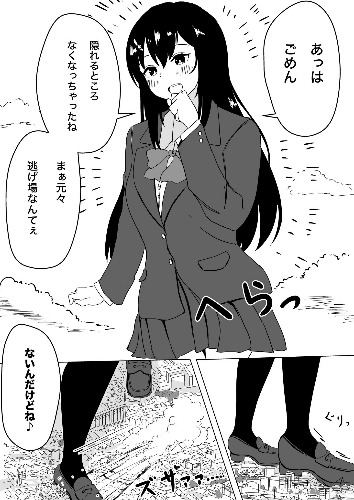

# 有人知道在哪里能看到piyonaf这个画家的作品吗？

作者：didi

TID：28020

<title>1</title> <link href="../Styles/Style.css" type="text/css" rel="stylesheet">

# 1

如图，最近在天真烂漫里有看到，风格很喜欢，但是推特好像看不了，有哪位大佬知道这个作者的其他作品吗？ <title>2</title> <link href="../Styles/Style.css" type="text/css" rel="stylesheet">

# 2

 <ignore_js_op>[231097.jpg](forum.php?mod=attachment&aid=ODEzMTN8ZDc0NWQxNmR8MTY3NDA2NjU4M3wxODIzMHwyODAyMA%3D%3D&nothumb=yes) *(61.09 KB, 下載次數: 0)*

[下載附件](forum.php?mod=attachment&aid=ODEzMTN8ZDc0NWQxNmR8MTY3NDA2NjU4M3wxODIzMHwyODAyMA%3D%3D&nothumb=yes)

2020-2-10 19:11 上傳  

</ignore_js_op> <ignore_js_op>[219199.jpg](forum.php?mod=attachment&aid=ODEzMTR8YzQzYjVkZGZ8MTY3NDA2NjU4M3wxODIzMHwyODAyMA%3D%3D&nothumb=yes) *(67.57 KB, 下載次數: 0)*

[下載附件](forum.php?mod=attachment&aid=ODEzMTR8YzQzYjVkZGZ8MTY3NDA2NjU4M3wxODIzMHwyODAyMA%3D%3D&nothumb=yes)

2020-2-10 19:12 上傳  

</ignore_js_op> <ignore_js_op>[227452.jpg](forum.php?mod=attachment&aid=ODEzMTV8NzA3MDdmOWF8MTY3NDA2NjU4M3wxODIzMHwyODAyMA%3D%3D&nothumb=yes) *(40.79 KB, 下載次數: 0)*

[下載附件](forum.php?mod=attachment&aid=ODEzMTV8NzA3MDdmOWF8MTY3NDA2NjU4M3wxODIzMHwyODAyMA%3D%3D&nothumb=yes)

2020-2-10 19:12 上傳  

</ignore_js_op> <ignore_js_op>[227451.jpg](forum.php?mod=attachment&aid=ODEzMTZ8NTc5OTg5NzZ8MTY3NDA2NjU4M3wxODIzMHwyODAyMA%3D%3D&nothumb=yes) *(50.67 KB, 下載次數: 0)*

[下載附件](forum.php?mod=attachment&aid=ODEzMTZ8NTc5OTg5NzZ8MTY3NDA2NjU4M3wxODIzMHwyODAyMA%3D%3D&nothumb=yes)

2020-2-10 19:12 上傳  

</ignore_js_op> <title>3</title> <link href="../Styles/Style.css" type="text/css" rel="stylesheet">

# 3

名字就是两个特别简单的日文字，天真烂漫里应该写着，他的推特早就不更新了，并且还锁上了，现在应该是专门画本子了，你不如去pixiv，也是同样的名字，里面有他之前的作品 <title>4</title> <link href="../Styles/Style.css" type="text/css" rel="stylesheet">

# 4

> 平板姬的欧派 發表於 2020-2-10 21:38
> 名字就是两个特别简单的日文字，天真烂漫里应该写着，他的推特早就不更新了，并且还锁上了，现在应该是专门 ...

多谢大佬，我找到了名字，ぴー，但是在p站找不到这个名字的用户，是改名了吗？ <title>5</title> <link href="../Styles/Style.css" type="text/css" rel="stylesheet">

# 5

原來不更新了 之前還想說怎突然把推特鎖了
倒是推特的melcara_kck 原因不明不讓我追蹤QQ <title>6</title> <link href="../Styles/Style.css" type="text/css" rel="stylesheet">

# 6

> [qazzaqjkl 發表於 2020-2-11 00:34](https://giantessnight.cf/gnforum2012/forum.php?mod=redirect&goto=findpost&pid=425631&ptid=28020)
> 多谢大佬，我找到了名字，ぴー，但是在p站找不到这个名字的用户，是改名了吗？ ...

看了下关注列表也没有这个作者了，现在我也不知道他是删了还是我当初忘关注他了_(:з」∠)_，你看看其他人谁关注他了，或者等推荐列表能刷出来，再或者他是真的全删完了
<title>7</title> <link href="../Styles/Style.css" type="text/css" rel="stylesheet">

# 7

> 平板姬的欧派 發表於 2020-2-11 09:53
> 看了下关注列表也没有这个作者了，现在我也不知道他是删了还是我当初忘关注他了_(:з」∠)_，你看看其他 ...

嗯，目前来看应该是真的都删了 <title>8</title> <link href="../Styles/Style.css" type="text/css" rel="stylesheet">

# 8

我早就知道这些大佬会一个一个退圈的，网络一点都不靠谱
[https://giantessnight.com/gnforu ... hread&tid=22226](https://giantessnight.com/gnforum2012/forum.php?mod=viewthread&tid=22226)
这个是备份，16/17年爬下来的，一个是Pixiv的，另外一个是twitter的
链接：[https://pan.baidu.com/s/1NuftgtBkWGIwCo9pEKvAWg](https://pan.baidu.com/s/1NuftgtBkWGIwCo9pEKvAWg)
提取码：6n6z

解压密码：giantessnight <title>9</title> <link href="../Styles/Style.css" type="text/css" rel="stylesheet">

# 9

> Dibdabdu 發表於 2020-2-11 15:34
> 我早就知道这些大佬会一个一个退圈的，网络一点都不靠谱
> https://giantessnight.com/gnforum2012/forum.php ...

天哪神人啊，这都可以提前备份的吗？太秀了，多谢大佬 <title>10</title> <link href="../Styles/Style.css" type="text/css" rel="stylesheet">

# 10

五 体 投 地
难道是春天到来了吗？万物复苏之际 <title>11</title> <link href="../Styles/Style.css" type="text/css" rel="stylesheet">

# 11

我這有個更全的

Pixiv是實時更新到他刪號爲止
Twitter到大概兩周前
不過我這邊只能傳Mega

[https://mega.nz/#!EB1nEAjD!4FeHpsEGEleIPGOFBf4iFmZUIxz3lv6MYoOkky87Eyw](https://mega.nz/#!EB1nEAjD!4FeHpsEGEleIPGOFBf4iFmZUIxz3lv6MYoOkky87Eyw)
密碼: bibun_kanou

<title>12</title> <link href="../Styles/Style.css" type="text/css" rel="stylesheet">

# 12

> [sidefx 發表於 2020-2-13 06:53](https://giantessnight.cf/gnforum2012/forum.php?mod=redirect&goto=findpost&pid=425957&ptid=28020)
> 我這有個更全的
> 
> Pixiv是實時更新到他刪號爲止

谢谢大佬，都是神仙呀！ <title>13</title> <link href="../Styles/Style.css" type="text/css" rel="stylesheet">

# 13

> sidefx 發表於 2020-2-13 06:53
> 我這有個更全的
> 
> Pixiv是實時更新到他刪號爲止

感谢大佬，但是为啥我下过来解压密码不对啊？ <title>14</title> <link href="../Styles/Style.css" type="text/css" rel="stylesheet">

# 14

> [qazzaqjkl 發表於 2020-2-13 14:49](https://giantessnight.cf/gnforum2012/forum.php?mod=redirect&goto=findpost&pid=425993&ptid=28020)
> 感谢大佬，但是为啥我下过来解压密码不对啊？

呃，我这里可以打开啊？

你换一个解压软件试一下？ WinRAR应该可以。

<title>15</title> <link href="../Styles/Style.css" type="text/css" rel="stylesheet">

# 15

> sidefx 發表於 2020-2-13 06:53
> 我這有個更全的
> 
> Pixiv是實時更新到他刪號爲止

哦哦密码是对的，估计是下载的时候出来问题，现在已经可以了，多谢大佬