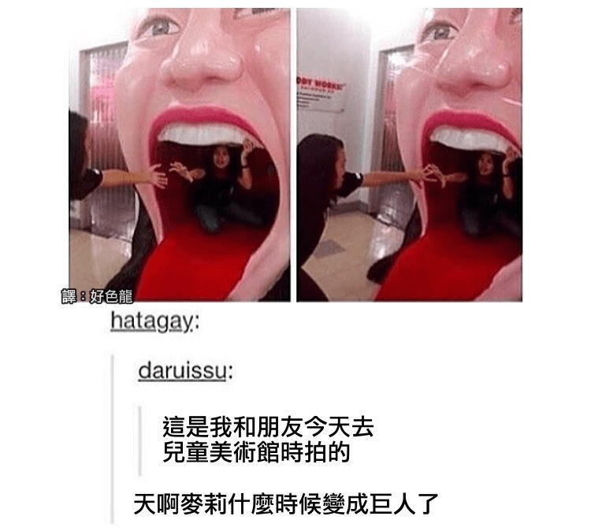

# 有人知道這是哪裡嗎

作者：marchs24145

TID：21126

<title>1</title> <link href="../Styles/Style.css" type="text/css" rel="stylesheet">

# 1

今天偶然看到的
雖然模型沒特別精緻，不過滿好奇是什麼地方會有這種展示
以前只有看過大猩猩張嘴的

<title>2</title> <link href="../Styles/Style.css" type="text/css" rel="stylesheet">

# 2

 <ignore_js_op>[12_titan.jpg](forum.php?mod=attachment&aid=NjE0NTZ8MDQxNGUwNzN8MTY3NDA2ODAxOXwxODIzMHwyMTEyNg%3D%3D&nothumb=yes) *(60.77 KB, 下載次數: 14)*

[下載附件](forum.php?mod=attachment&aid=NjE0NTZ8MDQxNGUwNzN8MTY3NDA2ODAxOXwxODIzMHwyMTEyNg%3D%3D&nothumb=yes)

2016-5-24 18:21 上傳  

</ignore_js_op> <title>3</title> <link href="../Styles/Style.css" type="text/css" rel="stylesheet">

# 3

好像也就是幼儿园的话滑滑梯把。 <title>4</title> <link href="../Styles/Style.css" type="text/css" rel="stylesheet">

# 4

……等等这是儿童美术馆？！ <title>5</title> <link href="../Styles/Style.css" type="text/css" rel="stylesheet">

# 5

儿童美术馆！？这一幅童年阴影的样子... <title>6</title> <link href="../Styles/Style.css" type="text/css" rel="stylesheet">

# 6

所以把这个放在儿童艺术馆的人是怎么想的 <title>7</title> <link href="../Styles/Style.css" type="text/css" rel="stylesheet">

# 7

所以我說麥莉是哪一位? <title>8</title> <link href="../Styles/Style.css" type="text/css" rel="stylesheet">

# 8

麥莉就是麦莉么