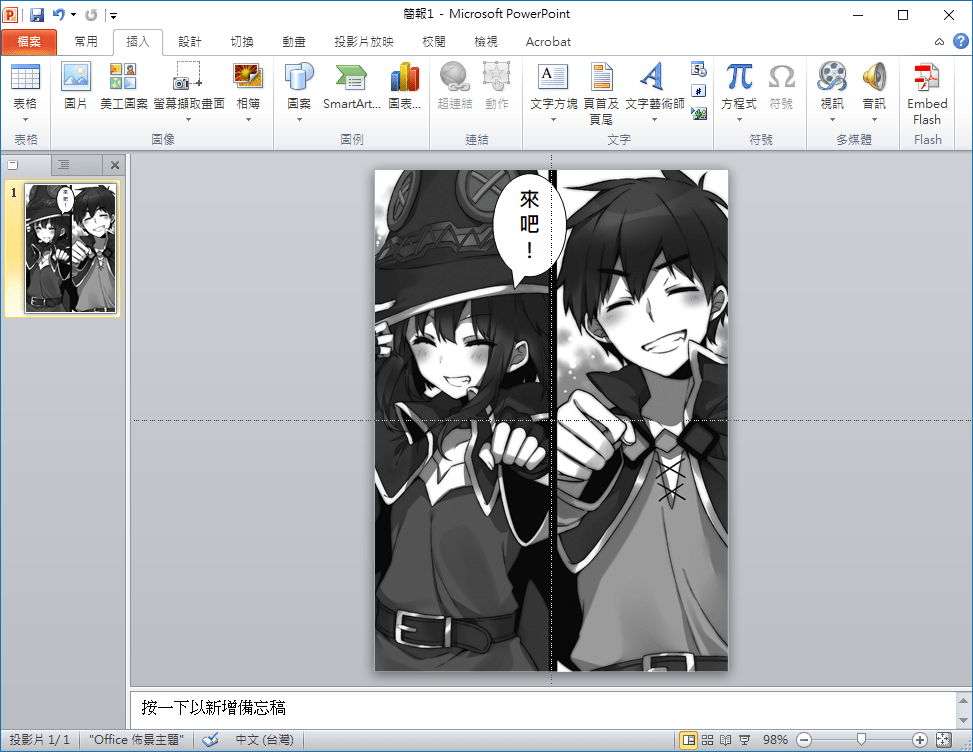

# 有什么好的嵌字软件

作者：2676350177

TID：25466

<title>1</title> <link href="../Styles/Style.css" type="text/css" rel="stylesheet">

# 1

如题，想个人翻译一个本子，但找不到好的嵌字软件 <title>2</title> <link href="../Styles/Style.css" type="text/css" rel="stylesheet">

# 2

如果你要專業版的嵌字軟體，可以考慮Adobe 系列的indesign / Illustrator / Photoshop
如果只有幾頁的話，用簡報製作軟體也可以，例如Microsoft PowerPoint
效果大概像這樣：
<ignore_js_op>

**嵌字.png** *(269.09 KB, 下載次數: 0)*

[下載附件](forum.php?mod=attachment&aid=NzMwODN8NjNjYjk2NjF8MTY3NDA2NzA2N3wxODIzMHwyNTQ2Ng%3D%3D&nothumb=yes)

2018-7-1 17:48 上傳

<title>3</title> <link href="../Styles/Style.css" type="text/css" rel="stylesheet">

# 3

嵌字我做了這麼久，唯一推薦就是PS (photo shop)
他是一個很適合拿來對圖片做後製的程式
嵌字排版也很方便
而且不會影響圖片格式(真的受不了論壇一堆pdf、word檔案)
其他的我一律不推薦</ignore_js_op>