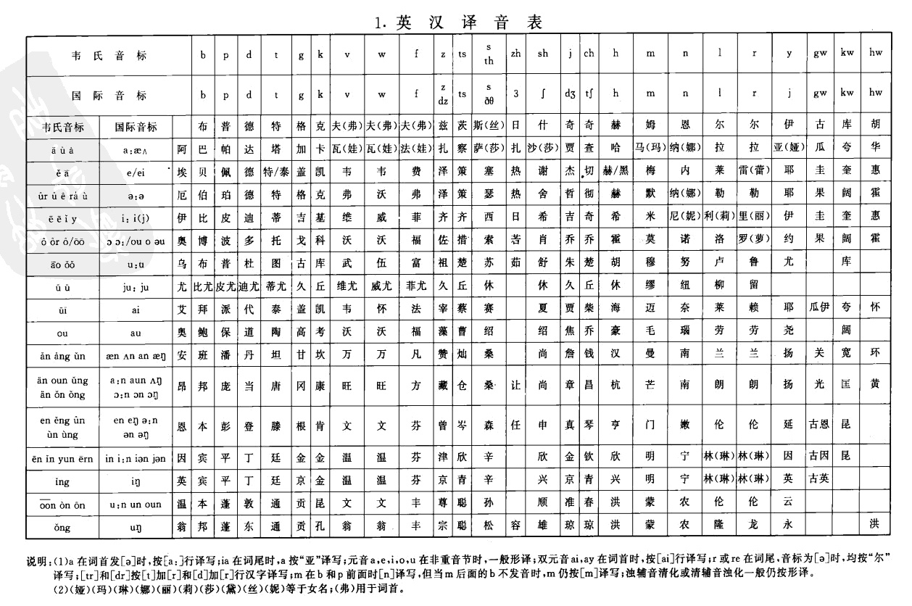

# 有偿征集一个名字的翻译

作者：猫头咕咕鹰

TID：29398

<title>1</title> <link href="../Styles/Style.css" type="text/css" rel="stylesheet">

# 1

*本帖最後由 猫头咕咕鹰 於 2020-9-7 00:14 編輯*

这是位作为第三女主角出现在《魔王克拉娜》系列里的角色，初登场于系列的第十三话（我刚翻到第四话，现在就去想她的译名是不是早了那么亿点点啊）。这位小姐姐的身份比较特殊，她原本是个人类，但是由于13话主线剧情里发生的事故被意外的变成了魔王体质，也因此而得以巨大化，不过她的内心仍然保有着身为人类时的温柔和价值观。
她的名字日文写作“マウ”，英文则是“Mau”，现在想为她征集一个中文译名，目前已经有两个备选方案了，但是为了不限制各位的思维边界，所以暂不放出，我想等收集几个译名之后再组织一个投票，最终译名则由各位投票决定。至于报酬……咱作为一个待业人员，暂时是拿不出钱来了，只能肉偿……不对，只能拿一次点餐机会当做报酬了。我会用最高优先级帮最后被选上的译名的提供者机翻+润色一篇文章（虽然不限内容，但是希望是口味能轻一点啊）。
以下为マウ（Mau）的人设图。
已截止，谢谢参与。

<title>2</title> <link href="../Styles/Style.css" type="text/css" rel="stylesheet">

# 2

 <ignore_js_op>[ci12.jpg](forum.php?mod=attachment&aid=ODQ4OTV8NDE5Nzk1ZGF8MTY3NDA2ODU3MnwxODIzMHwyOTM5OA%3D%3D&nothumb=yes) *(571.27 KB, 下載次數: 5)*

[下載附件](forum.php?mod=attachment&aid=ODQ4OTV8NDE5Nzk1ZGF8MTY3NDA2ODU3MnwxODIzMHwyOTM5OA%3D%3D&nothumb=yes)

2020-8-31 22:20 上傳  

</ignore_js_op> <title>3</title> <link href="../Styles/Style.css" type="text/css" rel="stylesheet">

# 3

直接音译“玛雾”怎么样，显得很可爱… <title>4</title> <link href="../Styles/Style.css" type="text/css" rel="stylesheet">

# 4

*本帖最後由 racer0725 於 2020-9-1 20:13 編輯*

可以用英汉译音表翻译成玛尤
或
玛雾

我跟你说，这个表格超好玩的。
<ignore_js_op>

**v2-6291de8fe2d629896d0533e9f87b3891_1440w.jpg** *(368.37 KB, 下載次數: 0)*

[下載附件](forum.php?mod=attachment&aid=ODQ5MjB8MTk1OGY1ZDh8MTY3NDA2ODU3MnwxODIzMHwyOTM5OA%3D%3D&nothumb=yes)

2020-9-1 20:04 上傳

<title>5</title> <link href="../Styles/Style.css" type="text/css" rel="stylesheet">

# 5

“麻舞”？
“舞”可以勉强对上”ま(い)“ <title>6</title> <link href="../Styles/Style.css" type="text/css" rel="stylesheet">

# 6

如果是mao的话可以翻译成真央，mau的话不清楚怎么念哎 <title>7</title> <link href="../Styles/Style.css" type="text/css" rel="stylesheet">

# 7

不如叫
馬鹿（日语）
（逃 <title>8</title> <link href="../Styles/Style.css" type="text/css" rel="stylesheet">

# 8

虽然估计用不上，还是列举一下吧，
日文可以念作まう的一些名字：

舞羽、舞優；
茉生、茉雨；
真雨、真羽；
麻羽、麻優
<title>9</title> <link href="../Styles/Style.css" type="text/css" rel="stylesheet">

# 9

玛奥？可以试试（我瞎说的）</ignore_js_op>