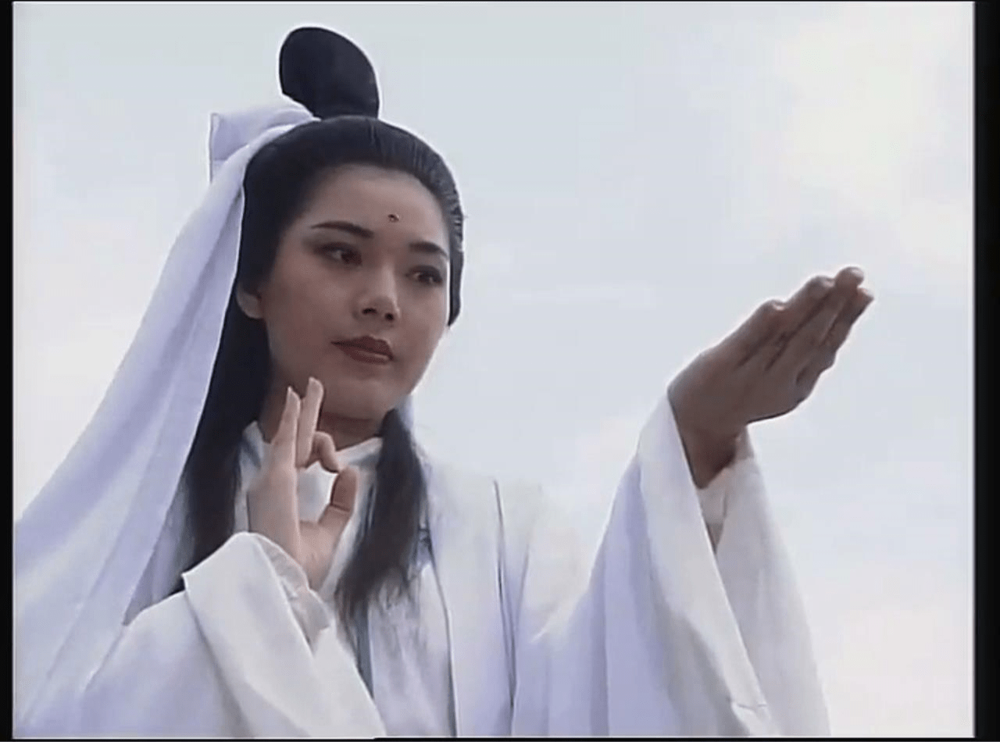

# 有几个人还记得这些难得的老国产GTS片段

作者：changshazxk

TID：21768

<title>1</title> <link href="../Styles/Style.css" type="text/css" rel="stylesheet">

# 1

*本帖最後由 NZ2012 於 2016-9-6 17:29 編輯*

以下截图为楼主小时候看的电视剧，现在看来是有些插边球,不过算是楼主的GTS启蒙.现在看来是满满的回忆.请问你们还记得你们第一次看到GTS镜头的时候吗？记得欲望被唤醒的那一刻吗？

<title>2</title> <link href="../Styles/Style.css" type="text/css" rel="stylesheet">

# 2

 <ignore_js_op>[Da mo 2.png](forum.php?mod=attachment&aid=NjM4ODh8NWJkYmE0OTh8MTY3NDA2NzgwMXwxODIzMHwyMTc2OA%3D%3D&nothumb=yes) *(2.69 MB, 下載次數: 27)*

[下載附件](forum.php?mod=attachment&aid=NjM4ODh8NWJkYmE0OTh8MTY3NDA2NzgwMXwxODIzMHwyMTc2OA%3D%3D&nothumb=yes)

2016-9-6 17:17 上傳  

达摩祖师中的女鬼

</ignore_js_op>  <ignore_js_op>[Da mo 3.png](forum.php?mod=attachment&aid=NjM4ODl8YTZmM2U2MTB8MTY3NDA2NzgwMXwxODIzMHwyMTc2OA%3D%3D&nothumb=yes) *(2.62 MB, 下載次數: 9)*

[下載附件](forum.php?mod=attachment&aid=NjM4ODl8YTZmM2U2MTB8MTY3NDA2NzgwMXwxODIzMHwyMTc2OA%3D%3D&nothumb=yes)

2016-9-6 17:17 上傳  

缩小

</ignore_js_op>  <ignore_js_op>[Da Mo.png](forum.php?mod=attachment&aid=NjM4OTB8NGZjNWQ2OGZ8MTY3NDA2NzgwMXwxODIzMHwyMTc2OA%3D%3D&nothumb=yes) *(2.69 MB, 下載次數: 6)*

[下載附件](forum.php?mod=attachment&aid=NjM4OTB8NGZjNWQ2OGZ8MTY3NDA2NzgwMXwxODIzMHwyMTc2OA%3D%3D&nothumb=yes)

2016-9-6 17:17 上傳  

达摩祖师中的女鬼2

</ignore_js_op>  <ignore_js_op>[莲花童子哪吒.png](forum.php?mod=attachment&aid=NjM4OTF8Mzk2YzE0ODR8MTY3NDA2NzgwMXwxODIzMHwyMTc2OA%3D%3D&nothumb=yes) *(2.3 MB, 下載次數: 4)*

[下載附件](forum.php?mod=attachment&aid=NjM4OTF8Mzk2YzE0ODR8MTY3NDA2NzgwMXwxODIzMHwyMTc2OA%3D%3D&nothumb=yes)

2016-9-6 17:17 上傳  

莲花童子哪吒1

</ignore_js_op>  <ignore_js_op>[莲花童子哪吒2.png](forum.php?mod=attachment&aid=NjM4OTJ8OGY1MTk2MmJ8MTY3NDA2NzgwMXwxODIzMHwyMTc2OA%3D%3D&nothumb=yes) *(2.46 MB, 下載次數: 6)*

[下載附件](forum.php?mod=attachment&aid=NjM4OTJ8OGY1MTk2MmJ8MTY3NDA2NzgwMXwxODIzMHwyMTc2OA%3D%3D&nothumb=yes)

2016-9-6 17:17 上傳  

莲花童子哪吒2

</ignore_js_op> <title>3</title> <link href="../Styles/Style.css" type="text/css" rel="stylesheet">

# 3

西游记的孙悟空铁扇公主 <title>4</title> <link href="../Styles/Style.css" type="text/css" rel="stylesheet">

# 4

达摩后面是不是还有配角被水晶球缩小有GT的 年代太久记不清了。 <title>5</title> <link href="../Styles/Style.css" type="text/css" rel="stylesheet">

# 5

是不是这个？

<ignore_js_op> [莲花童子哪吒.mp4](forum.php?mod=attachment&aid=NjM4OTR8OTQ4MTBkOWR8MTY3NDA2NzgwMXwxODIzMHwyMTc2OA%3D%3D) *(41.65 MB, 下載次數: 2051)* 2016-9-6 19:02 上傳點擊文件名下載附件

<ignore_js_op> [达摩祖师.mp4](forum.php?mod=attachment&aid=NjM4OTN8YWJjNDM3OTl8MTY3NDA2NzgwMXwxODIzMHwyMTc2OA%3D%3D) *(35.26 MB, 下載次數: 1556)* 2016-9-6 18:59 上傳點擊文件名下載附件

<title>6</title> <link href="../Styles/Style.css" type="text/css" rel="stylesheet">

# 6

好美的观音娘娘
《白蛇后传之人间有爱》
<ignore_js_op>

**暴风截图2016961389048.jpg** *(227.63 KB, 下載次數: 0)*

[下載附件](forum.php?mod=attachment&aid=NjM5MDN8MzZhZjdiYzF8MTY3NDA2NzgwMXwxODIzMHwyMTc2OA%3D%3D&nothumb=yes)

2016-9-6 19:15 上傳

<ignore_js_op>

**暴风截图2016961408845.jpg** *(215.12 KB, 下載次數: 0)*

[下載附件](forum.php?mod=attachment&aid=NjM5MDR8OGU0YjMyMzN8MTY3NDA2NzgwMXwxODIzMHwyMTc2OA%3D%3D&nothumb=yes)

2016-9-6 19:15 上傳

<ignore_js_op>

**暴风截图2016961418017.jpg** *(242.01 KB, 下載次數: 0)*

[下載附件](forum.php?mod=attachment&aid=NjM5MDV8OGQzMGQxN2J8MTY3NDA2NzgwMXwxODIzMHwyMTc2OA%3D%3D&nothumb=yes)

2016-9-6 19:15 上傳

<ignore_js_op>

**暴风截图2016961424101.jpg** *(267.18 KB, 下載次數: 0)*

[下載附件](forum.php?mod=attachment&aid=NjM5MDZ8ZTJlYmNjMTN8MTY3NDA2NzgwMXwxODIzMHwyMTc2OA%3D%3D&nothumb=yes)

2016-9-6 19:15 上傳

<ignore_js_op>

**暴风截图2016961429967.jpg** *(256.16 KB, 下載次數: 0)*

[下載附件](forum.php?mod=attachment&aid=NjM5MDd8MTk1YTFmNTR8MTY3NDA2NzgwMXwxODIzMHwyMTc2OA%3D%3D&nothumb=yes)

2016-9-6 19:15 上傳

<ignore_js_op>

**暴风截图2016961462852.jpg** *(272.18 KB, 下載次數: 0)*

[下載附件](forum.php?mod=attachment&aid=NjM5MDh8YThlNjlmMjR8MTY3NDA2NzgwMXwxODIzMHwyMTc2OA%3D%3D&nothumb=yes)

2016-9-6 19:15 上傳

<title>7</title> <link href="../Styles/Style.css" type="text/css" rel="stylesheet">

# 7

哇哦，没看过。我去看看，就喜欢这种古风·的， <title>8</title> <link href="../Styles/Style.css" type="text/css" rel="stylesheet">

# 8

> [斯佳摩妮 發表於 2016-9-6 19:16](https://giantessnight.cf/gnforum2012/forum.php?mod=redirect&goto=findpost&pid=307607&ptid=21768)
> 好美的观音娘娘
> 《白蛇后传之人间有爱》

扫兴的说一句，理论上观音是男的。。。
<title>9</title> <link href="../Styles/Style.css" type="text/css" rel="stylesheet">

# 9

> [田棒棒 發表於 2016-9-6 19:51](https://giantessnight.cf/gnforum2012/forum.php?mod=redirect&goto=findpost&pid=307614&ptid=21768)
> 记得佛和菩萨已经可以不男不女，不然这么说如来不是也擦边了

女版如来也是有的 <title>10</title> <link href="../Styles/Style.css" type="text/css" rel="stylesheet">

# 10

> [斯佳摩妮 發表於 2016-9-6 19:16](https://giantessnight.cf/gnforum2012/forum.php?mod=redirect&goto=findpost&pid=307607&ptid=21768)
> 好美的观音娘娘
> 《白蛇后传之人间有爱》

不错不错！非常喜欢！求还有没有类似的国产电视剧的GTS镜头呢？
<title>11</title> <link href="../Styles/Style.css" type="text/css" rel="stylesheet">

# 11

哈哈哈~~很好啊！！这个帖子！！还有没有泪类似的镜头!!! <title>12</title> <link href="../Styles/Style.css" type="text/css" rel="stylesheet">

# 12

> [斯佳摩妮 發表於 2016-9-6 19:16](https://giantessnight.cf/gnforum2012/forum.php?mod=redirect&goto=findpost&pid=307607&ptid=21768)
> 好美的观音娘娘
> 《白蛇后传之人间有爱》

还有吗还有吗  太赞啦！！哈哈
<title>13</title> <link href="../Styles/Style.css" type="text/css" rel="stylesheet">

# 13

希望还有这些镜头，动画片我记得也有不少吧 <title>14</title> <link href="../Styles/Style.css" type="text/css" rel="stylesheet">

# 14

都看过，我记得还有个什么封神榜？ <title>15</title> <link href="../Styles/Style.css" type="text/css" rel="stylesheet">

# 15

> [xnr 發表於 2016-9-7 01:58](https://giantessnight.cf/gnforum2012/forum.php?mod=redirect&goto=findpost&pid=307676&ptid=21768)
> 不错不错！非常喜欢！求还有没有类似的国产电视剧的GTS镜头呢？

难得你夸我一回呢，这个算不算脑补？
<ignore_js_op> [粵語長片-猩猩王大鬧天宮(1959).mp4](forum.php?mod=attachment&aid=NjM5MTN8NTUyOGI5MjV8MTY3NDA2Nzg1MnwxODIzMHwyMTc2OA%3D%3D) *(6.66 MB, 下載次數: 90)* 2016-9-7 20:33 上傳點擊文件名下載附件
不知道这个算不算
<title>16</title> <link href="../Styles/Style.css" type="text/css" rel="stylesheet">

# 16

> [changshazxk 發表於 2016-9-7 11:14](https://giantessnight.cf/gnforum2012/forum.php?mod=redirect&goto=findpost&pid=307692&ptid=21768)
> 还有吗还有吗  太赞啦！！哈哈

这个算不？
<ignore_js_op>

**暴风截图2016971418953.jpg** *(137.07 KB, 下載次數: 0)*

[下載附件](forum.php?mod=attachment&aid=NjM5MTR8ZjRjMGU1NWJ8MTY3NDA2Nzg1MnwxODIzMHwyMTc2OA%3D%3D&nothumb=yes)

2016-9-7 20:42 上傳

<title>17</title> <link href="../Styles/Style.css" type="text/css" rel="stylesheet">

# 17

《仙剑奇侠传》里的小石头，想必大家都看过吧。
太可爱了！

<ignore_js_op>

**(bbgyy.net_仙剑奇侠13.rmvb)[00.07.59.737].jpg** *(27.13 KB, 下載次數: 0)*

[下載附件](forum.php?mod=attachment&aid=NjM5MjV8MWI0MTVkM2R8MTY3NDA2Nzg1MnwxODIzMHwyMTc2OA%3D%3D&nothumb=yes)

2016-9-7 21:31 上傳

<ignore_js_op>

**(bbgyy.net_仙剑奇侠13.rmvb)[00.21.06.468].jpg** *(21.24 KB, 下載次數: 0)*

[下載附件](forum.php?mod=attachment&aid=NjM5MjZ8ZDFhYjE1YmF8MTY3NDA2Nzg1MnwxODIzMHwyMTc2OA%3D%3D&nothumb=yes)

2016-9-7 21:31 上傳

<ignore_js_op>

**(bbgyy.net_仙剑奇侠13.rmvb)[00.37.57.472].jpg** *(18.26 KB, 下載次數: 0)*

[下載附件](forum.php?mod=attachment&aid=NjM5Mjd8NWE2MjY5YWN8MTY3NDA2Nzg1MnwxODIzMHwyMTc2OA%3D%3D&nothumb=yes)

2016-9-7 21:31 上傳

链接：[http://pan.baidu.com/s/1ge2FDb9](http://pan.baidu.com/s/1ge2FDb9) 密码：n4no

此链接附带《白蛇后传人间有爱》第三集
<title>18</title> <link href="../Styles/Style.css" type="text/css" rel="stylesheet">

# 18

> [斯佳摩妮 發表於 2016-9-7 20:42](https://giantessnight.cf/gnforum2012/forum.php?mod=redirect&goto=findpost&pid=307738&ptid=21768)
> 这个算不？

  这是什么作品啊，也是观音手中么
<title>19</title> <link href="../Styles/Style.css" type="text/css" rel="stylesheet">

# 19

> [斯佳摩妮 發表於 2016-9-7 20:34](https://giantessnight.cf/gnforum2012/forum.php?mod=redirect&goto=findpost&pid=307737&ptid=21768)
> 难得你夸我一回呢，这个算不算脑补？

  这个视频不好下，网上找了YOUKU的，在多少分钟左右啊
<title>20</title> <link href="../Styles/Style.css" type="text/css" rel="stylesheet">

# 20

> [wuliaojianke 發表於 2016-9-7 22:29](https://giantessnight.cf/gnforum2012/forum.php?mod=redirect&goto=findpost&pid=307756&ptid=21768)
> 这是什么作品啊，也是观音手中么

  这是哪部大作啊，请问，有名字么
<title>21</title> <link href="../Styles/Style.css" type="text/css" rel="stylesheet">

# 21

> [changshazxk 發表於 2016-9-7 11:14](https://giantessnight.cf/gnforum2012/forum.php?mod=redirect&goto=findpost&pid=307692&ptid=21768)
> 还有吗还有吗  太赞啦！！哈哈

看不到啊  具体一点可以吗
<title>22</title> <link href="../Styles/Style.css" type="text/css" rel="stylesheet">

# 22

> [斯佳摩妮 發表於 2016-9-7 20:42](https://giantessnight.cf/gnforum2012/forum.php?mod=redirect&goto=findpost&pid=307738&ptid=21768)
> 这个算不？

晕 啊~~这是哪部啊  是什么作品~~
<title>23</title> <link href="../Styles/Style.css" type="text/css" rel="stylesheet">

# 23

> [斯佳摩妮 發表於 2016-9-6 19:04](https://giantessnight.cf/gnforum2012/forum.php?mod=redirect&goto=findpost&pid=307606&ptid=21768)
> 是不是这个？

如果我没有记错的话，赵雅芝版的白娘子传奇，也有缩小人在手上的镜头，但是忘了是第几集了，你有资源吗？谢谢~！
<title>24</title> <link href="../Styles/Style.css" type="text/css" rel="stylesheet">

# 24

> [xnr 發表於 2016-9-9 22:43](https://giantessnight.cf/gnforum2012/forum.php?mod=redirect&goto=findpost&pid=307975&ptid=21768)
> 如果我没有记错的话，赵雅芝版的白娘子传奇，也有缩小人在手上的镜头，但是忘了是第几集了，你有资源吗？ ...

应该是青姑娘把五个衙役的灵魂收在掌中的镜头吧，忘了第几集了。
好像还有蜈蚣精钻进胭脂盒卧底在白素贞枕边
再就是观音娘娘用净瓶收了小青和那个什么法王的镜头，不知道算不算
<title>25</title> <link href="../Styles/Style.css" type="text/css" rel="stylesheet">

# 25

> [斯佳摩妮 發表於 2016-9-10 09:08](https://giantessnight.cf/gnforum2012/forum.php?mod=redirect&goto=findpost&pid=308008&ptid=21768)
> 应该是青姑娘把五个衙役的灵魂收在掌中的镜头吧，忘了第几集了。
> 好像还有蜈蚣精钻进胭脂盒卧底在白素贞 ...

是不是在中后期啊？？？
另外还有哪部电视剧有缩小的内容？？

春光灿烂猪八戒是不是也有啊？？
<title>26</title> <link href="../Styles/Style.css" type="text/css" rel="stylesheet">

# 26

> [xnr 發表於 2016-9-12 23:52](https://giantessnight.cf/gnforum2012/forum.php?mod=redirect&goto=findpost&pid=308294&ptid=21768)
> 是不是在中后期啊？？？
> 另外还有哪部电视剧有缩小的内容？？

观音收妖应该是中后期吧，春光灿烂猪八戒应该没有
喜气洋洋猪八戒里好像有猪八戒被小仙女铁扫收进葫芦里的情节
<title>27</title> <link href="../Styles/Style.css" type="text/css" rel="stylesheet">

# 27

*本帖最後由 xnr 於 2016-9-23 01:23 編輯*

> [斯佳摩妮 發表於 2016-9-13 19:57](https://giantessnight.cf/gnforum2012/forum.php?mod=redirect&goto=findpost&pid=308336&ptid=21768)
> 观音收妖应该是中后期吧，春光灿烂猪八戒应该没有
> 喜气洋洋猪八戒里好像有猪八戒被小仙女铁扫收进葫芦里 ...

还有没有其他有缩小和互动的内容啊？缩小女也行

有观音和女娲娘娘的电视剧，是不是或多或少都会有一些GTS呢？
<title>28</title> <link href="../Styles/Style.css" type="text/css" rel="stylesheet">

# 28

> [xnr 發表於 2016-9-23 01:16](https://giantessnight.cf/gnforum2012/forum.php?mod=redirect&goto=findpost&pid=309233&ptid=21768)
> 还有没有其他有缩小和互动的内容啊？缩小女也行
> 
> 有观音和女娲娘娘的电视剧，是不是或多或少都会有一些GTS ...

不晓得撒，慢慢观察吧，相信会有的。大概邵氏电影里会有，我就记得《新孙悟空七十二变》里有观音把惠岸行者收进净瓶的镜头。
《盘丝洞》里有个蜘蛛精也用瓶子收过唐僧。
<title>29</title> <link href="../Styles/Style.css" type="text/css" rel="stylesheet">

# 29

我的启蒙是海底小精灵和羚羊号历险记 <title>30</title> <link href="../Styles/Style.css" type="text/css" rel="stylesheet">

# 30

这些都是很多年以前的了吧  
<title>31</title> <link href="../Styles/Style.css" type="text/css" rel="stylesheet">

# 31

具体是哪一集  可以告诉我吗  或者是多少分钟 <title>32</title> <link href="../Styles/Style.css" type="text/css" rel="stylesheet">

# 32

> [斯佳摩妮 發表於 2016-9-23 08:29](https://giantessnight.cf/gnforum2012/forum.php?mod=redirect&goto=findpost&pid=309237&ptid=21768)
> 不晓得撒，慢慢观察吧，相信会有的。大概邵氏电影里会有，我就记得《新孙悟空七十二变》里有观音把惠岸行 ...

具体什么时候啊~~求告知
<title>33</title> <link href="../Styles/Style.css" type="text/css" rel="stylesheet">

# 33

> [changshazxk 發表於 2016-9-25 10:26](https://giantessnight.cf/gnforum2012/forum.php?mod=redirect&goto=findpost&pid=309484&ptid=21768)
> 具体什么时候啊~~求告知

我可说不好，仔细找找吧，网上应该有 <title>34</title> <link href="../Styles/Style.css" type="text/css" rel="stylesheet">

# 34

*本帖最後由 NZ2012 於 2016-9-26 09:02 編輯*

其实有人提到的西游记系列，在邵氏1966年的《铁扇公主》里也有，下面是两个截图 <title>35</title> <link href="../Styles/Style.css" type="text/css" rel="stylesheet">

# 35

 <ignore_js_op>[tie shan gong zhu 2.png](forum.php?mod=attachment&aid=NjQzNTh8MmFmMDVlZGZ8MTY3NDA2Nzg2MXwxODIzMHwyMTc2OA%3D%3D&nothumb=yes) *(2.9 MB, 下載次數: 0)*

[下載附件](forum.php?mod=attachment&aid=NjQzNTh8MmFmMDVlZGZ8MTY3NDA2Nzg2MXwxODIzMHwyMTc2OA%3D%3D&nothumb=yes)

2016-9-26 08:43 上傳  

</ignore_js_op> <ignore_js_op>[tie shan gong zhu.png](forum.php?mod=attachment&aid=NjQzNTl8MzExMGYyMWR8MTY3NDA2Nzg2MXwxODIzMHwyMTc2OA%3D%3D&nothumb=yes) *(2.87 MB, 下載次數: 0)*

[下載附件](forum.php?mod=attachment&aid=NjQzNTl8MzExMGYyMWR8MTY3NDA2Nzg2MXwxODIzMHwyMTc2OA%3D%3D&nothumb=yes)

2016-9-26 08:43 上傳  

</ignore_js_op> <title>36</title> <link href="../Styles/Style.css" type="text/css" rel="stylesheet">

# 36

楼主推荐你一个他们没说到的，国产电视剧   天火传说   第57集    巨大的女娲娘娘   把一个人放在手心里，女娲超漂亮 <title>37</title> <link href="../Styles/Style.css" type="text/css" rel="stylesheet">

# 37

感觉不错呀，要是在带VORE 或者虐就太赞了 <title>38</title> <link href="../Styles/Style.css" type="text/css" rel="stylesheet">

# 38

这些电视剧都超怀念啊，现在已经好久没看了</ignore_js_op></ignore_js_op></ignore_js_op></ignore_js_op></ignore_js_op></ignore_js_op></ignore_js_op></ignore_js_op></ignore_js_op></ignore_js_op></ignore_js_op></ignore_js_op></ignore_js_op>