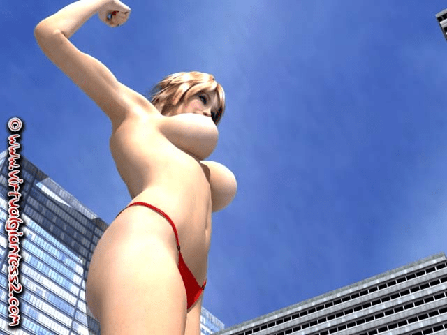
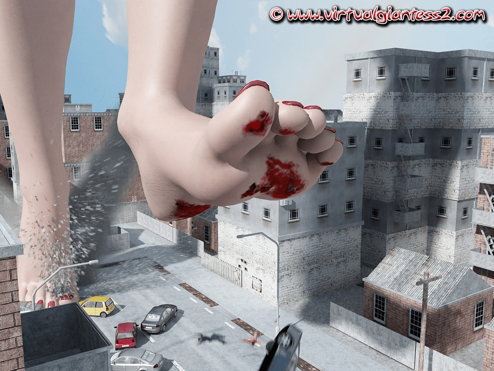
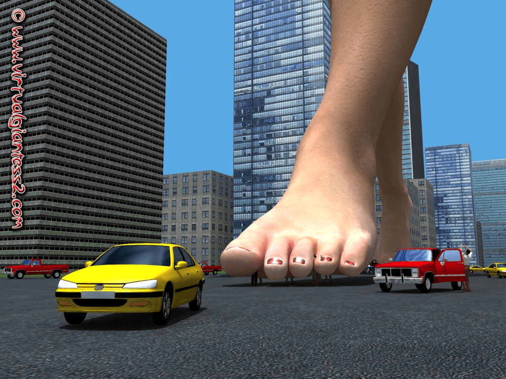
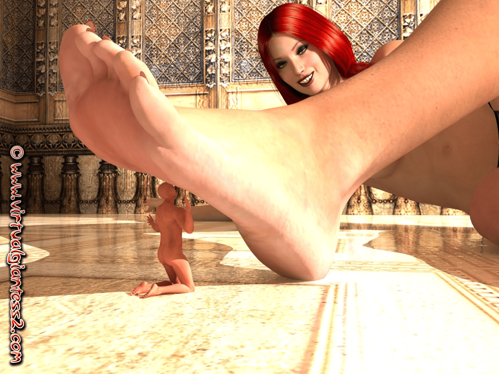
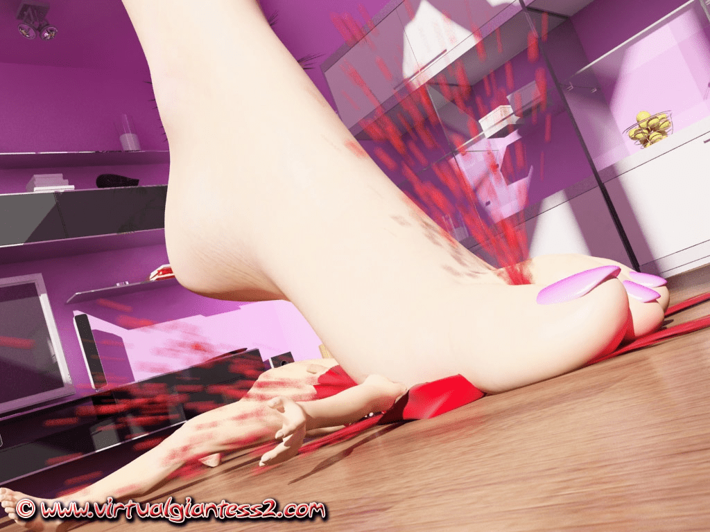
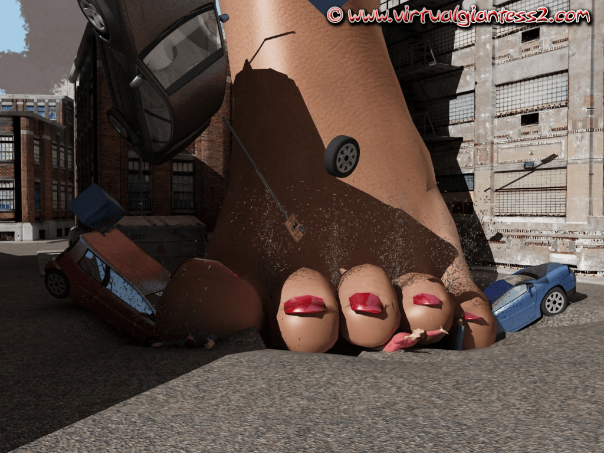
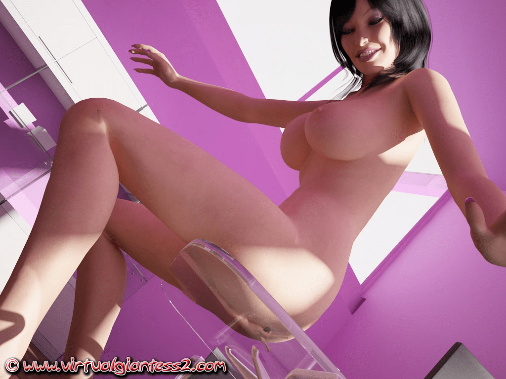

# 有志向自己制作GTS作品的进来看看吧。

作者：abc-c

TID：6496

<title>1</title> <link href="../Styles/Style.css" type="text/css" rel="stylesheet">

# 1

*本帖最後由 awkeygen 於 2014-3-28 09:59 編輯*

做一切之前大家务必坚信一件事：“**作品都是人做出来的，别人能做，我也能做，并且会做得更好**。”

之前，我们要根据自己的长处和兴趣选择适合自己的制作方式，在此我为大家做一下简单的总结。

方式一：**只用poser**

这种应该是大家最常见的了，国内外绝大部分作品使用的方式，特点是制作方便，模型库多，易于学习，容易上手，材质细腻，渲染效果上人物表达还不错，缺点就是很难表达场景，光线很难表达真实感，因为poser是人物插件，用一个插件制作出好的作品是不可能的，另外poser与一个完善的3d软件相差甚远，没有建模系统和完善的渲染、材质系统，怪异的打光，加上缓慢的渲染速度，不适合制作上等作品。好在poser pro与主流软件（max maya c4d xsi等）有完善的接口，这也正是poser最大的成功之处。

*例子：hglock的作品和本人的作品“小盈和晴晴”。*

方式二：**DAZ**

这是一个新兴的类似于poser软件，操作上强于poser，速度快，渲染快，模型库多，人物漂亮。可是缺点也很多，第一，daz与其他主流软件的连接很差，并且渲染精度很低，材质很模糊，但是整体光线还可以。如果要求不高并且想做“女巨人”推荐使用该软件。另外，如果你喜欢动漫模式，可以尝试DAZ大的动漫渲染，效果不错，而且速度快。并且稳定不卡机。**适合于配置低的机器。**

*例子：giantesscity的teacher's pet和本人作品“纪元2400”*

方式三：**3Ds max+vray**

利用poser的poserfusion可以将模型导入3ds max中，导入效果还可以，可是不停地导来导去会是工作效率大幅度降低，max本身的渲染质量不行，目前比较流行的vray和mr，可是这就要求我们在制作之前要重新制作所有贴图，好在vray的场景资源很多，制作场景应该不是很费力，3ds max的稳定性差，在制作时你的机器会卡得很，你还要做好软件随时都会崩溃的准备，并且，vray渲染速度慢，占用资源多，如果你的技术足够好，机器足够牛，可以试试max+vray。max+mr就更不用说了，mr是世界上公认的最好的渲染器，尤其是制作人物，可是渲染速度会让你疯掉。
例子：目前没有用max+vray制作的GTS作品。

方式四：**maya**
maya是个全能，各方面都是世界一流，但是这个软件很难学，maya主要是动画机器强大，并且，特效功能强大，渲染质量一般，可是他有内置的mr渲染器，渲染速度极慢，可是效果极佳，可与大片互相媲美，并且poser与maya可以用插件实现接口。问题就是太难了，菜单全是英文，长得要命，好在稳定性优于max。
*例子目前无。*

方式五：**cinema4D+AR**
Cinema 4D目前是我的最爱，因为我喜欢他系统化的工作界面，丰富的材质系统，高速的渲染和与poser的良好对接，c4d渲染质量一流，渲染速度飞快，可是，他出道不久，是一个新生儿，因此资源匮乏，只能靠自己一点一点做，一点一点自学，自己设计材质，但是我相信在一两年之内，就会出现大批的cinema4D的资源库了。还有cinema 4d稳定性世界第一，一般渲染一边玩dota都没问题。
*例子：我最近发的几个实验图片。*

方式六：**cinema4d+VR**
VR最近出了c4d版本，可以在c4d上渲染出max+vray的效果，这种效果很适用于做室内效果。缺点是我们要重新制作材质，并且渲染速度会慢于cinema4D+AR。再者若果vr与poser连用会出现贴图错误，尤其是高精度模型。所以大家应该注意到mk_cuf的作品里都是裸体，就是这个原因。
*例子：muzidianli翻译的mk_cuf的“**和**”*

方式六：**ps+3d**
主要适用于制作体内场景。先用3d做草图，再用ps加工。主要利用的是ps的融合和笔刷特性。
*例子：本人作品“小盈和晴晴”的体内片段。*

方式七：**ps**
直接利用切图工具完成图片合成。主要利用磁性套索和色彩曲线。
*例子：大仁的作品。*
 ***最后希望这篇文章能帮助你找到适合自己的路线！！！8" />8" />**

[ *本帖最後由 awkeygen 於 2010-1-31 20:24 編輯* ] <title>2</title> <link href="../Styles/Style.css" type="text/css" rel="stylesheet">

# 2

我觉得从方式3开始就已经不太现实了……
会3Dmax mr maya并且已经到可以制作人物的阶段，（况且GTS的模组背景普遍很广袤。。。） 对个人以及电脑要求是非常之高的呃。。。
当然还是很期待有人能够做出来嗯~

当然，期待楼主的cinema4D能学有所成，将来能够出现好的作品 <title>3</title> <link href="../Styles/Style.css" type="text/css" rel="stylesheet">

# 3

我注意你的头像很久了...
图片哪里弄的？谁做的？效果很不错啊！！
应该用的就是方式3
要是还有能不能在这里贴一张大的？我也试试！！
谢谢大大！！！ 

[ *本帖最後由 awkeygen 於 2010-1-31 10:36 編輯* ] <title>4</title> <link href="../Styles/Style.css" type="text/css" rel="stylesheet">

# 4

VISUAL GIANTESS啊 <title>5</title> <link href="../Styles/Style.css" type="text/css" rel="stylesheet">

# 5

上链接！！！ <title>6</title> <link href="../Styles/Style.css" type="text/css" rel="stylesheet">

# 6

哎 我这破电脑3开WOW都会卡
估计是没戏了 <title>7</title> <link href="../Styles/Style.css" type="text/css" rel="stylesheet">

# 7

别灰心 用方案2可行 <title>8</title> <link href="../Styles/Style.css" type="text/css" rel="stylesheet">

# 8

我这台烂电脑.........饿......... <title>9</title> <link href="../Styles/Style.css" type="text/css" rel="stylesheet">

# 9

我发誓我原来发过的……
随便找了三张。。。貌似不是什么好角度的……不过凑合一下吧
这个应该是3D max解决的了得，当然用cinema4D肯定效果更好
然后，这个的确是virtual giantess没错，是个好贵好贵的付费站搞的……

我也只有2008年左右的老东西…… <title>10</title> <link href="../Styles/Style.css" type="text/css" rel="stylesheet">

# 10

 <ignore_js_op>[mmega0000480.jpg](forum.php?mod=attachment&aid=MTY5MTV8ZDg4YWU1Y2J8MTY3NDA2OTcxNXwxODIzMHw2NDk2&nothumb=yes) *(38.91 KB, 下載次數: 0)*

[下載附件](forum.php?mod=attachment&aid=MTY5MTV8ZDg4YWU1Y2J8MTY3NDA2OTcxNXwxODIzMHw2NDk2&nothumb=yes)

2010-1-31 14:16 上傳  

</ignore_js_op> <ignore_js_op>[mmega0000662.jpg](forum.php?mod=attachment&aid=MTY5MTZ8ODg2MzgzNjB8MTY3NDA2OTcxNXwxODIzMHw2NDk2&nothumb=yes) *(245.29 KB, 下載次數: 0)*

[下載附件](forum.php?mod=attachment&aid=MTY5MTZ8ODg2MzgzNjB8MTY3NDA2OTcxNXwxODIzMHw2NDk2&nothumb=yes)

2010-1-31 14:16 上傳  

</ignore_js_op> <ignore_js_op>[mmega0000516.jpg](forum.php?mod=attachment&aid=MTY5MTd8ZDRmZmVkMjJ8MTY3NDA2OTcxNXwxODIzMHw2NDk2&nothumb=yes) *(248.4 KB, 下載次數: 0)*

[下載附件](forum.php?mod=attachment&aid=MTY5MTd8ZDRmZmVkMjJ8MTY3NDA2OTcxNXwxODIzMHw2NDk2&nothumb=yes)

2010-1-31 14:16 上傳  

</ignore_js_op> <title>11</title> <link href="../Styles/Style.css" type="text/css" rel="stylesheet">

# 11

這幾張太強大了,不頂不行呀 <title>12</title> <link href="../Styles/Style.css" type="text/css" rel="stylesheet">

# 12

不过渲染得真的很厉害（靠。。。居然大多数都露点了……想找个带人的好困难啊） <title>13</title> <link href="../Styles/Style.css" type="text/css" rel="stylesheet">

# 13

 <ignore_js_op>[mgent0000255.jpg](forum.php?mod=attachment&aid=MTY5MjB8YjNmYmM5ZDN8MTY3NDA2OTc0OHwxODIzMHw2NDk2&nothumb=yes) *(226.79 KB, 下載次數: 1)*

[下載附件](forum.php?mod=attachment&aid=MTY5MjB8YjNmYmM5ZDN8MTY3NDA2OTc0OHwxODIzMHw2NDk2&nothumb=yes)

2010-1-31 14:25 上傳  

</ignore_js_op> <title>14</title> <link href="../Styles/Style.css" type="text/css" rel="stylesheet">

# 14

够劲~哈~
再把3D制作的大概流程说说啊，呵呵，那个也是比较有益的，我感觉，学之前对整体先有个概念……像绪论一样

我现在要是工作就好了…… <title>15</title> <link href="../Styles/Style.css" type="text/css" rel="stylesheet">

# 15

。。。其实根本没剧情的……
你会发现几十张照片都是同一个人同一个姿势摆在那里，只不过角度不同……
后来我才明白原因……

就是，它的人物都是一个个现成的mod，然而血液，或者破损的楼房，汽车这种东西是不多的，即使有也是很不精细的……于是乎，就很少有这种图片出现
下面那俩是我觉得做得相对较真的了。我那1个G的包里这样子的不超过10张。。。 <title>16</title> <link href="../Styles/Style.css" type="text/css" rel="stylesheet">

# 16

 <ignore_js_op>[mcrus0000667.jpg](forum.php?mod=attachment&aid=MTY5MjF8MGMwOWU2ODJ8MTY3NDA2OTc0OHwxODIzMHw2NDk2&nothumb=yes) *(185.78 KB, 下載次數: 1)*

[下載附件](forum.php?mod=attachment&aid=MTY5MjF8MGMwOWU2ODJ8MTY3NDA2OTc0OHwxODIzMHw2NDk2&nothumb=yes)

2010-1-31 14:33 上傳  

注意所谓的血。。。

</ignore_js_op>  <ignore_js_op>[mmega0000635.jpg](forum.php?mod=attachment&aid=MTY5MjJ8MjU3ZGE3Mzh8MTY3NDA2OTc0OHwxODIzMHw2NDk2&nothumb=yes) *(250.61 KB, 下載次數: 0)*

[下載附件](forum.php?mod=attachment&aid=MTY5MjJ8MjU3ZGE3Mzh8MTY3NDA2OTc0OHwxODIzMHw2NDk2&nothumb=yes)

2010-1-31 14:33 上傳  

</ignore_js_op> <title>17</title> <link href="../Styles/Style.css" type="text/css" rel="stylesheet">

# 17

再发两张。。。这样子那个网站所有大的系列就都有了 <title>18</title> <link href="../Styles/Style.css" type="text/css" rel="stylesheet">

# 18

 <ignore_js_op>[meati0000298.jpg](forum.php?mod=attachment&aid=MTY5MjN8MzFkOWVhYTV8MTY3NDA2OTc0OHwxODIzMHw2NDk2&nothumb=yes) *(167.68 KB, 下載次數: 0)*

[下載附件](forum.php?mod=attachment&aid=MTY5MjN8MzFkOWVhYTV8MTY3NDA2OTc0OHwxODIzMHw2NDk2&nothumb=yes)

2010-1-31 14:40 上傳  

</ignore_js_op> <ignore_js_op>[mbutt0000004.jpg](forum.php?mod=attachment&aid=MTY5MjR8ZmIzZWRlNjh8MTY3NDA2OTc0OHwxODIzMHw2NDk2&nothumb=yes) *(142.48 KB, 下載次數: 0)*

[下載附件](forum.php?mod=attachment&aid=MTY5MjR8ZmIzZWRlNjh8MTY3NDA2OTc0OHwxODIzMHw2NDk2&nothumb=yes)

2010-1-31 14:40 上傳  

</ignore_js_op> <title>19</title> <link href="../Styles/Style.css" type="text/css" rel="stylesheet">

# 19

我目前能做出这种效果 这样一幅图估计要1小时出图 <title>20</title> <link href="../Styles/Style.css" type="text/css" rel="stylesheet">

# 20

你想学哪种？大木？？？？？ <title>21</title> <link href="../Styles/Style.css" type="text/css" rel="stylesheet">

# 21

> 原帖由 *awkeygen* 於 2010-1-31 15:49 發表 
> 你想学哪种？大木？？？？？

晕，“大木”……

这个还是慢慢来吧~~不急决定……

再说现在时间很有限，俺实验室的电脑显卡差的不得了……比一般的集成显卡都差 所以~~~不好办啊 家里的也一般……

[ *本帖最後由 muzidianli 於 2010-1-31 17:08 編輯* ] <title>22</title> <link href="../Styles/Style.css" type="text/css" rel="stylesheet">

# 22

哦 不用急 3d软件不吃显卡
就你的情况我建议学习daz 然后以poser作为模型库 <title>23</title> <link href="../Styles/Style.css" type="text/css" rel="stylesheet">

# 23

前辈~~领教了~~不过要做这东西 得一阵子啊 <title>24</title> <link href="../Styles/Style.css" type="text/css" rel="stylesheet">

# 24

maya+vray才是王道 mr太卡了 <title>25</title> <link href="../Styles/Style.css" type="text/css" rel="stylesheet">

# 25

Poser Pro有一个插件PoserFusion for Maya,可以将Poser模型导入到Maya2008中，可我安装后.在Maya2008的Imput中找不到Poser类型文件. <title>26</title> <link href="../Styles/Style.css" type="text/css" rel="stylesheet">

# 26

 poser下来了不会调人物比例啊- - 动作一调 就畸形了 纠结 <title>27</title> <link href="../Styles/Style.css" type="text/css" rel="stylesheet">

# 27

模型素材在哪里下啊？*