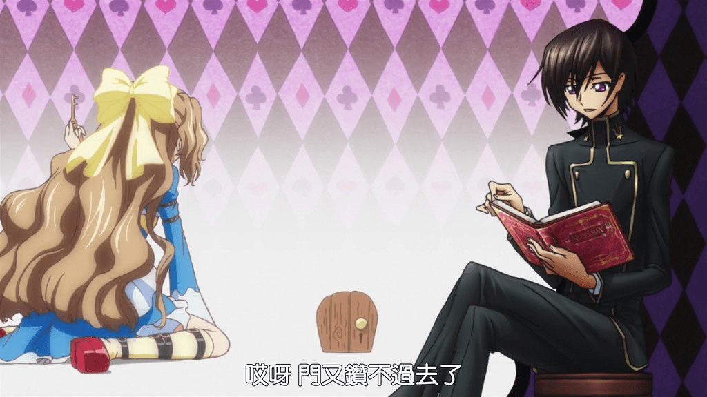

# 有沒有growth,長大,巨大化 的同好

作者：VERGIL

TID：13958

<title>1</title> <link href="../Styles/Style.css" type="text/css" rel="stylesheet">

# 1

例如 吃了長大藥 還是什麼射線..等等

造成女孩巨大化 ..撐破衣服.. 或者是艾利斯夢遊仙境之類的喜好者 <title>2</title> <link href="../Styles/Style.css" type="text/css" rel="stylesheet">

# 2

我猜正是Alice in Wonderland和The Wonderful Adventures of Nils还有Gulliver's Travels这三本书造成了我今天的爱好吧.... <title>3</title> <link href="../Styles/Style.css" type="text/css" rel="stylesheet">

# 3

就我所知有 Taylor made , Media impact 系列的真人影片

漫畫有 bust artist , gtsartist ...等

希望互相交流唷! <title>4</title> <link href="../Styles/Style.css" type="text/css" rel="stylesheet">

# 4

算在下一个...不过这类感觉很难找 <title>5</title> <link href="../Styles/Style.css" type="text/css" rel="stylesheet">

# 5

同好路过，握个爪 <title>6</title> <link href="../Styles/Style.css" type="text/css" rel="stylesheet">

# 6

其实我也喜欢这个阿。 <title>7</title> <link href="../Styles/Style.css" type="text/css" rel="stylesheet">

# 7

我超爱这个！握爪 <title>8</title> <link href="../Styles/Style.css" type="text/css" rel="stylesheet">

# 8

同好。。。。。举个爪子，话说Media impact在论坛发的种子里有。 <title>9</title> <link href="../Styles/Style.css" type="text/css" rel="stylesheet">

# 9

同好路过  这类的都不太多 而且我又好个GIGA 感觉就更少了 <title>10</title> <link href="../Styles/Style.css" type="text/css" rel="stylesheet">

# 10

> sqwzeyy 發表於 2013-2-8 09:51 
> 同好。。。。。举个爪子，话说Media impact在论坛发的种子里有。

里面太多啦 如何分辨啊 我只能认得带GROWTH的

<title>11</title> <link href="../Styles/Style.css" type="text/css" rel="stylesheet">

# 11

> archer 發表於 2013-2-8 11:41 
> 里面太多啦 如何分辨啊 我只能认得带GROWTH的

话说我都是每个就下一个。。。。根据内容推断的
<title>12</title> <link href="../Styles/Style.css" type="text/css" rel="stylesheet">

# 12

> sqwzeyy 發表於 2013-2-8 13:42 
> 话说我都是每个就下一个。。。。根据内容推断的

立马如何推断啊 求指导

<title>13</title> <link href="../Styles/Style.css" type="text/css" rel="stylesheet">

# 13

[http://c2240025.deviantart.com/favourites/](http://c2240025.deviantart.com/favourites/)  

share my favourites~
<title>14</title> <link href="../Styles/Style.css" type="text/css" rel="stylesheet">

# 14

我也喜欢，只是不好找，记得以前我有个网站都是这样的漫画，现在不知道失踪到哪里了 <title>15</title> <link href="../Styles/Style.css" type="text/css" rel="stylesheet">

# 15

*本文章最後由 c2240025 於 2013-2-8 16:43 編輯*

> sqwzeyy 發表於 2013-2-8 09:51 
> 同好。。。。。举个爪子，话说Media impact在论坛发的种子里有。

这个论坛在哪里阿~?

另外有兴趣可以去facebook 搜寻giantess growth 的社团 <title>16</title> <link href="../Styles/Style.css" type="text/css" rel="stylesheet">

# 16

我也是從小看了愛莉絲後  就超喜歡放大系列的   希望能一起分享交流一下~~ <title>17</title> <link href="../Styles/Style.css" type="text/css" rel="stylesheet">

# 17

> c2240025 發表於 2013-2-8 16:40 
> 这个论坛在哪里阿~?
> 
> 另外有兴趣可以去facebook 搜寻giantess growth 的社团

就是本论坛啊。。。[http://giantessnight.com/gnforum2012/forum.php?mod=viewthread&tid=13711&extra=page%3D1](http://giantessnight.com/gnforum2012/forum.php?mod=viewthread&tid=13711&extra=page%3D1)这个种子。。。我用迅雷会员下的
<title>18</title> <link href="../Styles/Style.css" type="text/css" rel="stylesheet">

# 18

> c2240025 發表於 2013-2-8 16:34 
> http://c2240025.deviantart.com/favourites/  
> 
> share my favourites~

大爱超感谢~
<title>19</title> <link href="../Styles/Style.css" type="text/css" rel="stylesheet">

# 19

某也是同好，不过比较喜欢漫画风格的 <title>20</title> <link href="../Styles/Style.css" type="text/css" rel="stylesheet">

# 20

娜娜莉梦游仙境 好名啊~可惜只有这一张还需要强烈脑补的伪GTS哈 <title>21</title> <link href="../Styles/Style.css" type="text/css" rel="stylesheet">

# 21

 <ignore_js_op>[QQ截图20130210155810.jpg](forum.php?mod=attachment&aid=MzMxMDl8NWY4Y2JmNDJ8MTY3NDA2ODQyMnwxODIzMHwxMzk1OA%3D%3D&nothumb=yes) *(110.52 KB, 下載次數: 1)*

[下載附件](forum.php?mod=attachment&aid=MzMxMDl8NWY4Y2JmNDJ8MTY3NDA2ODQyMnwxODIzMHwxMzk1OA%3D%3D&nothumb=yes)

2013-2-10 23:48 上傳  

</ignore_js_op> <title>22</title> <link href="../Styles/Style.css" type="text/css" rel="stylesheet">

# 22

+1~~
雖然大大們說的我不熟 但這種慢慢變大 成長的巨大娘 我極為 重度 非常愛唷^_____^
再加上治癒系 溫柔的話 就更好囉>W<~~~~

歡迎大家和我交流^______________________________^ <title>23</title> <link href="../Styles/Style.css" type="text/css" rel="stylesheet">

# 23

[http://giantessbooru.com/post/list/growth/1](http://giantessbooru.com/post/list/growth/1)

這個網站 也有唷 ~ 漫畫圖片的 <title>24</title> <link href="../Styles/Style.css" type="text/css" rel="stylesheet">

# 24

[http://www.dailymotion.com/alfa_omega_dm_4fde4da0e0b#video=xvpy8v](http://www.dailymotion.com/alfa_omega_dm_4fde4da0e0b#video=xvpy8v)

[http://www.dailymotion.com/Diderism#video=xvmyrp](http://www.dailymotion.com/Diderism#video=xvmyrp)

[http://www.dailymotion.com/odcc3#video=xvnohr](http://www.dailymotion.com/odcc3#video=xvnohr)

dailymotion影片的 ~ 記得把 家庭過濾器 off ! <title>25</title> <link href="../Styles/Style.css" type="text/css" rel="stylesheet">

# 25

> c2240025 發表於 2013-2-18 02:13 
> http://www.dailymotion.com/alfa_omega_dm_4fde4da0e0b#video=xvpy8v
> 
> http://www.dailymotion.com/Dideri ...

全部都打不开呀~~~家庭过滤器是啥？
<title>26</title> <link href="../Styles/Style.css" type="text/css" rel="stylesheet">

# 26

> archer 發表於 2013-2-18 02:36 
> 全部都打不开呀~~~家庭过滤器是啥？

最下面 有個 家庭過濾器 ON

調成OFF

如果找不到就ctrl + F 搜尋吧...
<title>27</title> <link href="../Styles/Style.css" type="text/css" rel="stylesheet">

# 27

同好握爪=-=…… <title>28</title> <link href="../Styles/Style.css" type="text/css" rel="stylesheet">

# 28

喜欢就是喜欢呀 <title>29</title> <link href="../Styles/Style.css" type="text/css" rel="stylesheet">

# 29

喜欢GIGA级的～ <title>30</title> <link href="../Styles/Style.css" type="text/css" rel="stylesheet">

# 30

> archer 發表於 2013-2-18 02:36 
> 全部都打不开呀~~~家庭过滤器是啥？

需要开VPN....
<title>31</title> <link href="../Styles/Style.css" type="text/css" rel="stylesheet">

# 31

> wxy112300 發表於 2013-2-19 01:15 
> 需要开VPN....

VPN 是啥 翻墙么<title>32</title> <link href="../Styles/Style.css" type="text/css" rel="stylesheet">

# 32

巨大化的過程才是gts真正精隨 <title>33</title> <link href="../Styles/Style.css" type="text/css" rel="stylesheet">

# 33

同好路过，我也喜爱 <title>34</title> <link href="../Styles/Style.css" type="text/css" rel="stylesheet">

# 34

同好路过，非常喜欢巨大化，特别是过程。有没有资源交流的地方呢？ <title>35</title> <link href="../Styles/Style.css" type="text/css" rel="stylesheet">

# 35

同好这类的不太多
<title>36</title> <link href="../Styles/Style.css" type="text/css" rel="stylesheet">

# 36

巨大化的过程最喜欢了 <title>37</title> <link href="../Styles/Style.css" type="text/css" rel="stylesheet">

# 37

其实巨大化是很有爱的，感觉比缩小要好啊