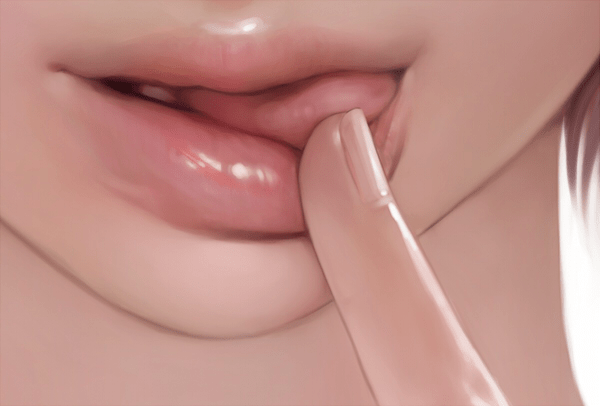
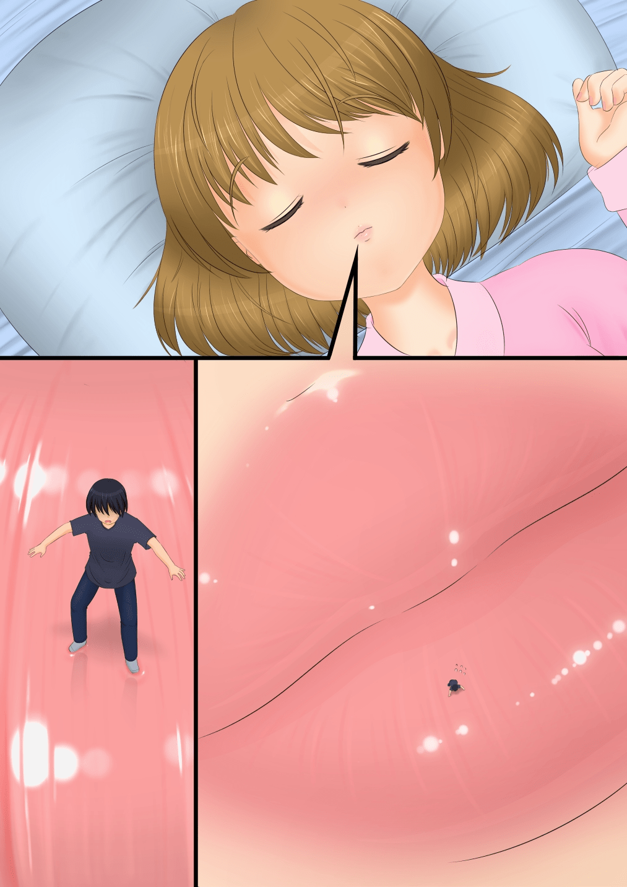

# 有沒有哪個畫師畫嘴唇特別厲害的

作者：网络菜鸟

TID：15421

<title>1</title> <link href="../Styles/Style.css" type="text/css" rel="stylesheet">

# 1

<ignore_js_op>

**26918986.jpg** *(73.37 KB, 下載次數: 8)*

[下載附件](forum.php?mod=attachment&aid=MzcxOTZ8YWY1OGEzNjN8MTY3NDA2Nzk3MXwxODIzMHwxNTQyMQ%3D%3D&nothumb=yes)

2013-10-19 18:31 上傳

Pixiv上找的，光看就.......XXX...(雖然跟GTS無關，腦補中)
個人閱歷不深，看過最有感覺的圖是SS畫的，
但....不知道該怎麼說，顏色白白的.....厄......
總之請大家推薦個嘴唇畫的性感的畫師。
<title>2</title> <link href="../Styles/Style.css" type="text/css" rel="stylesheet">

# 2

P站ID：
4406256
627172

不知道是不是你想要的~
顺便求一下你发的那张图的画师~ <title>3</title> <link href="../Styles/Style.css" type="text/css" rel="stylesheet">

# 3

咱也很控嘴唇，尤其是喜欢Chinbotsu的漫画 <title>4</title> <link href="../Styles/Style.css" type="text/css" rel="stylesheet">

# 4

画眼睛厉害的飘过～ 五官我最不会画嘴了。。。 <title>5</title> <link href="../Styles/Style.css" type="text/css" rel="stylesheet">

# 5

我更喜歡裏面的舌頭 <title>6</title> <link href="../Styles/Style.css" type="text/css" rel="stylesheet">

# 6

抱歉，畫嘴唇口部很厲害的 GTS畫師... <title>7</title> <link href="../Styles/Style.css" type="text/css" rel="stylesheet">

# 7

很厉害啊，看着有感觉 <title>8</title> <link href="../Styles/Style.css" type="text/css" rel="stylesheet">

# 8

PO发的那图曾经用来做过手机壁纸……
后来找了一下完整的图，发现……有点手贱的感觉
完整的全图不好看，顶多只能截半边脸来做手机壁纸
嘴唇的话，P站你那图的直接点该TAG不是一大堆吗 <title>9</title> <link href="../Styles/Style.css" type="text/css" rel="stylesheet">

# 9

> ADSL 發表於 2013-10-19 19:08 
> P站ID：
> 4406256
> 627172

什么是P站啊?求指教！

<title>10</title> <link href="../Styles/Style.css" type="text/css" rel="stylesheet">

# 10

*本文章最後由 小兵 於 2013-11-4 11:26 編輯*

> 小兵 發表於 2013-11-4 11:09 
> 什么是P站啊?求指教！

错了。。。有哪些好的画师给推荐下啊！
<title>11</title> <link href="../Styles/Style.css" type="text/css" rel="stylesheet">

# 11

真的很有感觉，不过还是想看全脸 <title>12</title> <link href="../Styles/Style.css" type="text/css" rel="stylesheet">

# 12

很棒的圖片，性感且誘惑。個人也比較控嘴唇。 <title>13</title> <link href="../Styles/Style.css" type="text/css" rel="stylesheet">

# 13

*本帖最後由 awkeygen 於 2014-2-9 16:42 編輯*

这种效果可以用3d渲染+PS达到的，当然，需要用渲染插件的。 <title>14</title> <link href="../Styles/Style.css" type="text/css" rel="stylesheet">

# 14

説到嘴唇就想到トビケラ
[http://www.pixiv.net/member.php?id=6884837](http://www.pixiv.net/member.php?id=6884837)
<ignore_js_op>

**35788174 (1).jpg** *(481.68 KB, 下載次數: 0)*

[下載附件](forum.php?mod=attachment&aid=NDA3OTl8MTE1MWY5OGJ8MTY3NDA2Nzk3OHwxODIzMHwxNTQyMQ%3D%3D&nothumb=yes)

2014-2-11 21:27 上傳

<title>15</title> <link href="../Styles/Style.css" type="text/css" rel="stylesheet">

# 15

这不挺好吗 <title>16</title> <link href="../Styles/Style.css" type="text/css" rel="stylesheet">

# 16

这画换的么。。。。太真实了。。 <title>17</title> <link href="../Styles/Style.css" type="text/css" rel="stylesheet">

# 17

嘴唇好性感的说， 画的真不错
<title>18</title> <link href="../Styles/Style.css" type="text/css" rel="stylesheet">

# 18

被这个嘴唇给蛊惑了 啾啾 <title>19</title> <link href="../Styles/Style.css" type="text/css" rel="stylesheet">

# 19

这张超有感觉- -记得媛媛系列好像多数是这样的，a weekend along也是类似的画风吧 <title>20</title> <link href="../Styles/Style.css" type="text/css" rel="stylesheet">

# 20

这细腻的画风，不管了~先撸一管！ <title>21</title> <link href="../Styles/Style.css" type="text/css" rel="stylesheet">

# 21

真的很想知道这些画师们都是怎么画出来的。。。 <title>22</title> <link href="../Styles/Style.css" type="text/css" rel="stylesheet">

# 22

我去，这个图片给人无线的遐想啊，诱人！！ <title>23</title> <link href="../Styles/Style.css" type="text/css" rel="stylesheet">

# 23

非嘴控居然也有感觉了！难道是太给力？ <title>24</title> <link href="../Styles/Style.css" type="text/css" rel="stylesheet">

# 24

看着有了感觉。。。。 <title>25</title> <link href="../Styles/Style.css" type="text/css" rel="stylesheet">

# 25

好漂亮的嘴唇！！！！ <title>26</title> <link href="../Styles/Style.css" type="text/css" rel="stylesheet">

# 26

我正在脑补，补了半天觉得还是得配文章 <title>27</title> <link href="../Styles/Style.css" type="text/css" rel="stylesheet">

# 27

封面图就很棒！！！看看有谁推荐些啥~</ignore_js_op></ignore_js_op>