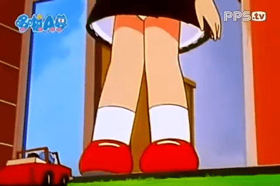

# 有沒有輕鬆幽默性質的GTS文學作品呢？

作者：phone2345

TID：25304

<title>1</title> <link href="../Styles/Style.css" type="text/css" rel="stylesheet">

# 1

論壇上有關GTS的創作，大多屬於寫實以及H的，雖然看的時候會有緊張刺激的感覺，但看久了似乎就有點麻痺了，甚至會有點疲倦的感覺，懷疑自己對於這方面的熱情是否消失了。

於是自己想開始嘗試的製作輕鬆、幽默的GTS[創作](https://giantessnight.com/gnforum2012/forum.php?mod=viewthread&tid=25275)，希望能像小時候看多啦A夢時，劇情中也會有GTS情節，但都不會過於緊張或倍感壓力。回顧這些有微微GTS情節的作品，雖然口味不重，但卻也能有放鬆身心的效果。

<ignore_js_op>

**擷取.PNG** *(227.99 KB, 下載次數: 0)*

[下載附件](forum.php?mod=attachment&aid=NzI3NTB8ZTBkYTgwYjZ8MTY3NDA2ODc2MHwxODIzMHwyNTMwNA%3D%3D&nothumb=yes)

2018-6-7 20:16 上傳

想問問論壇的大佬們，是否有推薦的輕鬆幽默的GTS**"文學"**作品呢？
希望能給小弟創作文章一點參考

<title>2</title> <link href="../Styles/Style.css" type="text/css" rel="stylesheet">

# 2

流浪人的 我和晓芸同居的日子1 2  [https://giantessnight.com/gnforu ... thread&tid=9697](https://giantessnight.com/gnforum2012/forum.php?mod=viewthread&tid=9697) [https://giantessnight.com/gnforu ... hread&tid=10223](https://giantessnight.com/gnforum2012/forum.php?mod=viewthread&tid=10223)  不知道这两篇算不算 这个作者的文章似乎都是这个风格的  有兴趣可以点他主题看看他的文章 <title>3</title> <link href="../Styles/Style.css" type="text/css" rel="stylesheet">

# 3

搞笑型的GTS小说倒是没啥印象,但是以前看过的老动漫倒是有不少这方面的擦边球元素,比如乌龙派出所,我记得有至少两集GTS相关的剧情,还有福星小子,GS美神和七龙珠系列等等,都是带有一定搞笑元素的GTS擦边球. <title>4</title> <link href="../Styles/Style.css" type="text/css" rel="stylesheet">

# 4

论坛不是有篇为美好的世界献上祝福么 <title>5</title> <link href="../Styles/Style.css" type="text/css" rel="stylesheet">

# 5

GS上大佬写的小さくなった、ただそれだけ这篇很有意思，似乎符合帖主的要求

论坛里面还有一二三的翻译 <title>6</title> <link href="../Styles/Style.css" type="text/css" rel="stylesheet">

# 6

林妹妹啊，《林萱瑜的错误日常》全是梗，而且是mini温柔系的，很合我胃口（GTS温柔系的毕竟不是主流呢...还有我搬的内两篇也算貌似轻松日常的说） <title>7</title> <link href="../Styles/Style.css" type="text/css" rel="stylesheet">

# 7

箱庭呀，我也很喜欢这种轻松的GTS文
剧情慢慢发展，微黄。 我很喜欢楼主写的 为美好世界献上祝福同人文，真很久没看到让人兴奋的文章了
比起无脑福利文，我更加喜欢有剧情有代入感的。楼主加油！
[https://giantessnight.com/gnforu ... highlight=%E7%AE%B1](https://giantessnight.com/gnforum2012/forum.php?mod=viewthread&tid=19340&highlight=%E7%AE%B1)
[https://giantessnight.com/gnforu ... highlight=%E7%AE%B1](https://giantessnight.com/gnforum2012/forum.php?mod=viewthread&tid=22929&highlight=%E7%AE%B1)
短片 误会也很不错哦
[https://giantessnight.com/gnforu ... =%E8%AF%AF%E4%BC%9A](https://giantessnight.com/gnforum2012/forum.php?mod=viewthread&tid=23439&highlight=%E8%AF%AF%E4%BC%9A)</ignore_js_op>