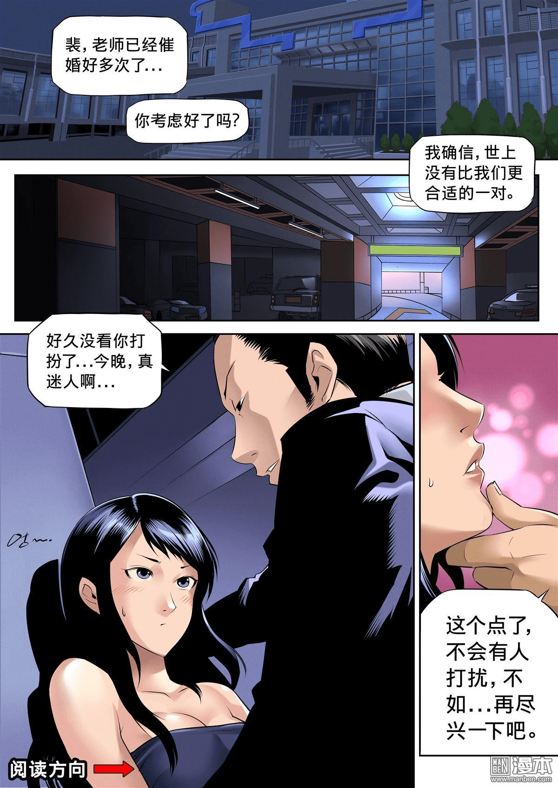

# 有沒有關於尼洛亞-NIRAYA-作者的消息

作者：4945

TID：21170

<title>1</title> <link href="../Styles/Style.css" type="text/css" rel="stylesheet">

# 1

剛剛刷手機看漫畫 一瞬間的廣告讓我震驚 <ignore_js_op>

**2.jpg** *(245.1 KB, 下載次數: 0)*

[下載附件](forum.php?mod=attachment&aid=NjE2MjR8M2IyMjAxMWR8MTY3NDA2NzQyOHwxODIzMHwyMTE3MA%3D%3D&nothumb=yes)

2016-6-4 01:29 上傳

<ignore_js_op>

**9.jpg** *(268.23 KB, 下載次數: 0)*

[下載附件](forum.php?mod=attachment&aid=NjE2MjV8NzRmODQwNzh8MTY3NDA2NzQyOHwxODIzMHwyMTE3MA%3D%3D&nothumb=yes)

2016-6-4 01:29 上傳

這個叫做尼洛亞的漫畫
作者:心一
我完全找不到關於作者的相關資訊
但基於我對於畫風的感度來說
這跟V姊的畫風有87%像
畢竟這樣的畫風並不是很常見(至少依照現在的萌系風格居多的時代)
而這個女角色的畫法更是讓我敏感
不知道有沒有人能夠出來解惑一下
又或是我過於敏感而以
<title>2</title> <link href="../Styles/Style.css" type="text/css" rel="stylesheet">

# 2

啊
真的很像啊，之前都没注意到。不过最近也没追这个了。 <title>3</title> <link href="../Styles/Style.css" type="text/css" rel="stylesheet">

# 3

我认为就是V姐的马甲,V姐既然不想公开的拿出来说想必是有自己的理由的,所以这里我建议还是不要深究了.
<title>4</title> <link href="../Styles/Style.css" type="text/css" rel="stylesheet">

# 4

确定不是V姐的？？？  完成一毛一样啊。。 <title>5</title> <link href="../Styles/Style.css" type="text/css" rel="stylesheet">

# 5

确实很像啊，不过这是正常向的吗？ <title>6</title> <link href="../Styles/Style.css" type="text/css" rel="stylesheet">

# 6

哈。。。我突然想起来南泽十八和新房昭之的梗。。。并无冒犯。。。只是这样的笔名马甲应该是常见的吧（如果不是也不要打我。。。我什么都不知道） <title>7</title> <link href="../Styles/Style.css" type="text/css" rel="stylesheet">

# 7

基本上第一話的阿修羅不就是GTS嗎XD

雖然只是劇情上稍稍帶過幾個畫面

反正我覺得是可以期待啦...... <title>8</title> <link href="../Styles/Style.css" type="text/css" rel="stylesheet">

# 8

*本帖最後由 CEW 於 2016-6-4 23:37 編輯*

上上個月(也可以說是不久前)就有人問過了，怎麼又再提一次= =
[http://giantessnight.com/gnforum2012/forum.php?mod=viewthread&tid=20889](http://giantessnight.com/gnforum2012/forum.php?mod=viewthread&tid=20889)

<title>9</title> <link href="../Styles/Style.css" type="text/css" rel="stylesheet">

# 9

话说V姐不是转行了吗?复出了? <title>10</title> <link href="../Styles/Style.css" type="text/css" rel="stylesheet">

# 10

> [田棒棒 發表於 2016-9-2 21:23](https://giantessnight.cf/gnforum2012/forum.php?mod=redirect&goto=findpost&pid=307078&ptid=21170)
> @vivian 现在好像都在画这个的连载，关于雅典娜还是地球就没消息

这个超链接是V姐在这里的首页？
<title>11</title> <link href="../Styles/Style.css" type="text/css" rel="stylesheet">

# 11

怎么感觉是V大的作品。。。 <title>12</title> <link href="../Styles/Style.css" type="text/css" rel="stylesheet">

# 12

这位作者的漫画在哪能看啊，或者说在哪能买啊，很久前看过类似画风的但不全 <title>13</title> <link href="../Styles/Style.css" type="text/css" rel="stylesheet">

# 13

> [CEW 發表於 2016-6-4 23:35](https://giantessnight.cf/gnforum2012/forum.php?mod=redirect&goto=findpost&pid=295428&ptid=21170)
> 上上個月(也可以說是不久前)就有人問過了，怎麼又再提一次= =
> http://giantessnight.com/gnforum2012/forum ...

因为很多帖子都被锁上权限，论坛里大佬给的网址要不上不去，要不根本不知道怎么用更别说去买了</ignore_js_op></ignore_js_op>