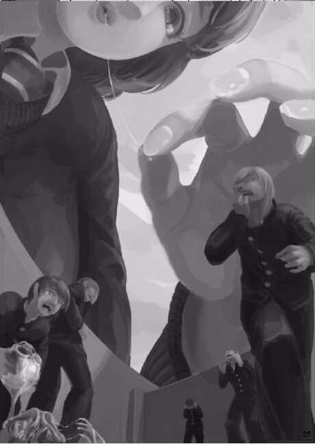

# 有没有坛友记得这篇老文

作者：Courant

TID：30702

<title>1</title> <link href="../Styles/Style.css" type="text/css" rel="stylesheet">

# 1

今天清理硬盘翻出来的图，几年前在贴吧某篇翻译贴里看到的。印象中这篇文是女主被欺凌后复仇的故事，质量不错，可惜被baidu清掉了…… <title>2</title> <link href="../Styles/Style.css" type="text/css" rel="stylesheet">

# 2

 <ignore_js_op>[386CC8686692174972A6DF1651DDA864.jpg](forum.php?mod=attachment&aid=ODgzMTJ8NmVhZTg4N2V8MTY3NDA2NjA0NnwxODIzMHwzMDcwMg%3D%3D&nothumb=yes) *(35.13 KB, 下載次數: 1)*

[下載附件](forum.php?mod=attachment&aid=ODgzMTJ8NmVhZTg4N2V8MTY3NDA2NjA0NnwxODIzMHwzMDcwMg%3D%3D&nothumb=yes)

2021-4-13 21:13 上傳  

</ignore_js_op> <title>3</title> <link href="../Styles/Style.css" type="text/css" rel="stylesheet">

# 3

另外…坛友们有什么靠谱的云盘推荐么？最近下载了两部vore相关的yapoo片子，想要分享出来( ͡° ͜ʖ ͡°)✧ <title>4</title> <link href="../Styles/Style.css" type="text/css" rel="stylesheet">

# 4

> [Courant 發表於 2021-4-13 21:19](https://giantessnight.cf/gnforum2012/forum.php?mod=redirect&goto=findpost&pid=465183&ptid=30702)
> 另外…坛友们有什么靠谱的云盘推荐么？最近下载了两部vore相关的yapoo片子，想要分享出来( ͡° ͜ʖ ͡°) ...

谷歌云盘
mega
onedrive
最近还有个阿里云盘
<title>5</title> <link href="../Styles/Style.css" type="text/css" rel="stylesheet">

# 5

翻译不知道

原文倒是有

[https://exhentai.org/g/716361/4c874026fa/](https://exhentai.org/g/716361/4c874026fa/)

可是是图片也很难去机翻…… <title>6</title> <link href="../Styles/Style.css" type="text/css" rel="stylesheet">

# 6

这个图我看着眼熟，就是想不起是哪里的图了... <title>7</title> <link href="../Styles/Style.css" type="text/css" rel="stylesheet">

# 7

> [leo1223 發表於 2021-4-13 23:34](https://giantessnight.cf/gnforum2012/forum.php?mod=redirect&goto=findpost&pid=465195&ptid=30702)
> 翻译不知道
> 
> 原文倒是有

阿这 半个小时不到就404了是什么操作，我记得E站不是不能删自己的帖的吗，给清掉了？
<title>8</title> <link href="../Styles/Style.css" type="text/css" rel="stylesheet">

# 8

这图不是《渺小的人真可怜呦》里边uru画的嘛，有文呢，不过不好翻，隔壁论坛汉化的也没翻那些文 <title>9</title> <link href="../Styles/Style.css" type="text/css" rel="stylesheet">

# 9

马克一下等答案，一开始想说伊织的复仇，不过记得这篇文没有配图.......... <title>10</title> <link href="../Styles/Style.css" type="text/css" rel="stylesheet">

# 10

> [妈的智障 發表於 2021-4-13 08:02](https://giantessnight.cf/gnforum2012/forum.php?mod=redirect&goto=findpost&pid=465200&ptid=30702)
> 阿这 半个小时不到就404了是什么操作，我记得E站不是不能删自己的帖的吗，给清掉了？
> ...

能看的，并没有404，这是14年上传的，总不见得选在这半个小时删掉。E站的东西不太会挂的。 <title>11</title> <link href="../Styles/Style.css" type="text/css" rel="stylesheet">

# 11

> [毛球 發表於 2021-4-14 13:15](https://giantessnight.cf/gnforum2012/forum.php?mod=redirect&goto=findpost&pid=465231&ptid=30702)
> 能看的，并没有404，这是14年上传的，总不见得选在这半个小时删掉。E站的东西不太会挂的。 ...

以前可能不太会挂，现在一些版权也开始瞄准e站了……
<title>12</title> <link href="../Styles/Style.css" type="text/css" rel="stylesheet">

# 12

> leo1223 發表於 2021-4-13 23:34
> 翻译不知道
> 
> 原文倒是有

谢谢茄子，有原文就好办了，可以汉化 <title>13</title> <link href="../Styles/Style.css" type="text/css" rel="stylesheet">

# 13

图片翻译感觉太困难了，但愿有猛男能办得到吧 <title>14</title> <link href="../Styles/Style.css" type="text/css" rel="stylesheet">

# 14

> SIDAIMU 發表於 2021-4-15 11:05
> 图片翻译感觉太困难了，但愿有猛男能办得到吧

安利一个叫papago的翻译软件，图片翻译准确度蛮高的 <title>15</title> <link href="../Styles/Style.css" type="text/css" rel="stylesheet">

# 15

这个图文e站就有，只不过没有汉化。