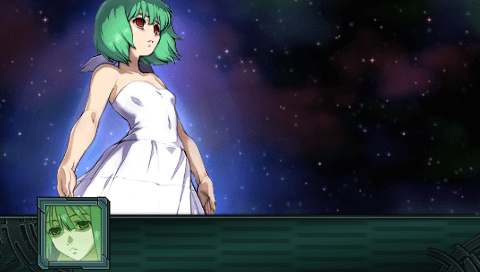
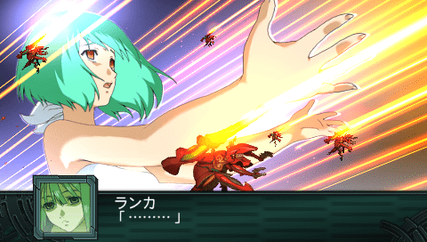
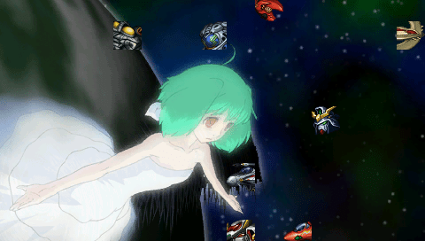
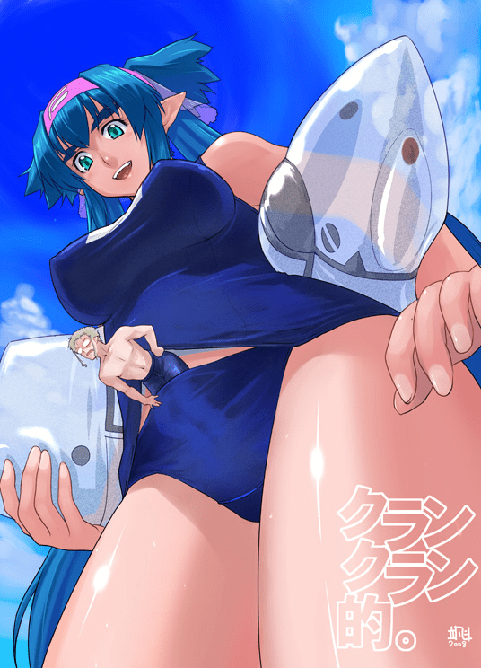
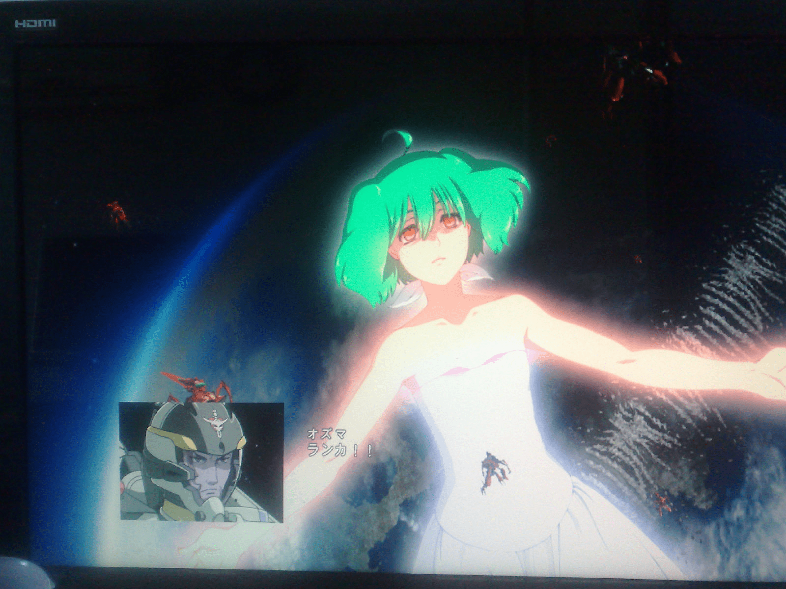

# 有玩過超級機器人大戰或是看過MACROSS嗎？？

作者：fox2

TID：12903

<title>1</title> <link href="../Styles/Style.css" type="text/css" rel="stylesheet">

# 1

可能很多人都知道了，不過最近抱著不破關就不睡覺的心態，拿起了被我放置PLAY超過三個月的超級機器人大戰遊戲來玩。其中因為喜歡MACROSS的劇情，於是大多走真實系路線。
到了後期的一個共通路線中，終於看到MACROSS F 最後的劇情了
可惜的是沒能拿到MACROSS F劇場版阿爾特新座機 VF-29

沒想到綠毛能夠以這種方式呈現，真是嚇死我了 

<ignore_js_op>

**201207261211_001.png** *(143.96 KB, 下載次數: 1)*

[下載附件](forum.php?mod=attachment&aid=Mjk5MjN8YWYzZGQ2Nzd8MTY3NDA2ODUwNXwxODIzMHwxMjkwMw%3D%3D&nothumb=yes)

2012-7-27 11:31 上傳

<ignore_js_op>

**201207261211_002.png** *(158.05 KB, 下載次數: 0)*

[下載附件](forum.php?mod=attachment&aid=Mjk5MjR8ZWE1NmMxOGJ8MTY3NDA2ODUwNXwxODIzMHwxMjkwMw%3D%3D&nothumb=yes)

2012-7-27 11:31 上傳

<ignore_js_op>

**201207261241_001.png** *(105.51 KB, 下載次數: 0)*

[下載附件](forum.php?mod=attachment&aid=Mjk5MjV8ZWEzYTVkMzN8MTY3NDA2ODUwNXwxODIzMHwxMjkwMw%3D%3D&nothumb=yes)

2012-7-27 11:31 上傳

<title>2</title> <link href="../Styles/Style.css" type="text/css" rel="stylesheet">

# 2

可惜巨大绿毛不是实体
MACROSS F中库兰和米歇尔从头到尾都没有互动情节也挺遗憾的... <title>3</title> <link href="../Styles/Style.css" type="text/css" rel="stylesheet">

# 3

 论坛上擦边搜索者职业人群可是最大的 刚出时候就有帖子啦
TV跟剧场也就巨大投影绿毛这里剧情一致了  连眼睛都吐便当了
to 2l :可御可萝同人多到可以自己开一类了，要感谢官方给留的活路啊。 <ignore_js_op>

**739 - bath giantess in_panties klein_klan low_angle macross_frontier shrunken_men suit.jpg** *(153.48 KB, 下載次數: 0)*

[下載附件](forum.php?mod=attachment&aid=Mjk5MjZ8NjA1MjY0YzV8MTY3NDA2ODUwNXwxODIzMHwxMjkwMw%3D%3D&nothumb=yes)

2012-7-27 13:05 上傳

<title>4</title> <link href="../Styles/Style.css" type="text/css" rel="stylesheet">

# 4

绿毛的这一段用来YY是相当好啊~~~ <title>5</title> <link href="../Styles/Style.css" type="text/css" rel="stylesheet">

# 5

大家都没看TV版吗？2008年的动漫了：

24 、25集 有兰卡巨大的投影，GTS效果还不错的说：
[http://v.youku.com/v_show/id_XNDIxMDk2MjA0.html](http://v.youku.com/v_show/id_XNDIxMDk2MjA0.html) <title>6</title> <link href="../Styles/Style.css" type="text/css" rel="stylesheet">

# 6

某程度上，vajira很像vagan的gafran......
就是macross的綠毛不像gundam age的綠毛...... <title>7</title> <link href="../Styles/Style.css" type="text/css" rel="stylesheet">

# 7

看我弱爆的屏射 <ignore_js_op>

**ranka2.jpg** *(246.99 KB, 下載次數: 0)*

[下載附件](forum.php?mod=attachment&aid=Mjk5Mzl8ODZhY2YyOGN8MTY3NDA2ODUwNXwxODIzMHwxMjkwMw%3D%3D&nothumb=yes)

2012-7-27 21:07 上傳

<title>8</title> <link href="../Styles/Style.css" type="text/css" rel="stylesheet">

# 8

表示。。。當年的馬克螺絲1代更好。
畢竟馬克斯夫婦這對標準的高女小男組合。。。嗯，貌似也出過同人小說的說。。。 <title>9</title> <link href="../Styles/Style.css" type="text/css" rel="stylesheet">

# 9

雖然不是真的巨大化
不過那巨大身型的感覺有做出來
聽說也有EVA的GTS? <title>10</title> <link href="../Styles/Style.css" type="text/css" rel="stylesheet">

# 10

是用什麼玩啊?NDS?PSP?PS3? <title>11</title> <link href="../Styles/Style.css" type="text/css" rel="stylesheet">

# 11

除了vf系列戰機超好看以外，裡面的女巨人(初代的米拉)也很吸引人</ignore_js_op></ignore_js_op></ignore_js_op></ignore_js_op></ignore_js_op>