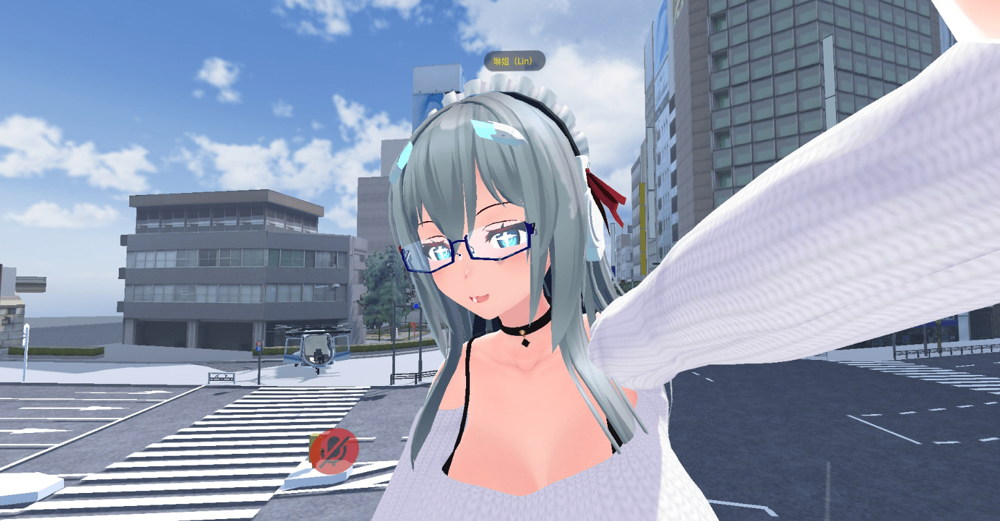
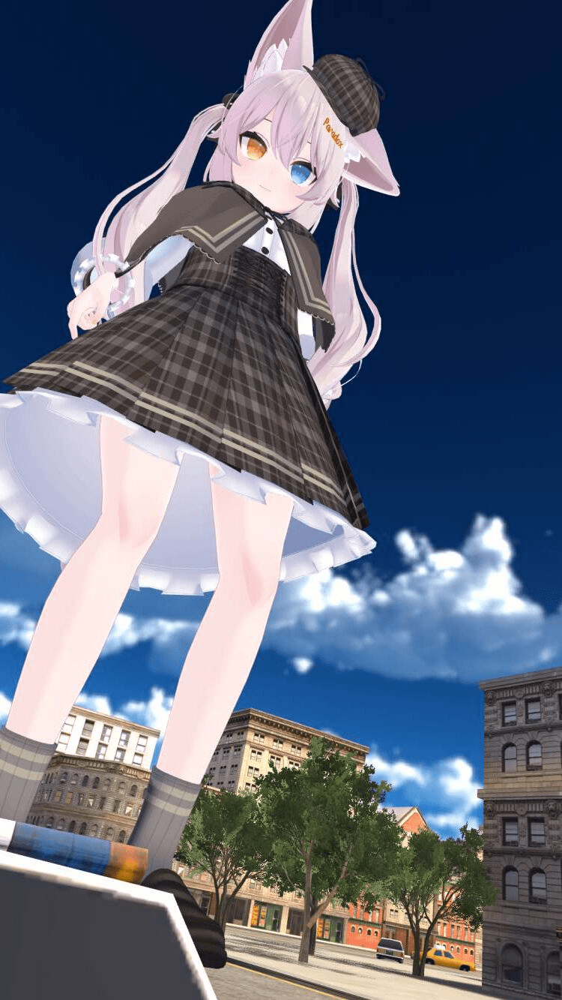
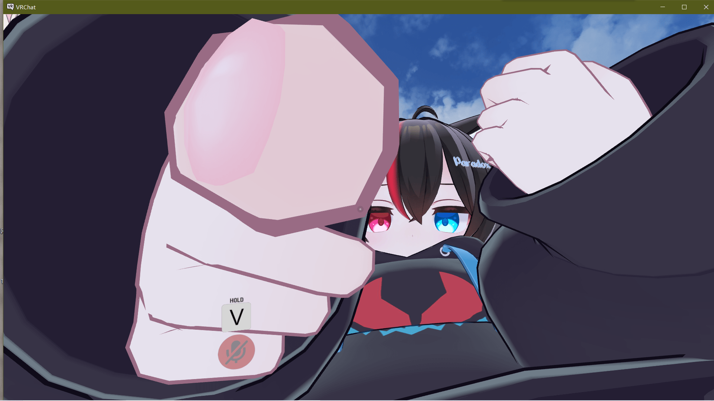
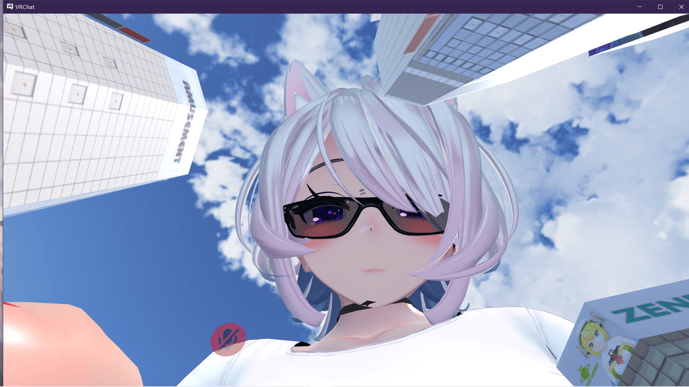
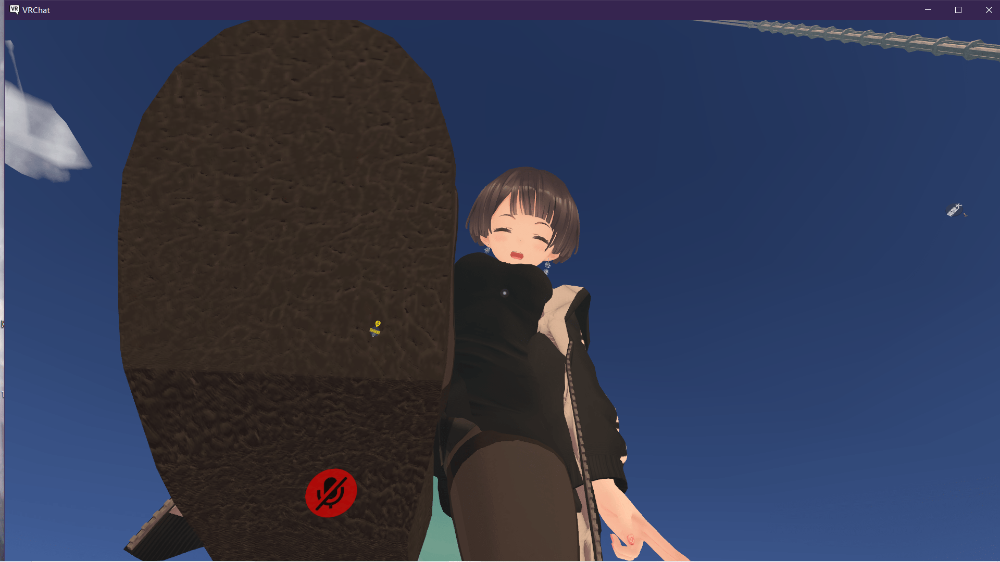

# 来说说VR看不同倍数巨大娘的感受

作者：hyperbeats

TID：32798

<title>1</title> <link href="../Styles/Style.css" type="text/css" rel="stylesheet">

# 1

*本帖最後由 s孙晓美 於 2022-3-6 00:17 編輯*

10~20倍体验是最好的 可以互动 双方也都能听见声音，是最推荐长期体验的大小。
<ignore_js_op>

**-17e8cd6e6e2c0de8.png** *(1.38 MB, 下載次數: 0)*

[下載附件](forum.php?mod=attachment&aid=OTQyNTN8MTM4YTE1YmV8MTY3NDA2NTYwMHwxODIzMHwzMjc5OA%3D%3D&nothumb=yes)

2022-3-6 00:01 上傳

100倍 开始非常有压迫感了。基本上没有交流了。但是小人还是有逃跑的空间。（VR中大模型摇杆移动慢）
如果有大楼楼顶之类的平台还是可以互动的，比如用手指指着小人，或者把嘴伸过来，假装要吃掉，但更多的时候是被胸部吞没。
<ignore_js_op>

**-29efa3721360651a.jpg** *(129.27 KB, 下載次數: 0)*

[下載附件](forum.php?mod=attachment&aid=OTQyNTZ8NmI1MDJkMzZ8MTY3NDA2NTYwMHwxODIzMHwzMjc5OA%3D%3D&nothumb=yes)

2022-3-6 00:03 上傳

   <ignore_js_op>

**屏幕截图(96).png** *(605.62 KB, 下載次數: 0)*

[下載附件](forum.php?mod=attachment&aid=OTQyNTd8YjIwOGNiMDR8MTY3NDA2NTYwMHwxODIzMHwzMjc5OA%3D%3D&nothumb=yes)

2022-3-6 00:05 上傳

1000倍和1000倍以上。这个阶段的体验感是恐惧，双方之间不可能有交流，你根本逃不出对方的活动范围。巨大娘随便动一动，无论是手指伸过来，还是脚踩下去一下子就把你吞噬到模型里面去了。经常性整个电脑屏幕全是是巨大娘的靴子，脚，手掌，脸。如果你站在地面上，基本上看不到全貌。费力跑开也看不到。尤其是VR恐惧感上升一个档次。（当然我有多恐惧就有多兴奋。）
<ignore_js_op>

**屏幕截图(127).png** *(1.9 MB, 下載次數: 0)*

[下載附件](forum.php?mod=attachment&aid=OTQyNTl8YjRlOTgwNTV8MTY3NDA2NTYwMHwxODIzMHwzMjc5OA%3D%3D&nothumb=yes)

2022-3-6 00:08 上傳

<ignore_js_op>

**屏幕截图(134).png** *(1.1 MB, 下載次數: 0)*

[下載附件](forum.php?mod=attachment&aid=OTQyNjB8OTlhZTJmMTJ8MTY3NDA2NTYwMHwxODIzMHwzMjc5OA%3D%3D&nothumb=yes)

注意看那个黄色的小点是飞在100米高空中的人

2022-3-6 00:09 上傳

可惜现在自己还没有用过50倍以上的巨大娘模型，如果以后用了来也会来说说巨大娘的VR体验。

<title>2</title> <link href="../Styles/Style.css" type="text/css" rel="stylesheet">

# 2

萌新请问一下，巨大娘由谁扮演的？ <title>3</title> <link href="../Styles/Style.css" type="text/css" rel="stylesheet">

# 3

> [speepian 發表於 2022-3-6 00:55](https://giantessnight.cf/gnforum2012/forum.php?mod=redirect&goto=findpost&pid=496602&ptid=32798)
> 萌新请问一下，巨大娘由谁扮演的？

琳姐giantess vrchat群里的全身大佬们啊
<title>4</title> <link href="../Styles/Style.css" type="text/css" rel="stylesheet">

# 4

想發圖片但是字節限制 限制了我的圖片XDD
<title>5</title> <link href="../Styles/Style.css" type="text/css" rel="stylesheet">

# 5

發點最近拍的圖片
100倍

1000倍

1000 VS 100

用魚眼鏡頭感覺比較拍得出效果(?   有對照物的話也比較有感覺(?

<title>6</title> <link href="../Styles/Style.css" type="text/css" rel="stylesheet">

# 6

> ref45628 發表於 2022-3-6 13:02
> 想發圖片但是字節限制 限制了我的圖片XDD

嗯，大佬，请问怎么用鱼眼拍摄呢？(๑╹ヮ╹๑)ﾉ
B站上有教程吗？ꉂ(ˊᗜˋ*)
效果确实好了很多呢。✧(≖ ◡ ≖✿) <title>7</title> <link href="../Styles/Style.css" type="text/css" rel="stylesheet">

# 7

> [s孙晓美 發表於 2022-3-6 13:38](https://giantessnight.cf/gnforum2012/forum.php?mod=redirect&goto=findpost&pid=496662&ptid=32798)
> 嗯，大佬，请问怎么用鱼眼拍摄呢？(๑╹ヮ╹๑)ﾉ
> B站上有教程吗？ꉂ(ˊᗜˋ*)
> 效果确实好了很多呢。✧( ...

其實也不一定比較好啦XD           怎麼用(?
1.買魚眼相機 [https://booth.pm/zh-tw/items/2147846](https://booth.pm/zh-tw/items/2147846)
2.然後用UNITY裝在自己的手上(綁在手的BONE上，可以再做個開關動畫)
3.上傳角色

<title>8</title> <link href="../Styles/Style.css" type="text/css" rel="stylesheet">

# 8

> [ref45628 發表於 2022-3-6 13:58](https://giantessnight.cf/gnforum2012/forum.php?mod=redirect&goto=findpost&pid=496667&ptid=32798)
> 其實也不一定比較好啦XD           怎麼用(?
> 1.買魚眼相機 [https://booth.pm/zh-tw/items/2147846](https://booth.pm/zh-tw/items/2147846)
> 2.然後 ...

好的_(:з」∠)_Unity还在学习 看来只能慢慢来了
<title>9</title> <link href="../Styles/Style.css" type="text/css" rel="stylesheet">

# 9

> [s孙晓美 發表於 2022-3-6 14:19](https://giantessnight.cf/gnforum2012/forum.php?mod=redirect&goto=findpost&pid=496671&ptid=32798)
> 好的_(:з」∠)_Unity还在学习 看来只能慢慢来了

50倍的可以白嫖，虽然很丑，但可以白嫖
<title>10</title> <link href="../Styles/Style.css" type="text/css" rel="stylesheet">

# 10

> [ref45628 發表於 2022-3-6 13:13](https://giantessnight.cf/gnforum2012/forum.php?mod=redirect&goto=findpost&pid=496658&ptid=32798)
> 發點最近拍的圖片
> 100倍

vrc的大佬是真的多啊，可怕，而且都是全身设备
<title>11</title> <link href="../Styles/Style.css" type="text/css" rel="stylesheet">

# 11

倍數好像可以用blender 和 unity 放大后上傳就可以了 <title>12</title> <link href="../Styles/Style.css" type="text/css" rel="stylesheet">

# 12

> [hyperbeats 發表於 2022-3-7 15:03](https://giantessnight.cf/gnforum2012/forum.php?mod=redirect&goto=findpost&pid=496798&ptid=32798)
> 倍數好像可以用blender 和 unity 放大后上傳就可以了

是的但是过程比想象中难 还在摸索中
<title>13</title> <link href="../Styles/Style.css" type="text/css" rel="stylesheet">

# 13

还是低倍数的最有感觉，有互动感和压迫感 <title>14</title> <link href="../Styles/Style.css" type="text/css" rel="stylesheet">

# 14

> [shengliyizhong 發表於 2022-3-15 03:25](https://giantessnight.cf/gnforum2012/forum.php?mod=redirect&goto=findpost&pid=497524&ptid=32798)
> 还是低倍数的最有感觉，有互动感和压迫感

100以内都不错 超过100目前来说互动性太差 虽然压迫感十足</ignore_js_op></ignore_js_op></ignore_js_op></ignore_js_op></ignore_js_op>