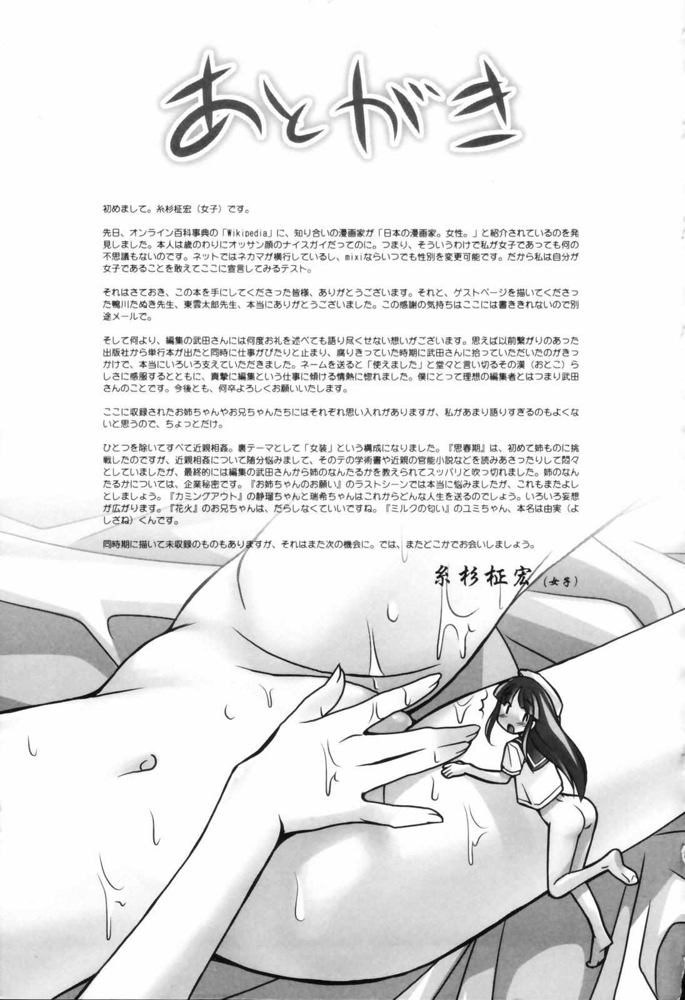

# 某作者的自畫像

作者：吸水恶魔

TID：18898

<title>1</title> <link href="../Styles/Style.css" type="text/css" rel="stylesheet">

# 1

看來她對於母親的感情是很深的
圖和原作的內容差很大
原作：變裝H 3P
<ignore_js_op>

**65476575173.jpg** *(520.53 KB, 下載次數: 3)*

[下載附件](forum.php?mod=attachment&aid=NTE2NzJ8ZmYyYTBlY2Z8MTY3NDA2ODA0N3wxODIzMHwxODg5OA%3D%3D&nothumb=yes)

2015-4-29 15:14 上傳

<title>2</title> <link href="../Styles/Style.css" type="text/css" rel="stylesheet">

# 2

本来还想求本子.
不过后面看到了糸杉柾宏,在exhentai上找到了这张图.
谢谢分享 <title>3</title> <link href="../Styles/Style.css" type="text/css" rel="stylesheet">

# 3

变装什么也要去接受的。 <title>4</title> <link href="../Styles/Style.css" type="text/css" rel="stylesheet">

# 4

恋母情结是么=表示无法接受== <title>5</title> <link href="../Styles/Style.css" type="text/css" rel="stylesheet">

# 5

戀母情結...........
覺得姐弟還能接受 <title>6</title> <link href="../Styles/Style.css" type="text/css" rel="stylesheet">

# 6

> [huang123ja 發表於 2015-4-29 15:32](https://giantessnight.cf/gnforum2012/forum.php?mod=redirect&goto=findpost&pid=253194&ptid=18898)
> 本来还想求本子.
> 不过后面看到了糸杉柾宏,在exhentai上找到了这张图.
> 谢谢分享 ...

求本子~~EX八点后上不去了
<title>7</title> <link href="../Styles/Style.css" type="text/css" rel="stylesheet">

# 7

后面没有内容了吗，求更多啊 <title>8</title> <link href="../Styles/Style.css" type="text/css" rel="stylesheet">

# 8

> [ZERO001 發表於 2015-4-29 20:07](https://giantessnight.cf/gnforum2012/forum.php?mod=redirect&goto=findpost&pid=253216&ptid=18898)
> 求本子~~EX八点后上不去了

去EXhentai搜索糸杉柾宏
或者直接百度

**[糸杉柾宏] お姉ちゃんのお願い-A Wish of my Sister**
<title>9</title> <link href="../Styles/Style.css" type="text/css" rel="stylesheet">

# 9

> [huang123ja 發表於 2015-4-30 11:38](https://giantessnight.cf/gnforum2012/forum.php?mod=redirect&goto=findpost&pid=253271&ptid=18898)
> 去EXhentai搜索糸杉柾宏
> 或者直接百度

＼（≧Д≦）＜十分感谢
<title>10</title> <link href="../Styles/Style.css" type="text/css" rel="stylesheet">

# 10

> [huang123ja 發表於 2015-4-30 11:38](https://giantessnight.cf/gnforum2012/forum.php?mod=redirect&goto=findpost&pid=253271&ptid=18898)
> 去EXhentai搜索糸杉柾宏
> 或者直接百度

非常感谢，只是看不懂0.0一定要好好学习日语。
<title>11</title> <link href="../Styles/Style.css" type="text/css" rel="stylesheet">

# 11

> [xsd00000000 發表於 2015-5-12 20:40](https://giantessnight.cf/gnforum2012/forum.php?mod=redirect&goto=findpost&pid=254434&ptid=18898)
> 非常感谢，只是看不懂0.0一定要好好学习日语。

其实我也不懂日语.
搜索作者这种事情,如果不是毫无线索,基本上只要你想去做,总能做到的.
那个图片上面的字我一个没看懂,但是作者名很明显.

<title>12</title> <link href="../Styles/Style.css" type="text/css" rel="stylesheet">

# 12

漫画蛮不错，糸杉柾宏画风一向很好，可以看看（撸撸）的 <title>13</title> <link href="../Styles/Style.css" type="text/css" rel="stylesheet">

# 13

恋母?....一般都是想到母亲就冷静下来了吧== <title>14</title> <link href="../Styles/Style.css" type="text/css" rel="stylesheet">

# 14

恋母?....一般都是想到母亲就冷静下来了吧== <title>15</title> <link href="../Styles/Style.css" type="text/css" rel="stylesheet">

# 15

我百度搜了半天找不到资源，有木有好心人能发个链接 <title>16</title> <link href="../Styles/Style.css" type="text/css" rel="stylesheet">

# 16

0.0恋母情节……表示喜欢御姐！！ <title>17</title> <link href="../Styles/Style.css" type="text/css" rel="stylesheet">

# 17

求本子。。。。E站上不去啊 <title>18</title> <link href="../Styles/Style.css" type="text/css" rel="stylesheet">

# 18

还是御姐题材比较好啊 <title>19</title> <link href="../Styles/Style.css" type="text/css" rel="stylesheet">

# 19

开始以为是要unbirth的节奏，看完本子完全不是.... <title>20</title> <link href="../Styles/Style.css" type="text/css" rel="stylesheet">

# 20

然后呢~一个图片？</ignore_js_op>