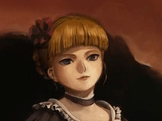
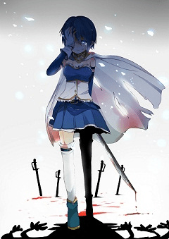
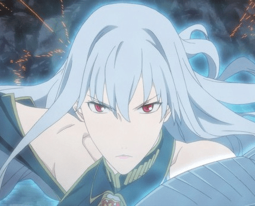

# 某坑爹的新作宣傳廣告（施工完畢）

作者：qiaolinger

TID：11222

<title>1</title> <link href="../Styles/Style.css" type="text/css" rel="stylesheet">

# 1

幾乎毀滅世界的戰爭結束兩百年后，艱難復興的人類文明遇上了常識之外的危機！！

殘酷而強大的　魔女，將人類視為　食糧！

×「就是這樣，諸位！請盡情起舞吧！」——無限之蛇之魔女，*梅朵麗塔*
<ignore_js_op>

**梅朵&#20029;塔.jpg** *(13.94 KB, 下載次數: 0)*

[下載附件](forum.php?mod=attachment&aid=MjY1MjB8YzdjYWQyYzV8MTY3NDA2ODc0MXwxODIzMHwxMTIyMg%3D%3D&nothumb=yes)

2011-10-20 21:27 上傳

飾演者：貝阿朵莉切（海貓鳴泣之時不是喵喵叫）

而英雄，自然會　　挺身而出！

×「我是劍，劍永不後退！」——青之騎士，*克萊薇雅*
<ignore_js_op>

**克&#33713;薇雅#.jpg** *(30.13 KB, 下載次數: 0)*

[下載附件](forum.php?mod=attachment&aid=MjY1MjF8NTVkMGE1Y2R8MTY3NDA2ODc0MXwxODIzMHwxMTIyMg%3D%3D&nothumb=yes)

2011-10-20 21:29 上傳

 飾演者：美樹沙耶加（魔法少女小圓沒有臉）

戰火蔓延，脆弱的人類也絕不會坐以待斃！

×「這是我們最後的尊嚴之戰！」——年輕的軍官，*歐文*中校
<ignore_js_op>

**&#27431;文中校.jpg** *(5.05 KB, 下載次數: 0)*

[下載附件](forum.php?mod=attachment&aid=MjY1MjJ8NDI4YTA1YzJ8MTY3NDA2ODc0MXwxODIzMHwxMTIyMg%3D%3D&nothumb=yes)

2011-10-20 21:30 上傳

飾演者：維魯金－鞏特（戰場的女乳神）

悲哀的戰鬥，帶來的只有傷痛，與仇恨

×「盧修斯哥哥，我又忘了自己是誰呢∼」——病床上的少女，*賽露拉塔*
<ignore_js_op>

**&#36187;露拉塔.jpg** *(28.16 KB, 下載次數: 0)*

[下載附件](forum.php?mod=attachment&aid=MjY1MjN8NWRjNWRlZDd8MTY3NDA2ODc0MXwxODIzMHwxMTIyMg%3D%3D&nothumb=yes)

2011-10-20 21:31 上傳

飾演者：間桐櫻（ＦＡＴＥ今晚留下來）

×「羅琳！我一定會殺了你！一定！！」——悔恨的男子，*盧修斯*
<ignore_js_op>

**&#21346;修斯.jpg** *(21.47 KB, 下載次數: 0)*

[下載附件](forum.php?mod=attachment&aid=MjY1Mjd8N2JmNWQzZDN8MTY3NDA2ODc0MXwxODIzMHwxMTIyMg%3D%3D&nothumb=yes)

2011-10-20 21:33 上傳

飾演者：間桐雁夜（ＦＡＴＥ零蛋）

阻擋在他們面前的，是無比強大的曾經的同伴

×「雲哥哥，這次，真的不會手下留情了哦？」——漆黑的城堡，*蓮*
<ignore_js_op>

**城堡 &#33714;#.jpg** *(8.23 KB, 下載次數: 0)*

[下載附件](forum.php?mod=attachment&aid=MjY1MjV8NTYxNzk0M2Z8MTY3NDA2ODc0MXwxODIzMHwxMTIyMg%3D%3D&nothumb=yes)

2011-10-20 21:33 上傳

飾演者：玲（空之詭計）

×「我很抱歉，但這只是立場問題，你必須死」——無心的列兵，*羅琳*
<ignore_js_op>

**列兵 &#32599;琳#.jpg** *(11.96 KB, 下載次數: 0)*

[下載附件](forum.php?mod=attachment&aid=MjY1MjZ8NWFhMTc3OGZ8MTY3NDA2ODc0MXwxODIzMHwxMTIyMg%3D%3D&nothumb=yes)

2011-10-20 21:33 上傳

飾演者：伊利亞－蘇菲兒（ＦＡＴＥ同人圖）

　　　　激烈的**廝殺**，宏大的**戰場**！

　　　　　　　　百名魔法少女組成的王之軍勢
　　　　　　　　　　　　　　ＶＳ
　　　　　　　　　　　　　　　大魔女構成的二十七祖

炮火紛飛，鋼鐵的部隊將面對神秘的魔力！

人類最後的希望就寄託在對決的雙方之上！

×「你終於來了」——蒼之女皇，***圖蕾帕***
<ignore_js_op>

**&#22270;蕾帕#.jpg** *(47.22 KB, 下載次數: 0)*

[下載附件](forum.php?mod=attachment&aid=MjY1Mjh8MGQzNzMxMzN8MTY3NDA2ODc0MXwxODIzMHwxMTIyMg%3D%3D&nothumb=yes)

2011-10-20 21:34 上傳

飾演者：塞爾貝莉亞（戰場的女乳神）

×「我來了，圖蕾帕，這一次．．．．．．」——炎之王，***云閑之***
<ignore_js_op>

**云&#38386;之.jpg** *(59.99 KB, 下載次數: 0)*

[下載附件](forum.php?mod=attachment&aid=MjY1Mjl8MDNjNDc1MDl8MTY3NDA2ODc0MXwxODIzMHwxMTIyMg%3D%3D&nothumb=yes)

2011-10-20 21:35 上傳

飾演者：七夜志貴（月基）

「這一次，我絕對會殺了你！」
「這一次，我真的會殺了你！」

多結局模式！到底何種結局才是命運石頭門的選擇呢？

×「一切無法再作改變，我們能做的，只有祈禱而已」——學院派領袖，**校長**
<ignore_js_op>

**校&#38271;#.jpg** *(6.81 KB, 下載次數: 0)*

[下載附件](forum.php?mod=attachment&aid=MjY1MzB8OTZiODU1YWR8MTY3NDA2ODc0MXwxODIzMHwxMTIyMg%3D%3D&nothumb=yes)

2011-10-20 21:35 上傳

飾演者：愛爾奎特－布倫史塔德（月雞）

年度大作！
演員陣容異常強（坑爹）大！
 愛情，友情，親情，基情

復仇，寬恕，責任，自由

盡在——

　　　　　　　　　　　魔法少女*學院派*
 編劇及導演及企劃及宣傳：一聽這頭銜就覺得累得和狗一樣的小劍

ＰＳ：以上角色均與實際或非實際人物毫無關聯，如有雷同，那是肯定的

特別鳴謝：友情出演便當角色湯姆大叔
<ignore_js_op>

**&#36711;&#38388;&#32418;摩.jpg** *(9.04 KB, 下載次數: 0)*

[下載附件](forum.php?mod=attachment&aid=MjY1MjR8ODBjZmU1MTR8MTY3NDA2ODc0MXwxODIzMHwxMTIyMg%3D%3D&nothumb=yes)

2011-10-20 21:32 上傳

的軋間紅摩先生

PS2: 第一章好評發售中！

[ *本帖最後由 小劍 於 2011-10-20 22:56 編輯* ] <title>2</title> <link href="../Styles/Style.css" type="text/css" rel="stylesheet">

# 2

萎二斤躺着也中枪

o(╯□╰)o，期待楼主新作。 <title>3</title> <link href="../Styles/Style.css" type="text/css" rel="stylesheet">

# 3

哇塞- -
好豪华的预告。。
难道要出现ova品质的tv连载文么！

[ *本帖最後由 毒蛋白 於 2011-10-20 22:07 編輯* ] <title>4</title> <link href="../Styles/Style.css" type="text/css" rel="stylesheet">

# 4

前排围观 <title>5</title> <link href="../Styles/Style.css" type="text/css" rel="stylesheet">

# 5

好多型月又见型月…… <title>6</title> <link href="../Styles/Style.css" type="text/css" rel="stylesheet">

# 6

我表示直接被楼主弄燃了啊啊啊啊啊 <title>7</title> <link href="../Styles/Style.css" type="text/css" rel="stylesheet">

# 7

有紅遍全球的氣勢，加油! <title>8</title> <link href="../Styles/Style.css" type="text/css" rel="stylesheet">

# 8

我第一次見到，有人可以把坑開得如此華麗 <title>9</title> <link href="../Styles/Style.css" type="text/css" rel="stylesheet">

# 9

我就是来贴个图，小圆脸真神作+10086。 <title>10</title> <link href="../Styles/Style.css" type="text/css" rel="stylesheet">

# 10

 <ignore_js_op>[30adcbef76094b3628ffdfb2a3cc7cd98d109d04.jpg](forum.php?mod=attachment&aid=MjY1MzF8MTEzMDAwN2N8MTY3NDA2ODc0MXwxODIzMHwxMTIyMg%3D%3D&nothumb=yes) *(36.15 KB, 下載次數: 0)*

[下載附件](forum.php?mod=attachment&aid=MjY1MzF8MTEzMDAwN2N8MTY3NDA2ODc0MXwxODIzMHwxMTIyMg%3D%3D&nothumb=yes)

2011-10-21 00:37 上傳  

</ignore_js_op> <title>11</title> <link href="../Styles/Style.css" type="text/css" rel="stylesheet">

# 11

這個比文章本體還華麗有木有！

羅琳是誰！這貨絕對不是伊莉亞！這不可棱！

（話說真練起來王軍明顯不夠看啊，27祖前列的應該無壓力取勝吧

校長果然是神隱黑幕，無論在哪裡都是如此

（又話說文章標題跟那麼大氣的宣傳好像掛不上鉤啊……||| <title>12</title> <link href="../Styles/Style.css" type="text/css" rel="stylesheet">

# 12

OMG，坑开大了，怎么会有一种抱头转身就跑的感觉
华丽丽的好虚幻。。。 <title>13</title> <link href="../Styles/Style.css" type="text/css" rel="stylesheet">

# 13

卧槽这是天坑啊
楼主你究竟多控TYPE-MOON……
那是伊利亚么？我怎么感觉那么像太太。（太太我喜欢你啊~）
如果楼主挂在了坑里，老虚会来鞭尸的，一定 <title>14</title> <link href="../Styles/Style.css" type="text/css" rel="stylesheet">

# 14

聽起來就很過癮啊
希望成品別讓我等失望
不考慮加入G秋葉嗎? <title>15</title> <link href="../Styles/Style.css" type="text/css" rel="stylesheet">

# 15

城牆擴建了。
偉大的劍爺站崗城樓。
萬里坑爹長城的磚塊，都是壹個坑掉角色的頭像。我，這個流放到萬里長城以外當搬運工的人，產生了壹些感想。
擴建真的能抵抗壹切入侵嗎?自從命運石座存在那時間，巨大少女就逐漸從Gn帝國隱沒。現在餘數的巨大少女，只不過是偽巨大少女而已。這施工完畢的長城，真能拯救GN萬民免於「伸手帝來yooo之時」

-那個漫天資源飛舞、妹子被伸手帝帶隊的伸手黨凌辱至渣的黑暗時代?
壹切壹切使我頭昏腦脹，曾經，我是壹個寫手卻完成不了城牆，留下無數坑洞，被世人辱罵、遺忘。現在GN的人民可以寄予劍爺壹個厚望，建成萬里坑爹長城-小劍段嗎?
這壹班角色的頭像，壹個都不知道是誰。我們祈求小圓真神的保護，他們真的趕緊在伸手帝侵略之前建成。 

[ *本帖最後由 wtman 於 2011-10-21 12:38 編輯* ] <title>16</title> <link href="../Styles/Style.css" type="text/css" rel="stylesheet">

# 16

魂淡，這不是坑口牙！
明明已經有一章了！</ignore_js_op></ignore_js_op></ignore_js_op></ignore_js_op></ignore_js_op></ignore_js_op></ignore_js_op></ignore_js_op></ignore_js_op></ignore_js_op></ignore_js_op>