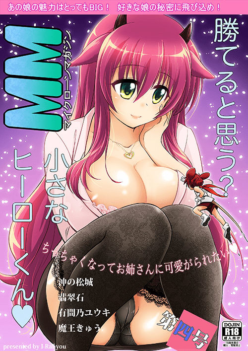

# 某杂志第四期的封面很吸引人，不觉得吗~

作者：月月月月食

TID：12900

<title>1</title> <link href="../Styles/Style.css" type="text/css" rel="stylesheet">

# 1

目测这期画风会很GJ <title>2</title> <link href="../Styles/Style.css" type="text/css" rel="stylesheet">

# 2

 <ignore_js_op>[mm4_p1.jpg](forum.php?mod=attachment&aid=Mjk5MjB8ZjliZWE1YmV8MTY3NDA2ODY0OXwxODIzMHwxMjkwMA%3D%3D&nothumb=yes) *(229 KB, 下載次數: 5)*

[下載附件](forum.php?mod=attachment&aid=Mjk5MjB8ZjliZWE1YmV8MTY3NDA2ODY0OXwxODIzMHwxMjkwMA%3D%3D&nothumb=yes)

2012-7-26 22:45 上傳  

</ignore_js_op> <title>3</title> <link href="../Styles/Style.css" type="text/css" rel="stylesheet">

# 3

看上去第四期給力多了，期待GJ <title>4</title> <link href="../Styles/Style.css" type="text/css" rel="stylesheet">

# 4

自从有了 EXHENTAI,妈妈再也不担心找不到本子
！ <title>5</title> <link href="../Styles/Style.css" type="text/css" rel="stylesheet">

# 5

剛看完第3部

期待第4部了 這封面 <title>6</title> <link href="../Styles/Style.css" type="text/css" rel="stylesheet">

# 6

貌似有人已经弄到第四部翻成中文版了...要40RMB
我能搞到的只有日文版... <title>7</title> <link href="../Styles/Style.css" type="text/css" rel="stylesheet">

# 7

好快 哪里找的呢？

ex上还没的说 <title>8</title> <link href="../Styles/Style.css" type="text/css" rel="stylesheet">

# 8

我想知道这个杂志的一，二两部为什么没有流传出来？至少我没在论坛里发现，如果有能告诉我在那吗？ <title>9</title> <link href="../Styles/Style.css" type="text/css" rel="stylesheet">

# 9

第一本我有在某個網站看到漢化的
只是我忘記在哪了…
第二本就真的連影子都沒有