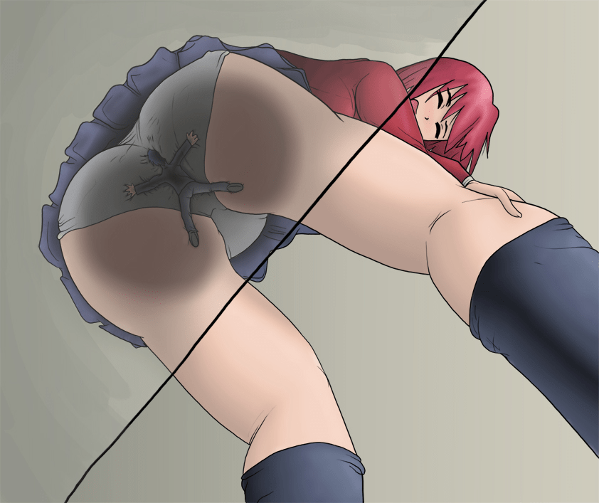

# 某貓的春節紅包【洗臉后再進限定】

作者：小邪神

TID：16094

<title>1</title> <link href="../Styles/Style.css" type="text/css" rel="stylesheet">

# 1

嗯，馬上我們即將迎來嶄新的一年……
鑒於某蛋丁不打算广派紅包，那今年就由某貓來代勞了……
嗯，見者有份……

是不可能的。

基本規則就是——搶樓，搶到的會有5G幣的獎勵。總共50個，搶到搶不到全看你們的運氣了～～～

追加特權：某幾位特定人士認真回覆后，會有100%中獎的額外獎勵。嗯～

另：嚴禁為了拿紅包給我這裡連續炸樓！
我會認真看每層的，亂玩的小心我倒扣分……哼哼 <title>2</title> <link href="../Styles/Style.css" type="text/css" rel="stylesheet">

# 2

发红包的话，真相只有一个！那就是傻大猫已经脱X了！（赶紧拿了红包闪人！

其实我更想要五枚金币，西班牙的 <title>3</title> <link href="../Styles/Style.css" type="text/css" rel="stylesheet">

# 3

在床上刚睡醒就看见猫大哥在群里说红包 果断求红包〜
然后过了几分钟就发地址了〜
中国好猫好大哥。
vicky在这提前祝大家新年快乐哈。 <title>4</title> <link href="../Styles/Style.css" type="text/css" rel="stylesheet">

# 4

5G?留個言就有........... <title>5</title> <link href="../Styles/Style.css" type="text/css" rel="stylesheet">

# 5

谢谢红包，祝你新年快乐。 <title>6</title> <link href="../Styles/Style.css" type="text/css" rel="stylesheet">

# 6

5G,可以吃馄饨了，午饭有着落了。 <title>7</title> <link href="../Styles/Style.css" type="text/css" rel="stylesheet">

# 7

红包吗。。好想要啊。该说什么呢。。。。。。。
祝猫哥：新年快乐，身体健康，万事如意，恭喜发财，红包拿来 <title>8</title> <link href="../Styles/Style.css" type="text/css" rel="stylesheet">

# 8

 新春我也有东西

 现在进度百分之五十 <title>9</title> <link href="../Styles/Style.css" type="text/css" rel="stylesheet">

# 9

是不是回复会有系统的40GB奖励的来着？ <title>10</title> <link href="../Styles/Style.css" type="text/css" rel="stylesheet">

# 10

原来是妹子才有百分百的中奖率吗！？？？
大猫我也是妹子求包养啊！
等等才5G？
坑爹呐摔 <title>11</title> <link href="../Styles/Style.css" type="text/css" rel="stylesheet">

# 11

猫叔发红包了，到底是什么，肯德基套餐还是mmd视频合集？ <title>12</title> <link href="../Styles/Style.css" type="text/css" rel="stylesheet">

# 12

- -建议抢送奖励点（打死 <title>13</title> <link href="../Styles/Style.css" type="text/css" rel="stylesheet">

# 13

金币是什么..能吃吗
.. <title>14</title> <link href="../Styles/Style.css" type="text/css" rel="stylesheet">

# 14

虽然明白只有妹子才有百分百空手入G币的设定。也来凑个热闹 <title>15</title> <link href="../Styles/Style.css" type="text/css" rel="stylesheet">

# 15

发红包....5G红包..可以升级到5GB的红包么~
凑个热闹吧= =这玩意是不是只有妹子才有...
算了，新年快乐~~ <title>16</title> <link href="../Styles/Style.css" type="text/css" rel="stylesheet">

# 16

領紅包啦~~~5G(差點看成5獎勵點) <title>17</title> <link href="../Styles/Style.css" type="text/css" rel="stylesheet">

# 17

春节还有抢红包这种好事！！必须抢楼啊 <title>18</title> <link href="../Styles/Style.css" type="text/css" rel="stylesheet">

# 18

-。=卧槽。。二连了。我不是故意的！orz <title>19</title> <link href="../Styles/Style.css" type="text/css" rel="stylesheet">

# 19

回复5G几率10%麽...
RP一直不好来试试..  23333
话说春节红包= =... <title>20</title> <link href="../Styles/Style.css" type="text/css" rel="stylesheet">

# 20

*本文章最後由 暗影使者 於 2014-1-27 15:54 編輯*

话说，因为看到发红包···
所以我就来了···
来碰碰运气试试会不会得到5g···
嗯，就是这样···

突然想到，如果没得到的话，删去刚刚的发言···
然后从新发，一直如此，会不会得到5g呢··· <title>21</title> <link href="../Styles/Style.css" type="text/css" rel="stylesheet">

# 21

新人路过，求脸熟，红包，是不是把自己包在饺子里被吃下去啊，！！！好期待的感觉 <title>22</title> <link href="../Styles/Style.css" type="text/css" rel="stylesheet">

# 22

感觉有些奇怪，5G么......
不过还是来凑热闹了。
妹子100%中包这个设定暴露了某猫的本性.....
虽然如此，
嗯，
新年快乐~

<title>23</title> <link href="../Styles/Style.css" type="text/css" rel="stylesheet">

# 23

*本文章最後由 月食 於 2014-1-27 16:24 編輯*

5G而且还是百分之10，肿么说呢。。完全不够看的呀
另外 新年快乐~ <title>24</title> <link href="../Styles/Style.css" type="text/css" rel="stylesheet">

# 24

好厉害的红包！很超值呢！回复后10%中得5G币另外无条件附加40G+20名声，回报率超高！

另，楼上好厉害！貌似是第一个拿到回复奖励的呢！ <title>25</title> <link href="../Styles/Style.css" type="text/css" rel="stylesheet">

# 25

24楼好厉害...从头翻到尾就看起来好像就这一个中的 <title>26</title> <link href="../Styles/Style.css" type="text/css" rel="stylesheet">

# 26

凑个热闹，讨个彩头。 <title>27</title> <link href="../Styles/Style.css" type="text/css" rel="stylesheet">

# 27

虽然现在不知道G币怎么花完，但秉着不拿白不拿的想法，我还是回吧 <title>28</title> <link href="../Styles/Style.css" type="text/css" rel="stylesheet">

# 28

10%等於是10個人中會中一個
目前看下來很符合這個機率=口=
但基於有機會拿到贈品卻下不拿的話~有違個人原則XD
雖然賭運一直不好~但還是要抽看看啦XD

在這邊也先祝福論壇的各位同好們~新年快樂~也祝大家馬年"駿馬奔騰來報喜，萬事順新又如意"~ <title>29</title> <link href="../Styles/Style.css" type="text/css" rel="stylesheet">

# 29

求獎勵點紅包((大誤
上面是開玩笑的..不過也祝樓主新年快樂，寫文順利啊XDD
話說未填坑的作者群可以多塞點稿費給他們@@ <title>30</title> <link href="../Styles/Style.css" type="text/css" rel="stylesheet">

# 30

浮出水面领红包~希望讨个好彩头~大家大吉大利咯~ <title>31</title> <link href="../Styles/Style.css" type="text/css" rel="stylesheet">

# 31

新年快乐，领红包咯~ <title>32</title> <link href="../Styles/Style.css" type="text/css" rel="stylesheet">

# 32

新人路过，春节快乐~ <title>33</title> <link href="../Styles/Style.css" type="text/css" rel="stylesheet">

# 33

哼！才5GB！我才不要，回复这一楼就有40+恩？！X大猫你干啥？！手里拿着斧子是啥意思？！别......别砍我！！（逃.......... <title>34</title> <link href="../Styles/Style.css" type="text/css" rel="stylesheet">

# 34

我绝对不是那种 阿谀奉承的人
我的话 也不会像他们那样 说 那么多
我是一个 内向的人
一般不说太多的话
<ignore_js_op>

**71882 - anime blue_eyes butt_crush clothed giantess micro panties pink_hair pink.jpg** *(321.48 KB, 下載次數: 0)*

[下載附件](forum.php?mod=attachment&aid=NDA0Nzd8Y2EwMGIzYjJ8MTY3NDA2OTA2N3wxODIzMHwxNjA5NA%3D%3D&nothumb=yes)

2014-1-27 23:37 上傳

    <ignore_js_op>

**3734 - anime butt butt_crush color crush drawing giantess glass japanese panties.jpg** *(230.51 KB, 下載次數: 0)*

[下載附件](forum.php?mod=attachment&aid=NDA0Nzl8ODdiYWU5MGN8MTY3NDA2OTA2N3wxODIzMHwxNjA5NA%3D%3D&nothumb=yes)

2014-1-27 23:38 上傳

我话一般很少贡献的却很多
如果有人 可以看到的话。。。。
总而言之   新年快乐（貌似离新年还差几天） <title>35</title> <link href="../Styles/Style.css" type="text/css" rel="stylesheet">

# 35

 <ignore_js_op>[71882 - anime blue_eyes butt_crush clothed giantess micro panties pink_hair pink.jpg](forum.php?mod=attachment&aid=NDA0Nzh8NjI0MjgxZTV8MTY3NDA2OTA2N3wxODIzMHwxNjA5NA%3D%3D&nothumb=yes) *(321.48 KB, 下載次數: 0)*

[下載附件](forum.php?mod=attachment&aid=NDA0Nzh8NjI0MjgxZTV8MTY3NDA2OTA2N3wxODIzMHwxNjA5NA%3D%3D&nothumb=yes)

2014-1-27 23:37 上傳  

</ignore_js_op> <title>36</title> <link href="../Styles/Style.css" type="text/css" rel="stylesheet">

# 36

艾玛，这果断是要几率越来越低的节奏吧
预祝猫大新春快乐（龇牙笑 <title>37</title> <link href="../Styles/Style.css" type="text/css" rel="stylesheet">

# 37

> 447825856 發表於 2014-1-27 23:29 
> 哼！才5GB！我才不要，回复这一楼就有40+恩？！X大猫你干啥？！手里拿着斧子是啥意思？！别......别 ...

秦受填坑+1

开错回复方式了=。= <title>38</title> <link href="../Styles/Style.css" type="text/css" rel="stylesheet">

# 38

深夜预习高数逛逛论坛发现福利帖诶嘿嘿~
来试一下人品咯~
今天脸不错开出了金希尔瓦娜斯分了3200心情超好~
另外..弱弱地问一句..炸楼是什么？ <title>39</title> <link href="../Styles/Style.css" type="text/css" rel="stylesheet">

# 39

認真
....是这个意思？
<title>40</title> <link href="../Styles/Style.css" type="text/css" rel="stylesheet">

# 40

支持～ <title>41</title> <link href="../Styles/Style.css" type="text/css" rel="stylesheet">

# 41

什么情况。。。。。哦哦 新年快乐 快乐就好 <title>42</title> <link href="../Styles/Style.css" type="text/css" rel="stylesheet">

# 42

我这种潜水后现在冒出来是不是很欠扁....新年快乐ˊ_>ˋ无论如何 <title>43</title> <link href="../Styles/Style.css" type="text/css" rel="stylesheet">

# 43

红包红包？来讨个喜气 <title>44</title> <link href="../Styles/Style.css" type="text/css" rel="stylesheet">

# 44

还有两天就过年了...可我还在医院（大家要保重身体呵）
总之，无论如何，甲午马年快乐*^_^*
<title>45</title> <link href="../Styles/Style.css" type="text/css" rel="stylesheet">

# 45

lz新年快乐 <title>46</title> <link href="../Styles/Style.css" type="text/css" rel="stylesheet">

# 46

红包在哪里 <title>47</title> <link href="../Styles/Style.css" type="text/css" rel="stylesheet">

# 47

(*一*)敲碗要福利

(* *)中奖就可以和猫爷做羞羞的事情了么

(#—#)说吧一个晚上多少钱从我住注册时间里扣吧 <title>48</title> <link href="../Styles/Style.css" type="text/css" rel="stylesheet">

# 48

新年快乐，就是5G币少了点…… <title>49</title> <link href="../Styles/Style.css" type="text/css" rel="stylesheet">

# 49

红包无爱，希望祝福送到了才是真 <title>50</title> <link href="../Styles/Style.css" type="text/css" rel="stylesheet">

# 50

你看看樓上覺悟多高，所以才拿到了紅包
再看看你們，嘖嘖（恨鐵不成鋼的三叔父表情

（所以說回帖的money比獎勵的還多啊喂！這個設定是鬧哪樣！果然還是形式主義麼啊哈！ <title>51</title> <link href="../Styles/Style.css" type="text/css" rel="stylesheet">

# 51

某人表示看得一頭霧水。
以上。 <title>52</title> <link href="../Styles/Style.css" type="text/css" rel="stylesheet">

# 52

我來不是為了紅包
而是因為我開了一個新坑，嗯 <title>53</title> <link href="../Styles/Style.css" type="text/css" rel="stylesheet">

# 53

新年快樂
貓大恭喜發財,紅包拿來 <title>54</title> <link href="../Styles/Style.css" type="text/css" rel="stylesheet">

# 54

真的嗎那就太好了5GB 不知會是什麼很期待
人品爆發 哈哈 <title>55</title> <link href="../Styles/Style.css" type="text/css" rel="stylesheet">

# 55

新春快乐 还在苦逼复习考试 唉 考试怎么这么多啊
不过考完这科就可以高高兴兴过春节啦啦啦啦 <title>56</title> <link href="../Styles/Style.css" type="text/css" rel="stylesheet">

# 56

猫叔，新年快乐！！！ <title>57</title> <link href="../Styles/Style.css" type="text/css" rel="stylesheet">

# 57

新年快乐！其实我是来混红包的 <title>58</title> <link href="../Styles/Style.css" type="text/css" rel="stylesheet">

# 58

来得早不如来得巧嘛~ 猫大给红包 <title>59</title> <link href="../Styles/Style.css" type="text/css" rel="stylesheet">

# 59

好像有人拿得比較多呢

嗚嗚，我也好像拿比較多
<title>60</title> <link href="../Styles/Style.css" type="text/css" rel="stylesheet">

# 60

求红包啊，求红包，新年快乐！ <title>61</title> <link href="../Styles/Style.css" type="text/css" rel="stylesheet">

# 61

特定人物前来，呼呼呼…… <title>62</title> <link href="../Styles/Style.css" type="text/css" rel="stylesheet">

# 62

一年又一年，祝各位马到成功，新年快乐! <title>63</title> <link href="../Styles/Style.css" type="text/css" rel="stylesheet">

# 63

作为一个新人今天才知道有这事，不知道有没有来晚啊。 <title>64</title> <link href="../Styles/Style.css" type="text/css" rel="stylesheet">

# 64

新年快乐，我的真正目的是红包…… <title>65</title> <link href="../Styles/Style.css" type="text/css" rel="stylesheet">

# 65

给GN的各位拜个晚年，祝大家新年快乐
<title>66</title> <link href="../Styles/Style.css" type="text/css" rel="stylesheet">

# 66

新年快乐！（不知道还有没有红包领啊） <title>67</title> <link href="../Styles/Style.css" type="text/css" rel="stylesheet">

# 67

祝大家新年快乐 <title>68</title> <link href="../Styles/Style.css" type="text/css" rel="stylesheet">

# 68

现在还是春节吧,现在应该还有吧.
其实我是来骗积分的... <title>69</title> <link href="../Styles/Style.css" type="text/css" rel="stylesheet">

# 69

还有我的份吗 <title>70</title> <link href="../Styles/Style.css" type="text/css" rel="stylesheet">

# 70

新人助各位新年快樂(好像有點晚了... <title>71</title> <link href="../Styles/Style.css" type="text/css" rel="stylesheet">

# 71

我才不是为了红包进来的呢！
祝大家新春快乐，新年被缩小哦 <title>72</title> <link href="../Styles/Style.css" type="text/css" rel="stylesheet">

# 72

祝你新年快乐 <title>73</title> <link href="../Styles/Style.css" type="text/css" rel="stylesheet">

# 73

不知道是否来晚了
祝楼主新年快乐</ignore_js_op></ignore_js_op>