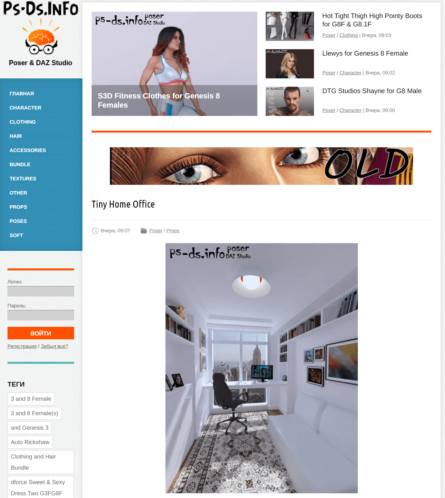
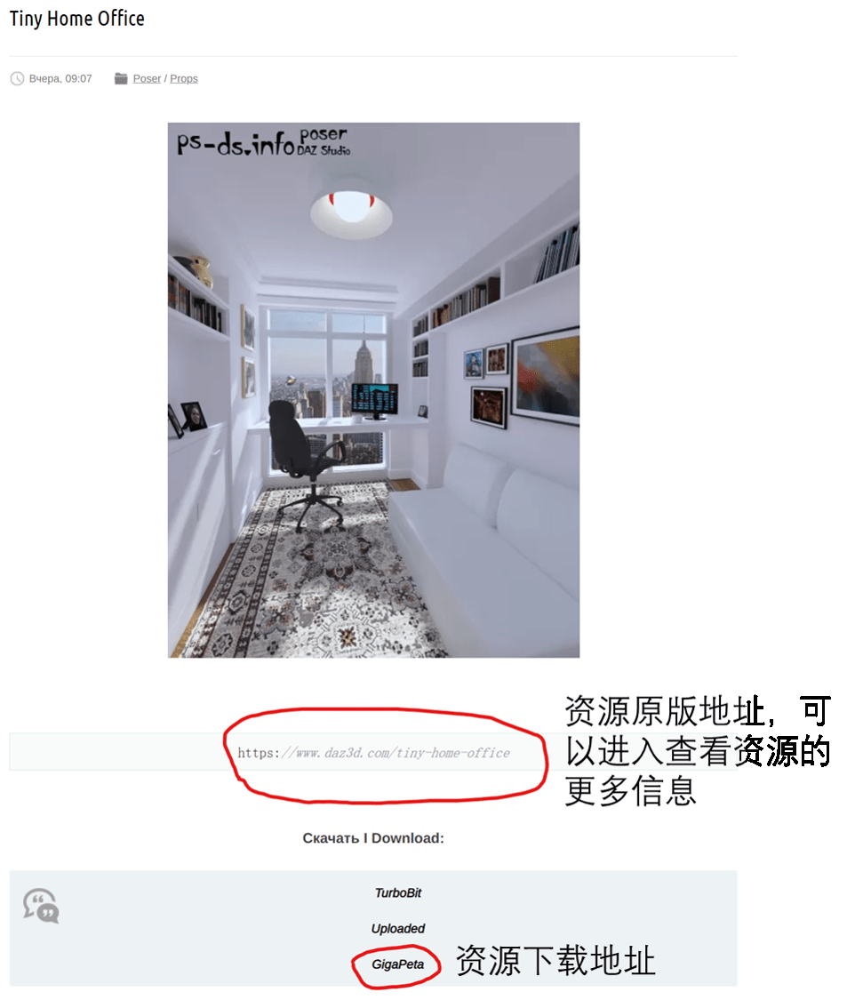

# 查找并下载DAZ模型的方法

作者：awkeygen

TID：31383

<title>1</title> <link href="../Styles/Style.css" type="text/css" rel="stylesheet">

# 1

*本帖最後由 awkeygen 於 2021-8-2 00:15 編輯*

随着3D技术的发展，DAZ由于其简易的操作及请内置iray渲染器的照片级渲染效果，已经成为目前GTS领域主流的制作软件之一。
对于DAZ创作者来说，资源的查找和获取是完成创作的关键，在这里，作者结合自己的经验，给大家分享DAZ资源的查阅与下载方法。
目前，制作DAZ模型的公司众多，在这里，我经常使用的是下面的网站去浏览3D模型文件：
https://ps-ds.info/
这个网站完全免费下载，而且更新迅速，实质上之前有很多类似的网站，但是都逐渐被封。
进入[https://ps-ds.info/](https://ps-ds.info/)之后，我们会看到如下网页：
<ignore_js_op>

**01.png** *(1.61 MB, 下載次數: 0)*

[下載附件](forum.php?mod=attachment&aid=OTAwNzN8MjlmMGZhNGF8MTY3NDA2OTU5NnwxODIzMHwzMTM4Mw%3D%3D&nothumb=yes)

2021-8-1 17:25 上傳

这个网站已经为大家做好的分类，其意义依次为
1\. character ：这个是人物模型文件，如基础模、人物变形包等
2\. clothing：服饰，鞋等
3\. hair：发型
4\. accessories：主要是各种小挂件，比如首饰
5\. bundle：这个是合集，通常是DAZ针对某一模型开发的3D模型合集
6\. texture：材质，建议大家多下载，这个对渲染效果提升很大
7\. props：场景及各种物件，场景是制图的关键，这个毋庸置疑
8\. pose：预制动作，可以大幅度地降低摆pose的工作量
——————————————————————————————————————————————
那么如何去下载资源呢？
以上图的资源为例，点击资源标题，进入至如下界面
<ignore_js_op>

**图片2.png** *(523.85 KB, 下載次數: 0)*

[下載附件](forum.php?mod=attachment&aid=OTAwNzZ8YmE5ZGRlM2V8MTY3NDA2OTU5NnwxODIzMHwzMTM4Mw%3D%3D&nothumb=yes)

2021-8-1 17:40 上傳

但是，这个网站里提供的是俄罗斯的某网盘，下载速度较慢，如何高速下载资源呢？
在这里，推荐两个网站：
https://daz3ddl.com/
http://daz.lianghuadashi.com/
这两个是国内的两个搬运网站，他们的主要工作就是把这些资源搬运到国内自己的网站上卖，如果长期创作，建议在这两个网站上充VIP(几百元)，他们均提供百度网盘下载。
以上就是DAZ的模型下载方法，希望能对大家的创作有帮助。

<title>2</title> <link href="../Styles/Style.css" type="text/css" rel="stylesheet">

# 2

感謝大佬用心推

可惜晚了點...
我這年4月開始學MMD到現在
已經不想再換軟件了QQ <title>3</title> <link href="../Styles/Style.css" type="text/css" rel="stylesheet">

# 3

有一说一 俄罗斯的那几个网盘都是垃圾中的战斗机，限制比百度网盘还离谱，也乱删用户文件，而且价格还死贵。相比之下百度网盘算极为良心的了，不明白为什么他们不用mega或者onedrive这些网盘 <title>4</title> <link href="../Styles/Style.css" type="text/css" rel="stylesheet">

# 4

> [lollollyt 發表於 2021-8-1 21:42](https://giantessnight.cf/gnforum2012/forum.php?mod=redirect&goto=findpost&pid=475359&ptid=31383)
> 有一说一 俄罗斯的那几个网盘都是垃圾中的战斗机，限制比百度网盘还离谱，也乱删用户文件，而且价格还死贵 ...

之前是有用mega的，但是后来都被查封了。
<title>5</title> <link href="../Styles/Style.css" type="text/css" rel="stylesheet">

# 5

A大好久不见，那我也推荐一个好了
[https://render-state.to/](https://render-state.to/)
难得两年多了还没被封锁，而且还是Google和Mega网盘的

不过因为这些都是盗版素材，实际用的话还是有点担心的 <title>6</title> <link href="../Styles/Style.css" type="text/css" rel="stylesheet">

# 6

感谢大佬的分享和指引，这样可以更方便的寻找和下载资源了。</ignore_js_op></ignore_js_op>