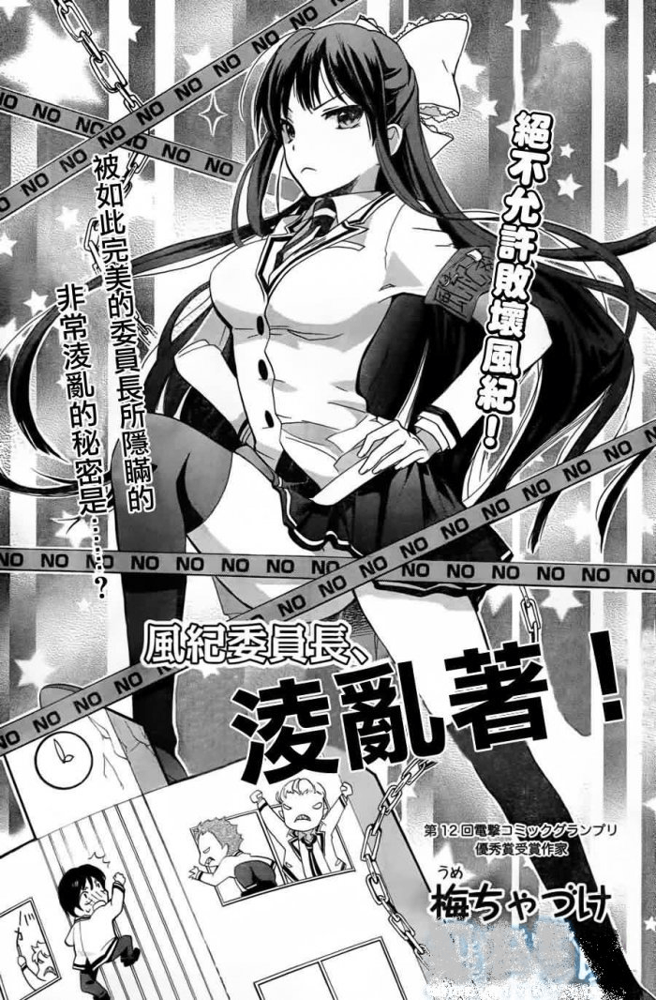

# 樓房踐踏擦邊

作者：luffyoo

TID：18875

<title>1</title> <link href="../Styles/Style.css" type="text/css" rel="stylesheet">

# 1

感覺現在的封面
某些越來越往這邊靠攏
不知道是不是錯覺呢
女主角的祕密就是沒有穿內褲
<ignore_js_op>

**forum.jpg** *(226.71 KB, 下載次數: 6)*

[下載附件](forum.php?mod=attachment&aid=NTE2MjB8NThlNDJkMjV8MTY3NDA2Nzk1NXwxODIzMHwxODg3NQ%3D%3D&nothumb=yes)

2015-4-25 11:55 上傳

<title>2</title> <link href="../Styles/Style.css" type="text/css" rel="stylesheet">

# 2

确实...感觉这个楼房和小人的比例有点不太正确...不过Q版就无所谓了... <title>3</title> <link href="../Styles/Style.css" type="text/css" rel="stylesheet">

# 3

这漫貌似叫 风纪委员长败坏风纪 来着? <title>4</title> <link href="../Styles/Style.css" type="text/css" rel="stylesheet">

# 4

果然是好福利 谢谢楼主的分享 <title>5</title> <link href="../Styles/Style.css" type="text/css" rel="stylesheet">

# 5

风纪委员败坏风纪？听起来好兴奋。有英文名吗？ <title>6</title> <link href="../Styles/Style.css" type="text/css" rel="stylesheet">

# 6

内容和封面没什么关系， 漫画还行 <title>7</title> <link href="../Styles/Style.css" type="text/css" rel="stylesheet">

# 7

这女的很漂亮啊！为啥是擦边呢TAT <title>8</title> <link href="../Styles/Style.css" type="text/css" rel="stylesheet">

# 8

有链接吗，看上去好像不错的样子 <title>9</title> <link href="../Styles/Style.css" type="text/css" rel="stylesheet">

# 9

结果我百度了一下，只有一话。。。 <title>10</title> <link href="../Styles/Style.css" type="text/css" rel="stylesheet">

# 10

期待这个漫画继续更新 <title>11</title> <link href="../Styles/Style.css" type="text/css" rel="stylesheet">

# 11

作者和漫画信息有吗，对这种擦边球漫画我总是兴趣满满的0.0 <title>12</title> <link href="../Styles/Style.css" type="text/css" rel="stylesheet">

# 12

图不错啊 的确……不错 <title>13</title> <link href="../Styles/Style.css" type="text/css" rel="stylesheet">

# 13

有開分流嗎???小弟跪求~~~~~~~~~~~~ <title>14</title> <link href="../Styles/Style.css" type="text/css" rel="stylesheet">

# 14

然而我还是觉得楼主脑洞略大 <title>15</title> <link href="../Styles/Style.css" type="text/css" rel="stylesheet">

# 15

风纪委员败坏风纪233333 <title>16</title> <link href="../Styles/Style.css" type="text/css" rel="stylesheet">

# 16

好像很不错的样子啊</ignore_js_op>