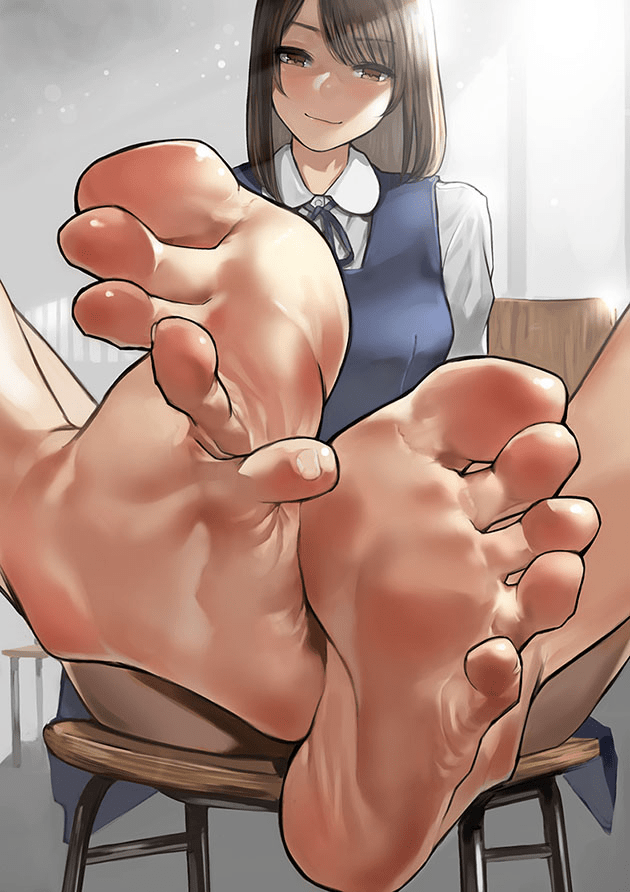
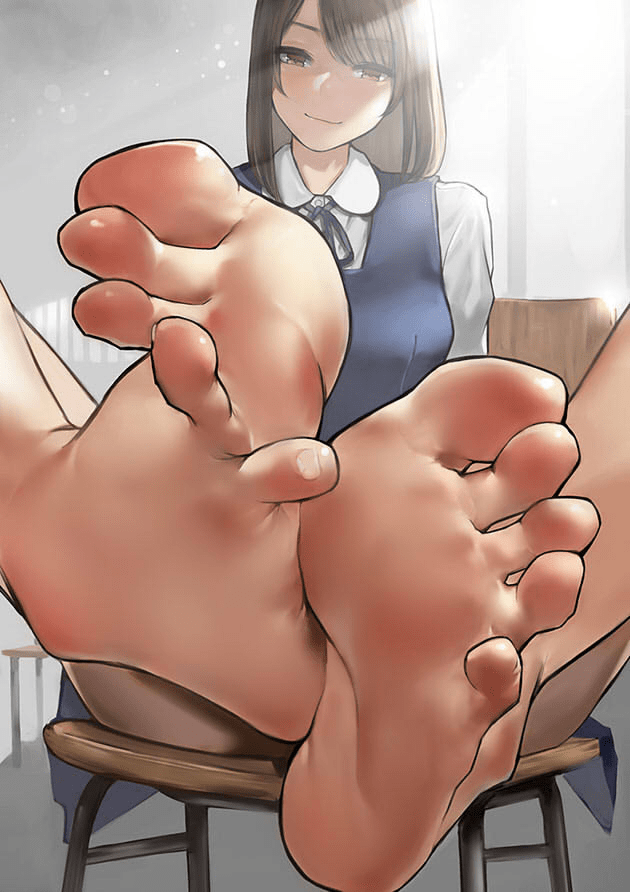

# 每次看到這種圖都覺得很擦邊

作者：xxx99

TID：22751

<title>1</title> <link href="../Styles/Style.css" type="text/css" rel="stylesheet">

# 1

是不是沒救了！要是有人會ps就好了
可以適當增加些小人在上面
這個姿勢非常贊啊！

<ignore_js_op>

**61886266_p0.jpg** *(113.14 KB, 下載次數: 2)*

[下載附件](forum.php?mod=attachment&aid=NjcxODh8M2E1YjRjZTB8MTY3NDA2NzY5OXwxODIzMHwyMjc1MQ%3D%3D&nothumb=yes)

2017-3-13 09:47 上傳

<title>2</title> <link href="../Styles/Style.css" type="text/css" rel="stylesheet">

# 2

我只是觉得这个腿型，太扭曲了 <title>3</title> <link href="../Styles/Style.css" type="text/css" rel="stylesheet">

# 3

這個姿勢明顯會導致小腳趾的抽筋
<title>4</title> <link href="../Styles/Style.css" type="text/css" rel="stylesheet">

# 4

*本帖最後由 gw1990zzz 於 2017-3-13 17:57 編輯*

不介意我改图画成我喜欢的画风吧？
<title>5</title> <link href="../Styles/Style.css" type="text/css" rel="stylesheet">

# 5

 <ignore_js_op>[gaitu1.jpg](forum.php?mod=attachment&aid=NjcxOTN8MzRiNDBkZmN8MTY3NDA2NzY5OXwxODIzMHwyMjc1MQ%3D%3D&nothumb=yes) *(62.69 KB, 下載次數: 1)*

[下載附件](forum.php?mod=attachment&aid=NjcxOTN8MzRiNDBkZmN8MTY3NDA2NzY5OXwxODIzMHwyMjc1MQ%3D%3D&nothumb=yes)

2017-3-13 17:44 上傳  

</ignore_js_op> <ignore_js_op>[gaitu2.jpg](forum.php?mod=attachment&aid=NjcxOTR8MzE1ODk1OTh8MTY3NDA2NzY5OXwxODIzMHwyMjc1MQ%3D%3D&nothumb=yes) *(64.18 KB, 下載次數: 1)*

[下載附件](forum.php?mod=attachment&aid=NjcxOTR8MzE1ODk1OTh8MTY3NDA2NzY5OXwxODIzMHwyMjc1MQ%3D%3D&nothumb=yes)

2017-3-13 17:44 上傳  

</ignore_js_op> <ignore_js_op>[gaitu3.jpg](forum.php?mod=attachment&aid=NjcxOTV8OGVhYzQ1Zjh8MTY3NDA2NzY5OXwxODIzMHwyMjc1MQ%3D%3D&nothumb=yes) *(64.3 KB, 下載次數: 3)*

[下載附件](forum.php?mod=attachment&aid=NjcxOTV8OGVhYzQ1Zjh8MTY3NDA2NzY5OXwxODIzMHwyMjc1MQ%3D%3D&nothumb=yes)

2017-3-13 17:57 上傳  

</ignore_js_op> <title>6</title> <link href="../Styles/Style.css" type="text/css" rel="stylesheet">

# 6

> [gw1990zzz 發表於 2017-3-13 17:44](https://giantessnight.cf/gnforum2012/forum.php?mod=redirect&goto=findpost&pid=326171&ptid=22751)
> 不介意我改图画成我喜欢的画风吧？

嘛人不太精細啊
要是只有1個就好了
不喜歡虐殺的
<title>7</title> <link href="../Styles/Style.css" type="text/css" rel="stylesheet">

# 7

> [xxx99 發表於 2017-3-13 18:01](https://giantessnight.cf/gnforum2012/forum.php?mod=redirect&goto=findpost&pid=326173&ptid=22751)
> 嘛人不太精細啊
> 要是只有1個就好了
> 不喜歡虐殺的

本来就是jpg 压缩过的  不可能画细的。。。你可以自己试试    我是纯手工非P图   随便画的。。 <title>8</title> <link href="../Styles/Style.css" type="text/css" rel="stylesheet">

# 8

> [xxx99 發表於 2017-3-13 18:01](https://giantessnight.cf/gnforum2012/forum.php?mod=redirect&goto=findpost&pid=326173&ptid=22751)
> 嘛人不太精細啊
> 要是只有1個就好了
> 不喜歡虐殺的

原稿最起码几千分辨率  所以这个尺寸放大全是马赛克 <title>9</title> <link href="../Styles/Style.css" type="text/css" rel="stylesheet">

# 9

脚趾扭动的太厉害，不自然，失了美感。不过这种视角的恋足图的确很容易自行脑补到GTS内容，对于那种很赞的三次图，不要太舒服 <title>10</title> <link href="../Styles/Style.css" type="text/css" rel="stylesheet">

# 10

*本帖最後由 gw1990zzz 於 2017-3-14 16:54 編輯*

昨天忙着下班  今天改成你要的一个人   马赛克无解。。。 <title>11</title> <link href="../Styles/Style.css" type="text/css" rel="stylesheet">

# 11

 <ignore_js_op>[gaitu5.jpg](forum.php?mod=attachment&aid=NjcxOTh8NWZlOTkxZGN8MTY3NDA2NzY5OXwxODIzMHwyMjc1MQ%3D%3D&nothumb=yes) *(63.03 KB, 下載次數: 0)*

[下載附件](forum.php?mod=attachment&aid=NjcxOTh8NWZlOTkxZGN8MTY3NDA2NzY5OXwxODIzMHwyMjc1MQ%3D%3D&nothumb=yes)

2017-3-14 16:54 上傳  

</ignore_js_op></ignore_js_op>