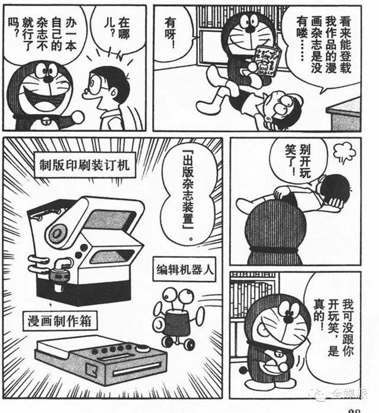

# 比起虛擬實境或直接放大縮小，我更想要這個道具

作者：葬儀社

TID：19915

<title>1</title> <link href="../Styles/Style.css" type="text/css" rel="stylesheet">

# 1

*本帖最後由 小虎 於 2015-10-9 00:46 編輯*

<ignore_js_op>

**0.jpg** *(154.09 KB, 下載次數: 0)*

[下載附件](forum.php?mod=attachment&aid=NTQ3ODh8ZmFhZjlmZWZ8MTY3NDA2ODA2NHwxODIzMHwxOTkxNQ%3D%3D&nothumb=yes)

2015-10-9 00:45 上傳

編輯機器人就算了，其他兩個、尤其是漫畫製作箱，簡直是神兵利器 <title>2</title> <link href="../Styles/Style.css" type="text/css" rel="stylesheet">

# 2

图炸了。。。。看不见 <title>3</title> <link href="../Styles/Style.css" type="text/css" rel="stylesheet">

# 3

呃...话说具体的运作机理是什么啊？ <title>4</title> <link href="../Styles/Style.css" type="text/css" rel="stylesheet">

# 4

总觉得有了这两样道具，依然和目前的现状是没区别的，依然靠幻想嘛。
而虚拟实景是可以“真实”体验的。
<title>5</title> <link href="../Styles/Style.css" type="text/css" rel="stylesheet">

# 5

嘛。。。vr归vr，有vr也还是会想看平面的本子啊，独立的需求 <title>6</title> <link href="../Styles/Style.css" type="text/css" rel="stylesheet">

# 6

如果是哆啦的道具 那肯定必须要缩小灯 什么漫画机什么的太没追求了 <title>7</title> <link href="../Styles/Style.css" type="text/css" rel="stylesheet">

# 7

  多啦A梦的道具十有八九都是因果略大杀器的说 <title>8</title> <link href="../Styles/Style.css" type="text/css" rel="stylesheet">

# 8

有時光機甚麼都好辦 <title>9</title> <link href="../Styles/Style.css" type="text/css" rel="stylesheet">

# 9

樓上的幾位太沒追求了，漫畫製作箱NB的地方在於它可以用任何作家的畫風(給它掃描該作家作品)做出任何你想要的題材(輸入基本的設定和要求就好，它會自動幫你想劇情) <title>10</title> <link href="../Styles/Style.css" type="text/css" rel="stylesheet">

# 10

缩小灯 缩微照燈 不是更好嗎
是最真真真真實的 <title>11</title> <link href="../Styles/Style.css" type="text/css" rel="stylesheet">

# 11

沒想到有跟當年我同樣想法的人

也就是說這幾項玩意
可以讓你用知名畫家/漫畫家的畫風作出你想要的GTS創作(同人)

例如:用佐野俊英老師的畫風畫出JUNKMAN老師的王女さまシリーズ故事
(沒記錯這道具用畫風記憶好後就可以輸入故事然後自己生出一本雜誌/書)

畢竟喜歡的故事可能永遠只能存在於文字裡
能用自己最帶感的畫風創作出來也是另一種夢想啊 <title>12</title> <link href="../Styles/Style.css" type="text/css" rel="stylesheet">

# 12

不亏是虎爷，传统的让人心碎...... <title>13</title> <link href="../Styles/Style.css" type="text/css" rel="stylesheet">

# 13

> [ghost2012 發表於 2015-10-9 14:39](https://giantessnight.cf/gnforum2012/forum.php?mod=redirect&goto=findpost&pid=270840&ptid=19915)
> 如果是哆啦的道具 那肯定必须要缩小灯 什么漫画机什么的太没追求了

首先你得有个支持你的女朋友
<title>14</title> <link href="../Styles/Style.css" type="text/css" rel="stylesheet">

# 14

一般人包括我想到的无非就是缩小灯啊或者幻想电话亭啊之类的，
完全没想到能这么用哆啦A梦的未来道具！觉得眼前一亮！</ignore_js_op>