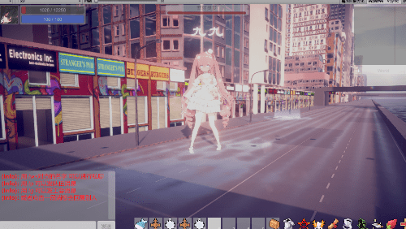

# 水两张截图

作者：dronoketer

TID：28759

<title>1</title> <link href="../Styles/Style.css" type="text/css" rel="stylesheet">

# 1

(/ω＼)其实主要是自己太穷了，本来想用之前的单机去做联机版的，但是后来发现自己租的起的服务器根本带不动那种游戏模式https://giantessnight.com/gnforum2012/forum.php?mod=viewthread&tid=28190&extra=page%3D1&mobile=2
（这也是我做的哦
那为什么不做单机版游戏呢。。。？其实挺想做的。。。等再填填这个坑就去做那边吧。

下面我打算好好的弄一下UI了emm现在这个观感确实不好。。。就特别捞。 <title>2</title> <link href="../Styles/Style.css" type="text/css" rel="stylesheet">

# 2

 <ignore_js_op>[-f65bd8e0a89da9.png](forum.php?mod=attachment&aid=ODMxMjV8YjA2OWI2ZWV8MTY3NDA2NjQzMHwxODIzMHwyODc1OQ%3D%3D&nothumb=yes) *(262.42 KB, 下載次數: 1)*

[下載附件](forum.php?mod=attachment&aid=ODMxMjV8YjA2OWI2ZWV8MTY3NDA2NjQzMHwxODIzMHwyODc1OQ%3D%3D&nothumb=yes)

2020-5-24 01:44 上傳  

</ignore_js_op> <ignore_js_op>[1955135d01701876.png](forum.php?mod=attachment&aid=ODMxMjZ8NTlkM2Y0ZjR8MTY3NDA2NjQzMHwxODIzMHwyODc1OQ%3D%3D&nothumb=yes) *(244.93 KB, 下載次數: 0)*

[下載附件](forum.php?mod=attachment&aid=ODMxMjZ8NTlkM2Y0ZjR8MTY3NDA2NjQzMHwxODIzMHwyODc1OQ%3D%3D&nothumb=yes)

2020-5-24 01:44 上傳  

</ignore_js_op> <title>3</title> <link href="../Styles/Style.css" type="text/css" rel="stylesheet">

# 3

还有就是VRChat确实很好玩。。。 <title>4</title> <link href="../Styles/Style.css" type="text/css" rel="stylesheet">

# 4

> [dronoketer 發表於 2020-5-24 01:49](https://giantessnight.cf/gnforum2012/forum.php?mod=redirect&goto=findpost&pid=437278&ptid=28759)
> 还有就是VRChat确实很好玩。。。

大佬，想玩vrchat，现在还没入手vr设备，想知道最经济的玩法应该咋玩，我电脑 8700k+1070 ram32g，想加入你们，有联系方式吗，或者群啥的